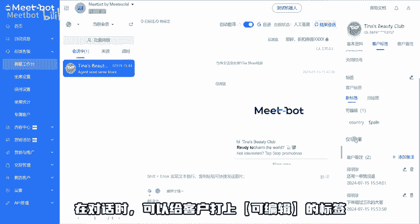
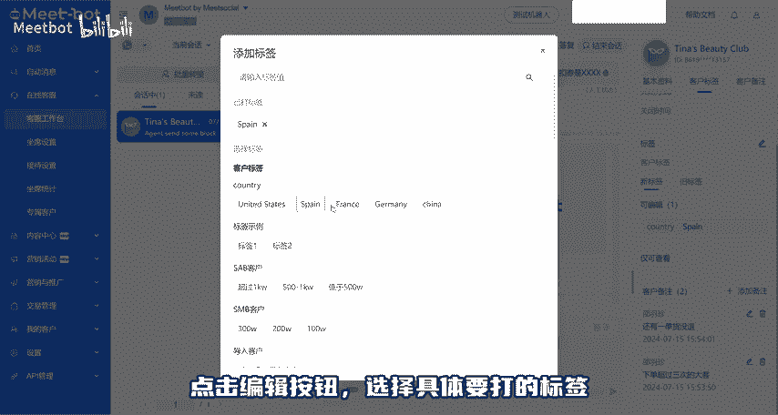
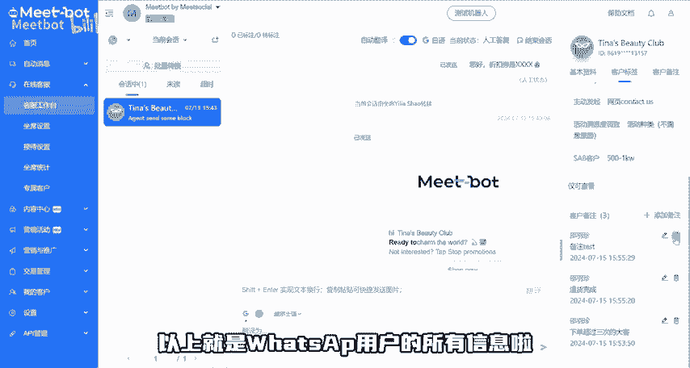

# Meetbot课程｜ WhatsApp有哪些用户信息？ - P1 - Meetbot - BV1RP8xecECX

本节课将介绍whatsapp里有哪些用户信息是可以查看并使用的mb客服工作台右侧可查看资料，上方展示基础信息，如whatsapp名字、手机号码，点击小眼睛可查看具体的号码。

如需拨打联系客户可在手机上输入号码。此时间表示，与客户的末测联系时间节点，下方可查看客户来源，第一次访问时间，当前接待的客服以及绘话状态等信息。客户标签栏分为可编辑及仅可查看。在对话时。

可以给客户打上可编辑的标签，点击编辑按钮，选择具体要打的标签，点击评论区视频，了解更多客户标签信息，最后是下方的客户备注，备注支持新增修改删除所有客服写入的备注均能查看不限制备注的语言及条数。

单个备注最多可输入100个文字，以上就是花CP用户的所有信息了。扫描二维码，启动whatsapp营效。

