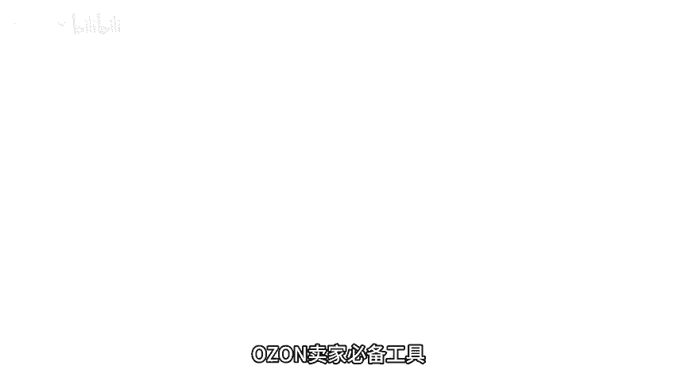
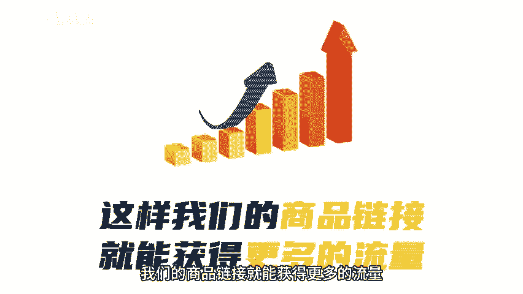

# OZON卖家必备运营工具 - P1 - 老骆跨境 - BV134xTefEHn

🎼欧众卖家必备工具。第一个图片翻译工具。欧众规定我们在上传商品图片的时候，图片中的文字必须是俄文，否则就会上下失败。那这个工具是我用过众多翻译工具中，我觉得最好用，并且翻译最准确的一个。第二个。

视频翻译工具，我们都知道有视频的商品链接和没视频的商品链接，他们的评分和流量推荐是不一样的。所以我们一定要尽有可能的为商品加上视频。这样我们的商品链接就能获得更多的流量。

但是欧众也规定视频中的文字也必须得是俄文，否则就会出现审核不通过的情况。那这个视频翻译工具呢也是我用过比较好用的工具，并且它还是免费的。第三个，文字翻译工具，写标题做详情页预埋关键词。

这些都需要我们确保翻译的准确性。这个文字翻译工具是我用过最接近俄罗斯人口语习惯的翻译工具了，非常好用。这三个工具我都打包好了，有需要的可以按好工具，我给你安排。

