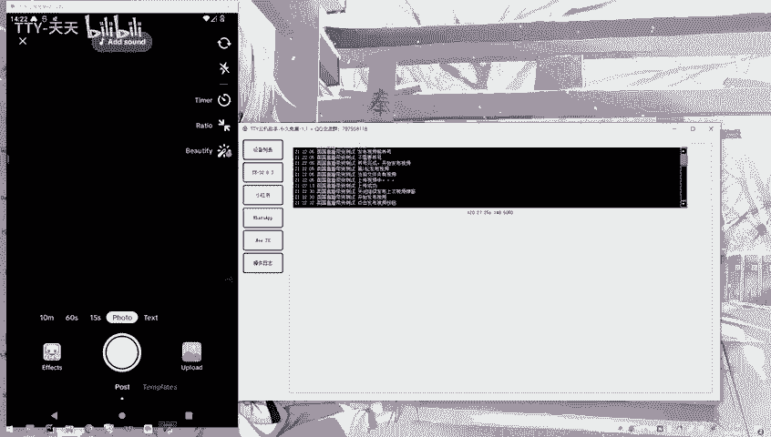
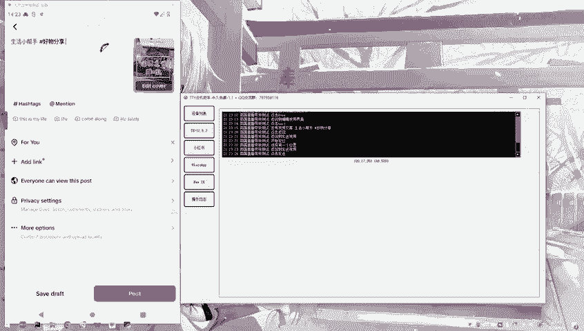

# TikTik如何自动发布视频 - P1 - TTY-天天 - BV1FEYferEsc

本期录制的是tickt视频自动发布的视频。😊，点击打开参数设置。😊，然后选择发布视频。前面两项四个参数是必须要填的，发布视频前后的养号时间设置。往下是视频音效，有三种选项，无音效、随机音效、收藏音效。

然后根据自己的需要，选择是否勾选挑战与定位，右边是单轮发布视频的数量，再往下是视频文件路径，第一次操作时，需要点击一下初始化目录。😊，点击打开短视频文件路径，初始化目录后会自动创建一个示例文件。😊。

打开视例文件。😊，然后把需要发布的视频放到此路径内。打开标签文本，异行一个标签，不需要井号，这边是内容文本，然后准备工作做好之后关闭文件夹，点击运行表格，这边点击刷新获取到银机。

然后勾选自己想要跑的银机即可。😊，功能这边勾选发布视频，点击开始打开操作日志。😊，自动打开tktok。😊，从本地上传视频到银机相册中。上传成功。开始发布视频。

从云机相册选择视频。选择随机音乐。😊，点击视频挑战。😊，输入文案跟标签。点击定位。

发布视频。获取发布视频进度中。发布视频完成。自动删除本地视频与相册视频成功。运行结束，感谢您的观看，再见。😊。

