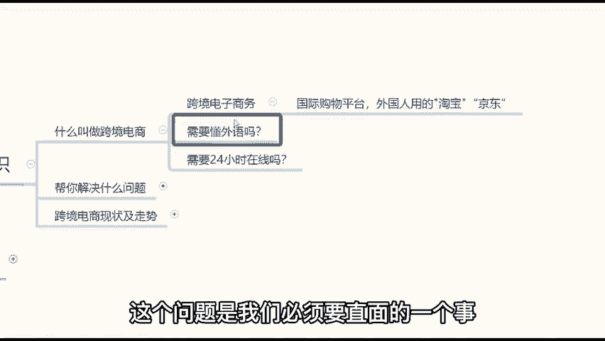
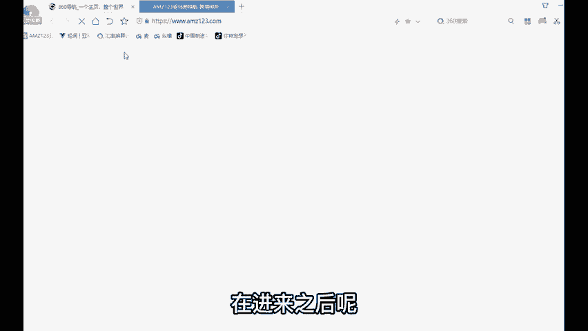
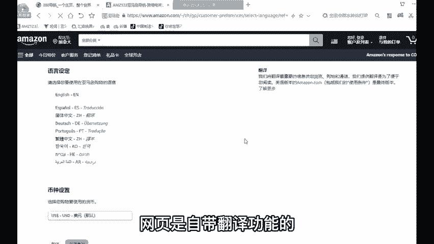
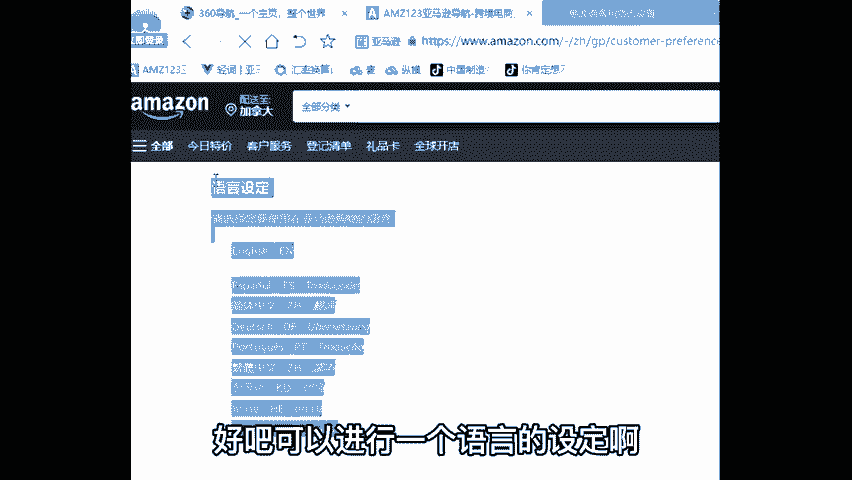
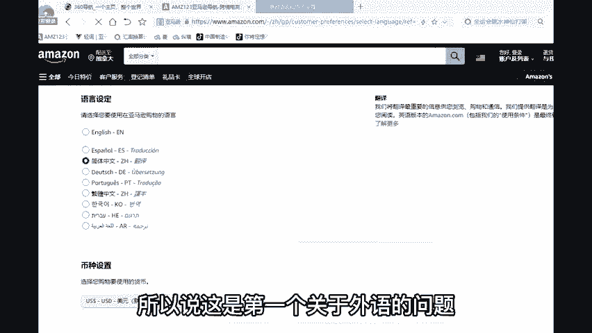
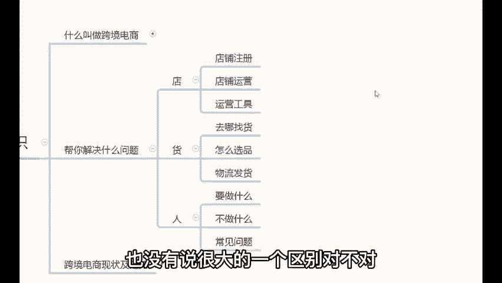

# TikTok+亚马逊跨境电商运营全套零基础视频教程   亚马逊扩展Prime购物服务，推出TikTok广告直购服务 - P18：01、什么是跨境电商 - 传递价值信息 - BV12fsmeNEuW

。

首先我们的这堂直播课设计的话呢分为三个板块给大家做一个讲解。哪三个板块呢？第一个板块的话，我会用到大概在半个小时左右的时间跟各位讲一些关于跨境电商的一些基础的知识内容。那当然在讲完了这些基础知识之后呢。

我会在用一个小时到一个半小时间左右，跟各位讲一些关于亚马逊运营和实操内容。这个环节当中，我也会拿出来我的店铺在今天的课程上做到一个实操演练。你们可以看一看。😊，我平常是怎么运营店铺的啊。

包括说你们有了店铺之后，该怎么去进行一个正常的运营啊，然后最后的半个小时，我也会以我的经验跟各位做到一个分享。就假设说你说我要想要做这个事儿，那么应该如何开始行动。哎，这就是我们今天的课程大纲。那么。

😊，在正式分享之前强调一个点，就是说跨境电商这个事呢，它不是说你用两个小时你就可想要完全掌握的了的。这个完全不现实哈，就任何事不可能说两个小时你就完全能够掌握得住。那么但是如果说你认真学习的话。

这两个小时一定可以让你们对于跨境电商有一个非常全面的了解，我会带着各位由浅入深，一步一步的去了解跨境电商。建议各位在听课时候听课的时候呢，全程不要走开。因为我们今天的分享是全程直播，没有录播的。

是老师干货满满的一个亲情风险。建议各位一定要认真听，好吧。😊，那么。呃，大概介绍完之后的话，我也就废话不多说，就开始我们今天的分享。首先的话进入到分享的第一个环节。

我们一起来了解一些关于跨境电商的一些基础的知识内容。那么先来给大家介绍一下什么叫做跨境电商。跨境电商的全称叫做跨境电子商务。简单的来说，你可以理解为一个国际购物平台，或者说外国人用的京东。😊。

也可以理解为外国人用的淘宝。那么既然说哎我们这样去理解哈，就是如果说不好记忆的话，你就以为你就认为说是外国人在用的京东这样的软件就可以了。😊，OK那么在这种情况下跟外国人打交道，对吧？那第一个问题。

老师那我做跨境经商是不是需要懂外语啊啊，这个问题是我们必须要直面的一个事儿，对吧？不懂外语能做这个事儿吗？首先跟大家去解决一下这个顾虑哈，做跨境电商不需要各位，你们一定要懂外语。

因为你要知道是跨境电商平台，针对是全球市场，全球有几百个国家和地区。如果说你去学外语的话，你可能要学。😊。

几十上百门语言，这个现实吗啊不太现实，对不对？那么不懂外语怎么做这个事儿呢，其实也很简单。比如说我们直接打开这个网页哈。😊，我们直接打开一下这个网页，打开这个网页之后呢。

咱们进入到亚马逊的一个官方的网址导航。在进来之后呢，你可以看到亚马逊就有很多个站点呢。你可以看一下，像美国、英国、日本、德国、法国、意大利、西班牙、加拿大、墨西哥等等这些。😊。

对吧亚马逊有那么多个站点，我们以美国站来举个例子。那么点击美国站呢就进入到了亚马逊美国站的一个官方网站。那么在进来之后呢，你会发现一个很有意思的事哈。😊，就这个网站上面的内容啊基本上都是中文。

只有极其少的一部分是英文，对不对？那么绝大部分的内容都是中文，这个就有点奇怪了哈。那你说外国人，美国人都看得懂中文吗？在这里啊其实有一个小小的细节给大家去分享一下啊。

网页右上角位置呢有一个美国国旗的图标，你再把点击这个美国国旗图标之后呢，你就可以发现它是可以进行语言的设定的比如说。😊，我们可以选择像英语、简体中文、繁体中文、韩语、日语、西班牙语等等这一些。😊。

那么它是可以进行语言的选择的。所以说如果说你不懂外语的话，其实没关系啊，网页是自带翻译功能的对，这个问题呢是由亚马逊帮助我们解决掉了，好吧，可以进行一个语言的设定啊，所以说这是第一个关于外语的问题。

先给大家去解决一下哈，这个问题不担心了之后呢，那一会有第二个问题了。那很多人会很多同学会讲说老师，那我们跟外国人之间是存在失差的呀。那比如说。😊。

我们白天的时候，美国就是晚上，我们晚上的时候，美国就是白天。那你会发现我们跟很多很多的国家都是存在这么一个时差的问题。那既然说存在这么一个时差的问题，那这样的一个问题就是说我做跨境电商这个事啊。

需不需要说24小时在线盯着我的电脑，是不是需要一直在线啊，就这个问题也是大家比较顾虑的多的问题啊。😊，关于在线时长的问题也给大家解决一下。首先也不需要你们24小时在线，为什么呢？因为2019年开始。

亚马逊就开始逐步的取消了在线客服了，就现阶段的亚马逊是不设置在线客服的。如果说有客户买产品有问题哈。他买产品的时候有什么疑问，想要发信息的话呢，会给我们发邮件。😊，收到了这封来自的客户邮件之后。

我们只要在24小时之内。邮件。回复就可以了，不用说你实时在线盯着电脑去回这个邮件之类的啊，不需要，只要在收到了客户信息之后，24小时之内，通过这个邮件去回复就可以了。其实这个问题也很好理解啊。

这个消费习惯的问题，不信你自己回想一下自己的一个消费习惯哈。假如说啊我举个例子啊，比如说你现在去网上买东西的时候，我就是这个样子啊，不管我是在京东啊还是在淘宝上买东西的时候。

我一般是不怎么跟他的客服沟通的。就是我看到自己需要的东西，我就会直接买，对吧？只有说出现了售后的问题，我才会去找他们客服。因为整个产品详情页他已经介绍的很清楚了，对不对？所以说这就是一种购物习惯啊。

有多少同学会像我一样的话，可以在公屏上打一个一。所以说关于这个在线时长的问题。各位，其实你们也不用去担心了哈。那么这样的两个问题，就是关于外语的问题，以及在线时长的这样的问题的话。

其实就是我们新人比较问的多的问题。那么今天除了这些非常简单的问题之外，我主要。😊，帮助你们解决哪些问题问题呢？我们的这张直播课主要帮助各位解决三方面的问题，哪三方面呢？

就是你们做跨境经商常会遇到的关于店货人三方面的问题。店的话呢，我会讲到亚马逊的店铺注册以及亚马逊的店铺运营，还有运营需要介入到的运营工具，这是关于店的内容。那么关于货的内容。

我会讲到说你去哪里去找货源怎么选品，出了订单之后，如何对接物流进行发货。那么关于人的内容呢，就是做跨境经商这个事，你需要干什么，不需要干什么？遇到的常见问题应该如何去进行处理。

那么我们的这张直播课就主要围绕这三个方面呢给大家做一个讲解，在正式讲解之前呢，先来给你们吃个定金玩。好吧，那有同学会听说跨境电商，跨境电商，就是跨境这两个字，而且感觉是不是好难啊？就是我告诉你们。😊。

说白了啊跨境电商跨境电商它也就是个电商平台，对吧？你说白了，你在学习掌握了之后，你就发现真的很简单。在你真正正儿八经有个店铺去运营一下，你就会发现这个事没有你想象那么复杂啊。原来也就是个电商平台啊。

给给你平常开一个这个什么这个微商做个微商，开个淘宝店之类的，也没有说很大的一个区别，对不对？只不过是把时间和精力化在上面了OK。😡。

