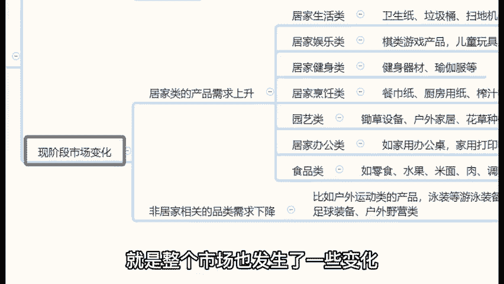
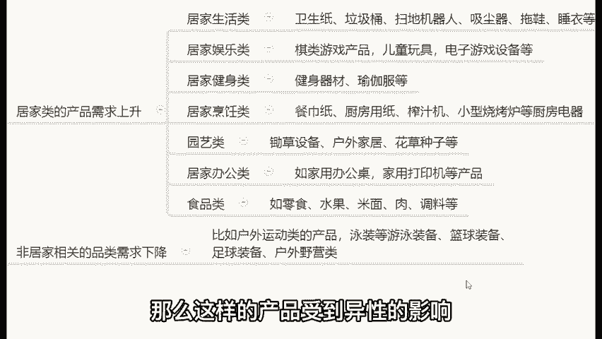
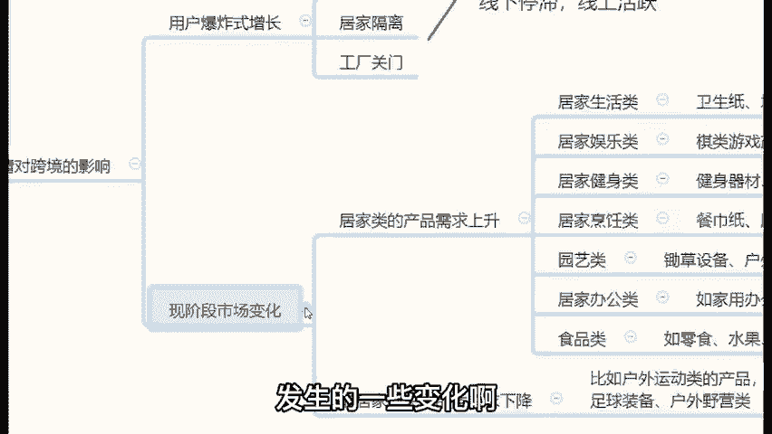

# TikTok+亚马逊跨境电商运营全套零基础视频教程   亚马逊扩展Prime购物服务，推出TikTok广告直购服务 - P20：03、跨境电商的发展预测 - 传递价值信息 - BV12fsmeNEuW

。

那么在这种情况下呢，我们国就是跨经商未来的走势如何呢？这个问题其实很多同学想要问的是，疫情造成的影响。那么大家看新闻的同学，大家都知道啊。

那么因为疫情就是在整个全世界第一个就是爆发疫情的国家是哪一个国家？中国对吧？这个大家都知道啊，我们中国是第一个爆发疫情的，这个这个事情其实蛮痛苦的。那么第二个。😊，这最先控制住疫情的是哪个国家？😡。

也是我们中国。那么所以说很多外国的国家就开始抄生活的作业啊，他说中国控制的那么快是为什么呢？哎，他们明白了，因为我们当时啊防控做的很好，当时在家里边隔离啊，就是国家一声号召之下。

所有人在家家里边不出门了。😡，那么所以说很多外国的商场就有一样学样啊，就是也是在家里边隔离。但是直到现在他们外国人比较开放啊，就是哎这个事其实比较悲痛，但是你总感觉有点可笑，为什么感觉有点可笑呢？你看。

😊，就比如说美国，直到今天啊。😡，美国每天的感染人数还大几个大几万，每天的死亡人数还还有好几千。所以说你要知道，就是因为受到这次疫情的影响，哎，其实风波还是挺大的啊，就跟灭霸打了一个那个响指啊。

一下子干干掉了很多很多人。这个事其实蛮痛苦的。那么很多外国比较守规矩的人呢，就是你要明白的是很多外国的商场就限流了。为什么商场要限流，商场是人口聚集地啊，对这个东西你说商场不限流的情况下啊。

你人口都往那边转，对吧？你很容易就交叉感染。😡，那么商场限流仍在家里边居家隔离，对吧？那么这就导致整个线下交易受到了非常大的影响。线上开始不断活跃起来。对不对？那除此之外。

很多国外的工厂也属于关门的状态啊。😡，工人不敢去上班啊，谁不惜命啊，对吧？那我们的工厂复工的原因是因为我们疫情控制住了，很多外国的工厂是承担不起的那保险公司他也赔不起这个这个人命钱呀，对不对？

那很多外国的工厂关门就会导致什么呢？😡，哎，供需不平衡，就他们需要的产品在本国生产不出来，那很多人就开始通过跨境电商平台去购买了，对吧？所以说整个市场受到疫情的影响啊，因为这各种各样的一些风波啊。

就是整个市场也发生了一些变化，什么样的变化呢？这是我自己做的一些统计哈，因为疫情的原因，很多居家类型的产品。比如说你原来在家里边常用的东西啊，像什么居家生活类，还有健身器材，对吧？

像什么哑铃啊瑜伽服啊、瑜伽垫啊啊瑜伽球啊、跳绳啊，这种健身类室内健身类产品啊，包括说这个跑步机啊，那么这样的产品呢，包括说厨房用品需求量都在上升。😊。

对吧因为你出不去门嘛，这些东西你该用的你还是要有的。而一些非居家类的东西呢，比如说什么篮球、足球啊，这些出去呃玩的这种各各种各样的设备。那么这样的产品受到疫情的影响，就发生了一些下降的一个情况。

这就是受到疫情的影响。整个市场发生了一些变化啊，这个点大家需要清楚一下。😊。

