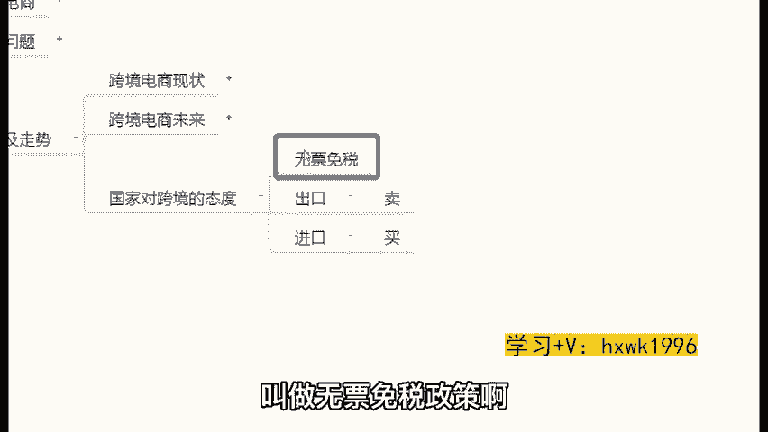
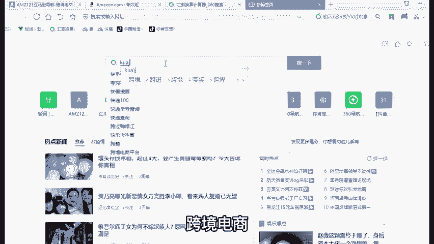
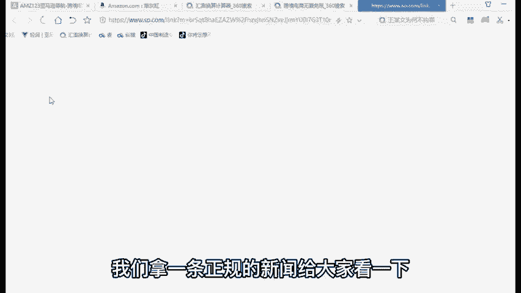
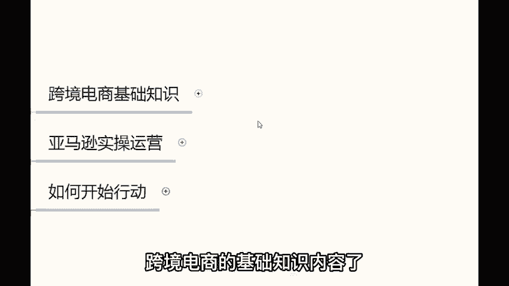

# TikTok+亚马逊跨境电商运营全套零基础视频教程   亚马逊扩展Prime购物服务，推出TikTok广告直购服务 - P21：04、对跨境的态度 - 传递价值信息 - BV12fsmeNEuW

。

OK那么在这种情况下，我们国家的态度是怎么样的？我们国家是否支持我们做跨境电商呢？问你们一个很简单的问题吧，好吧。😊，哎，各位，你们感觉出口和进口这两种交易类型的形式，就这两种交易形式啊。

出口和进口哪一个对咱们国家的经济会更有利点？你们认为各位你们认为出口和进口这两种类型的交易形式，哪一个对咱们国家的经济会更有利呢？哎，我看到很多同学在讲说出口，这个道理大家都吃过这个亏的啊。

为什么我们说吃过这个亏呢？因为我们印象非常深刻，在00年的时候，90年代00年代那个时候啊，那那个时候的人都大家都清楚啊，那个时候我们买东西的话，基本上都是从国外进口的，是吧？呃，买个火柴叫洋火。

买个这个图钉叫洋丁，买个图钉叫杨丁，买个自行车叫洋车。那个时候因为我们的制造业不发达，所以说那个时候我们一直在进口，进口是干什么，就把外国人产品买进中国来。😊，对不对？买进来，而出口呢。😡。

出口的话呢就是。卖产品给外国人。😡，就是你把东西卖出去挣钱啊，还是把东西买进来挣钱啊，这个这这个这个没没没这样说的啊。但是实际上道理大家应该明白哈，就是肯定是出口会对我们国家的经济会更有利一些，对不对？

那要么那外国人那么想出口的，所以说为了鼓励我们普通人能够参与到这个事儿里边来。因为众志成城，才能把这个事情做大做强嘛，😊，为了鼓励我们普通人参与到这个事儿里边来，国家提了一个政策叫做无票免税政策啊。

什么叫做无票免税政策呢？

我们打开百度在百度上搜一下哈，就是为了鼓励我们普通人做这个事儿啊，国家提了这个这个无票免税政策，跨境电商。😊。

无票免税政策。OK呃，搜索完之后，你看这里面有多少的新闻都在讲哈，我们拿一条正规的新闻给大家看一下啊，这个新闻我不敢作假了，为什么啊新闻联播啊央视频道啊，新闻联播李克家总理说的话啊。

这个东西我我是不敢跟你说是吧？在这里弄虚作假的OK那在这里你就可以看到啊，那么李克强总理讲到什么呢？他说对于我们跨境电商零售出口实施无票免税政策啥意思啊？你现在开通一个东西，把中国的产品卖给外国人。

你挣的钱全是你的，你是不用给国家缴税的。😊。

在中国有哪些行业不用缴税呀？你就是开个超市，你开个服装店对吧？你该交税你还是要交税的，对不对？你的一收你的这个收入高。😡，高的时候你还是要给国家缴税的对吧？你开个网店还要缴税的。但是在做亚马逊的话。

就是做跨境电商现在是不要缴税的，无票免税。所以这就是我们国家对于我们做这个事的态度啊，就是现阶段是非常鼓励我们做这个事的啊。那以上这些内容呢就属于一些关于跨境电商的基础知识内容了。

就先给你们做个简单的介绍了哈。😡。

