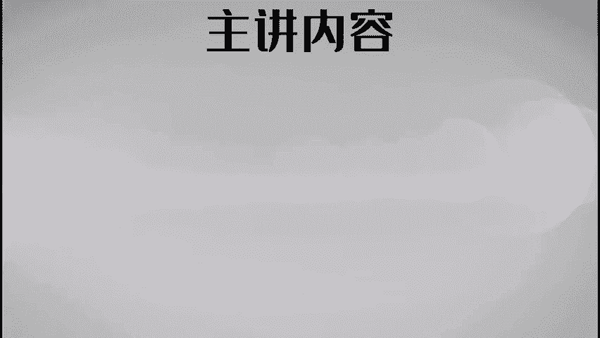
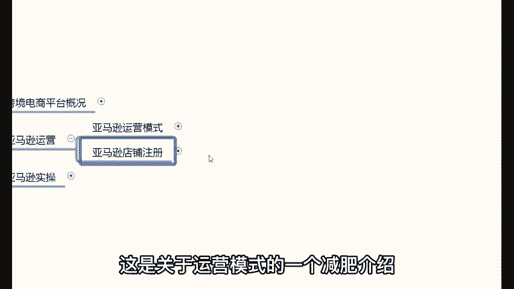

# TikTok+亚马逊跨境电商运营全套零基础视频教程   亚马逊扩展Prime购物服务，推出TikTok广告直购服务 - P27：10、亚马逊运营模式总结 - 传递价值信息 - BV12fsmeNEuW

。

就是前期做亚马逊的一个资金预算，大概需要多少钱？给大家去讲一下，低风险入门1万块钱左右就可以了。😊，你这1万块钱都花到哪里呢？首先第一个你要有一台电脑，但是这个台电脑不需要说很高的配置啊。

就是你又不打游戏，说白一点，你又不打游戏。电脑的话，什么台式机、笔记本的新机器、二手的机器都行啊。那么第二个是你可能会花的一笔钱。😡，为什么我说可能啊？😡。

亚马逊从来没有规定过说你们做这个平台必须要交什么这个软卖软件的费用。没有这样说。亚马逊从来没有规定过说我们做亚马逊必须要买一些软件之类的，没有这样的说法，但是确确实实的有一些软件可以减轻我们的工能压力。

提升我们的工作效率。等一会儿在实操演练的时候，呃，你们需要的时候啊，我会推荐我用的比较好的软件给你们做到一个简单的介绍，你们需要的话可以自己去购买哈。那么所以说这是第二个你可能会花的一笔钱。

第三个就是关于流动资金的问题了。做亚马逊，你的一个资金储备啊，流动资金大概多少钱呢？前期啊就是两3000块钱左右就可以了。😡，亚马逊的回款周期是14天，就你把这个东西，你说你卖出去了。

14天亚马逊就会把这个钱打给你，你又不囤货，不押货，你准备那么多的流动资金干什么呀？😡，🎼完全不需要，没必要，你明白吗？你又不囤货不压货之类的，不需要准备那么多的流动资金啊。

前期两3000块钱左右就可以了。这就是关于亚马逊的一个资金的一个预算问题。那么至于这两种模式的话呢，我建议你们可以先做FBM再做FBA两种模式在一个店铺里边是可以同时存在。

就是FBA和FBM这两种模式是可以同时存在的啊。然后你们从FBM开始做，当你把这个模式做起来之后哈，再来做FBA就可以了。每天花个一两个小时的时间学习加运营加实操就可以了。

你千万不要小瞧自己的一天一两个小时，我给大家举个例子啊，为什么我告诉你们，一天一两个小时，你可以把这个事做好。我举一个比较生活化的例子，各位。😡，我问一下，今天来听课的各位同学，有多少同学打过王者荣耀。

就这个游戏有多少同学玩过来打过王者荣耀的公屏上打一个一，就你们平常在家里边会玩游戏的，就是玩过这个王者荣耀这个游戏的，可以在公屏上打个一。😡，玩过的话可以打个一啊，就这个我举一个。

就这个东西我相信很多像我们这些年轻一点的啊，像二三十岁的啊，30多岁的就大家在家里边休闲的时候啊，你就是放松的时候啊，就是工作压力比较大啊，或者说这个想要放松一下啊，也会打打王者荣耀。

甚至可以跟跟自己的这个身边的同事啊一起开个黑之类的，很正常，对吧？😊，你们自己思考一个问题，来，你们自己回顾一下，你打王者荣耀最开始的时候，你就是你一个青铜段位，你是不是很菜？😡，你是不是很菜。

咱们讲直面自己哈，直面自己，你是不是很菜？😊，就那个时候你身边带着你玩这个游戏的人，肯定会骂你啊，你真的太菜了，我真不愿意跟你一块玩，是不是？😡，对不对？

但是你有没有发现你说你每天打王者荣耀真的花了很多的时间吗？也没有，有时候偶尔玩一把，偶有偶尔玩一把，然后随着不断的这样的一个累积啊，你的段位慢慢的从青铜变成了黄金，然后变成了钻石，然后变成了铂金啊。

然后变成了这个呃这个星耀王者之类的，对不对？就是我们每天花了时间在干这个事儿。😡，所以说我们的技术就越得越来越好了。😡，对不对？啊，原来嘲笑我们的那帮子人，可能到现在他不敢嘲笑我们了，反被我们嘲笑。

对不对？很正常。所以说因为我们把时间和精力放在这个地方了，所以说这个时间和精力不会没有说特别的多，对吧？可能一天一两个小时两三个小时，OK我们玩个两三把三五把之类的，但是你的时间放在这个地方。

你的技术就变得越来越好了。你就明白了吧？所以说说亚马逊的时候也是这样一个道理，就万事万物都是这样的一个情况，都是从零到一，从无到有的一个过程。😡，对不对？😡，那么从你不懂到慢慢的开始懂。

到慢慢的开始可以运营好一个店铺，并且可以把这个店铺做的很好，甚至做出来非常好的成绩。😊，有明白了吗？对，这就是关于亚马逊的这个店铺运营的一个简单的介绍啊。那么所以说做亚马逊的时候啊。😡。

这个先从FBM开始做，将来也可以做FBA每天花个一两个小时，两三个小时。当然你时间多的话，那这也是你的优势啊，比如说嗯。😡，你是一个宝妈呀，或者说你是一个平常时间比较多的人。

那你可以拿出来大把的时间做亚马逊的话，你的进步速度肯定会比别人快的，这是自然的啊，这是关于运营模式的一个简单介绍。😡。

