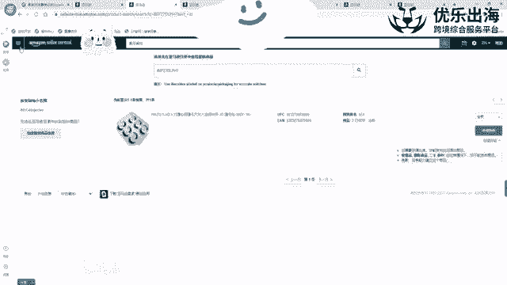
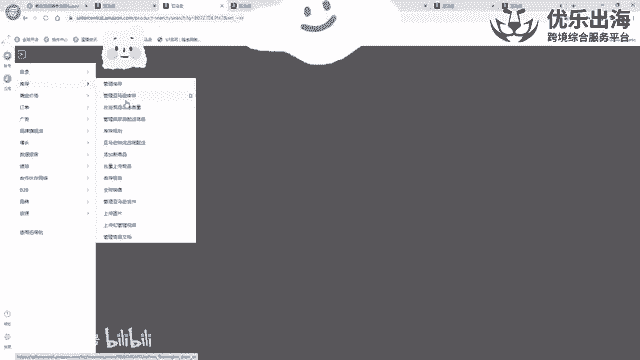
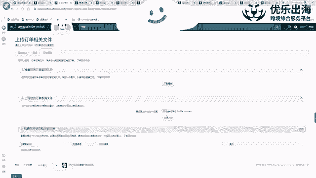
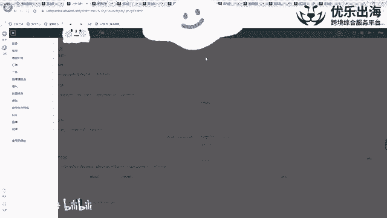
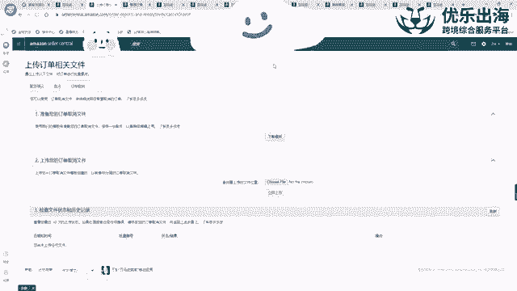
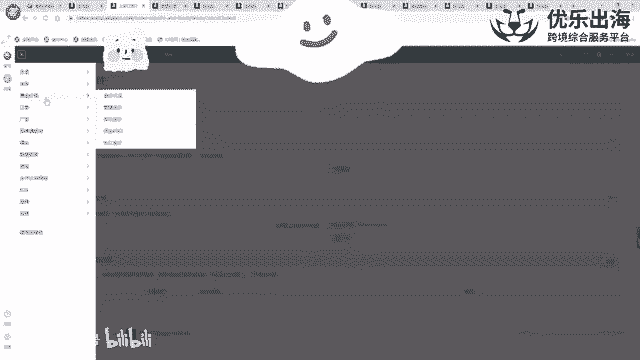

# TikTok+亚马逊跨境电商运营全套零基础视频教程 亚马逊扩展Prime购物服务，推出TikTok广告直购服务 - P20：第15讲.listing上传和管理视频 - 帝国乘风起 - BV14DyAYrEpM

然后接着是上传和管理视频啊，上传和管理视频。那么。我们接下来就是这个在注册了品牌之后，因为大家尽量的还是选择注册品牌哈。注册品牌之后可以使用很多的一种啊功能，再点击上传和管理视频这一部分。

上传和管理视频这一部分点击之后呢，我们可以通过这里去上传我们的一个产品的视频，上传完视频之后，一定要去注意一个点，它的视频的一个要求啊，有一个这样的一个要求，时间是要卡控在60秒以内啊。

还是说45秒以内，我忘了哈，就基本上是一分钟以内时间，然后我们的一个视频要小于5G啊，要有480以上的一个更高的一个分辨率然后另外标题标题里面。

我们这里的标题是展示给客户去看的啊，我们这里的标题是展示给客户去看的。所以说就是关于品牌about。about这个产品。about就是查他这个产品，然后多少多少怎么样。

然后另外一个点就是品牌里面就是AC里面品牌哪一个哪一个品牌，我们这里直接输入负AC的品牌，所有的一个子AC都会列入进去。如果我们针对于不同的颜色，不同的一个尺寸去有单独的一个视频的话。

那么我们可以去就是单纯的放入符合我们标准的一个子AC也是可以的，这个没有问题。然后缩略图缩略图的话是我们这个视频上传之后，我们可以截取视频里面的一个精彩的一个页面啊。因为如果说我们不放缩略图的话。

亚马逊是随机去抽取的啊。亚马逊是随机去抽取视频里面的某一个片段放到我们的一个缩略图上面去然，我们可以看一下哈。那么这个产品可以看一下，就这个可能是这个客户单独放的呃，可能是这个客户单独放的。

因为这个说实话，这个图片做的还是挺不错的，对不对？🎼也可以把这个缩略图放成我们的一个品牌的一个logo。也可以把这个平台logo截成一张图片，去放成我们的一个缩略图啊，然后这样。很专业哈啊。

这视频很专业哈。一个好的一个视频的话，我们可以在这里后台看到我们视频的浏览量的一个完成度啊，也就是说浏览量完成度越高，说明客我们的这个视频对于客户的吸引度越高。

我们的一个转化率就会有相应的一个更好的一个提升啊，更好的一个提升。A加和视频一定是大家就是比较重点所关注的一些点。因为大家有听说过嘛，就是卖电商卖产品就是卖图片，所以说我们一定要去把握住这个板块啊。

增加我们的一个产品的一个流评率啊，是这种。这是上传和管理视频板块。然后接着是我们来讲一下管理订单这个板块。管理订单板块的话是这样啊，就是我们打开管理订单。我们打开管理订单之后呢，我们可以通过这里。啊。

我们可以通过这里去切换我们卖家自配送的订单，以及我们亚马逊FBA的一个订单来回切换啊，我们可以查看。另外然后F就是卖家自配送的一个订单呢，有等待中未发货，已取消和已发货。

就是我们在这里啊把等待中的啊还有未发货的去处理一下就可以了。一般我们我这边的话就是做的FBM的形式比较少。所以说我也不跟大家去演示了。另外一点的话就是亚马逊呃FBA的一个卖家的话，FB订单的话。

就是我们可以通过这里销售渠道进行筛选，只选择CA啊，或者说只选择COM这样的一个卖那个站点去出的一个订单，以及只选择是不是企业买家啊出的一个订单这种情况。我们可以通过这种情况具体去进行一个评判哈。

另外一点，我们就是打开这个产品的呃，打开这个产品的一个页面之后，就订单的一个详情页面。这里有一个呃细节的点，就是首先第一个啊我们可以点击请求评论按钮。因为这个产品是刚发货的。所以说现在还没有办法去点。

可以去点击请求评论按钮去啊让亚马逊官方帮我们锁屏，让亚马逊变官方帮我们锁帮我们锁屏锁屏按钮，就是在这里，然后接着就是联系买家，我们可以直接点击买家的这个呃名字啊，直接就跳转到了联系这个买家的一个页面啊。

非常的方便。然后联系买家的话，有几个。有几个那个原因啊，我们一般选择其他啊，我们一般选择其他，不选择其他的。就算是我们真的给他退款，我们也要选择其他啊，我们要选择其他，然后去联系卖家，联系这个买家。

接着就是订单退款啊。如果说就比如说我们想要去给客户进行退款的时候，那么我们应该如何去操作？一般来说我们这边我都是直接选择一般盘点，然后在这里输入退款的一个金额啊。如果要全额退款的话，直接勾选就可以了。

然后在这里买家须知配送一句话，就是呃sorry呃，就是就是非常抱歉给你一个不愉快的购物体验啊，就此类的一种情况嘛，或者说怎么样，就是please check，就是呃the money。

就是refodre，就是请查收一下我们的一个退款的一个金额啊，然后提交退款就可以了。这是我们这个呃产品的一个退款啊，订单页面里面，我们第一如何去查看FB和FBM的订单。第二就是如何去联系客户。

如何去啊去那个官方锁屏，以及如何去给客户退款。这是管理订单板块哈。另外还有一个点就是。在这里跟大家去呃分享一个非常呃bug的一个东西哈，非常bug的一个东西。就是呃如果说我们再去做亚马逊的时候。

因为我们的一个操作失误，导致设置了大量的0元购的话啊，导致大量的客户0元去买了我们的产品一夜之间，我们的产品被买空的情况。我们这时候会损失惨重。

所以说我们要做的第一件事就是我们要尽可能的把我们的这个店铺啊，就是亏订单取消掉啊，现在已经没有办法去联系客服，把我们的一个店铺呃订单取消掉了。然后。另外一点的话就是我们可以通过啊这里上传订单相关文件啊。

上传订单相关文件里面有一个订单取消。里面有个订单取消，下载这个模板，下载完这个模板之后。下载完这个模板之后，我们把我们的一个订单编号什么的，按信息填入进去，填入进去之后，然后我们点击上传啊。

在这里看能否将我们的订单取消掉。我之前出现过一次这样的一个失误。就是说客户0元购了嘛，0元购之后导致大量的一个亏损啊，一夜之间把我的库存全部买空了，亏了啊几万块，然后这时候的话就是我通过这种形式上传。

但是说实话没有上传成功。模板出现了一个报错，而且到现在我也没有办法去解决这个报错的一个问题。就是我已经开case联系了客服。模板团队的给我的一个回复是他们看不到。因为不是在目录管理库存。

上传产品里面去上传的一个模板编号。所以说他们找不到这个模板编号，没有办法帮助我。然后我联系普通的一个客服，普通的客服的话，说通知我他们没有权限去进入这个事情。所以说这个包括这个报错的一个逻辑的话。

就是他说里面的一个字段无效啊，这种情况下的话没有没有办法很好的解决，一直到现在的没有办法很好解决。就是大家如果说真的遇到这种情况的话，这个可以去尝试一下啊，可以去尝试一下进行操作啊。

但是呃说实话这个成功的概率的话，只能是看我们自己的个人了。万一大家能够成功的，对不对啊？当时提示字段无效的话，我这边就是手动输入，手动挨个输入这个订单编号，以及我去复制。

编号啊都已经尝试了，但是没有成功。

大家有这个具体了解就可以了，希望也希望大家就是啊永远用不到这个功能哈。

