# TikTok+亚马逊跨境电商运营全套零基础视频教程 亚马逊扩展Prime购物服务，推出TikTok广告直购服务 - P21：第16讲.亚马逊产品库存后台管理 - 帝国乘风起 - BV14DyAYrEpM

然后接着是就是刚才我们这个呃库存。板块的话呃库存板块的话我在这里跟大家去。实际的去操作一下接下来的一个库存板块里面的一个产品的一个信息吧。库存更换亚马逊物流配送，增加新商品，全球销售管理亚马逊货架啊。

也就是说我们的一个产品创建完啊，创建完这个lististing之后，我如何给我的产品进行发货补货的一个操作。首先我们打开这个链接啊，去选择。

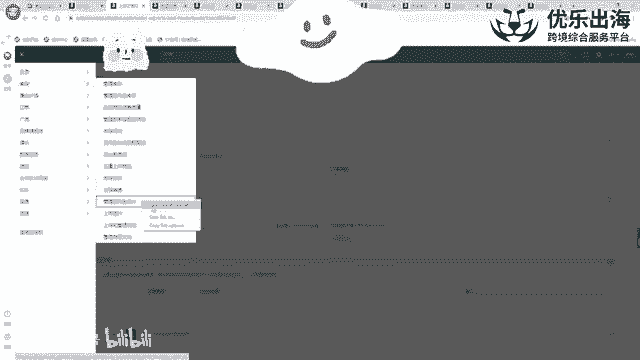

发货补货勾选一这里一定要去切记哈，不要去选择附体，千万千万不要去选择附体，而是去选择字体，而是去选择字体。选择字体之后呢，我们点击发货补货。我们点击发货补货。然后。接下来。那，我以这个产品为例哈。

点击发货补货，这里发货地址尽量的是填写我们营业执照上的一个地址啊。尽量去填写我们营业执照上面的一个地址，然后包装箱的一个数量，我们可以写，可能就是两个箱子啊，两个箱子这种，然后展开一个具体的一个内容。

添加包装行。创建新的包装呃，没有啊，就只有一个包装的话，那么我们就不用创建了。天写2。呃，要发送哪一个数量。然后接着呢就是。移除我们先移除啊，就只保留这一个包装啊，然后我们接下来去。选择。

然后我们在这里就是前面勾选啊之后，我们是点击设置预处理分类。这个预处理分类的话指的是就是我们这个产品是不是一些就是包括一些易碎品啊，包括什么其他的，是否需要二次的亚马逊帮助我们去处理。

我们直接就选择无需预处理就可以啊，我们就直接选择无需预处理，然后点击保存。

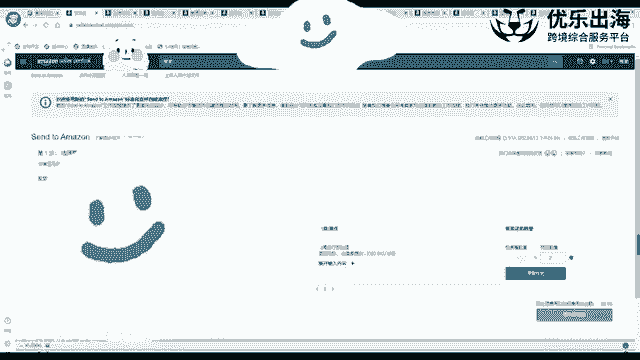

啊，点击保存点击保存完之后呢，然后我们接着就是准备包装。

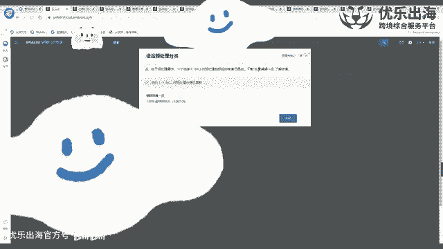

包装完啊，我们去包装单件商品，在这里可以同时去打印出来我们的SQU的一个标签。我们点击SKU标签之后，打印全部啊。

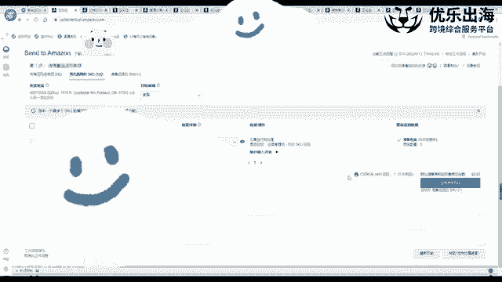

选择打印，然后就会生成PDF格式的啊一个呃产品情况。

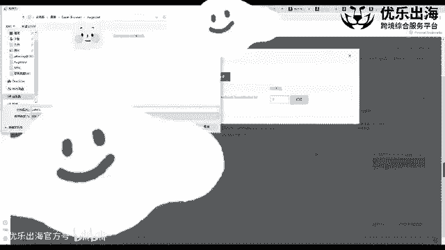

就会生成PDF格式的一种产品情况。那么这时候的话呢，就是我是这种类型的啊一种产品的一个格式。我们可以让美工在下面批上made in chin啊，PS上made in chin，然后打印出来。

如果说不批上的话，那么我们也需要在产品的其他地方有made in chin的一个体现。如果说没有的话，那么会影响我们产品的一个正常入仓。

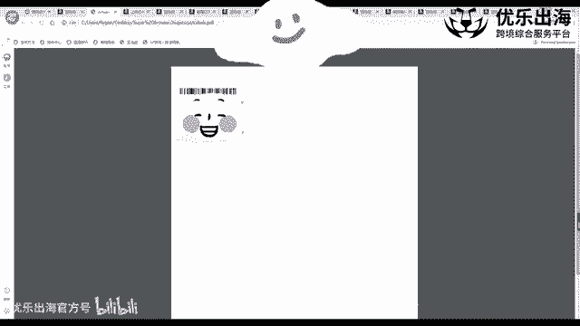

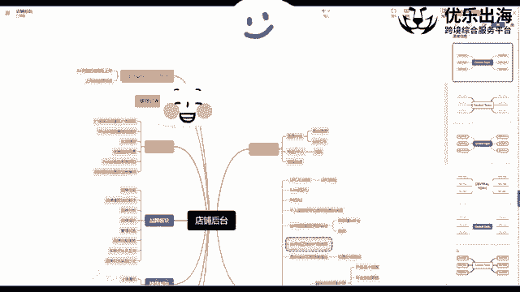

甚至是会导致我们的产品可能就。

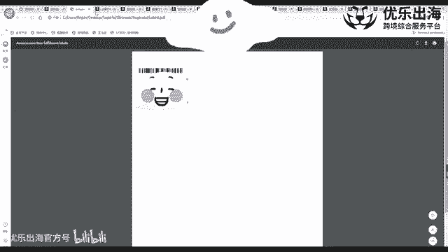

直接入不了仓库啊，打印打印出来之后呢，然后如果我们在这里就是直接进行了下一步啊，下一步下一步之后呢，我们就是整个货件可能处理完了。处理完之后，我们再去没有办法去回到之前的形式。

之前的上一步去打印我们的一个商品标签的话，也不用特别着急。我们可以点击管理库存啊，管理库存页面之后，我们点击我们这个单个产品啊，选择。打印商品标签啊，选择打印商品标签就可以。达到我们刚才那种效果啊。

可以达到我们刚才那种效果。然后接着就是是否是所有的商品装同一个包装箱，需要多个包装箱啊，装一个箱子还是两个箱子，我们可以选择装两个确认，然后我们选择箱数二就可以。然后在这里选择同一个包装箱。

我们直接点确认。那么我们就没有必要去选择这个箱子的一个信息，就是就是每个箱子的一个信息。我们在这里直接就输入多个吧。通过web表单，就是通过网页。输入还是上传excel表格啊，一般来说。

如果说SQ比较多的话，超过50个SQU30个SQU那么强制性的会让我们上传excel表格。一般来来说我们就外部表单需要两个箱子，两个产品，两个箱子，然后打开外部表单，箱子一有几个产品，箱子二有几个产品。

箱子重量是多少？嗯，箱子一的重量是多少？箱子二的重量是多少？然后尺寸呃是多少。

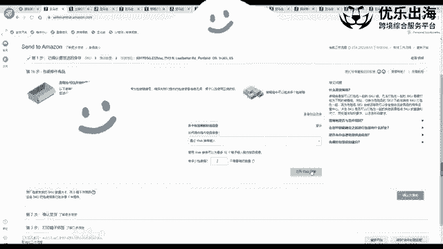

尺寸是多少？然后另外如果说这两个箱子不一般尺寸的话，我们这里。去添加上啊去添加添加上我们产品的一个呃具体的一个信息啊，产品的一个具体的一个信息。然后我们点击确认装箱信息啊，确认装箱信息。

点击确认并且继续。

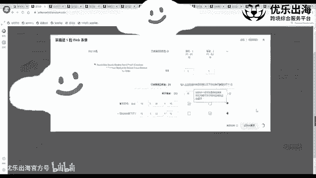

啊，接着就是确认发货发货日期，我们我一般的话尽量的是选择就是今天的日期啊。因为我们创建完的话，一般两三天我就会发走啊。如果说我们要下周或者下周的话，我们也可以选择目标的日期。然后这个日期的话。

主要管的是我们这个货界创建完之后，它会维持3个月3个月啊，然后亚马逊如果就算是没有收到这个产品的话，也会强制性的把这个货界关闭，关闭的话，会影响我们的一个入仓。所以说我们这个开始时间是比较重要的啊。

开始时间比较重要的。然后选择小包裹快递。一般来说的话，我们需要打脱的话啊，就是再去选择汽车连单。啊后接着就是选择非亚马逊承运人选择其他啊，选择其他就算是我们发的是UPSDHR。

我我这边的话一般都是选择其他没有什么问题，不会影响我们的入仓啊，非常的正常。包括我们海运啊，卡车派送，我都是选。都没有什么问题，然后接收费用。并且准备发货啊，接收费用，并且准备发货。

然后我们点击进入到下一步打印箱子的一个标签。在这里我们可以点击打印，打印完之后就直接出来了我们箱贴的啊一种显示。我们这里箱贴的话，然后也可以在这里PS上made in china。

或者说是我们单独在箱子上贴上一个made in chin的一个标签啊，贴上made in chin标签，一定要去切记我们的一个包装箱上和我们的一个产品上面都是需要我们的made in chin的啊。

然后接着就是继续输入啊，追踪的详情，点击完这一步呢，就是输入我们的运单号，快递单号输入完我们的一个快递单号之后，基本上就整个货件就算是创建完成，我们就发货。正常的我们贴标发货就可以了。

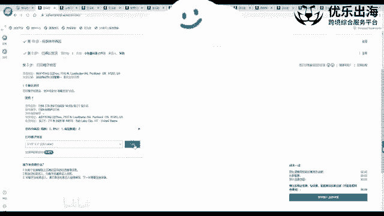

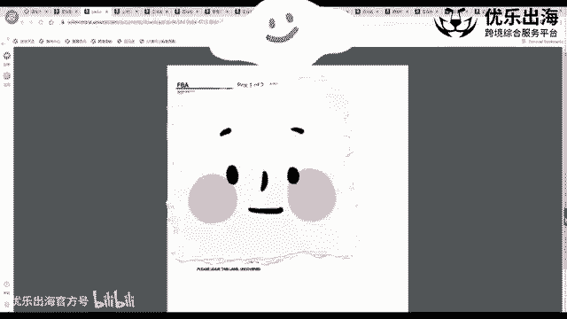

这是我们的一个创建的流程哈。另外就是因为这是演示嘛，所以说我就直接点击这里啊删除货件以及预估的一个费用啊，删除货件以及预估的一个费用。这就是后台的一个啊创建货架的一个板块。

另外一点的话就是在最底部有两个啊，一个是补货限制和一个仓储容量的一个限制。一般来说我们那个产品在呃发过发过去之后哈，然后那个新店，尤其是新店铺，我们在刚开始创建店铺的时候。

一般来说都会有一定的一个限制啊，但是仓库容量的话一般是不会去限制我们啊，一般是不会限制我们。但是我们的一个发货的一个件数，会限制我们啊，一般来说新店铺是1000新店铺是1000。

在一定的有一定的销量之后啊，通再到亚马逊的一个下一个呃IPI的一个绩效的一个考核阶段。那么我们可以呃会根据我们的一个销量的一个表现，适当的放宽我们的一个库容。这时候我跟大家去分享一个小技巧。

也就是说我们这个店铺如果说是新的话，我们可以上一些小的产品啊，比如说一些可能是就是啊指甲呃指甲刀啊，或者说是一些就是非常小的，而且使用频率非常高的这些产品，我们可以上传产品之后。

因为这些产品开单价也不高嘛，对不对？让我们上传产品之后先去出上一二百单，三四百单，就是短时间内出上几百单，出上几百单之后，然后会进入到亚马逊的1个IPI的一个绩效考核里面去。

7月1号就是啊那个新新的一期绩效考核。也就是说我们7月1号之前4563个月。我们那个销量比较不错。我们的日均销量挺高的。那么7月份之后会给我们更多的增加一个库容啊，更多的一个增加库容。

另外一点就是我们那个产品，如果说就着急发货，扩容的话，有两种解决方案，第一种解决方案是去联系我们的一个账号经理。我们的一个招商经理，然后去询问一下，就是他是否可以帮助我们申请扩容。

一般来说大客户经理是有这种权限的，但是普通的账号经理没有这种权限啊，大家可以去询问一下问一下嘛，就是又又不吃亏。然后这个是让我们招商经理帮助我们扩容。第二种方式是我们可以选择去用亚马逊的官方物流啊。

亚马逊的官方物流进行发货。然后这种进行发货的话，那么我们可以联系这个官方的物流经理帮助我们去扩容，甚至是帮助我们去锁仓。因为我们发创建了货架之后，可能会发到一些。就比较呃垃圾的一些仓仓库啊。

就是上架时间非常慢，上架时间非常非常慢。那么这时候的话我们想要改成就比较好的一个仓库的话，就是我们也可以通过使用亚马逊物流联系这个亚马逊物流经理，帮助我们实现锁仓的服务啊，帮助我们实现锁仓的一个服务。

是这种。然后另外也可以通过亚马逊物流经理，帮助我们去申请扩容啊，申请扩容。另外第三种扩容的方式，就是我刚才讲到的啊，就是那个呃就是通过我们产品上架大量的低客单价的产品，然后快速的把我们的销量堆起来。

从而把我们的库容冲开啊，从而把我们的库容冲开，这也是一个比较不错的一个方法。这是这呃关于我们的一个亚马逊货架的一个板块哈，亚马逊货架的一个板块。接下来我再去。

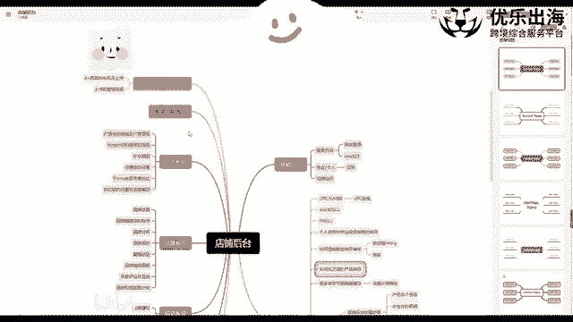

看一下。啊，库存方面的话基本上就啊讲的已经差不多了。然后我们就是确定我们的一个价格，我们的一个产品的一个定价状况，以及我们的一个协议定价。这方面的话就是我基本上都是自动忽略这些呃这些一个定价的一个策略。

因为什么呢？因为我们这个产品呃成本不一样，我们的产品的运费也不一样。别人可能已经是做了很长时间了，所以说这个整体的。整体的一个价格可以压的非常低啊，整体的价格可以压的非常低。但是对于我们来说啊。

对于我们这方面来说的话，就是我们这个产品可能是刚开始新品，我们的一个订货量小，我们的产品成本高。所以说我们的一个整体的成本是要比他们高的。他们的一个售价可能在我们来看来，没有利润或者说是10%利润率。

20%利润率这样是不可以接受的。所以说。一般来说，我都不会去进行这个呃协议定价的一个操作。另外一点就是这个定价可以帮助我们去做什么呢？就是第一是。参考跟我们产品相关的竞品。它的一个定价情况啊。

给我们一个建议情建议的定价。第二个就是可以根据市场上价格的一个波动，自动帮我们去调整价格啊，自动去帮助我们调整价格。但是这个方面的话，我不建议大家去用哈，不建议大家去用佣金折扣的话啊。

我在这里可以跟大家去啊去显演示一下哈，就是降低价格获得佣金折扣。

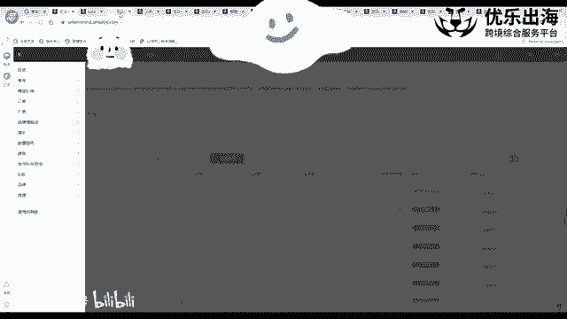

比如说就是我们如果有一些直接降到了现实的优惠的一些价格的话，那么呃亚马逊可能会从15%的佣金变成10%的佣金。但是这里是需要呃那个有一个定价建议的。也就是说亚马逊在我们的产品已经卖了一年了。

我们都是100美金。亚马逊在这有一个定价建议，要我们降到80美金，降到80美金的话，它会从15%的佣金降为5%的佣金啊，我们降完之后，它会给我们佣金的一个折扣。另外一点的话。

就是我们这个呃产品如果没有这个定价建议的话，那么我们也是获就算是降价了，也获得不了这个佣金的一个折扣啊，这是库存板块，订单板块确定价格板块以及目录板块。我们接着去讲我们的广告板块。

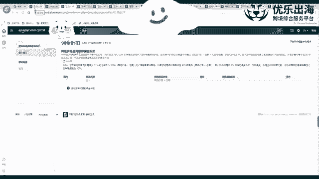

首先啊打开活动广告活动管理。广告活动管理的话有三种广告层级，一种是广告组合，还有一种是广告活动，一个是广告组。这个我会在广告的板块详细的去跟大家去解答一下。然后首先是那个创建广告活动的话。

我也会在那个接下来去具体的去跟大家去讲一下哈。

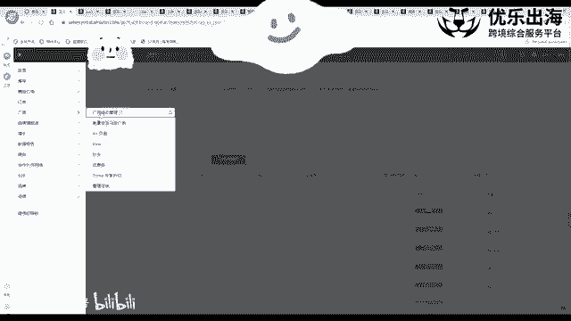

让我们这里可以点击继续。嗯，可以点击继续。然后在广告的板块里面，我们去输入广告组的名称，添加上我们的产品，以及我们的定价策略。我们的竞价是多少，否定关键词，否定商品以及我们的一个呃产品的一个竞价策略。

最后启动我们的一个广告活动啊，这是广告这一层面，我们在这里就不太具体的进行讲，就是主要是讲解我们关于这个店铺后台的一个操作嘛，基础操作。然后接着就是衡量非亚马逊的一个广告。

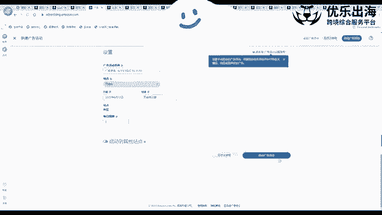

这里主要指的是呃亚马逊三种广告模式里面的呃SD广告啊，就是retargeting呃在营销亚马逊广告这个广告的话呢，是这样哈，就是我们这个产品，我们这个产品如果设置SD广告的话。

我们在广告环理活动管理里面是没有办法看到很详细的1个SD广告的一个详情。我们可以在这里去看到啊，数据页面。然后接着是产品的A加。刚才讲类似性的时候已经讲到了，接着是one计划啊。

one计划的话是亚马逊官方养的AP批测评人啊，亚马逊官方养的一些一批测评人。

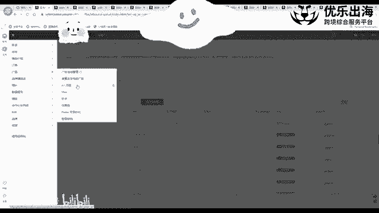

我们可以在这里看一下，了解更多信息。然后我们可以把符合我们标准的一些产品去输入A，输入Ain之后，然后去放最多30个产品。最多放30个产品，然后亚马逊呃亚马逊的一个就是官方的一个测评人。

看到我们的产品感兴趣的话，会就是直接放到我们的这个这个。里面去吧啊，就是直接会领取我们的一个产品，并且领取我们产品的一个呃之后呢，他们会要求会写上一个呃一段一个评价。会写上一段评价。是这种哈。

然后这里的话首先是第一个我们是需要是FB，第二个是我们需要是品牌的所有者。第三个就是每一次会收取一定的费用。这个费用的话就是他会帮我们挂到他的一个就是测评的那个网站上3个月。

3个月里面有一个人领也会收取200美金的一个费用。然后呃那个只是。帮我们放3个月，这是帮我们放3个月。如果说三个月之后没有人领，那么也基本上作废啊，也别基本上作废3个月只里面只领了一个，只领了一个的话。

我们也需要支付200美年的一个费用啊。然后这个的话基本上就是。建议大家是什么呢？就是什么样的一个产品才是。亚马逊万计化的人就是就是比较喜欢的产品领的可能会多一些。第一个就是第一，它有一定的市场体量。

也就是它不是一种非常冷门的一种产品，并不是说放上去之后，我根本就不知道这个产品是做什么的，大部分人都不知道，那么也不会对它感兴趣，这是第一点。第二点是我们的客单价尽量的高一些。😡。

最起码我们也要比我们整体的市面上的一个价格要略高一些啊，略高一些，最好是30美金以上，40美金以上，50美金以上。这样的一些产品的话，再配合稍微有一定的一个市场体量。

那么这样的产品是比较容易能够被被人领到的。第二个点的话就是美国站这边因为测评人可能是太多了嘛啊，万计化的人太多了。英国那边啊英国欧洲那边，包括日本那边，他们领取的万计化的一种呃这个形式的话。

就是比较快的啊，他们领取的万计化的这个情况是比较快的。所以说我们可以重点的去。进行一个啊具体的一个考量啊，在这里跟大家去分享一下。然后呢，就是我们产品提报one计划的一个标准啊，需要是评论少于30个啊。

新品FBA然后可购买的一个库存，然后怎么怎么样，这些大家可以自行的去看一下哈。

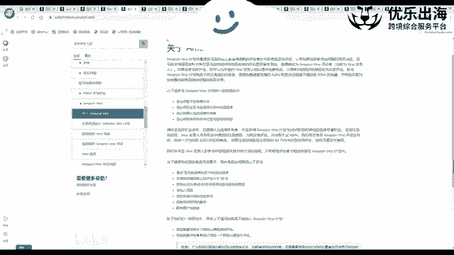

接着是秒杀的啊秒杀方面的一个提报的一个方法啊。广告下面啊，接着我们去打开秒杀页面，打开秒杀页面。打开秒杀页面之后呢，我们点击创建新促销啊，这里面有两点。第一个是秒杀。

就是LD嘛啊就是一天时间12个小时之间的秒杀。第二个就是7天的促销，7天的秒杀。这个秒杀的话，我会单独的在新品推广那里跟大家去具体的讲一下，里面的一些操作的技巧。然后指的就是如果说。

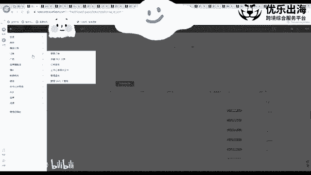

我们的产品符合秒杀情况下的话，我们可以在这里就是直接有秒杀推荐，点击创建秒杀就可以了啊，点击创建秒杀就可以创建新的一个促销啊。另外大家可以看一下，就是针对于这个点嘛，就是还有一个prim的一个呃时间。

今年的prim的一个时间是7月22号，那7月22号，然后。呃，7天秒杀不符合prim的一个促销活动啊，不符合prim的一个促销活动。所以说。

大家可以现在看一下后台就是有没有prim的一个啊秒杀提报资格啊，如果有的话，可以提报一下，这个流量还是比较大的。接着就是prim的一个会员专享折扣啊，prim的一个会员专享折扣的话。

我接着跟大家可以看一下。😊。

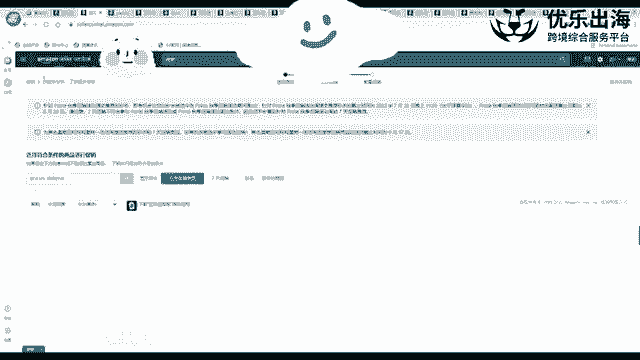

prim的一个会员专用折扣。如果说我们的一个产品就算是没有在会员日的秒杀里面没有推荐的话，我们也可以单独的设置会员日的一个秒杀的一个折扣。我们可以第一点击创建折扣。

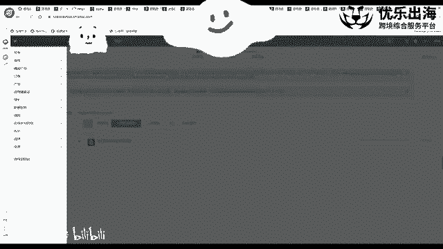

创建折扣这个什么呢？就是下面有一个。问答此折扣是否是prim会员的折扣？prim会员折扣是prim会员日折扣，也就是说什么意思嘛？7月22号嘛，对不对？是这个prim的一个会员日的折扣。

那么如果说是的话。时间直接就没有了啊，时间现就没有了。然后我们就直接点击就是。产品。Pm。备案日。这扣。🎼我们保存并添加商品就可以了。然后这个折扣只会在会员日期间生效啊，只会在会员日期间进行生效。

如果说不是的话，我们就是想要平时生效。我们选择今天。嗯，我们选择今天之后，我选择一个日期，我想在这个月之内或者说今年之内或者多长时间之内生效。那么我们可以点击这里，然后这里就不需要那什么了。

就产品会员折扣。会员折扣。会员折扣，然后保存并添加商品，保存并添加商品，最后提报就可以了。在这里需要注意的一个点就是第一，我们需要注意查看一下会员日的指南。

会员日的指南它的一个价格优惠力度必须要少于20%啊，然后那个至至少要20%以上，并且啊要低于过去A30天的一个最最低价。这是pre会员日的一个指南哈。另外普通的一个的一个折扣的话。

就是基本上至少优惠10%啊，至少优惠10%。另外一点的话，我们在这里可以看SQ啊我们输上就可以折扣的类型一般都是百分比一般都是百分比然后10%的一个折扣啊，或者是20%的一个折扣都可以。

然后接着有一个最低的一个价格，您的最低的一个价格啊，大家需要注意一个点，就是这个最低价格里面我们产品是100美金。我们这里有20%的的一个折扣。我们可能也有其他的比如折扣嘛。

我们也设置了50%我们也设置了20%优惠券我们也设置了20%。那么这三个折扣相加是60%的折扣，折扣太大了。我们可以在这里设置。😊，50啊，也就是说在使用prim折扣之后。

如果说最低的最终的价格低于百分百分之就是50美金的话，那么prim的折扣是不生效的。其他的折扣正常生效。但是prim的一个折扣是不生效的。所以说这里大家需要去注意一下。

最好是设置一个就是一个保底的一个我们的一个价格可能是盈亏平衡点或者是其他的一个方向啊，下一个方向。这是啊prim的一个折扣一个情况哈。prim折扣情况，接着去。跟大家去说一下优惠券。优惠券是怎么样的？

就是我们在这里可以点击创建新的优惠券，然后把我们的一个as去填入进去。去找一个A赛啊。然后我们把as输入完了，直接就刚才就直接就剪辑掉了。然后开始日期我们选一个结束日期我们选一个。

然后我们想要去是设置折扣百分比，还是说设置我们的一个直接的一个优惠价格，我们可以在这里选择啊，一般来说我跟大家去说一个小技巧啊，设置的时候，小技巧。如果说我们的产品低于100美金。

如果我们的产品客单价低于100美金，那么我们可以去直接输入我们的一个百分比啊。如果说我们的客单价高于100美金的话，我们可以直接就输入啊一个那个呃就是金额折扣金额。因为说实话的话就是。大家可以想一下。

如果我们那个客单价高于100美金的话，我们设置。10%和就是设置11美金可能是一样的。但是11美金能够给到客户的一个直接的观点是它更大。客户很多的客户都比较懒了，他是看哪一个数字比较大。

他就可能会直接就断定这个他的一个这个卖家的优惠力度就会大。所以说我们高于100美金的产品，尽量设置一个金额的折扣，低于100美金的产品，设置啊百分比的一个折扣。

然后这里就是还可以限制每位买家只能使用一次折个折扣码。然后接着设置预算啊，预算的话就是我们一般就是保证一个充足的一个预算，以及优惠券的名称。我们产品名。产品名称啊，在这里有个10%。

我们设置10%之后可以看到，就我们可以直接在这里看到优惠10%这个产品啊这个产品。一目了然，我们再直接点击继续就可以了。在这里也有一个所有的卖家，我们是针对于会员，还是说是学生会员，还是说家庭会员啊。

就是他们可以使用这个折扣，我们可以进行设置一下。这是关于优惠券的一个呃设置哈。优惠券的一个设置的话，可以直接在前台。就展示出来。看一下有没有啊，在这里酷oppen啊，直接在前台这里进行展示。

刚才说的那个会员日的一个折扣啊，会员日折扣只有亚马逊的会员呃，只有亚马逊的会员才可以看到这个折扣的一个情况，才可以看到折扣情况。我们普通的一个卖家，包括我们现在都没有去登录。

我们是看不到这个折扣的一个情况的啊，就是我们的页面。上面的显示的价格跟prim的一个会员，他们的一个显示价格都不一样啊，大家能理解就可以了。这是优惠券哈。

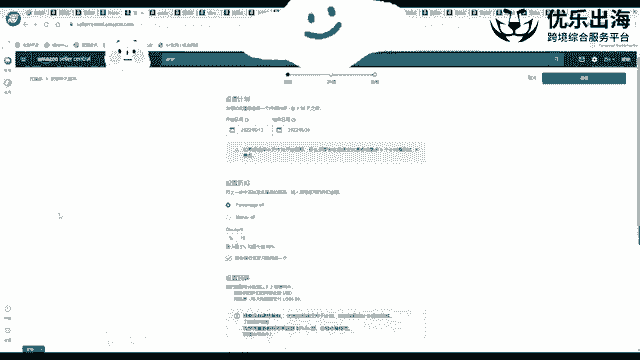

呃，优惠券完了之后，我们再接着去讲解。

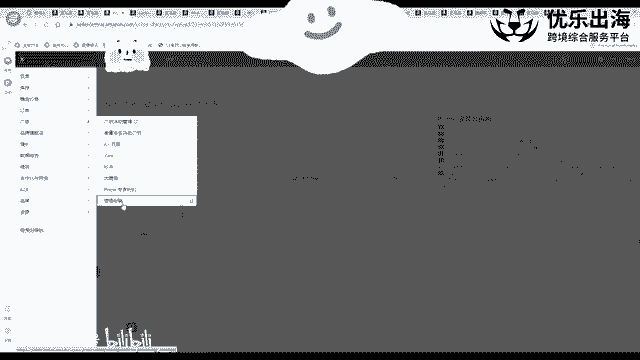

管理促销啊管理促销这个是非常重要的一个点哈。因为很多时候导致两个折扣码进行叠加和折扣码和优惠券之间进行叠加，折扣码优惠券会员日折会员日折扣，会员折扣进行叠加都会导致我们的一个非常严重的一个亏损。

所以说大家一定要去非常注意我们这个就是设置的一个点。😊，首先管理促销里面有3个买一赠一是比较简单的，就是输入一个商品，然后再输入另一个商品就可以了。然后创建促销以及购买折扣啊。

创建促销以及购买折扣里面有一个射媒和购买折扣。射媒的话是怎么样呢？就是我们创建一个自定义的促销折扣码。但是这个折扣码的话，最高生效期只能是一个月只能是一个月啊，或者说是就是生效时间非常短。

然后我们有这个折扣码的话，就直接生效，生效完之后，亚马逊的红人。会直接看到我们的这个折扣码。如果他们感兴趣的话，帮助我们去推广这个产品，可以获得他们的一个一定的一个呃佣金啊，获得一个一定的一个佣金。

是这个设媒促销折扣代码专门。我们设置好之后，不用专门发给网红啊，就是亚马逊有一个网红平台，他会自己的去呃领取啊去领取。

或者说是我们这边也可以去发到我们自己的ins账号或者facebook账号里面啊放到这些里面去领取。然后接着就是购买折扣。也就是说我们平时去做站外的时候，用的最多的一个点啊，里面第一个购买数量。

购买一个产品。就可以享受到我们设置的这个折扣的一个信息。然后第二个就是商品，我们要选择都是哪些商品。以及我们可以选择所有的一个商品分类啊，所有商品分类。另外呢我们就是店铺里面有10个产品。

我们只想让一个产品去做，我们就选择创建新的商品链接。在商新的商品链接里面，我们可以用SQ或者AC，然后SQ。列表创建SQU列表之后，我们输入我们产品的一个名称，方便我们辨别嘛。SQ里面包括as里面。

我们可以。输入一个负ac，那么所有的子都会生效，也可以输入我们部分的子a啊，只针对于我们部分的Zac进行生效。是针对于我们部分的theation进行生效这种。然后减免的折扣啊，百。

比如说40%offer或者30offer或者220offer。然后有一个更多选项添加促效性级。就是说客户在买两个之后可以获得50%3个之后可以获得60%，这个就呃大家明白就可以了。

可以自动设设可以自己去设定。然后另外的话就是这里面所有商品分类里面哪些不去参加。我们可以这里单独再去选啊，单独再去选。然后这就是我们。这个折扣开始日期以及我们这个折扣的一个结束日期是多少？内部的描述啊。

比如说我们A产品，然后40%的折扣，我们可以直接通过这里。因为这个这里是给我们卖家来看的，帮助我们去识别啊识别这个追踪编码，我们这个直接就可以忽略掉然后优惠码有3个，第一个是没有优惠码。

就是客户所有的客户都可以去用啊，直接去用。第二个就是无限制的折扣码啊，无限制的折扣码。然后那个没有数量限制，可以就是客户使用的次数没有限制。还有一个就是一次性，客户只能用一次啊，这个折扣码。

那么无限制的折扣码里面里面也有一个具体一个信息，就是每位买家只能使用一次优惠码啊。只用只能使用一次优惠码。但是我们这里勾选了之后，可以并不代表着就是他只能去买一个产品。这个买家在购买多个产品的时候。

也可以去呃，就是通过这个折扣码一次性的批量使用啊，批量使用。我们可以看一下这里。无限制折扣码没有数量限制。如果说将发布在上美网站上，库存会短时间之内售完，否则我们可以选择一次性的一个促销编码啊。

一次性促销编码。但是一般来说的话都是选择无限制，然后勾选只能使用一次啊，或者说是不勾选也没有什么太大的问题啊，不勾选也没有什么太大的问题。然后在这里去输入我们的一个优惠码的一个信息啊。

输入我们的优惠码的一个信息，然后我们可以自己去编辑这个优惠码。在这里有一个比较重要的点，如果我们选择勾选的话，那么前台会展示出来我们的个这个折扣码。

所有的买家都可以看到所有的买家都可以看到所有的买家都可以用。那么我们。取消勾选的话，然后只把这个优惠码发给我们的一个站外的服务商啊，然后那么这个站外服务商的一个效果就可以有单独的一个展现啊。

单独的一个展现。并且我们还可以通过这种形式去联系红人。给红人单独设置一个折扣码啊，然后前台显示隐藏。我们可以看到这个红人的一个具体的一个效果到底是怎么样的啊，到底是怎么样的优惠码啊。

包括我们这个呃产品展示的一个形形式。那，这就是一次性。一次性的话基本上就是我们设置呃设置完之后，就是买家可以直接就使用了嘛买家直接使用了嘛。一般来说我们放站外的话。

都是去进行无限制的一个折扣码的一个设置。然后点击查看，还有提交啊，就是我们这个折扣码设置就成功了。啊。🎼然后这是我们广告板块，广告活动的一个创建啊，万计划的一个提报，秒杀的提报优惠券的一个设置。

然后prim会员专享折扣的一个设置，以及我们折扣码的一个设置和注意事项。

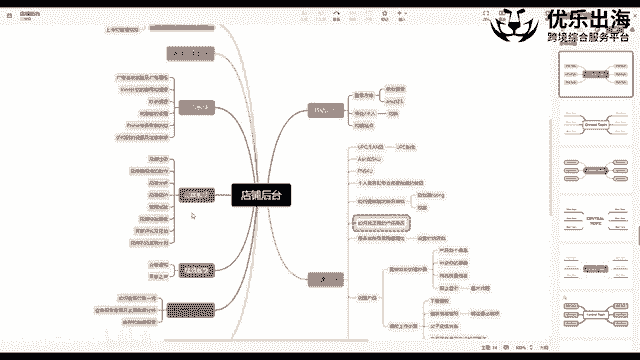