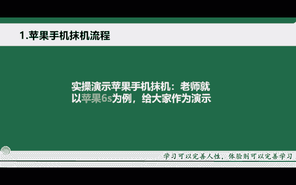

# TikTok+亚马逊跨境电商运营全套零基础视频教程 亚马逊扩展Prime购物服务，推出TikTok广告直购服务 - P33：7.苹果手机抹机实操演示 - 帝国乘风起 - BV14DyAYrEpM

那首先第一个啊，我们来给大家去演示一下这个苹果手机裸机的一个流程啊，那苹果手机的话这个比较多，对吧？比如说像苹果七、苹果八等等啊，苹果十一、苹果12，苹果13啊，这么多，对吧？

那今天的话老师就以这个苹果6S为例啊，给大家做一个演示啊，那其实苹果手机它的系统都是一样的啊，同一个系统。所以说它的裸机的话，它大致都是相似的啊。如果说有个别你不懂的啊。

你都可以截图或者说拍视频发给对应的解答老师啊，这边的话都会给你进行一个讲解啊。那今天的话老师这边的话就以这个苹果6S啊，作为一个裸机啊，给大家去进行一个详细的演示好。

OK那接下来的话给大家实操一下苹果手机磨机的一个教程。嗯，那这个手机的话是老师用的苹果6S啊，以苹果6S给大家为例进行一个裸机实操。那首先的话这个就是一个新买的手机啊，而且的话什么里面都没有下载。

里面是没有插卡的啊，然后就连接了一个wifi。那接下来的话我们怎么去给它进行磨机了。首先点到这个设置里面去啊，点到设置里面的话，然后往下面滑啊，往下面滑，然后呢找到这个通用啊，就是通用这里。点击通用。

然后呢，点击通用之后呢，滑到这个地方有个还原啊，点击还原。然后呢，上面第二个抹除所有内容与设置，然后点击这个啊，然后呢抹掉iphone。再继续啊点抹抹掉iphone。那在这一步之后。

他手机的话就会重启啊，就是进入这样的一个界面。大概这个过程的话就是呃1到2分钟啊，1到2分钟。这个看手机啊，每个手机的话它都不同。有的手机的话，它进度比较快。有些手机的话，它进度的话相对比较慢。

同学们的话就在这个地方耐心的等待一下就行啊。OK啊，当它这个重启完成之后，它就会进入到这个界面啊，进入到这个界面之后，我们应该怎么做呢？直接按这个手机啊，这个home键就是中间这个小圆圈啊，按一下啊。

按一下之后它会出现一个语言的选择，那我们肯定是要选择这个英文啊，就是你要去做台湾的话，你可以选择繁体的中文。那如果说你要去做英国美区啊，你就直接选择english啊，选择英语啊进来之后的话。

这一步就是我们要去选择国家的时候啊，就是地区的时候，那我们直接划到最下方啊，选美国找美国的话，就是这个啊 states啊，当然老师的英语不是很好啊，大概就这个意思就是英语啊，呃选择英国啊美国啊。

然后选完了之后直接点击这个下面这个。蓝色的啊还是一样。现在的话直接点击这个中间的蓝色的往进走啊，这里的话就需要大家去选择一个呃这个。wifi然后呢连接上啊，就是你自己的手机开个热点。

或者说你自家的wifi都可以啊，我这边的话连接一下。OK当它连接上这个wifi之后，就需要设置这个手机啊，大概就是稍微等它那么一分钟左右啊。这里的话它也是比较慢的啊，就是跟之前重启的那一个时间段差不多。

okK进入到这个界面之后的话，我们就直接点击上面的啊这个蓝色的这里点击。然后呢，这里就是让你去输入你的这个ID那我们肯定是没有的啊，后期再去输入啊，在某机的过程中，不需要去输入ID。然后我们点击第二个。

点第二个了，然后点不使用啊。然后在这个进来之后，我们点中间蓝色的这个地方，点蓝色的。然后呢，我们点最后一个就是第四个这一步啊，然后呢我们剪点不使用啊，第一个。OK然后进入到这个界面之后。

我们就点最后一个。然后呢，这里的话就是让你去输入你的ID，然后你就暂时先不用点中间这个蓝色的，然后呢点这个稍后再去设置啊，中间蓝色的，然后呢点这个不许用OK。那这里的话就是它苹果的一个协议啊。

苹果的一个协议。然后呢我们点击agree同意啊。然后这一步的话就是一个定位跟这个数据分析。然后我们点这个下方的啊，就是第二个这个然后我们点这个设置啊，然后还是点这个中间的啊，然后这里的话也是个定位。

我们点第二个，然后点OK啊，就把定位关闭，然后这个siri啊，这个东西的话，我们也是稍后去设置啊，点第二个。然后这个时间的话，我们也是点第二个啊，还有这个APP的苹果的一个数据分析啊，我们点。不去啊。

然后这里的话就是一个界面啊，深浅。然后我们点这个。默认的就行啊，这里的话也是一样，就总共一个按钮啊，你直接往下点就行啊，这里也是一样。OK那后这样的情况下的话，我们的这个手机就进来了啊，都进来了。

但是呢还没有模具完成啊，我们需要干什么？需要设置啊，需要设置它的这个语言时区跟定位这些啊OK然后呢，我们给它点到这个设置里面去啊，设置里面进来之后，它会跳出一个这个啊，就是访问wifi与数据。这个的话。

我们点第一个啊，一定要点第一个就是第一个wifi与数据蜂窝数据啊，点了之后的话，我们划到这个设置里面去。点开设置，然后呢找到time时间啊，这个date跟time，这个就是日期与时间。然后呢。

我们把这个定位给它找到这个美国的洛杉矶啊。搜ROS啊，就是美国洛杉矶的一个简称啊。如果说大家不知道的话，可以自己自行去百度啊，然后搜索点击这个ok然后这里的话就是美国洛杉矶的一个时区。

你可以看到它现在已经是改过来了哈，然后我们再点返回，然后点返回了，找到这个隐私啊，就像手一样的这个东西，点击进去进去之后的话，先看一下定位有没有关闭啊。因为我们刚刚在这个某机的过程中已经把定位关闭了。

所以说它这里没有显示啊，然后这个地方也给它关闭啊，然后点返回啊，再点返回okK那这样的话就是整个的操作的话就已经完成了啊，已经完成了那有些部分的话，它是有这个广告跟踪的啊，有些有些手机版本它是没有的。

广告跟踪的话，有你就给它关闭，没有的话就不用关啊，广告跟踪的位置的话，也给大家去找一下啊，就是在这个定位下方啊，定位的第二行有有的是没有的啊。啊，这个手机的话就是整个设置啊就是已经设置好了啊。

然后很多同学会发现，哎这个上面的这些APP好像都是在等待当中啊，还没有下载，你又怎么办呢？你点击一下啊，点击一下，它就是否访问这个wifi数据啊。你点第一个啊访问允许啊，那你可可以看到吧。啊。

它所有的APP就开始下载了啊，就是因为你刚刚没有点允许啊，然后这样的话就整个的手机已经给它默击完成了啊。好。

