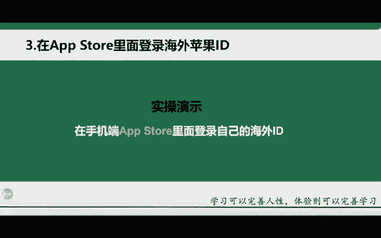
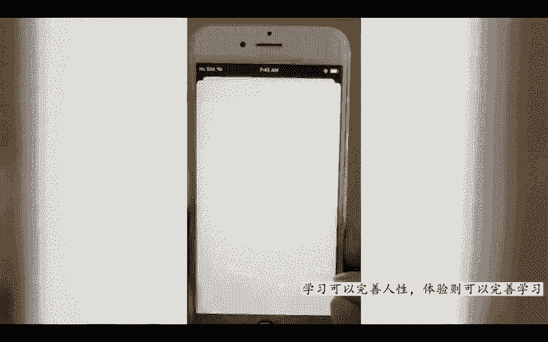

# TikTok+亚马逊跨境电商运营全套零基础视频教程 亚马逊扩展Prime购物服务，推出TikTok广告直购服务 - P34：10.在App Store里面登录海外苹果ID - 帝国乘风起 - BV14DyAYrEpM

OK那接下来给大家去讲一下这个第三个啊，就是在商店里面去登录自己注册的一个海外苹果ID啊，这个也是非常至关重要的啊，至关重要的。大家要做好笔记，一定在这个apple store里面去登录。

不要在自己的设置里面去登录。记住啊，不要在自己的这个手机设置里面去登录好吧啊，这里我给大家进行一个重点的一个强调啊，重点的一个强调，因为很多同学在这里就犯了一个小错误啊。

就是很多同学他会在设置里面去登录啊，千万不要再样去做啊，记住在apple store里面去登录，也就是我们常用的这个苹果的商店啊，苹果商店啊。

那接下来我给大家去实操演示一下这个台外ID它登录的一个流程啊。

hello同学们好，今天的话我给大家录制一个在手机端登录自己的一个苹果海外ID的教程啊。那首先的话我们拿到了这个手机的话是磨过机的啊，一定要记得就是磨过机的。磨完机之后的话。

连接上自己的一个wifi或者说自己的热点。那这边的话老师在这个录制的时候连接的是我自己的热点啊，就是在联网的一个情况下，然后呢，我们登录自己的海外苹果ID那登录的时候的话，一定要记得在这个苹果商店。

就是这个APP star里面去登录。啊后就是i star里面去登录。然后我们打开我们的这个i star。那打开之后的话，大家可以看到啊，进来就是这样的一个界面。进来之后的话。

我们点击这个右上角这个地方啊，打开这个右上角这个头像啊，然后在这里呢输入我们的注册好的这个ID的账号跟密码啊，稍等啊，随便的话输入一下。呃，6。6晚上。Ocle。OUT啊都O。点C。然后呢。

我这边的话密码就不给大家去看了啊，我这边的话输入一下密码。Yeah。OK啊，输入密码之后的话，我们点击啊就是把你的账号跟密码输入完成。输入完成之后呢，我们点击下方的这个登录啊，就是左下角这个啊点登录。

点击。由于你的账号的话，注册下来是新的账号，啊新的账号的话，它会发送到你的这个手机验证，可以看到吗？就是你的手机会接入的一个验证码啊，这个的话就是你在你的手机上就可以看到。贴个码就行。

我这边的话梳理一下。272237。272。哎，说错了。272。237OK好，输入验证码之后，它就会自动跳转到这一步，然后你就等它这个加载啊，因为它又上页的话，还是转圈圈啊。到达这一步的话。

就很多同学就不知道怎么操作了啊，一直问老师对吧？然后今天的话就给大家去讲一下，到达这一步怎么操作。因为由于你的账号的话，它是新的账号，新的账号的话，你第一次登录它会有一个验证啊，就会有一个验证。

我们点击右边的这个检查啊，就是验证，一定要记得点击右边的这个啊，点击右边的点击。那点击进来之后的话，它就会跳转到一个你填写信息的一个界面了。

就以这个地方的话就是一个协议啊，你就不用管它是什么协议。你点击这个右边的开关给它打开啊，就是这个开关，本来是关闭的，然后你给它打开啊，打开之后的话，我们点击右上角的这个下一步啊，就是右上角这里next。

然后点击下一步。点击下一步之后，进入进入到这个步骤，大家的话一定不要乱动啊一定不要乱动，就是直接看都不用看。因为你在注册你的这个ID的时候，你将这些信息都已经填写完了啊，所以说在这里的话不需要动它。

然后呢点击这个右上角的下一步啊，一定要记得点击右上角下一步，然后我们点next下一步。OK到达这里的话，你就点击这个下好的啊，蓝色的就只有这一个啊，点击蓝色的OK这种情况下的话。

就是你将你注册好的这个海外的苹果ID就已经完全登录到你的这个手机里面去了。可以看到吧？就是你这个账号已经完全登录上了啊，这个的话就是一个海外ID的一个登录教程啊，登录教程。那今天的话就给大家录制到这里。

