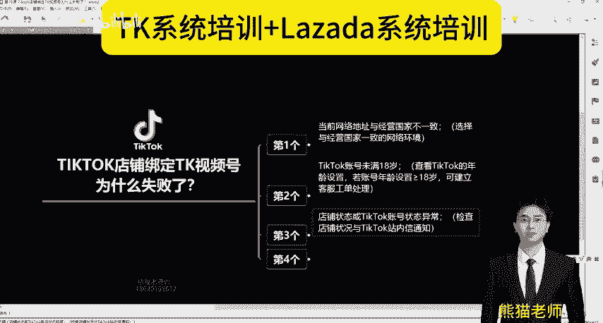
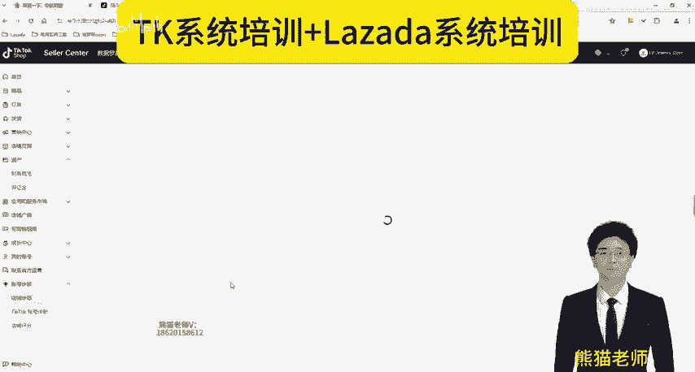
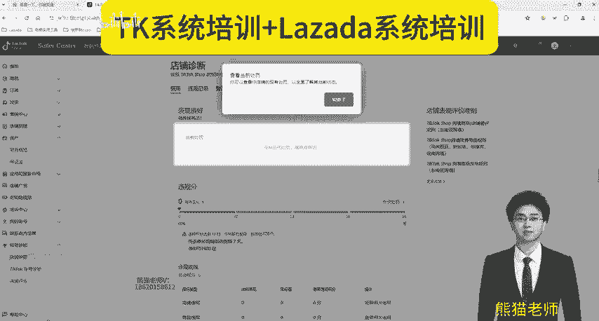
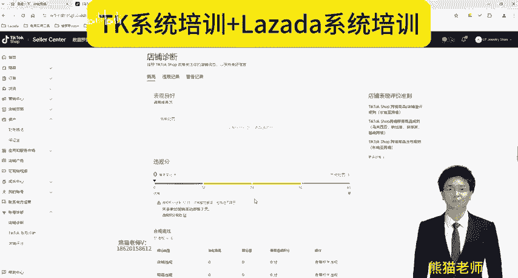
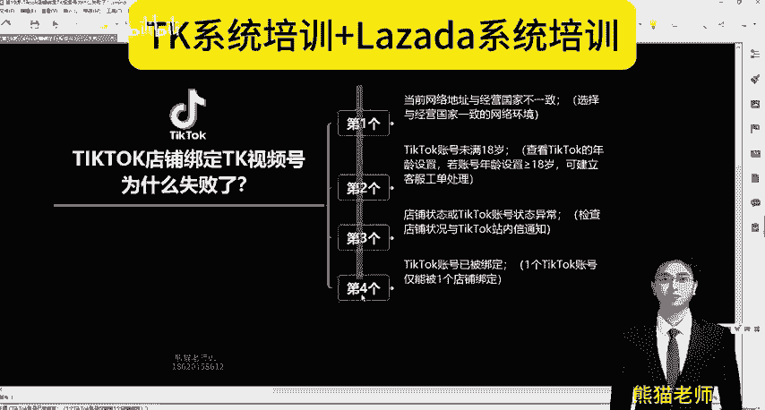

# Tiktok店铺绑定TK视频号为什么失败了？(Tiktok跨境电商之Tiktok运营教程） - P1 - Lazada熊猫老师 - BV1aNaLeqEoa

各位身朋友大家好，我是熊猫。我们一直在做TK和哪自亚的一个系统培训。同时我们也在做独立站的一个相关服务。好，这个视频呢给大家分享的是TK店铺绑定TK视频号为什么会失败。

那这个是非常多的商家遇到这个问题是吧？给大家找四个原因，大家自己做一个排查。第一个呢就是当前网络地址和经营国家不一致？你要选择与经营国家一致的网络环境。什么意思？比如说你做泰国。

然后你TK视频号是泰国IP是吧？但其实你选择的TK视频号的IP，它不是泰国的，它是菲律宾的新加坡的或者是美国的那这就是网络环境不一致导致的错误。第二个是啥？就说你的TK视频号。没有满18岁。

因为我们在注册第个视频号的时候，他要填写是吧？你可以在账号里面设置年龄呢，你要大于等于18岁。好，第三个哎第三个是啥？第三个就是说我的1个TK店铺的状态，或者说我TK的账号异常，你一定要去检查一下是吧？

比如说我们直接进入。

我们的TK店铺后台是吧？在账号诊断这里面有一个店铺诊断和TK看我的鼠标左下角左下角啊标左右部分，左下角TK账号的诊断。这两个呢就是刚才说的第三第三点，你的状态是否正常，是不是要判断？

反正店铺已经忘记缴纳保证金是吧？店铺已经疯了。你说熊猫老师绑不上绑不上，这谁绑，或者说你违规了，你的48分之干掉了，是吧？绑不上绑不上，这怎么绑嘛？

是不是要做排查，必须要。第四点。我们的TK账号已被绑定了是吧？比如说你邀请一个达人是吧？那个达人已经绑定了其他的TK店铺，那这个时候就不行，是不是？因为他1个TK账号只能绑定一个店铺。

你只能干嘛跟他私聊是，你能不能解绑啊，来绑定我们的呀，是不是这么个意思？所以说一定要一个点1个点去排查。好，还没有关注我的朋友先点一波关注，谢谢大家。

