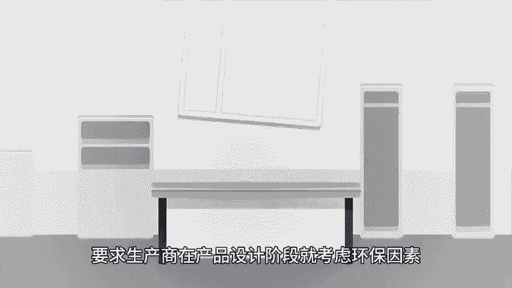
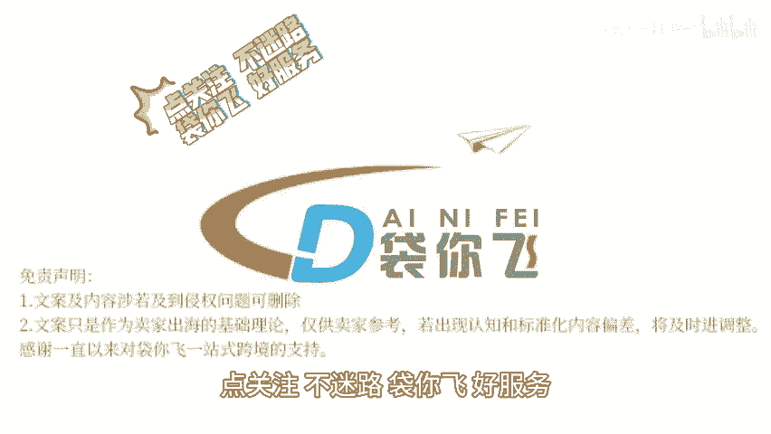

# WEEE卖家应该如何自查 - P1 - 袋你飞进亚马逊课堂 - BV1s32wYTEXk

🎼欢迎收看带你飞电商小课堂。今天我们来了解一下V卖家应该如何自查V指令waelectical ande equipment是欧盟为了妥善处理日益增多的电子电器设备废弃物而制定的一项环保法规。

通过强制生产商承担起支付报废产品回收费用的责任，减少电子废弃物对环境的污染。V指令鼓励对电子废弃物进行回收和再利用，以节约资源并减少对原材料的需求，要求生产商在产品设计阶段就考虑环保因素。

符合rose指令要求，并向欧盟成员国登记，提高整个社会的环保意识。那么卖家应该如何自查呢？首先，您需要访问业官方网站。这是德国官方授权的V注册机构在网站的搜索栏中输入您在亚马逊平台上提交的V注册号。

然后点击按钮在搜索结果中检查mark显示的品牌名称。是否与您在。😊。

🎼归门户中提供的品牌一致，同时检查market street列是否有日期，如果有日期，则说明您的注册号已过期。如果品牌和分类信息正确，且markettra列没有显示日期，则说明您的V注册号是有效的。

如果您的V注册号已失效或过期，您需要在30天内重新提交有效的德国V注册号给亚马逊，以避免商品被停售。如果您已重新提交了有效的V注册号，但商品仍然被停售。您可能需要联系亚马逊卖家支持进行申诉。

并按照亚马逊的指引恢复商品销售，如果您需要恢复多个，您可以进入亚马逊后台，选择数据报告库存报告，然后选择非在售商品报告，并按照指引批量恢复商品销售，点关注不迷路带你飞好服务，点赞关注。

带你了解更多跨境资讯。

