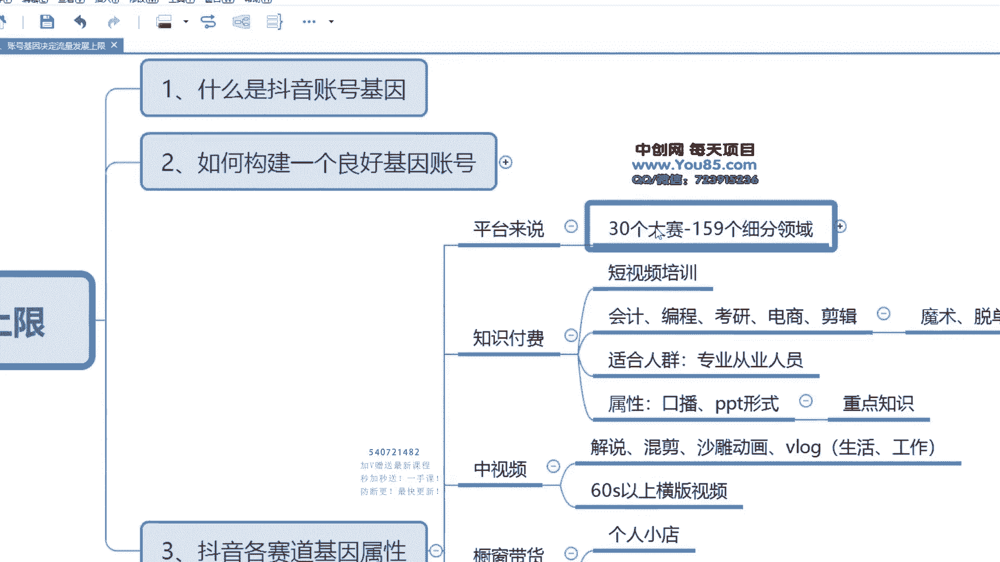
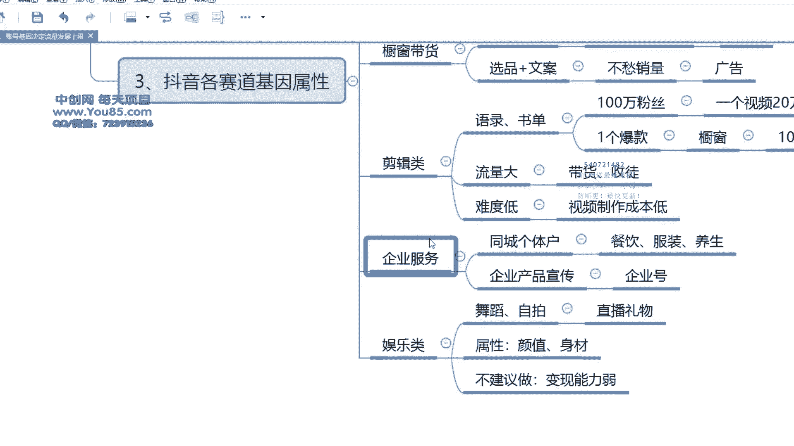

# [16]-15 抖音各赛道基因属性 - P1 - 难就做9次 - BV1SS411N7H7

我们想要把短视频做好，一定要搞清楚短视频它到底靠什么去赚钱。就是很多人在做短视频的时候，做抖音的时候，他根本就没有想清楚自己做好了之后到底要靠什么去变现。就是很多人他做一段做了一段时间之后。

已经有粉丝也有一定流量。但这个是不知道怎么去变现了。这就是因为我们在前期做耗，起号的过程当中，没有把这个赛道的属性给搞清楚，不知道怎么自己是否去做什么。每个赛道他有什么样的属性，有什么样的特点。

对于平台来说的话啊，对于平台来说，一共有30个大赛道，159个细分领域。其实这是抖音，它给我们进行区分的。就比如说这些你是做什么行业的，你可以对照着这个表去看你属于什么行业，这个也是抖音。

它给我们账号打标签参考的一个依据。但是我们在做抖音的时候，并不会啊不主要依靠这个表格，而我们主要是依靠的下面这一些，这才是我们的啊需要选择的一个赛道。那么接下来就一个一个给大家讲一下。

呃，在抖音上最大的一个赛道，不得不说的一个最大的一个赛道就是知识付费啊，比如说我自己的这个培短视频啊，就是做的短视频培训知识付费这一块也是现在抖音上非常竞争非常激烈的一个赛道。也是确确实话。

确实也是特别的赚钱。不过除了短视频之外，抖音上你任何技能都可以把它做成一个课程。就是比如说我们常见的会计编程考研电商剪辑，这些都可以做成课程，销量也是非常高的。哪怕你是做魔术，做什么做脱单的。

都可以做成课程，销量也是非常高，大家应该都有看到过，就详细去讲这个知识付费，它主要适合什么样的人群，必然叫做知识，那肯定就是专业这个专业从业人员我们都可以去做这个行业。如果。

是去做一个知识付费的话，那么这个行业的属性主要就是依靠一种直播。另一种就是PPT的形式。我自己的这一个账号，那就是靠的这种PPT形式。那么知识付费的这个重点就是在于他的核心点就是在于知识。

你一定要讲得出知识来。而且这个知识让观众他看了之后觉得有所收获，对观众他自己觉得他自己能力有所提升。那么这个我们才可以去做知识付费这一个板块。那么第二个抖音一个大的板块就叫做中饰品。

很多人你可能自己行业跟做的年龄不够，可能讲不出知识。那么这个时候也有一个大的板块，就是中饰品，但是中饰品它适合它比较局限，并不是说我们所有的视频都可以去做装饰品。因为装饰品它是靠播放量去变现。

视频它是60秒以上的横版视频，而且它时间比较长，所以制作的成本并不是很低。

而且它是靠播放量去变现，那么你的播放量一定要高才能赚到钱。一般来说，你每个视频里的播放量至少要达到，就是说10万的样子。那么你一天至少要发3到5个视频，那你一个一个月下来，你就可以赚到是好几万块钱了。

适合做中视频的一些类型，一般就是最大的就是影视解说，就是解说电视剧解说电影解说漫画。等等。因为这一些它流量比较高，受众比较广。除了之外，也有一种做的比较多的沙雕动画，这也是靠中视频去变现。

当然这些也是可以去靠搜图的，也可以去变现。还有一类做中视频的就是Vlog的形式，你可以是分享你的生活，也可以分享你的工作，把这些东西给拍成vlog的形式发在抖音上面。但是如果你想要拍vlog的话。

那么有两点，第一点就是你拍的这个东西确实是你的生活是丰富多彩的，是大家没有体验过的，所以才会去关注。然后第二呢，你第二种就是你拍的这个东西是和大家有很强的情绪过敏。那么这就就是中饰品。

这是第二个大的赛道。然后第三个大的赛道。

他的就是就是初装代货，这个也是抖音上一个大赛道。也就是说抖音电商对于我们来讲的话，其实就适合去做个人小店。因为个人小店它。保证金。是比较低的，而很多类目它还可以，就是说还有一些类目直接是免费的，也有。

所以如果不知道实在是不知道做什么呢，那你就去做初创带货，这个也是没有门槛的，就可以去做。只是说对于这个赛道它的属性来说的话，我们需要注重的点。那一个就第一就是选品。然后第二呢就是文案。

只要把这2块做好了。那么我们是不愁。销量的。怎么怎么说呢？选品你选的好，基本上就成功了一半啊，你随便怎么去发，那你的销量可能都会很高。然后其次就是这个文案能力。因为如果我们是因为做这个橱窗待货。

它就是一条广搞视频，因为它就是。广告我们如何把这个广告给让用户能接受，这个时候就需要我们剧行不案去去去把它创作一下，这就是橱窗带货啊，我身边也有很多朋友，他什么都不懂，他去做橱窗带货。

也能拿到不错的收益。

下一个就是剪辑类型，剪辑类型，这也是我自己操作过的一个一个赛道，尤其是鱼荔枝鱼录，荔枝鱼乐，我这个之前是做了100万粉丝的这个账号啊，以前我们一个视频涨的最快的时候，一个视频啊，它可以涨20万粉丝的。

但是现在来讲的话，这个励志的赛道它就要窄一点。我们呃一一种是励志，还有一种就是情感语励志语录，还有情感语录，其实它都不叫做励志语录，它其就叫做语录。我们可以是励志类型的。我们可以是励志类型。

也可以是情感类型。然后就是书单形式啊，也是现在见的比较多的这种形式，以前也做以前做的更多。我们之前做这种语录形式啊，一个一个爆款。

你挂的这个橱窗，橱窗基本上我们会去带货，挂橱窗的话，基本上销量是要1万，我们是要销销售额是要达到1万的。不过现在要难一点了，但是这一种就是。

什么呢？难度低。对我们来说就是它难度比较低，然后就是视频制作成本。也不高，流量又比较大。它的边线基本上就是属于啥？呃，带货和收图就是这两种。然后这属于是剪辑类型。如果你开始不知道呃，怎么做。

想要快速去做短视频的话，可以尝试一下这个可以尝试一下这个类型的这种视频。因为它成本比较低。你发一条视频也就可能半个小时时间，一个小时时间不行的话，那就重新接着发，可以去掌握一下抖音这个平台。

它的一些算法，它的一些规律。用户的一些喜好。

然后下一个也是一个大的分类大的板块，就是企业服务这种企业服务，它可以是嗯。

服务类型它叫做企业服务吧，其实它就叫做服务吧啊，一种是同城的个体户，一种是企业产品宣传。同城个体户主要就是一些同城饭店，包括餐饮店、服装店养生的养生馆这一些就特别的多，这也是抖音非常大的一个板块。

尤其是今年确实也有一个重大的扶持。其实它的一个竞争对手的话，其实它无非就是和美团吧和美团有一个竞争。然后啊对于企业来说的话，我们主要做的就是一种叫做企业号啊，也可以也可以不认证，也可以认证企业号。

这一种我们主要就是以转化转换为目的。这种的话我们主要是考虑。转化基本上我们对于涨粉。涨粉要求。搞。对于企业号这种，我个人的话，因为和企业都长期有合作的，所以是对于企业产品宣传这一块是特别了解的。

对于怎么去提高转化，怎么去制作内容，这个都是有一定技巧的。然后下一个类目就是啊我们一个赛道，就叫做娱乐类。娱乐类的话，它的类型就比较多了。常见的比如说我们的开了一些舞蹈啊，一些自拍呀这一些呀这。

都是属于非常娱乐化的内容。其实这一块是抖音流量最大的一个板块。因为抖音它毕竟是一个娱乐平台。它并不是一个嗯我们学习知识的平台。什么这这些东西，学习知识平台其实最好的平台。你去你要看最专业的知识的话。

其实你去实网去看，去百度学术去看，这是最好的。毕竟抖音是一个娱乐平台，所以做我们做知识类型的很多博主，他就喜欢把这些东西搞成娱乐化，变得就是知识有的时候完全就是变味了。娱乐类舞蹈自拍啊什么的。

其实它的一个变现最大的这个变现模式，无非就是直播刷礼物。这个变现模式啊，这个赛道它的属性主要就是你要有好的身材，你要有好的颜值，那么你才适合去做一个你有了这些东西之后你。随便发一个视频。

都有很高的播放的。根本就不需要考虑什么技巧。因为生产颜值这样讲，它也是一个市场稀缺资源。

那么呃当然不建议去做这个行业，因为我对于我们大部分人而言，其实不具备这个条件，而且这个东西变现能力也是非常的弱。我之前也是见到这种很多这种呃做做娱乐类的主播，他们粉丝量可能两三百万。

但是他们的变现能力非常弱。比如说我们做这些类型的，就说支识类心，比如说很多我们做支识内有1万粉2万粉就已经可以开始变现了。

