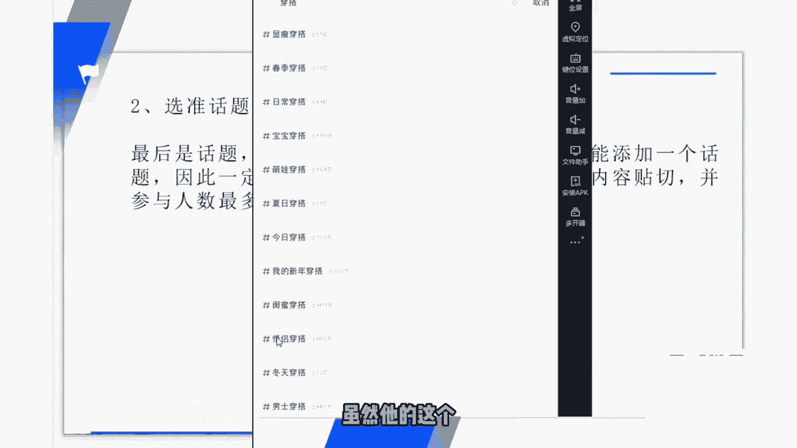
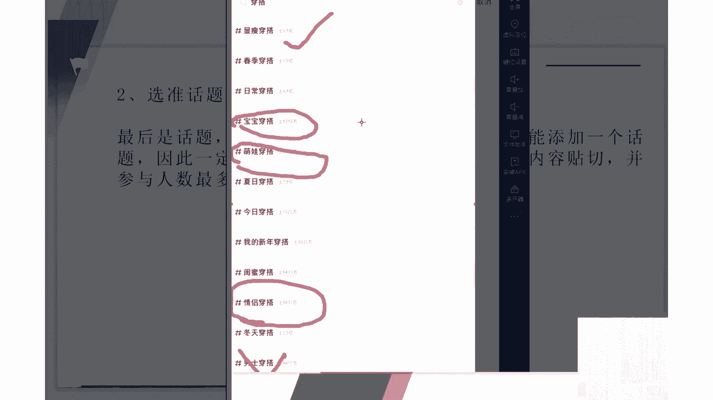
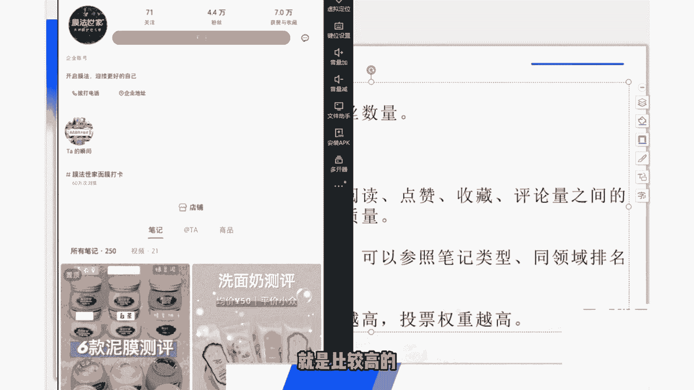
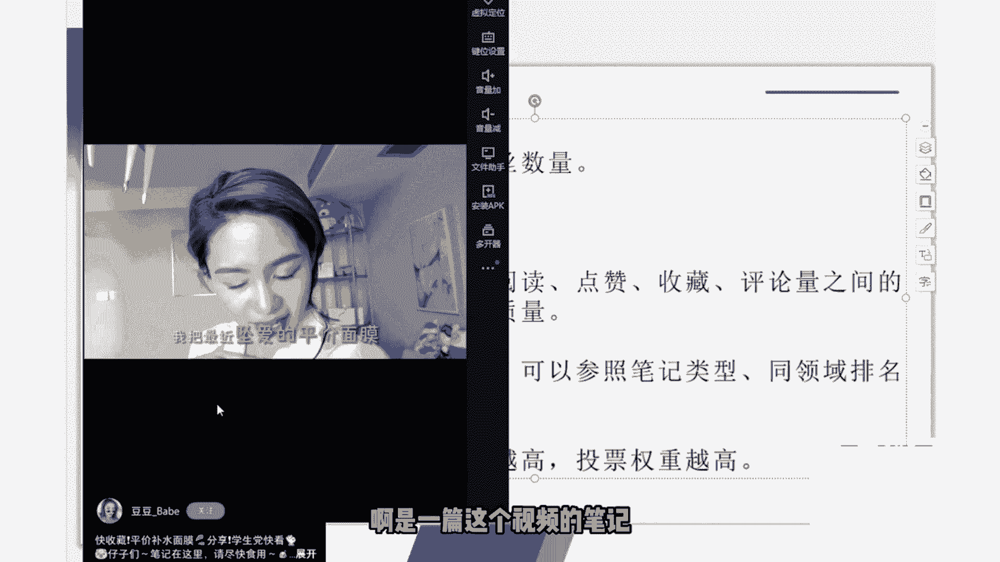
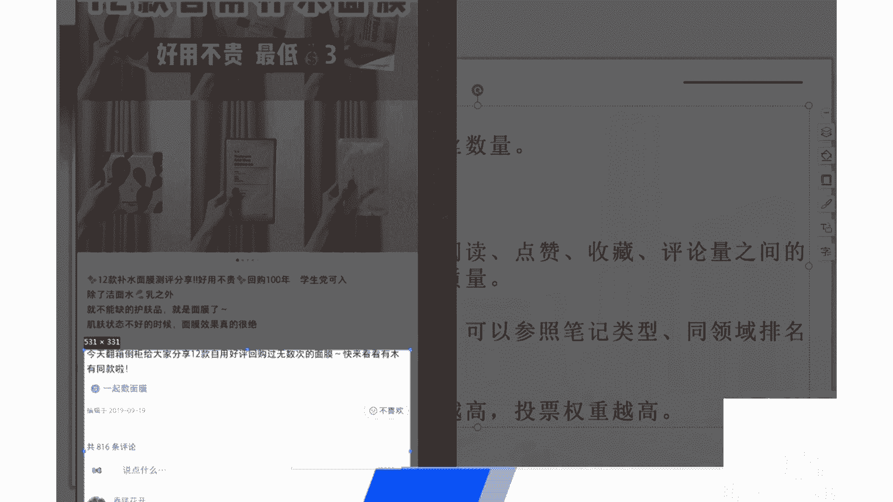
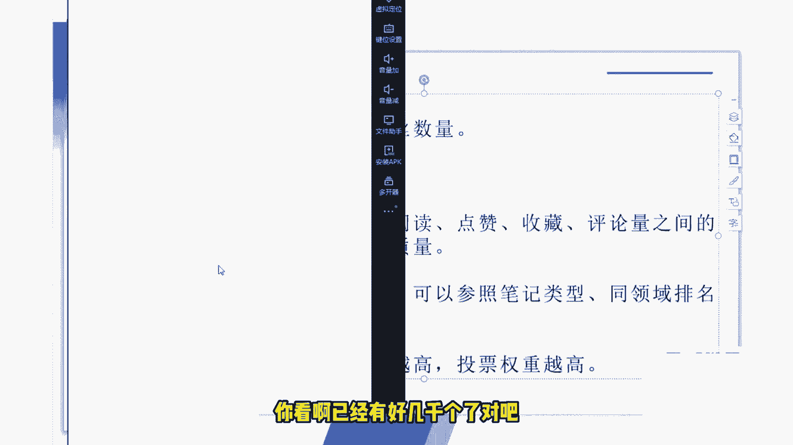
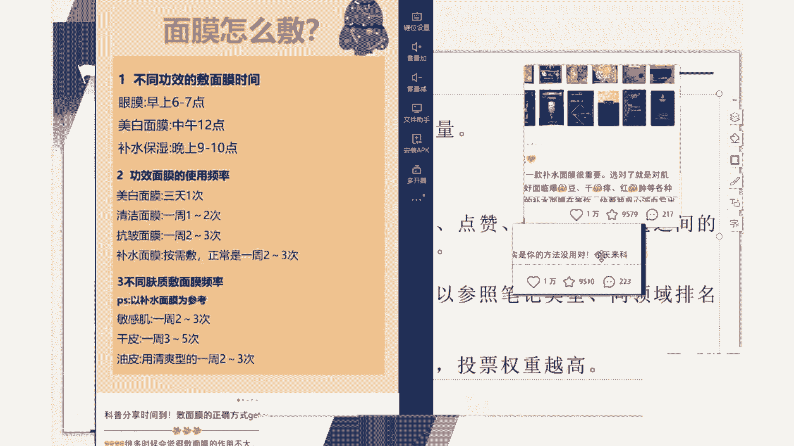
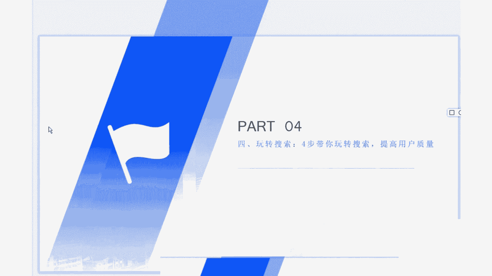

# [2024版小红书体运营教程】全B站最良心的小红书运营新手起号 0-1新媒体运营必学课！不要荒废18-30岁，小红书体开店 起号真的不难，拿走不谢！ - P9：第8节：小红书如何获取优质搜索流量？只需掌握这四个技巧，快速提高用户质量 - 小万必有曙光 - BV1Yn4femEqR

我们这节课呢来和大家讲一下，小红书的一个搜索，玩转小红书的搜索四步，带你去玩转相关小红书搜索的一个机制，去了解小红书搜索推荐的一些排名规则，更好的去提高我们笔记的一个展现质量啊。

同时呢对应引流到比较优质的，高质量的一个客户，那我们说到这个优化搜索的话呢，就不得不就不得不提到，一个很关键的一个东西了，那就是一个关键词对吧，首先呢关键词的选择的话，在前面的课程里面。

我是和大家介绍过了，什么是这个核心关键词，什么是相关关键词，什么是长尾关键词，那这一节这一节课呢我们就不再去赘述了啊，这里我给大家圈一下，就是一个呃核心关键词，核心关键词我就不写了啊。

这里面有一个相关关键词和一个长尾关键词，大家可以看一下，为什么我是不建议大家去做这个核心关键词呢，因为核心关键词的话呢，呃就比如说呃面膜祛斑美白这样的，很简单的这种核心关键词呢。

它的竞争竞争呢是比较大的，一般呢都是有一些比较大的公司，头部的公司呢去做，呃，我们如果去做的话呢，基本上预算也是不够的，就比如说别人可能做这个关键词，他的预算呢可能就达到一年的费用呢，就会达到100万。

或者说1000万之内啊，他是有这么多钱去做这种投放，或者说做这种啊关键词的竞争的，但是我们呢不可能说有这么多钱去做这个，投放和竞争，那怎么办呢，所以说我建议大家呢，可以做一些这个相关关键词的一个呃。

相关关键词和这个长尾关键词，虽然呢做这两种词的流量是比较少的，但是呢它更容易去做，更容易去给我们带来这个流量，而且呢我们是玩的一个矩阵嘛，不是说以多少的这个广告费，多少的这个投入来博取我们的这个流量的。

我们是用矩阵的方式，就比如说我一个小红书号布局的是这个词，那我可以同时布局20个30个账号对吧，可以布布局无数个这样的关键词，那流量的话也是相对来说不会去啊，不会很少的，另外下面我要说的呢。

就是关键词不一定要全部连在一起才可以啊，才叫一个关键词，比如说一个长尾关键词对吧，那么分开的话呢，它其实也可也是可以的，同时呢可以用上一个垂直领域下的，其他的这个相关关键词。

大家这个这个如果不太理解的话呢，可以看一下前面的课程或者后面的课程呢，我也会在具体的实操里面和大家说到啊，就比如说我们今天拿这个一个关键词，来举例子吧，就比如说补水护肤品这个关键词对吧。

啊比如说补水护肤品这个关键词，我在写文章标题的时候可以怎么带上去呢，那我我起的我起的这个标题呢，就是皮肤干燥，想要补水，有没有护肤品推荐对吧，那这个补水和护肤品它没有，它并没有连在一起，但是如果说啊。

但是如果说你去这样子啊，你去这样子去把它联系在一起的话呢，这个小红书的搜索引擎呢还是会认啊，还是会认得到的这样的一个长尾词，他还是同样的去会去收录的，这里面呢，我就用这个这个关键词呢给大家搜索了。

看一下，就比如说我们现在是啊，搜索的是补水面膜这个关键词对吧，我们看一下他排在前面的这些这些收入呢，就比如说，就比如说我们看到的这个第二个，排名第二的对吧，补水面膜，我现在搜的这个词是补水面膜。

他的这个标题里面呢是出现了这个补水面膜的，那是理应理应当出现在这里的对吧，但是大家还可以看一下其他的这些文章啊，其他的这些笔记的标题看到了吗，啊这个是补水面膜，啊敷面膜看到了吗。

相关的这些相关的一些这个相关关键词呢，它也是可以做上去的，涂抹式面膜啊，因为涂抹式面膜，它在文章里面应该是提到了补水的一个作用，所以说它标题里面加上这个词的话，小红书的搜索引擎呢也会是可以搜索到的。

比如说我们再来看一下，啊这里大家可以看一下这个标题，他这个标题呢就根本没有补水啊，补水面膜补水这两个字对吧，那为什么他会被收录进收录进去了，我们来看一下，这里给大家画一下，看到了吗，这里面补水补水面膜。

补水啊，我有的地方可能是看漏掉的，漏掉的，大家在我们再仔细看一下，补水补水，啊超超超级补水，补水，大家如果从这个我画红色的这个圈圈，那就可以发现这篇小红书笔记的一个规律。

虽然它的标题没有标明了一个补水面膜，但是他的文章里面大量的去布局了，这个相关的一个关键词，同样的话，它是会被小红书的搜索引擎给抓取到了，所以说这个这里呢大家一定要注意一下，这就是一个非常典型的一个例子。

但说到这个关键词的一个关键啊，这个标题关键词的一个抓取之后呢，我们再和大家说一下，正文内容里面的一个关键词分布，就像我刚才给大家看的这个文章，这篇文章我们再看一下，我们还可以找一下其他的一篇文章。

比如说我们找一下这篇文章，啊他的这篇文章为什么会排在，也是比较靠前的呢，我们来看一下它里面的这个啊一些，一些技巧大家可以看一下它，这里面呢有一个话题，补水面膜对吧，补水面膜这里也有一个啊。

我们就慢慢的把这些这些词给找出来看一下，啊大家可以看一下我圈出来的这篇文章里面呢，他提到的这个补水面膜的相关的一个关键词，分布呢啊实际上还是比较合理的啊，呃等会等会我会和大家说一下。

这里面我给大家提的一个建议是什么呢，就是说我们最好在文章的开头的前30个字，里面呢，去提到一下，我们这篇啊这篇笔记的一个相关关键词，大家可以看到他的这个关键词分布呢，还是比较均匀的对吧。

均匀的去分布在这篇文章里面，基本上呃他的这篇文章呢，基本上前面是提到了一些痛点对吧，提提到了一些痛点会刺激皮肤啊，我换个颜色会刺激皮肤造成敏感，所以说顺势而为的的去推出了，他所推荐的这款补水面膜对吧。

大家还记得那个写小红书笔记的几个步骤吗，那这个人呢就是按照这种步骤去写的，对吧啊我最近比较喜欢的，大家应该还记得吧，就是我们上一节课说到的那个写作的一个风格，最后呢是一个总结啊，最后是一个总结。

所以说这篇这篇笔记呢他是写的写，写的是相对来说比较成功的，也就不难啊，也就不难看出，他为什么能够排在这个关键关键词的，去关键词的前面了，好了，这里呢就是我要和大家说的呢。

就是我们的这个开头呢和这个结尾呢，最好是要有相关的相关的这个关键词，比如说我们说的是补水面膜这个词对吧，那开头呢呃最好是正文前面的这个30个字，然后适当的话呢可以加一些别的关键词。

来为这个笔记带带一些别的流量，但并不是说关键词越多越好，就像我们刚才看到的这篇文章啊，它主要的还是围绕着这个补水来说的，但是适当的去提到了一个精华液，大家可以看到了吗。

这里面适当的去提到了一些精华液的一个啊，关键词有两个地方，一个是这，还有一个是这啊，有三个地方对吧，他适当的提到了这个精华液，大家知道这个精华液也是用来补水的，所以说这种这种啊其他类目的一个关键词呢。

也就是我们这里提这里去提到的，可以用上一个垂直领域下的其他的关键词，就比如说同样是补水用的对吧，那精华液同同样的也是可以用来补水的，所以说他的文章里面呢，就会去相应的去带一下这个东西啊。

最后呢就是我要说的这个图片的标签，图片的标签呢你也可以去适当的去添加一些，添加一些这个适当的图片标签，当然但是呢图片标签不要添加的很多，与内容贴切，那就比较好了，在正常的这个情况下呢。

关键词如何分布也是不要去刻意的追求，就基本上能够做到均匀分布就已经很不错了，就已经很不错了，大家可以参照我刚才给大家看的这篇文章对吧，然后呢好的内容呢才是一个王道，因为毕竟呢好的内容才有人去啊。

很详细的把你这篇文章看完，然后有感而发，去点赞转发收藏评论等等对吧，如果少了这些关键性的数据呢，对我们的这个小红书笔记的一个优化呢，还是存在一些问题的，我们再看一下这个文章的一个标签。

我看他我看这篇文章有没有去用到标签，啊大家可以看可以看到他的这个图片呢，就是没有几乎就没有用到什么标签对吧，因为他写的已经很已经很详细了，所有的这个介绍的都是很详细啊，一如果这样子你介绍的非常详细的话。

从每个点都介绍了名字，介绍一个功效长的什么样子，多少钱多少片啊，补水效果，包括推荐度，都有个这样的一个详细的一个介绍的话呢，那基本上也就可以去不用加图片的这个标签了，这里大家也应该注意一下。

下面我们来和大家说到的呢，是这个选择话题的一个方法，在我们发完笔记发到最后的时候呢，通常是需要我们去选择话题的，这里给大家看一下啊，选择化形呢是在这么一个界面对吧，那所选的话题呢我一般建议大家是什么呢。

就是说赚的这个权重比较高，然后呢一篇笔记的话只能添加一个话题，所以说我们小红书里面呢，一篇笔记只能添加一个话题的话，大家一定要去谨慎对吧，一定要去拿准你所添加的这个文章的这篇标题，这篇笔记的这个标题啊。

话题呢尽量是与内容去贴切一点，并且呢选择参与人数比较多的那一个，这里面呢我给大家举个例子啊，比如说我今天写了一篇这个很啊，为什么要选择这个穿搭这个词呢，因为这个穿搭这个词呢，他是非常典型的一个话题。

一个例子，就比如说我今天写的是好，打个比方啊，我今天写的是如何让胖女孩去穿搭，看起来比较瘦一点对吧，大家记住啊，我的文章写的是如何让胖女孩穿搭衣服，看起来比较瘦一点，那所以说我们如果去选选这篇文章的。

这个话题的话，那有有哪些话题是千万不能选的呢，首先这个情侣穿搭是不能选的，因为他和我的，他虽然他的这个参与人数是比较多的对吧。

但是他不能够，但是呢它不能够和我的文章内容，起到一个相互呼应的一个作用对吧啊，就比如说萌王的一个穿搭，那我写的是女生的一个穿搭对吧，包括这个宝宝也也不能这样去选，对不对啊，那我可以去选什么呢。

显瘦这个是比较好的对吧，一共有我看一下，一共是一共有一共有是5亿多的啊，5。5亿的一个参与参与的一个活跃度啊，那就比如说包括这个古装啊或者男士啊，那他就非常不适合了对吧。

所以说我们去选择这个相关话题的时候呢，大家一定要注意一下，去贴合我们这篇笔记所讲的一个东西，你要搞清楚你这篇笔记所讲的一个主题是什么，基本上我们啊，大家还有还有一点要注意的是什么呢。

就是说基本上我们所写出来的这些笔记啊，呃这篇笔记的这个话题，在我们之前一定是有人去写到过了，就比如说我们看一下穿搭这个词对吧。

传单这个词大家可以看一下，有啊已经有这么多，已经有这么多人这么多个关键词，基本上能把我们所想想到的一些穿搭的，一些这个这个关键词呢，基本上都是涵盖了进去的，所以说这个大家呢也不用去太太过于担心啊。

说我写的这个词可能没有没有多少人去选择，对吧啊，这个是大家一定要注意的，关于这个旋转话题这方面，好我们接着说这个第三个方法，那第三个方法呢就是，啊也很简单，就是提高我们账号的一个权重，账号的权重呢。

就包括我们这个小红书账号的一个等级啊，获赞与收藏粉丝数量等等，我们基本上可以看一下，就是对照我们前面看到的这些个，关键词底下，比如说我们还是以这个补水面膜，这个词为为例子。

我们来和大家看一下排在前面的这几个啊，这几个博主我们来看一下这几个达人对吧，那这个就不用看了，这个魔法世家呢他是一个企业号，大家可以看一下，他那是一个企业号，所以说他的这个啊企业账号。

他所以说他的这个权重呢就是比较高的。

我们可以看一下别的这种普通的账号，比如说我们在这看一下这个人，他的他的这篇笔记呢啊是一篇这个视频的笔记。

好我们看一下这个这篇笔记吧，这篇笔记呢一共是816条评论，然后点赞呢看一下，好点赞，这个是在屏幕下面的，我来截图给大家看一下吧。

他的点赞呢是，啊他的点赞呢是2万个赞，然后呢被收藏了是有11。30000个，评论是816个对吧，我们看一下这个人的账号，他的这个啊他的账号呢，那你可以看一下他的账号权重就比较高了对吧。

有关注他主动关注59个，这个就不用看了，他的粉丝就很多对吧，那他的这个获赞与收藏呢也是非常多的，所以说他的这个账号权重，整体来说的话是比较高的，你就比如比如说我们可以看到他发的这篇，这种笔记呢。

你看啊已经有好几千个了对吧。

就比如说他他的这篇，他的这篇笔记呢啊被点赞了一千一千四，将近对吧，收藏是758，评论呢是145，所以说想要有一个比较好的一个排名的话，首先你自身的这个账号呢，那权重是要比较高一些对吧。

然后呢他的相关数据啊，相关的这些获赞与收藏啊，包括粉丝数量都要比较高一些，这个是没有办法，就是一下子去达成这个目标的，因为因为每个人的账号他都是慢慢去积累的，这个也是没有办法的啊。

所以说大家在平时去养号的时候，或者说去啊，刚开始做你自己这个小红书账号的时候呢，可以去适当的写一些优质的这种笔记，然后呢用其他的一些小号去啊，点赞评论收藏，还有转发对吧，那么我们再说下一下啊。

说下面一个就是关于刷数据这一块呃，如有的人就可能会说了对吧，我写了一篇笔记，那我什么都不太知道，我就是想去得到一个热门，就是想去靠前，那我去找人刷这个笔记的相关的数据行不行呢。

就比如说我去花钱去刷这个点赞，收藏与评论行不行呢，啊，这里面呢那有就有很多很多的这个几点呢，要和大家说一下，第一点的话呢就是呃如果你不会的话呢，一定要去找这个专业的团队去刷啊，去帮你刷这些数据。

如果说他不是专业的话呢，它刷出来的这些这些数据本身就不太好，然后呢最好是控制一下这个阅读啊，点赞收藏评论之间的一个比例，这样子啊，这样子为什么叫控制这个比例呢，就给大家看一下，比如说啊打个比方。

我现在写了一篇这个小红书的笔记，也是写关于这个补水面膜的，那我们可以看一下补水面膜，它前面的这几个，前面的这几个，他的这些点赞啊，收藏他的他的这个比例大概是多少，我们可以看一下，就比如说这篇笔记吧对吧。

他的点赞是1万，收藏是收藏是9000多，也将近1万了对吧，评论呢就比较少有200多个，所以说我们刷的时候呢，就可以参照着多看多看几个，多看几个这样的一个账号发布的，这个发布的这个自然的一个数据啊。

我们再看一下这个数据，我来多截几个给大家看一下。

大家可以看一下，这是我找到的这三篇笔记对吧，第一篇笔记1万额9200多，1万9200多，这是1万六八千多600多对吧，所以说我们如果去刷这种，比如说我们是呃同样去写这个补水面膜。

补水面膜相关的相关的这种笔记的话，你如果想去刷的话呢，你就可以参照一下啊，大致的一个比例，你不可能说呃点赞有2万，但是收藏只有几百，那肯定不行了对吧，比如说点赞呢有3万，但是他的这个收藏呢只有8000。

那这个也是不正常的，所以说他都会被这个小红书后台的这个检查的，一些呃相关的一些算法呢会发现的，我们大家如果刷的时候呢，可以同比例放大或者缩小，就比如说如果说我想刷1000个赞的话。

那这边是不是同等要缩小十倍，对吧啊，评论的话，那那只有几十个，对不对，那这样子的话是一个比较不错的一个比例啊，这里呢就是我我和大家说的，要控制住这个阅读啊，点赞评论之间的一个比例，而且呢去刷的时候呢。

这个账号呢质量呢一定要是比较好的，就是说不能找那种刚注刚注册的那种号，或者说啊没有活跃过的，没有发过笔记的那种账号对吧，就是给你这个笔记去增加权重的这个账号，它本身也不能是很垃圾的账号，如果系统发现。

你这篇笔记里面有很多垃圾的账号，就俗称僵尸僵尸号，僵尸粉对吧，再给你做这样的一些数据，那本那数据做做得再再高，也没有什么太大的意义啊，对然后呢，下面这个就是我要刚我刚才说过的对吧。

没有一个这这个这些点赞啊，评论啊，包括收藏这些数据呢没有一个绝对的啊，没有一个绝对的，但是呢大家去刷之前一定要去参考一下，如果说你确定要去刷这些数据的话呢，你可以去参考一下这些数据，同领域对吧。

同等类型，同等领域的里面的这些比例靠前的这些比例，它到底是什么样的一个数据，你可以按照这种同等的，就是这些数据呢去增加或者缩小你的时间，对吧啊，然后最后一点呢和大家说的，就是我们账号的一个质量额。

账号质量呢是和大家说过了，因为这里面啊已经重复了已经重复了，最后一点和大家说的是什么呢，就是说我们去刷的这个速度啊，比如说你的目标是1000个赞对吧，你不要一下子就刷到1000个赞。

还记得我们第一节课和大家说的，小红书的这个相关的推荐机制吗，那个流量池大家还记得吗，就是一级流量池到二级流量池到三级流量池，它是慢慢慢慢去推荐的，我们同时去刷的时候呢，也不要刷的多快。

因为不可能有一个账号，一开始就会达到三级流量池的那么一个标准的，它一定是从一级流量值过渡到二级，然后再过渡到三级啊，然后再去4G然后慢慢的往下，不可能你你说你一个笔记发出来5分钟。

一下子就会获得1000个赞，那这样子的话呃，小红书的这个反作弊机制呢，一下子就会发现你是啊有问题有作弊的对吧，那所以说刷刷的这个速度呢，大家也要去掌握一下，最好的话呢就一次性刷，不要超过50啊。

不要超过50~70个，这样子呢去慢慢慢慢的去增加它是比较好的，同时呢配合小红书他官方的一个推荐机制好了，那本节课呢就是和大家说的，就是玩转小红书的这个搜索相关的一些啊，一些步骤和一些玩法。

