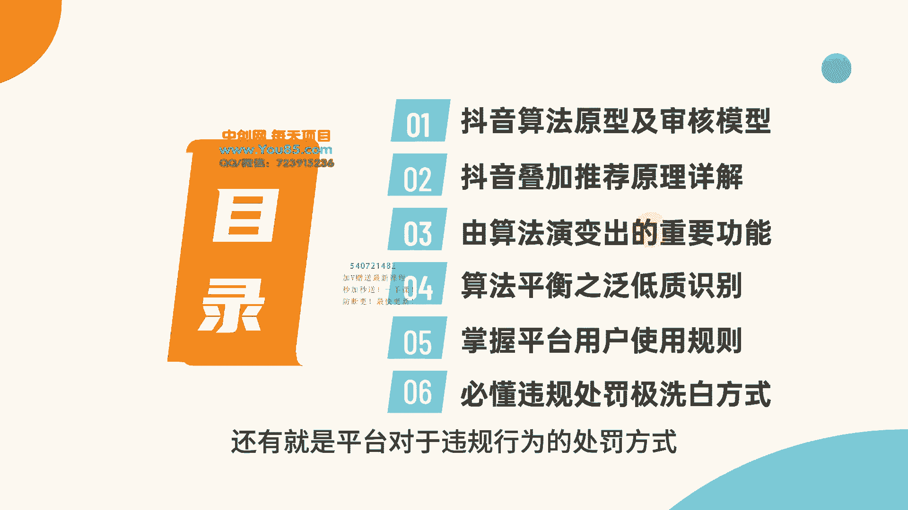
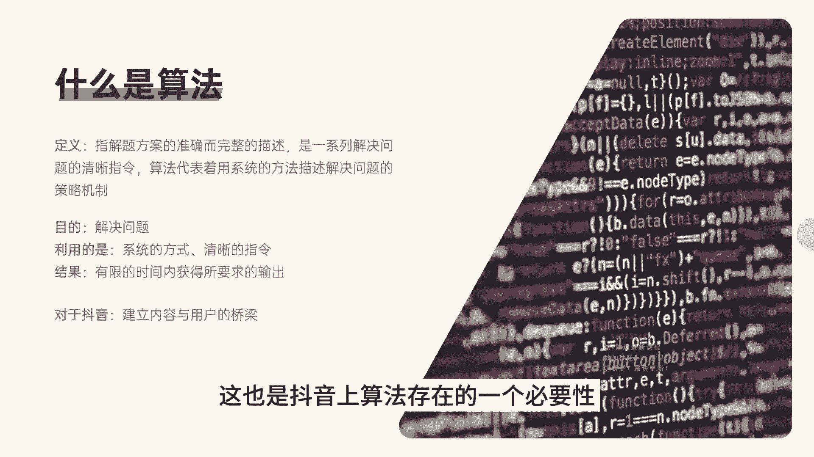

# [2]-1 抖音算法原型及审核模型 - P1 - 难就做9次 - BV1Jw4m1q7KA

第一章看透抖音核心算法原理。我们为什么要去讲算法，因为算法是互联网现在非常核心的一个技术。不管是以前的搜索引擎也好，还是说电商平台也好，以及现在的自媒体平台。如果没有这些算法。

那么我们在使用这些平台的时候，肯定是没有现在的体验那么好。如果没有这些算法，那系统它就不知道怎么把这些内容推荐给我们。对于做抖音而言，如果不知道系统怎么把内容推荐给用户。

系统怎么去筛选这一些用户的反馈信息。这些如果不知道的话，那么做抖音想要上热门，只能是碰运气。所以说在做抖音之前，我们必定要了解算法的原理，这样才能提高起号的成功率。

才能让上热门这种偶然的事件变成一种必然的结果，本章一共分为6个小节，包括算法的原型及审核模型，及抖音核心的一个算法叠加算法。由算法演变过来的重要功能有哪些，然后平台是怎么去识别低质量的内容。

以及平台的使用规则。作为用户和。

创作者怎么合理的使用平台的一些功能。还有就是平台对于违规行为的处罚方式以及违规之后的洗白方式。第一节课抖音算法原型及审核模型。这一节课让大家知道抖音它是怎么去审核视频的，它的基本算法到底是什么样。

算法本来是一项非常复杂的事情。我们怎么用简单的形式去理解抖音的这种算法。首先说一下什么算法。算法指解题方案的准确而完整的描述，是一系列解决问题的清晰指令。算法代表着用系统的方法描述解决问题的策略机制。

这里有几个关键点，就是算法的目的它是解决问题。那么对于抖音而言，算法解决的问题就是视频和用户之间的一个匹配，怎么去筛选，怎么去挖掘出高质量的视频，然后让这部分视频匹配到它最精准的用户群体。

那利用的就是系统的方式清晰的指令，系统的方式在抖音上就是抖音的一些算法。

比如说抖音的叠加算法，抖音的召回机制导致的一个结果就是有限的时间内获得所有要求的输出。因为抖音上现在每天有大量的视频产生，这些视频要经过算法去处理它。这些算法，它要用最高效的一个效率。

然后匹配到精准的用户群体。这也是抖音上算法存在的一个标签。那抖音算法的基本模型是什么样的。我们可以看一下这一张图，这是抖音算法最基础的一个模型，就是用户和内容之间，它有算法进行匹配，机器去识别这个内容。

它是什么标签，同时去识别这个用户是什么标签，然后把有相同标签的用户和内容进行匹配，就是这么一个简易的模型。互联网平台对于每一个用户都会有一个标签，就是通过系统的这种算法去计算得到。对于内容也是一样。

系统对内容进行识别，形成内容标签，内容标签进行权重大小进行排列。用户标签是怎么形成的。就比如说这里小明在。

今日头条有一个账户，那么今日头条他使用了之后就会有一个标签。然后小明通过今日头条去登录了抖音，那么抖音的标签就会继承今日头条的标签。当然，这个地方并不仅仅只是继承今日头条的标签。

同时还会继承其他平台的标签。因为大数据平台会相互推荐，来识别用户画像。抖音在得到这个标签了之后就会进行视频的推荐。在视频推荐之前，比如说小明标签的画像，它是北京爱好美食喜好时尚，年龄26等等。

然后抖音他会根据这个人物的标签进行分发视频。这个视频给小明推荐了之后，小明观看，他会做出一系列的行为。比如说点赞分享评论，然后得到这个行为了之后，那么他的视频的标签就会重新进行更新。简单来说。

用户的标签就是这么一个过程。就是系统会根据标签进行内容分发，逐步去完善更新标签数据。这里还有一个就是系统会进行协同通。通过大数据进行筛选内容会分发给同类人群。就比如说有短视频运营标签的用户。

那么他一会刷到直播运营标签的视频，就是这一个原理。然后这是抖音审核的一个机制。我们上传了视频之后，系统会根据视频的画面标题关键词进行审核。这个时候是机器审审核，如果发现有违规，那么会进入人工审核。

人工审核确定确实有违规，这个时候就进行视频的删除或者限流处理。当然人工审核检查了之后，发现这个视频是由系统的误判，这个时候会重新进行推荐，在推荐的这个过程当中还会进行视频的画面消重关键词匹配。

如果发现内容重复度过高，那这个时候就会进入低质量的流量词。在推荐的这个过程当中，用户的反馈行为，平台会接受用户的反馈行为。如果说用户的反馈比较差，那这个时候就直接停止推荐。

所以很多人也就只有三五百的播放，当然也会有一种情况，就是用户的反馈差，实际上是用户推荐不准确。那这个时候视频它会进入待推荐序列。等待第二次推荐。如果数据反馈比较好。那这个时候就进行叠加推荐。

当视频接收到叠加推荐的这一部分流量之后，如果反馈仍然比较好，那就会进入更高的流量池。因为这个时候流量词比较高，可能会接收到用户的举报。如果说接收到举报，那么会进入人工审核阶段，人工排查这个举报是否成立。

如果这个举报通过，那么就会对视频做出相应的处罚。当作者接收到这个处罚之后，它可以进行申诉，如果申诉通过，那这个时候又会继续推荐。如果申诉不通过，当然就直接停止推荐，甚至是删除视频。如果说举报没有通过。

那这个时候视频会继续推荐。整个持续的周期基本上就是在一天到一周的样子。一周时间过了之后，那么这个时候视频的热度值就会降得很低，这个时候就会有一些零散的流量。这就是一个大概的审核机制。总结来说的话。

抖音对于视频的审核，它就是一个人工审核加继续审核的双重审核机制。大部分时间是有继续进行审核。因为平台上的视频数量。实在是太大了。如果说全部由人工审核，这个肯定人工成本过高。

而且现在抖音经过了大量的视频学习。对于审核的准确率已经非常的高。这里给大家总结了三个审核的规律，上热门的视频都是经过人工审核的，尤其是大热门视频，就是一个视频能不能上热门，其实取决于审核员。

当然在没有违规的情况之下，人工一般不会去干预，就是说人工不会去阻断你的这个热门，主要由系统去判定你的这个视频能到达什么样的流量层级。然后第三个审核规律就是这个视频不仅仅是说要对用户产生价值。

同样还需要对平台产生价值。比如说最近大家看到的抖音平台封了很多大的博主，其实这些博主对用户是有价值的。但是对于平台而言，他们引导私下交易，引导了不良的一些文化习俗，所以平台会进行封号处理。

大家还会注意到一点，就是以前在抖音上大家经常看到这样的视频，就是说你根本不需要去花钱学习抖音，只需要关。注这么几个账号，比如说创作灵感，抖家小助手等等这一些账号，那么你就能上热门。

其实这样的视频对于大部分用户来说，一看其实就是真实的。但是平台还是会推荐大量的流量，这就是因为平台他需要这一个价值，平台也需要宣传自己的平台，就是有这么一种规律。那算法到底有什么好处。

这里一共总结了4点。第一个就是公平竞争，小博主和大博主相比，权重相差是比较大的。但是小博主和大博主他也有一个PK的机会，小博主同样也能拥有大博主级别的流量，这就是一个公平竞争的机会。

也是抖音去中心化的一个机制。第二个好处就是在于能有互利共赢的情况。不管是用户还是创作者还是平台都能得到自己想要的，因为有算法的存在，用户他能看到自己喜欢的内容，那创作者能把自己的视频推荐给精准的用户。

而平台他有源源不断的内容，有源源不断的用户，就会形成这一种互利共赢的。

良好局面。第三个好处就是在于平台能过滤掉低质量的内容。这能大幅度提高用户体验。如果大家在平台上刷到的视频都是一些低质量的视频，那么可想而知，用户对于这个平台的依赖性，对于这个平台的口碑当然是非常不好的。

第四个好处就是在于能灌输新鲜血液，尤其是现在自媒体的平台，平台它需要源源不断的内容。如果说我们在抖音平台上每天刷到的都是同样的一些博主，那时间长了之后就会丧失新鲜感。对于这个平台也就没有依赖性。

所以平台是需要新鲜血液。那么通过这个算法的计算，就能不断的去发掘出新的博主，也会去吸引新的创作者来平台进行创作，就会有这么几种好处。

