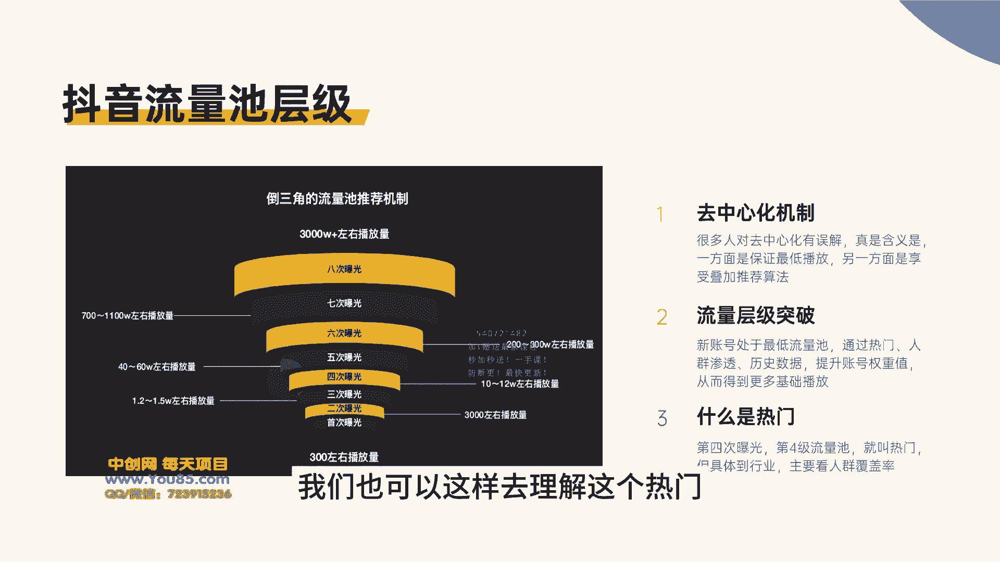
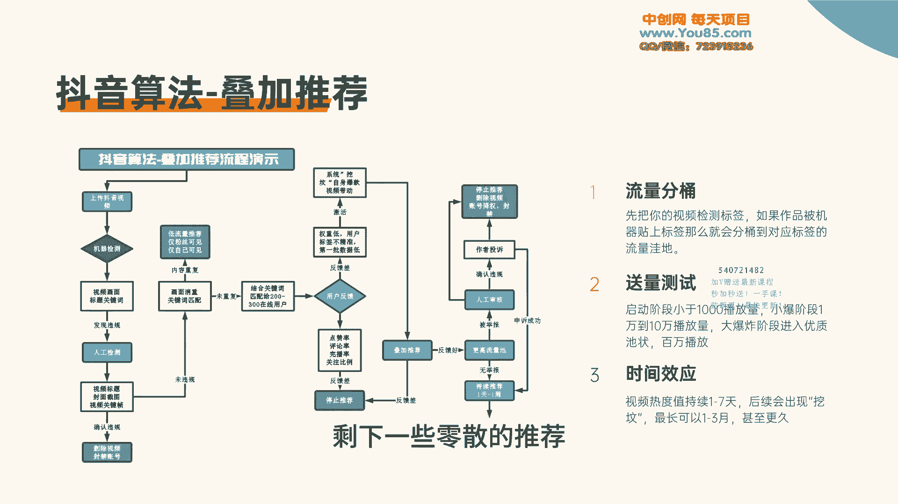
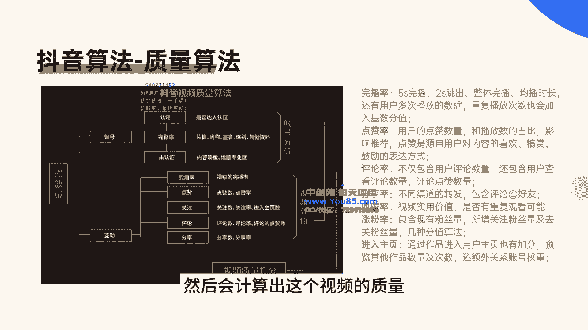

# [3]-2 抖音叠加推荐原理详解 - P1 - 难就做9次 - BV1bM4m1U7eJ

第二节课抖音叠加推荐原理的详解。抖音叠加推荐算法可以说是抖音最核心的一个算法。毫不夸张的讲，抖音之所以能发展到今天，最大的工程就是叠加推荐算法。就好比百度发展的时候，主要依赖于李彦宏的HIT算法。

这是因为李彦宏自创了这一套算法才发明的百度，抖音也是一样，张一鸣创建的叠加推荐算法，才有了今天的抖音，可以看出，想要做好抖音一定要了解抖音叠加推荐算法。当然，很多人对于这个算法或多或少有一些了解。

但是这个了解一定不够。接下来就告诉你，这个叠加推荐算法更深层次的理解。首先就是抖音流量池成级，抖音是有流量池，如果说你的作品反馈比较好，那么你就会进入更高的流量池。具体来说的话就是抖音有这么8个流量池。

第一个流量池就是百人的流量池，一般来说会分配到300左右的播放，然后第二个流量池就是第二次曝光，进入千人流量池。第三次曝光了之后，就会进入万人流量池。这个时候视频的播放基本上就是在。

2到5万的样子，然后会进入人工审核，人工审核了之后进行第四次曝光，进入10到50万的一个播放。那么第五次曝光的时候就会进入到将近百万的播放。到第六次曝光，这个时候会在200到500的一个播放。

到第七次曝光，这个时候会进入到数千的播放。那么第八次曝光基本上就是一个全域的流量，这个时候会有数千或者上亿的播放。这是抖音整个流量池，那根据这个流量池，我们有几点。第一个就是去中心化机制。

相信大家都知道这一点，抖音是一个去中心化的平台。但是很多人对于这个去中心化，它有误解，就是你可能会认为抖音去中心化机制，就是让我们的新账号以及我们新人和大V和老账号，它有一个同等的流量。

或者说是就是新账号和老账号没有多大的区别。当然肯定不是这样的。真实的含义是，不管你是新账号，或者说是你是老账号低权重账号，不管你什么样的账号，抖音都会给你一个基础的播放。这个基础播放就是300到500。

或者说是100到300，这根据你账号的质量而定。还有就是会根据当前大盘的视频数量而定。假如说当前大盘的视频数量都比较高，那这个时候基础播放就会低一点。所以去中心化机制。

实际上就是保证我们有一个最低的基础播放，只要我们的账号是正常账号不违规，没有被处罚，没有限流，那么我们就能得到300到500的基础播放，这叫做去中心化机制。然后有了这300到500的播放。

我们就能享受抖音的叠加推荐算法。通过这个算法去评判我们的视频是否可以进行下一次的推荐。其实这个叫做去中心化机制。所以我们也可以这样去理解，去中心化仅仅是在某一个小的层面去中心化。

对于大的博主对于高权重的账号，他们和我们普通账号完全是不一样的。能得到的基础播放也是不一样。所以就会出现一个东西叫做流量层级突破。对于新账号处于是最低流量。

那么可以通过热门人群渗透历史数据去提升这个账号的权重值。就比如说我们的视频上了一次热门，那么我们就有突破流量成绩的可能。因为还要看具体上的是什么样的热门。对于很多账号，你上了一次热门，你接到去发视频。

你会发现你新发到视频还是三五百的播放，没有去突破流量层级。所以我们要具体看上热门的情况。如果你上了这一个热门，没有进行人群渗透。那么你的成绩突破不了人群渗透。也就是说我们这个热门的流量一定要精准。

它要渗透到我们自己行业的人群里面去。同时经过大量的历史数据积累，我们整个账号的标签精准，我们账号的人群渗透率逐渐提升。这个时候账号的权重值就会提高，这也是起号的一个过程。这里还补充一个知识点。

就是什么是热门，看起来是一个比较简单的问题啊。但是它有更深层次的理解。简单来说，经过第四次曝光，我们达到10万播放的时候，那这个时候就可以叫做是小热门。但是还有一点就是我们要看具体的行业。

因为还要看行业的属性。假如说一个行业它整体有20万的人。我们这一个视频就已经达到了10万的播放。那么我们这个视频肯定就是热门。假如说这个行业只有10万的人群，我们就能达到8万的人群。

这个行业人群渗透率达到了80%。那这个时候也可以叫做热门，我们也可以这样去理解这个热门，就是主要看人群的覆盖率。接下来这个大家重点说一下叠加推荐算法，整个演示的流程，这在上一节课也给大家重点讲解了一下。

上一节课主要讲的是抖音审核的机制，它是人工审核加机器审核的双重审核机制。那么这个时候我们重点说系统它是怎么进行推荐，视频上传经过了审核之后，那么这个时候会进入到我们基础的一个播放量。

那这个播放量就是200到300的人群，这里需要注意一点，就是抖音是通过流量分桶的形式给我们这个基础播放。抖音会把我们的视频贴上关键词，这个关键词也就是视频的标签，先把我们的视频贴了标签。

根据这个标签去分配到相应的流量池流量。如果说贴了这一个标签，它本身人群是比较少。这个时候平台在线用户。

比较少。那这个人群平分到桶里面的时候，每一个桶分配到的人可能就没有200到300，就会有这么一种情况。所以我们非常注重视频的标签。如果说视频没有贴上精准的标签，那这个时候只会分配到一些零散的流量。

流量分桶了之后就会进入数量测试，也就是迭代测试。开始的时候只有200到300的用户人群。这个时候会看用户的反馈，如果说用户反馈比较差，那么它可能会是因为我们账号权重比较低。

用户标签不精准导致这个时候进入待推荐序列，如果这个时候数据反馈就比较好，那么就会直接进入我们的更高流量词进行推荐。当进入待推荐的时候，这个时候会根据我们后面的视频去带动。假如说后面报了的视频。

把这个视频带动起来了，给了这一个视频一些数据的反馈，从而会出现一种挖坟的机制，让这个视频继续引爆。当数据反馈比较好的时候，这个时候会进入叠加推荐。如果数据反馈比较差。那这个时候叠加推荐都会停止。

如果点赞率评论率完播率关注比例等等这。些数据都比较好，那么它就会进入更高的流量池。依据我们前面的这一个流量池层级，会不断的去推荐。在这个推荐的过程当中，如果没有举报。

那我们整个推荐时间基本上就是在1到7天。如果说出现挖坟的机制，那么我们整个推荐时间的话，可以达到1到3个月，甚至更久。大家可以看一下我的这一个账号发的这一个起号的视频。

它整个推荐周期已经达到了5个月6个月时间。这个持续推荐离不开的就是挖坟的机制。假如说推荐过程当中，有人举报就会进入人工审核，确定违规，那自然就会对视频进行处理。如果申诉成功，那就会重新进行推荐。

直到最后的视频冷却，剩下一些零散的推荐。在这个推荐的过程当中，影响最大的一个就是矢量算法，大家对于这一点应该都有所了解。因为我们在抖音上经常会看见相关的一些知识博主，讲解这一个抖音推荐算法。

但是这里要给大家再详细补充一些这个数据反馈具体是哪些方面。就比如说关于王波，我们知道的是5秒玩波，两秒跳出。

以及整体王播均播时长这一些要号。但是还有一些数据就是我们视频重复播放的次数也会进入基数分值。这里还需要注意一点，就是刚开始起号的时候，视频的时长不易过长。如果说你视频时长太长，整体的玩播控制不好的话。

那这个王播的加权就会变得很低。其次是点赞率，这个点赞数据就代表对视频的喜欢靠闪奖励的表达形式。抖音最重视的是玩播数据，其次就是点赞数据。因为点赞数据在账号里面，它的体现是比较明显的。我们打开一个账号。

点击它的主页，我们看到视频的时候，它视频的下方它就会显示一个点赞数量。所以说点赞其实代表的这个权重也是不低的。因为这一个代表的就是用户是否喜欢你的这个视频。然后玩播数据的话。

为什么比点赞数据的权重更高一点。其实主要是因为平台对于用户的平台需要用户留在这个平台。如果说王播达到了，那这个用户它就留在了平才会引发一些后续的行为。所以平台是非常重视王博，其实就是评论率。

不仅包含用户评论的数量，还包括用户去查看评论数量这个行为以及评论的点赞数量。就是说热评。假如说用户去赞了评论，这一个行为它也会计算到我们的权重里面去。

然后就是分享率分享就代表的是希望更多的人去看到这个视频，所以会出现视频播放量比较集中，这里也包括在评论区爱看好友也是一种分享行为，其实就是收藏率，收藏代表的是这个视频的使用价值，是否有重复观看的可能。

如果收藏率比较高，那么这个视频可能会出现后续的挖粉机制。还有一点就是涨粉情况，如果说这个视频的涨粉率比较高，掉粉数比较少，那也能反映出这个视频的质量是比较高的。假如说这个视频掉粉率比较高，涨粉率比较少。

那这个视频的权重值肯定是要降低的。以及还有一个因素就是用户点击了主页，那这个时候整体的这个视频的权重值也会提高。通过用户的这一系列的行为，然后会计算出这个视频的值。

怎么样从而判断出视频的权重值、热度值进行流量分发。