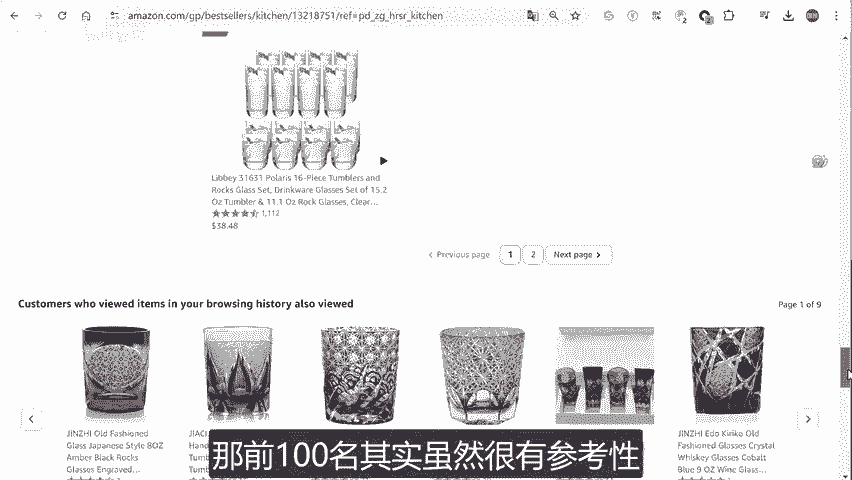
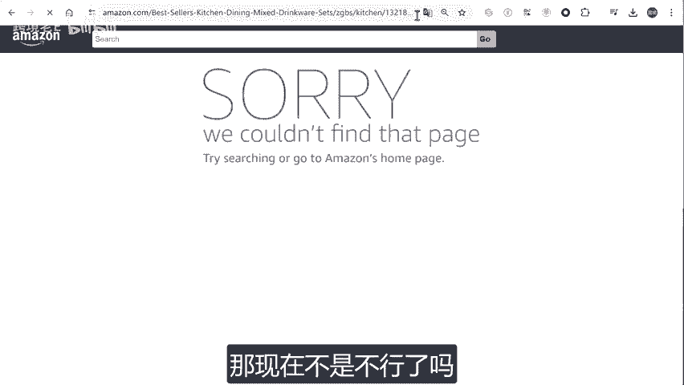
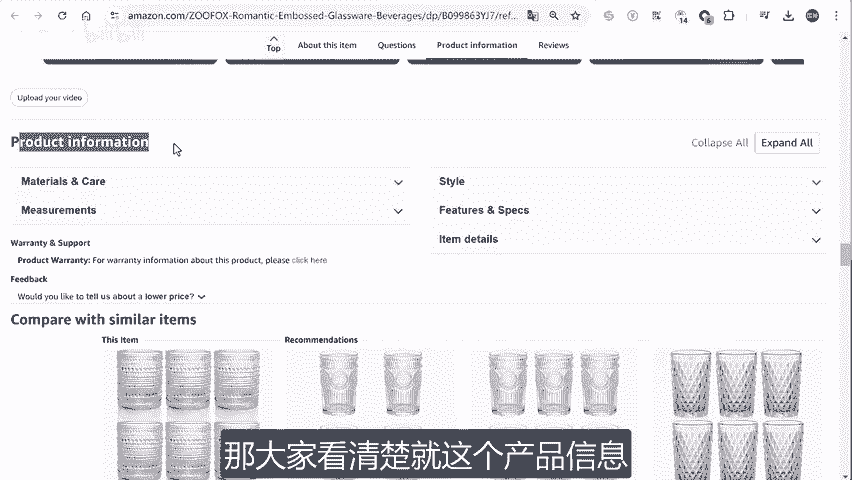
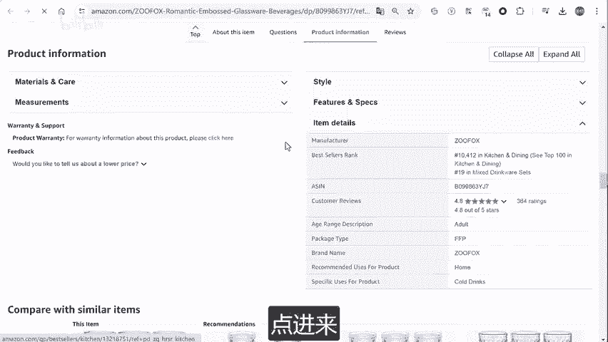
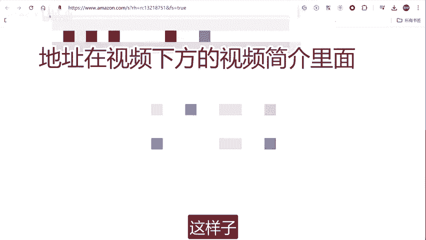

# [选品技巧]亚马逊如何查询BS榜单100名之后的产品 - P1 - 跨境老E - BV1u72gYNESi

大家好，今天跟大家分享一下如何不使用工具查询这个BS榜单100名之后的这个呃产品。就我们选品的时候，经常呃需要对这个竞品啊啊是吧？那前100名其实虽然很有参考性，但是我们更多的话就是要参考前300名。

啊，前300名的产品。那之前可以通过改这个呃这个P2啊，把它改成3，那现在不是不行了吗？啊，现在不行，所以说呃我们还是用其他的方法是可以实现的。首先我们打开一个呃相同市场的产品。

比如说我们要分析这个市场。所以我们就打开随便一个产品。然后呢，拉到这个最下面。

这边有一个产品信息啊，以前都是展开，现在它堆叠起来了。那大家看清楚就这个产品信息啊，点击这个产品详情。

这个啊他排了第19名啊，点进来。

那这个就是前100名的这个第一页50嘛啊，然后第二页也是50啊，更好100。然后呢，大家看一下这个地址。看到这一串数字了没有啊，这个就是我们说的这个类目的ID我们把这串数字给复制起来。

替换到这个地址上面啊，把这个叉叉叉，我这他改一下吧。这。啊，把这四个字给替换掉，用什么替换呢？用刚刚复制的这个码替换掉。啊，这边替换。这样子。

好，那这就打开了另外一个这个页面，这时我们点一下这个按照BS排序。啊，那这就是前面1000名的这个产品啊，那这个就可以直接分析我们这个产品的这些竞品啊，分析他们的这个数据。那另外的话，我这个链接会放在。

这个视频的下方那不要找不到哈，就在这个地方啊，这个地方就在视频的下方啊，很多粉丝加我说找不到这个下载链接啊，就在这边，我等一下也会把这个地址放在这个地方那手机端的话是在这个地方。

标题后面有一个向下的键号点一下啊，看到没有啊，链接也会放在这个地方。啊，大家拿去用，就是把这个替换的那个四个字给替换掉，其他都不要修改哈。好呃，那我们今天就讲到这边啊，我是跨境劳逸，我们下次见。

