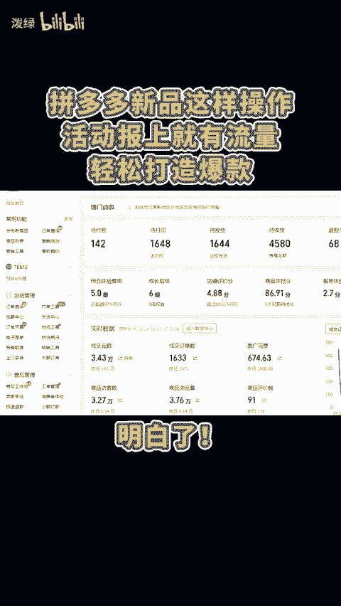
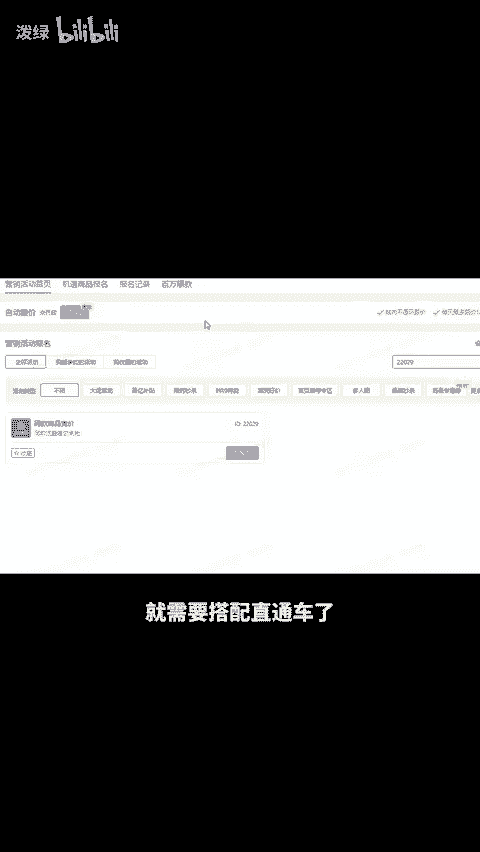

# ew拼多多新品这样操作，活动报上就有流量！轻松打造爆款 - P1 - 泼绿 - BV1jcsSeXETA

拼多多新品这样操作活动报上就有流量，轻松打造爆款。明白。😊。

假设成本时上价定20，并立即做好房比价，之后用成本价报名21365，积累权重，30%利润报名20303，25%利润报名15996，最后20%利润就报名9052了，活动报完再打开推广，每天限额100。

不用开太多，出价就按照售价的一半，一个小时快速花完拉高流量，这样后面才有机会憋出自然单，保你稳赚不赔，如果不想降价，还想蹭活动流量，那就得原价去卡活动了，可以卡大促流量值和同款低价去截流。

原价多少上活动就多少钱。但是因为价格高就需要搭配直通车了。还有不会的点左下角。😊。

