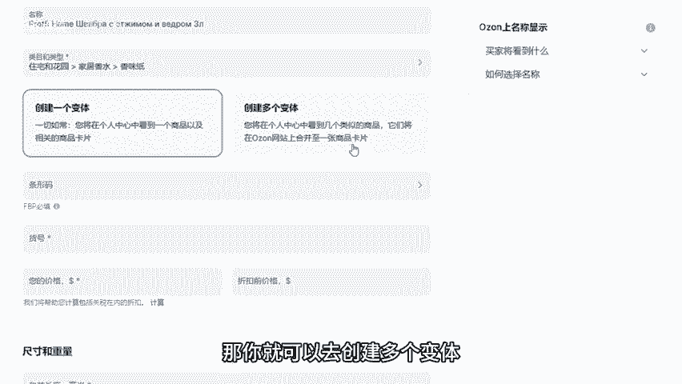
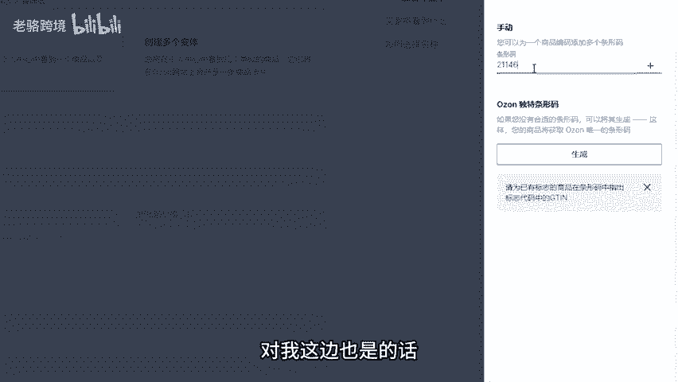
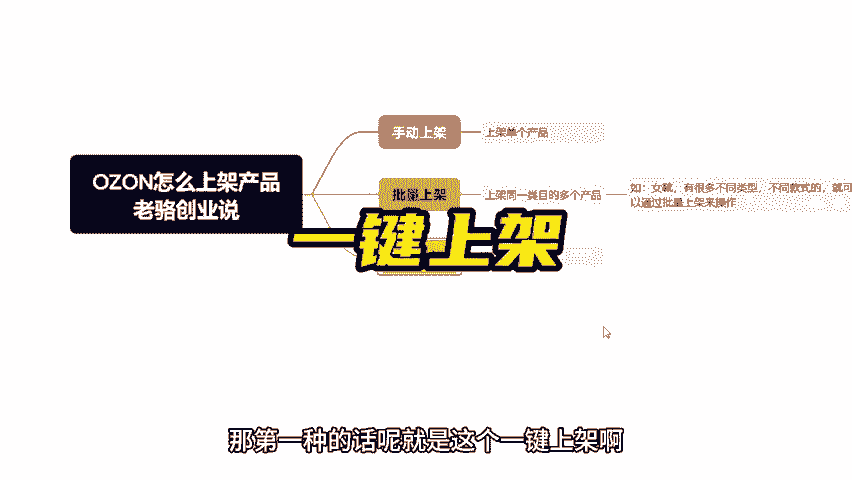
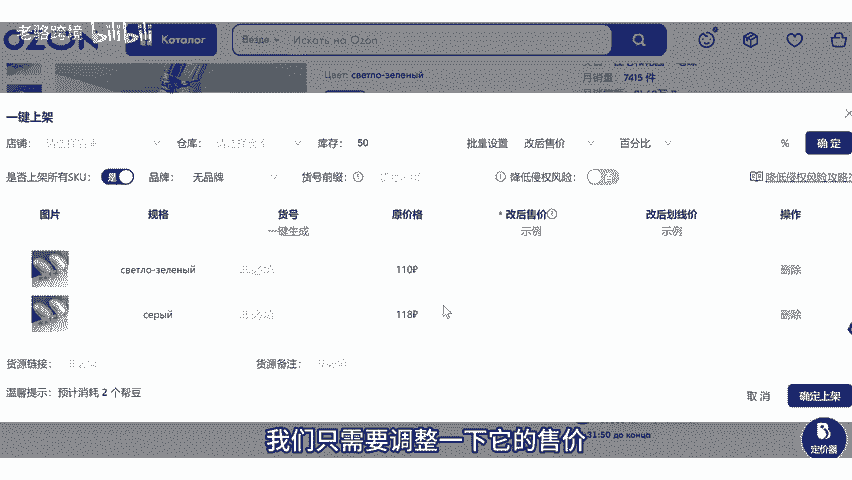
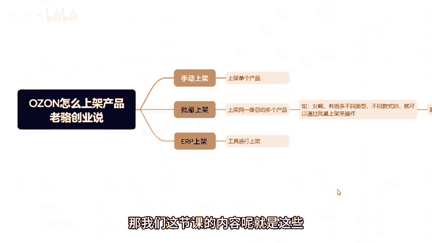

# ozon怎么上架产品？ozon跨境电商运营教程，手动上架，批量模板上架，erp工具上架 - P1 - 老骆跨境 - BV1htyPYjE2K

这一节课的话呢来讲一下那一个欧众的手动上架批量上架以及ERP上架啊这三种上架方式。那手动上架的话呢，你可以理解为就是我们单个产品的上架啊，就是我们单个上呃商品的上架。那么批量上架呢。

你也可以理解为就是什么呢？通过模板进行上架。你看它这里写的非常清楚，你可以一次性添加啊那个同一类目的多个商品啊，就是我们去通过模板进行上架啊，这个就是批量上架。

但是呢它有个前提就是同一个类目的多个商品啊，比如说你是做女靴的对吧？那履靴的话呢，它有很多不同的类型，不同的款式，对吧？那你就可以通过啊这一个批量上架来操作。那么接着呢就是ERP上架ERP上架。

你可以理解为就是通过工具啊进行上架啊，就是你通过这种ERP工具，对吧？进行上架，把别人的这个产品采集过来，然后呢那一个修改一下上架对吧？所以说呢这是它的就是三种啊这种上架方式。

那我们呢今天的话呢一个一个来讲啊，那其实呢就是说呃我们先来讲手动和批量上架。那其实。那你只要把手动上架理解清楚了，那批量上架呢，你自然的就理解清楚了，对吧？啊，为什么呢？

因为就是说你会发现批量上架他要填写的东西呢和手动上架要填写的东西呢是差不多的啊，所以说我们讲明白手动上架，批量上架，自然就会了啊，那我们可以那个就打开这个欧众的后台啊，这里就有一个手动上架啊。

那我们就可以那一个点击对吧？啊点击啊，那首先的话呢，这里的话呢就是名称啊，你就可以理解为就是你要写的这个标题啊，写一个标题因为这一节课呢是给大家的一个就是讲解，所以说我这边就随便写一个啊。

随便复制一个别人的然后呢接着呢就是那一个类目类型，就是你的这个商品是什么类目啊，所以说呢你可以自己去自己去选啊，就是你的这个商品啊，你认为应该放在哪个类目。

或者说呢你也可以就说去看一下啊那一个别人是放在哪个类目的啊好，所以说我这边就因为是演示嘛，所以我就随便选一个啊，给大家主要是给大家讲解，就这个是什么意思啊，一个遍体多个便题，什么意思呢？

你比如说你的这个商品对吧？啊，是就是只有一个型号对吧？或者一种颜色，那你就选。一个面体。如果你要是多个品体，比如说你的这一个商品，它有两种不同的颜色，那你就可以去创建多个遍体。比如说黑色和白色，对吧？

那你就可以去创建多个面体。条形码条形码的话呢，这个你可以自己去填啊，它这里有呃两种，一种是手动，对吧？你自己去编辑一个，还有一个呢就是那一个啊你可以去生成，对吧？所以说呢这个你根据自己的情况来吧，啊。

我这边演示的话，我就就就那一个就随便填一个好吧，然后呢，货号也是一样的，你自己去随便填啊，就这个是由自己去编辑的价格啊，你的售价啊，这个售价就是你要卖多少钱啊，你要卖多少钱。

比如说我这个想卖20美金记清楚，它这里的就是呃这一个就是你的这个币种的符号啊，因为有的人他下的店呢是这个人民币的这个符号啊，有的呢是那一个就是美金的这个符号，对吧？所以说你要去记清楚啊。

它的这一个符号啊，就是它的这个币种的符号，然后折扣钱的价格，就是你的下的一个划线价，比如说25美金，对吧？好，在这里的话你就去填写你的这个产品的包装的重量，对吧？以及宽度高度。

对吧以及长度对吧啊，就是它的这一个尺寸和重量。你根据你的实际情况去填，你要不知道对吧？那你就可以去问一下你的这个采购的商家，然后呢，接着就是那个上传图片，对吧？那么我们这边就比如说随便填一下，对吧？啊。

比如说啊1一对吧？啊1。啊，嗯好，这里记清楚它的那个重量啊啊，就是单位啊，它这里呢就是都是毫米啊以及克，接着就是这里上传图片啊，你的图片对吧？主图，其他的副图你自己去上传啊，再接着就是品牌啊。

就是如果你做了品牌备案，对吧？那你就写，如果没有，你就写无品牌，对吧？然后呢，商品名称合并到一个商品卡啊，这一个就是你比如说你卖的是女轩，那你就是女轩，就是给你的这个商品，取一个就是名字啊。

它这个不是标题啊，就是取一个名字，就是你这个商品的名字啊，你可以去那个就取一个啊。我这边比如说呃这个随便填一个啊。好，然后呢简介啊这个你就是可以理解为你商面的描述啊，这个用俄语去填，对吧？然后呢。

以及你的这个体积啊、重量呀、香味啊，那这些其实都是根据你的产品来的。因为我们刚刚选择的是那个香位纸嘛，所以说呢它这里就会那一个要求我呃那一个就是填写啊，你这个是什么香味的对吧？

那你如果假设你换一个其他的类种，它它又不同了，你比如说你换一个其他的啊呃你比如说家具日用啊，比如说我们这一个这个。吧台店啊，你会发现它下面的又不一样了，对吧？比如说你的这一个商品的颜色，对吧？

以及呢这个包装里面有几呃有几件产品，对吧？就是它会根据你不同的内目，他会要求你填写不同的东西啊，你觉得你填的差不多了，对吧？你就点击创建完成就可以了啊，就可以了，对吧？其实手动上架呢。

就是你填写这些东西就可以了。因为我们其实说实话就是先上架后优化，对？把我们的效率提升啊，那么这时那一个就是说手动上架，那再接着呢就是批量上架，批量上架的话呢，其实说实话它就是通过模板。

比如说我们选择那一个通过模板，然后呢，我们可以在这里呢选择exexcel，对吧？你会发现它会让你干嘛呢？第一步先让你选择一个类目啊，对吧？比如说他会让你先选择一个类目，你是做哪个类目的对吧？

你的这个商品对吧？你要在这个类目多呃就是上传多个商品，对吧？那你就选择这个类目，对吧？选择了之后呢，然后呢下载这一个表格去进行编辑，编辑完了之后呢，把它那一个就在这里去啊拖进来对吧？然后呢。

再点击发布就可以了。所以这就是为什么我们最开始就说说这一个上上架多个类目呃，就一同一个类目的，多个商品而。不是说多个类目的多个商品，因为你会发现它会让你先选择类目对吧？你你只有上架。

你只有通过表格去上架了一个这个类目的多个商品，对吧？你才能那一个就是上架成功嘛。但是就是说哎你有很多类目，对吧？那你就需要去生成不同类目的这个表格啊，是这个意思啊，然后呢他下载下来这个表格呢。

其实和我们刚刚手动上架要填写的东西是差不多的。所以说呢基本上就是只要你的手动上架，理解清楚了，批量上架是没有问题的那么最后一种呢就是那个ERP上架ERP上架的话呢，其实呢我认为是呃最好的方式，对。

其实我不太推荐用什么批量上架，手动上架，我真的是不推荐啊，特别是我们这种的一个做跨境店的啊，特别是无货源的这种卖家啊，因为我们要的效率，对吧？啊，那不管是手动上架还是那个批量上架都挺麻烦的对吧？

因为你需要提前去把图片下载下来，提前去做图去翻译去那一个怎么样怎么样的对吧？那我是呢比较更建议就是说用ERP上架对吧？这样效率呢就更快一些啊，那你就比如说像这一个我现在正在用的这个ERP工具啊。

它有三种上架模式。第。就是这个一键上架啊，直接把别人欧众店铺的商品一键上架到我们自己的店铺，对吧？我们只需要调整一下它的售价就可以了。那么第二种呢就编辑上架啊，也是一样，就是把别人欧众店铺的商品，对吧？

直接那一个上架到我们自己店铺。但是我们可以去修改这一个商品的参数啊，属性啊等等等等这些那么还有第三种就手动上架就什么意思呢？就是我可以去把其他的平台的一些商品上架到我们欧众店铺。

比如说我们可以去在61688上去采集一个商品上架到我们店铺，然后以及多多上去采集一个商品啊，那一个上架我们店铺。而且呢就是我们采集的之后，我们是可以编辑的，比如说把图片一键翻译成俄文，对吧？

然后呢以及呢可以稍微的编辑一下它的属性价格等等等这些对吧？当然这个ERP呢如果有需要的啊，也可以找我这边直接发给你对吧？或者说呢你直接暗号啊这个上架啊，我这边给你安排啊，反正就是说我用过很多E品呢。

我觉得这个还是可以的因为效率的话呢是比较快。因为其实我们做运营的话呢，最主要的就是怎么去想尽办法的提升我们的运营效率啊，不然的话你手动上架，你可能上架一个品给了1个三四十分钟，对吧？那这个效率呢就太低。

好吧，那我们这节课的内容呢就是这些。好吧，那我们下节课再见。

