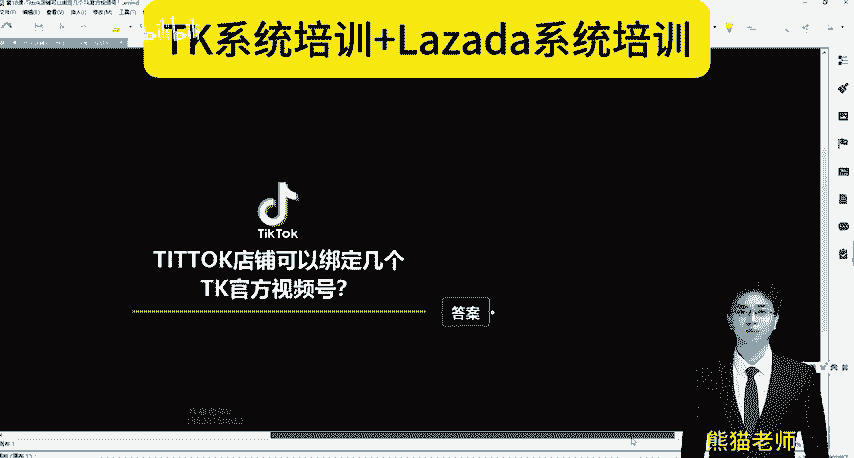
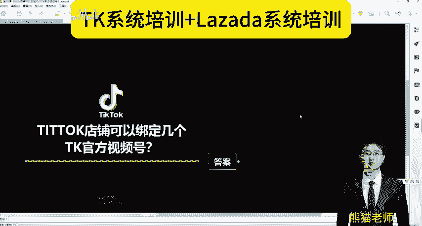
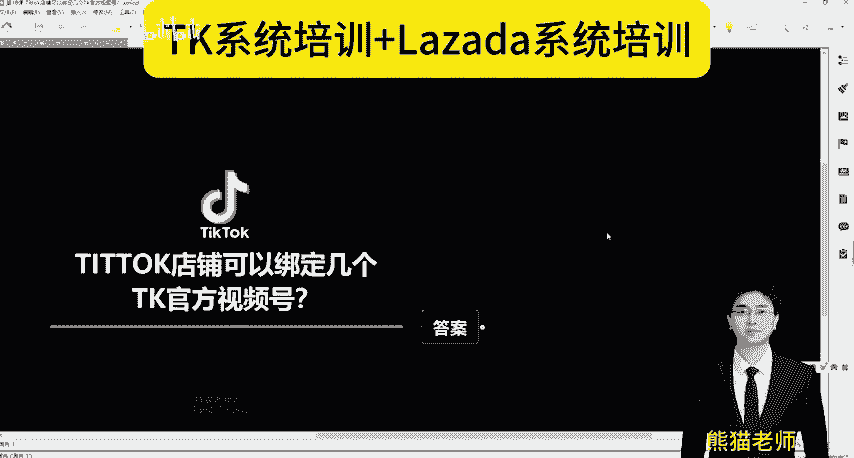
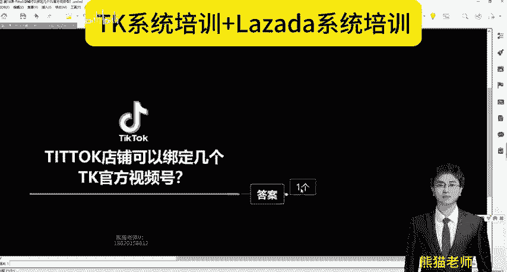
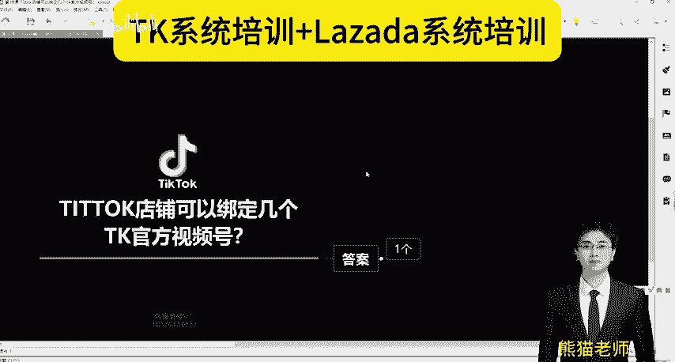

# tiktok店铺可以绑定几个Tk官方视频号？(Tiktok跨境电商之Tiktok运营教程） - P1 - Lazada熊猫老师 - BV1aNaLeqEvk

各位商家朋友大家好，我是熊猫。我们一直在做TK和哪扎大的什么系统培训。同时我们也在做什么独立战的这一块的一个业务好。这个视频跟大家分享，当然还没关注我的，先点波关注哈。

TK的店铺可以绑定几个TK官方视频号呢？因为前一个视频我给大家讲了TK官方视频号是什么？

TK官方视频号不是TK平台的视频号，是你自己的TK视频号。

明白没？这个是解释。好，答案就是一个就是1个TK店铺可以绑定1个TK官方视频号，可以绑定一个你自己的。

官方视频额外给大家延伸一下知识，可以绑定多少个其他人的TK视频号啊，在你还没有出新手存的时候，你只能绑定一个。当你出了新手存，你可以绑定4个正式答案。好，还没有关注的朋友先点一波关注，谢谢大家。

