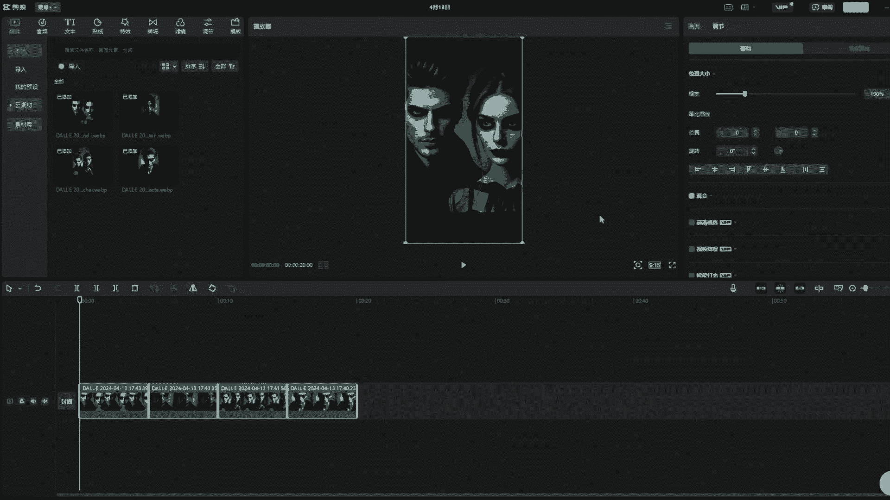

# tiktok新手小白不会起号？ 尝试过AI技术暴力起号吗？ 抓紧看吧，一个视频6分钟教会你 - P1 - 卡拉米soho - BV1rf421Q7zb

好大家好，今天呢就给大家演示一种，其中用AI做TIKTOK视频的一种方法，那么我们接下来就直接开始吧，首先呢我们打开TIKTOK这个软件，在电脑上登录，我们正常的去刷一下这个视频啊。

接下来呢我们就针对当前比较火的一些素材，进行搜索，看TIKTOK上面都是什么样的，最近呢比较火的呢有一个东西叫做暗黑心理学，那么我们一起来看一下暗黑心理学都是什么样，在搜索栏目当中输入暗黑心理学。

这个时候呢我们已经输入完了暗黑心理学，点击搜索，我们看一下大家在搜的时候，一定要看这个账号啊，不要再去点综合或者是视频，看账号里面，我们去发现一下，有哪些账号是做这个暗黑心理学相关的啊。

首先一看这个有二百七十六千，就27万多的这个粉丝啊，我们一定要去怎么去找这样的对标账号啊，之前的视频里面也说过了，一定要去找英文的，其次像这种他的粉丝量也不错，但是这种阿拉伯文的我们还是不建议啊。

然后一直往下这些呢其实都是很好的，作为一个参考的，那我们就以第一个为例吧，点开这个账号，看看他里面的视频是什么样的，通过这个视频的后台我们一看啊，整个的播放量其实还是蛮不错的。

虽然不是说每一个视频都是爆火，但总体来说呢视频的质量还可以，他这里面置顶了三个视频，都是已经超过百万的播放啊，那我们看一下最近某一个视频。

他的一个播放量的情况，啊最近的一个视频，大家看他的整个一个情况是什么样的，这种视频，它是通过这种图文相结合的形式，去在TIKTOK上发布的，它的播放量只有五个，说明我们按照之前的这个逻辑来说。

他是是属于画面比较牛，但是文案还有各方面都是有所欠缺的，那么对于这个账号这个视频来说，他有2万多的这个播放量其实已经可以了。

但如果说我们要做类似的这种图文形式的AI。

怎么去做呢，我们就照着他的这个抄看，每一张图上其实他都有这样的一个标题，有一个标题的目的呢，其实就是为了吸引，让用户在他这个视频上进行时间上的停留，我们可以挨个的去看一下啊。

每一张图片上都有相关的这个视频好。

此时此刻，我想大家应该按照我之前的拆解方式，知道怎么去对它进行拆解了，并且我们也做出同样的一个视频出来，这个时候我们需要什么，需要类似于这样的一个图片，这种图片怎么生成呢，他明显是用AI去做的。

通过AI有两种方式，第一个呢是用MAJOURNEY啊，这种生图的方式，第二个呢就是最简单的用恰GBT，我们可以直接生成，那么我们就用第二种方式直接打开恰GBT。

好的，我们在这里打开chat gbt，我给它输入了一个指令，请帮我生成一张图片，要求是那种符合暗黑心理学的人物，看起来比较凶狠，一般人难以接近的模样，这里一定要写出图片的比例啊，因为我们在抖音上发布。

或者说TIKTOK上面发布都是九比16的比例，那这样的话，它整个的一个比例是符合我们的要求，那么第一张图片我们已经生成了，这个时候我们把它下载下来，同样的方式我们再去生成5~6张这样的图片，好的。

这个时候我们已经生成了四张这样的图片，接下来我们打开剪映。

把把相应的图片把它弄过来。

接下来我们在简易里面进行编辑，首先确定一下比例。

再次打开TIKTOK，我们可以通过这上面的案例来看一下，他所说的文案都是什么，很简单，我们完全可以通过微信上有一个翻译的功能，直接翻译。

把这个文字提取出来好，这个时候我们把它提取出来，接下来我们把这个文案放到谷歌翻译里面，看一看翻译成中文是什么意思，尊重那些尊重你的人，不尊重那些不尊重你的人啊，同样的我们再换一个方式去把它反过来。

再重新翻译，发现没有，我们在这里点击的时候，它会出现不一样的一个翻译啊，或者说大家也可以使用其他的翻译工具，其实呢很简单，就是你要做的内容，就是把这一段文字翻译成中文之后，再反过来翻译成英文。

但是呢翻译之后的结果和原文章不要完全重复，这个时候就可以了啊，比如说我们把这个复制复制过来之后。

我们打开剪映，这里添加文字，嗯调整一下，这里我们还可以对这个文字进行不同的编辑啊，包括对上下的位置，好了文字编辑好了之后，把它拖到和这张图片一样的时长，同样的方式，把第二第三第四同样的图片弄好。

我就不做长时间的演示，大家可以自行过来啊，这个时候我们实际上就已经生成了，这样的一个图文的形式。

但是我们导出的时候要把它导出为图片，整个视频的大部分已经完成了。

接下来的音乐我们不需要在简易里面添加，而是在发布的时候通过TIKTOK后台去添加。

我们把它导出为视频啊。

音频不需要直接导出即可。

视频呢做到这里呢基本上已经完成了，我想大家呢可能有两个问题，第一个呢是为什么要做暗黑心理学啊，因为暗黑心理学是最近比较火的，如果说大家还想有其他的系列的比较火的，可以通过屏幕上的这个联系方式来找到我啊。

第二个呢还有关于ChatGPT，还有MEJOURNEY的这些资源，如果大家没有的话，也可以通过联系方式找到我，好。

