# 【微信视频号教程】微信视频号起号正确方法，抓住当下这波风口，打造月入10w的自媒体账号！ - P9：3.视频号和快手抖音的区别 - 日剪向映教程 - BV13c4cejExp

我们既然是跟抖音和快手去对标的话，那他到底有哪样的一些优势呢？我们为什么是不选择抖音和快手选择视频号这个平台呢？啊，我们从三个地方去看，第一个他的DAU就我刚刚说的日活用户，视频号现在是5亿，抖音是6。

5亿，快手是3。2亿，抖音达到这么一个数值，它是整整花了有56年的时间，他从这个16年开始做，那你想一下到现在啊，他的一个日活用户，56年的时间才到达这么一个数据。

但是你像视频号他是短短一年半的时间远超快手直追抖音，这是他的一个发展速度是不是非常快啊，毕竟是已经走过的路嘛？好，那我们再来看一下他的一个创作者数量，这个非常重要啊，从这三个地方去对标啊。

你看创作者数量很少很少。但是抖音和快手将近2亿人，这就是我刚刚说的人才比较多。你这个时候想要去跟他们竞争。你如果说真的没有什么技术啊，或者说我没有什么特别大的一些优势啊，很难跟他们去抢。所以说。😊。

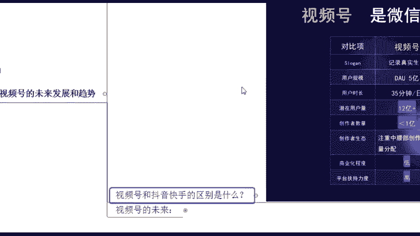

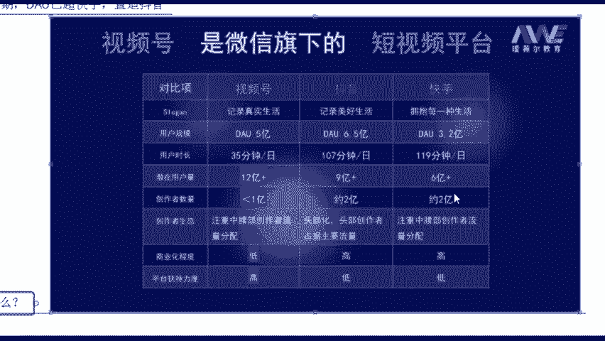

这个就是能够看到的一个对比啊，以及它的商业化程度是非常低的啊。但是他现在来说，商业化程度低，未来肯定是要往什么商业化程度高的方向去发展的那我们现在腾讯内部的话，也有这个相关的一些消息啊。

就是腾讯内部的话，他说即将在2022年的下半年啊，要将视频号开启什么商业化了啊，即将要开入这个商业化程度了啊，所以说这是我们可以看到的平台扶持力度是非常非常高的。如果说你会刷视频号的同学啊。

你可能会发现就是我们之前呃经常刷过的一些这个段子啊，在抖音啊，甚至你在其他平台有火过是吧？很火很火。结果呢你在视频号上面你再去发一遍，那我发现这个东西我之前刷到过啊，结果他还又火了一遍，对不对？

甚至还要比在抖音的更火，就是他的播放量还要更高，这个就是现在他的一个平台扶持，我给大家看一下啊，这个是我自己学员他们在做的一些作品啊，同样的一个什么缝纫小技巧。😊。

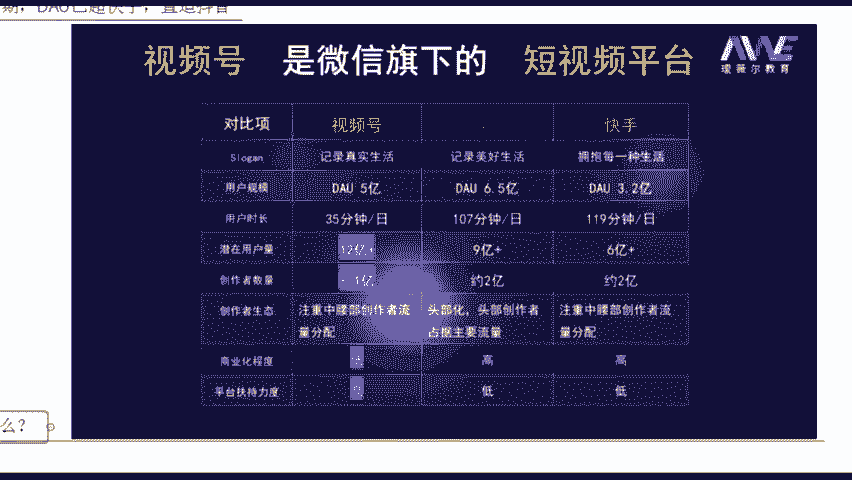

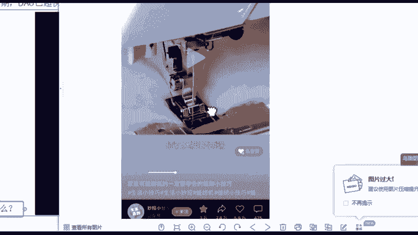

这么一种生活小妙招嘛，你看他发在呃这个是发在视频号的，我给你先看一个抖音的啊，抖音它的数据量是怎么样的？同一天同一个作者啊同时发布的。然后他在抖音发布的一个赞是497个赞11个评论255个收藏。

然后呢转发是88啊，就这么一个什么他的一个点赞量其实不算高呃，相对比的话不算高吧。但是他在视频号发的时候啊，同一天发，你看他的一个播放量收藏3万转发7。8万，点赞5。

9万评论475有没有看见这就是很明显的是不是流量扶持都是同一个作品啊，一模一样啊，没有什么更改的。好，这个就是现在我们视频号他的一个流量扶持。好，那我们讲到这里的话，为什么我们现在要去做这个视频号呀。

也详细跟你们说一下啊，第一个就是我刚刚说的平台是有这个流量扶持的，并且我们为什么要现在去做呢？还是官方消息，你看发布创作者激励计划，三有政策扶持创作者开始。😊。

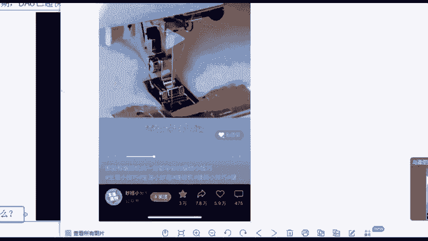

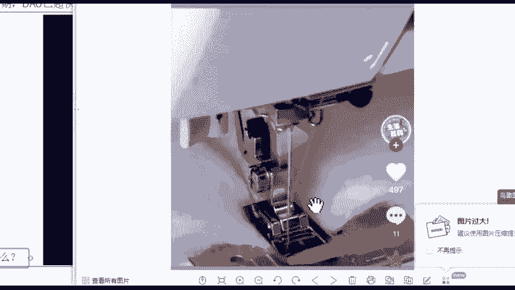

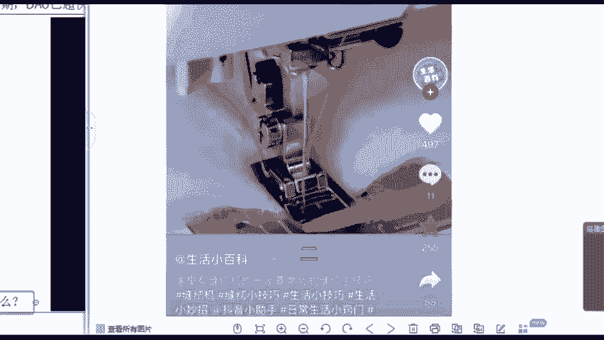

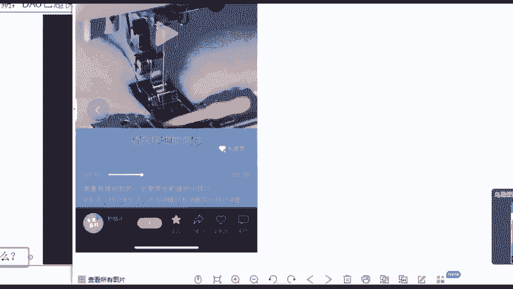

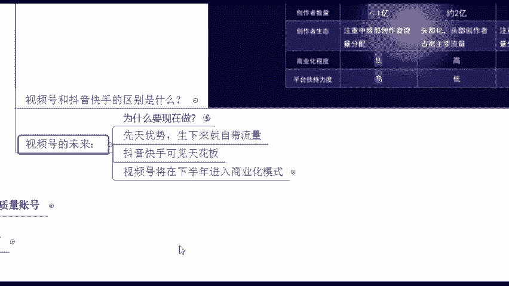

现了他要干嘛放大招了啊，那你看一下他这边呃有给到我们什么样的一些机会呢？三有扶持政策未来一年将通过流量扶持、专项奖励和全生命周期成长权益是吧？体系，让平台创作者真正的实现，有流量有收入，有成长。

三有政策，就是这么一个三友让你有流量有收入，有成长，这就是平台的一个扶持。那这个其实就是给到咱们什么零基础，或者说我从来没有接触过这个东西啊，也有这么一些扶持，我能够有流量的扶持了啊。

这是他官方的一个消息啊，同时我们视频号的话跟其他的平台相比，也会有一些先天的优势在的先天的优势是什么？😊。

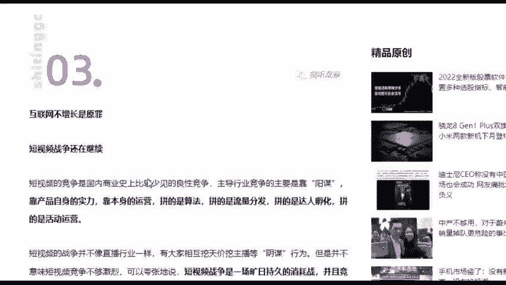

啊，他生下来就自带流量，生下来人家就是皇宫贵族我生下来，我背后我就是12亿的流量值。但是你像抖音和快手，人家就是从零开始的。所以说他什么？就是相当于生下来自带这个buff啊，自带加成啊。

这就是非常厉害的。包括像抖音和快手现在的话已经可见天花板了。你如果说真的想要去再去做什么突破的话，很像好像很难，对不对？因为它的内容的话也一直都是这么一些，除非你是有什么新的一些模式能够走出来了啊。

那视频号的话，他将在下半年进入这个商业化模式，你像我们现在的话他在下半年进入商业化模式意味着什么呢？这里将会有大量资本的涌入。那我们现在去做账号其实是更好去做的。

因为并没有说很多的一些什么大流量的一些账号，你很少有看到吧，基本上我们能够刷到的，有一些可能几十播放量的，几百播放量的你都能看见。那其实意味着什么？我们现在起号，你去做号是更加容易的那等你的账号起来。

意味着你掌握了这个。😊，流量的钥匙了，流量的密码，那自然而然你就能够跟品牌呀跟这个资本去合作做流量。那你可以什么帮他们推广广告，从中去赚到这么一波红利了。好，这就是所谓的一个当下的一个机遇了。嗯。

现在去做视频号，其实就相当于是5年前去做这个抖音。😊，想一想啊，我年前做抖音，最早期其实通过这个短视频赚钱的人是非常非常多的。你像2018年双十一的时候，薇娅她1000的带货量呃，将近2。67亿。

你想想薇娅虽然说他现在已经什么凉了，但你像2。67亿，老师我一辈子都没有见过这么多钱，单场他只要直播一场啊，直播一场，他可以赚200多万。李佳琪的话大概是300多万啊，其实这些的话呢。

你要说他真的有什么过人之处吗？其实嗯也没有啊，他就是踩在时代红利上的人值不值得去做呢？这个你可以好好想一想，那讲到这里，你们觉得这个视频号它到底值不值得去做呢？你觉得值的话，你给老师打个值。😊。

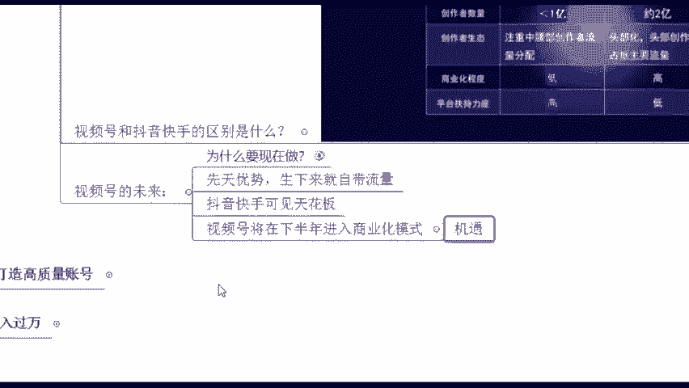

值的话，给老师拿个值，这个就是我们现在市民号肉眼可见的未来发展趋势到底是怎么样的？😊。

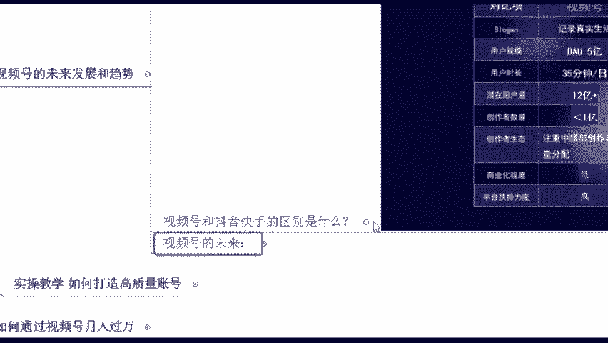

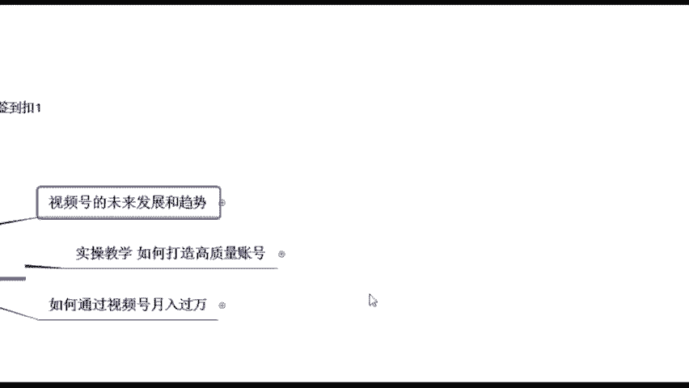