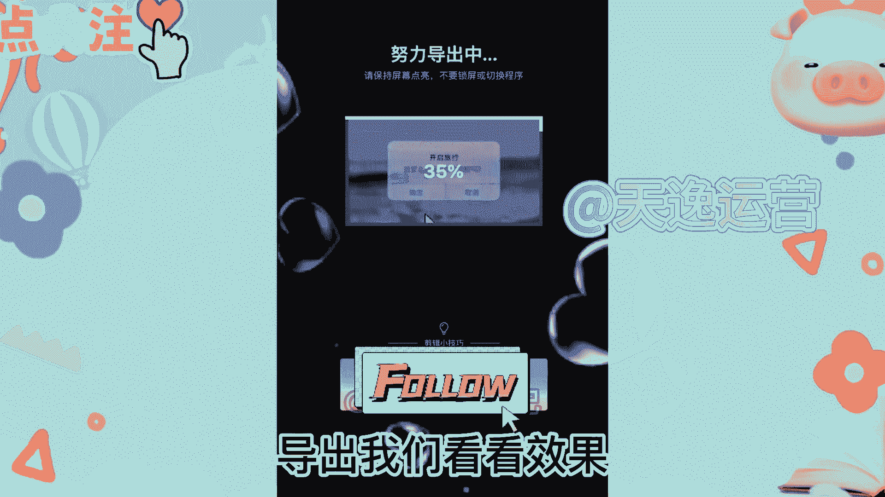

# 《24年最新自媒体运营思路》在B站听歌赚钱，一个月赚了54000多，普通人也可以做，详细实操过程分享！ - P1 - 九幺起飞了 - BV1KC411h71P

不跟大家吹牛啊，今天这个视频呢大家刷到就是赚到，因为我即将分享一个容易上手，并且是零门槛就能够赚钱的方法，不需要呢自己去拍摄，也不需要你有才艺，适合那些想做自媒体，但是又不想露脸的朋友们。

一个月也能月入过万，大家可以看到这个呢是我后台的一个收益数据，那现在呢很多人都说这个数据是可以造假的，那么在这里呢我给大家刷新一下，那刷新之后呢，大家可以看到这个数据呢是没有什么变化的。

都是真实有效的一个数据啊，那大家一定要耐心的看完本期视频，那今天呢我就把这个方法全部细节分享给大家，现在呢在自媒体平台上面，是可以通过发布文章或者发布视频，来赚取收益的。

但是呢大部分人都不知道该发什么样的内容，或者说不知道发怎样的内容会火，那现在呢我就把我的操作思路来分享给大家，大家呢只要做好了就可以了，其实呢就是在平常空闲的时间听一听歌，选择当下比较火的音乐片段。

把它变成视频，然后把它发布到一些有播放量就有收益的，自媒体平台就可以了，那么话不多说，我就给大家实操演示一下，首先我们先做一个片头，导入一段事先准备好的素材视频，关闭原声，把视频的时长调整为一秒。

添加特效模糊点文本文字模板气泡，找到这个弹窗模板，手动修改一下文字，在贴纸里呢搜索一个鼠标，然后我们用关键帧做一个鼠标移动的效果，在鼠标点击的位置点音效，添加鼠标音效，接着我们导入更多的视频素材进来。

点提取音乐提取我选择好的音乐素材，选中音频条，点击踩点，自动踩点，选择踩节拍，调整每段视频的时长都与古典对齐，添加特效录像带三点文本识别歌词，给识别出来的字幕，添加入场动画，卡拉OK导出，我们看看效果。

要肆意奔跑，♪ 白天到晚上 ♪，♪ 直到我看见天空变微亮 ♪，♪ 也想要变成鸟儿在飞翔 ♪，♪ 我想让你的笑容刻在我的心上 ♪，♪ 要肆意奔跑 ♪，♪ 天到晚上 ♪，♪ 直到我看见天空变微亮 ♪。

♪ 也想要变成鸟儿在飞翔 ♪，♪ 我想让你的笑容刻在我的心上 ♪，呜呜那想要成为一个合格的up主，那这里就涉及到很多了，比如账号的注册，起号怎么写标题封面的一个设计，如何运营账号。

平台的规则以及平台的推送机制等等等等啊，那最后呢如果你看完本期视频还没有方向，不知道怎么去做自媒体的话，可以在评论区留言一个学习，那我呢也会给你分享一些，我学习过的自媒体实操直播课程。

这节课呢是完全免费的，两小时的一个直播课程，我觉得是非常有帮助的，大家也不用担心自己学不会，因为它是从很基础开始讲解的，讲解的呢也非常的详细，我想呢只要你认真听完，一定会有所收获的。

那今天的分享呢就到这里了，那我们下期再见吧，祝点赞的小伙伴好运连连，心想事成。

