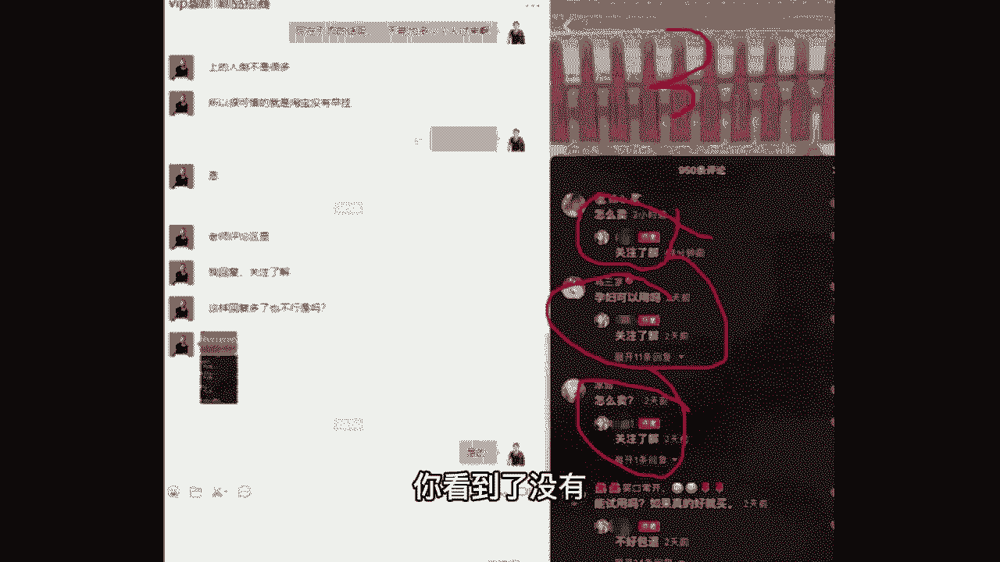
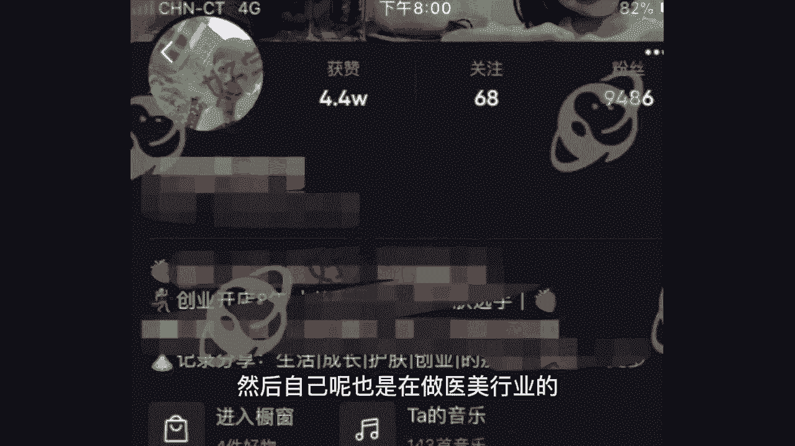
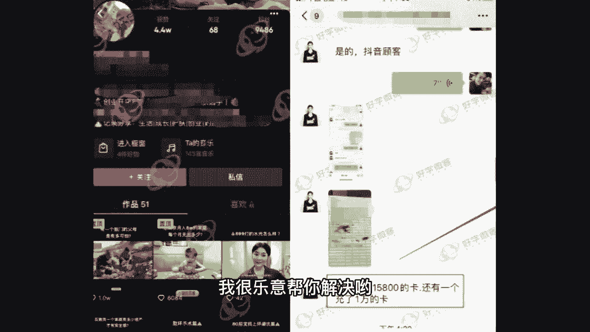
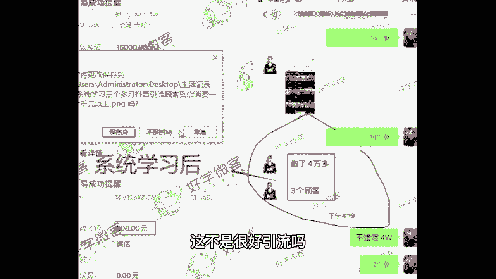

# 《抖音全套运营教程》2024年做抖音怎么快速起号？分享抖音起号运营思路：找账号-定形式-抄选题-测爆款-复制爆款！ - P11：9、视频制作核心(下) - 毛有大大钱 - BV1NA4m1w7Zs

那接着中间解决问题，开头给人家提了，中间必须解决，中间不解决，别人看到中间直接就给你划走了，那么接下来我给你们看一个视频，咱们班有没有做房产，汽车领域的同学，可以公屏上扣个一，我看一下，来一起看视频。

看完了再回答我的问题，谢谢，年轻人到底该先买房还是先买车，北漂女孩的任性，有车太爽了，我觉得买车真的会对生活品质有很大的提高，她是徐秘密，93年北漂白领单身，去年刚成为有车一族，他告诉我。

有车的幸福来自于，他会让你去哪里的距离都变得很短，每天早上一睁眼，我就很期待着跟他见面，我的车上班都变成一段幸福的旅途，我买了车以后就更喜欢上班了，有人说春日消耗品，房产能让人安静。

秘密并不觉得我想了一下，首先首付是一个很大的问题，第二个是你要还房贷的话，我觉得他会对我造成很大的压力，比起令人感到沉重的房贷，通过奋斗买一辆自己乘坐的几个小车，何尝不是一种迂回的幸福。

你可以开车在这座城市穿梭，我开始对生活有更多期待，或许不是每个人都能留在北京，但至少在这段愤怒的日子里，这辆车能和你一起，见证在这座城市的许多荣光与失落，车真的能带你看到更大的世界。

这是一个北漂女孩的任性和倔强。

也是生活对他最公平的奖赏，来我的问题是啊。

你看这个视频，题目是年轻人到底该先买房还是先买车，也画群体了，也找了核心话题了，那么我想问一下咱们班同学，如果说你看到一个合适的标题，哎，同行的标题很不错，你可不可以照搬不动的拿来用，觉得可以的扣一。

觉得不可以的扣二，你包括做黄金的同学，你看马上过年了，黄金哪种人最喜欢女士啊，饰品啊，你给他提个问题，给丈母娘送什么样的黄金饰品最保值对吧，过年了就当那种女婿上门见家长了，那送点黄金对吧。

那又抓住了一个要点，最保值，什么样的黄金饰品又是送丈母娘对吧，如果你遇到这种话题，你觉得可不可以照搬不动的拿来用来，我告诉大家可以问题一样，不算抄袭，你可以用，我也可以用，它也可以用，中间不能一样啊。

中间找出你自己的亮点，像那个年轻人到底该先买房还是先买车，咱们班你卖房的同学，你说买房的好处，你卖车的说买车的好处，你卖二手车的，你说买二手车的好处，你本身从事这个行业，我让你说一个好处。

你不张嘴就来啊，你要是好处都说不出来的话，那老师我没法带你了啊，来接着结尾，很多同学说，老师为什么我的视频这么多人看，我就是不涨粉，你有没有考虑到一个知识点，人均刷抖音的时长是多久。

112分钟接近两个小时啊，每天刷两个小时接近，那么会不会出现那种情况，哎我把这个视频从头到尾看完了，但是我因为刷视频刷的时间太久了，我忘记给他点赞，点关注了，正常吗，我个人觉得是非常正常的。

那么这个时候需要你去引导他，你去提醒他一下，你可以给我点个关注啊，怎么提醒，不要用太长时间，你的视频本身没多长，三秒钟以内一句话的事啊，这样记下来，比如说喜欢你就点个关注哟，或者是下期想看什么。

欢迎在评论区给我留言哟，或者是像我这个学员，他是做护肤品的，也是很多人看之前就看完了，就划过去了，他就用三秒钟加了一句，如果你对他感兴趣的话，评论区给我留言，你看怎么卖，孕妇可以用吗，怎么卖。

你看到了没有。

这就是非常好的引流方式，包括我之前有个学员是宝妈，然后自己呢也是在做医美行业的。

也是在分享自己生活，分享医美知识的同时，在结尾加了一句，如果你不你有不懂的可以私信我，我很乐意帮你解决哟。

你看充了两个1万5800的卡抖音，那个顾客，然后这边抖音的顾客三个做了4万多块钱，这不是很好引流吗。

而且还是很针对性的啊，这就是老师我跟你说的结尾的方法，细节决定成败啊，你现在你以前是不知道，你现在是知道了，你给我把这句话加上啊，好这就是老师我给你讲的第一个板块，如何涨流量。

