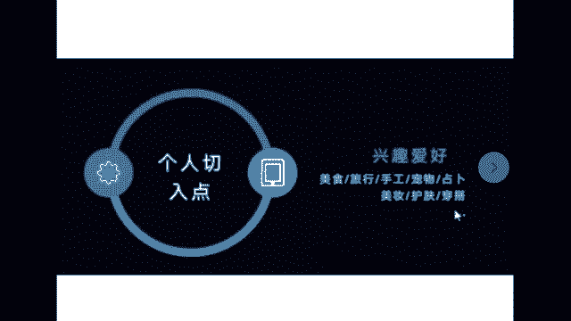

# 《抖音全套运营教程》2024年做抖音怎么快速起号？分享抖音起号运营思路：找账号-定形式-抄选题-测爆款-复制爆款！ - P13：11、视频类型1-2 - 毛有大大钱 - BV1NA4m1w7Zs

那我们接着往后看啊，文案我给你解决了，我给你解决下一个环节内容，很多同学有可能你也听过其他老师的课，其他老师会说哎同学们我教你怎么涨粉诶，同学们我教你怎么变现，但是小月老师我跟你说，直白的涨粉到变现。

它不是一条直线的，中间还有一环，这一环就是说你得嗯我给你打出来，你得立你的这个小人设，这个人设是干啥，是为了让咱装逼吗，不是的，这个人设是为了，比如说这里有十个人，他都是做装修的，哎就我们小王同学。

他有人设，比如说立了一个特别爱搞笑啊那种人设啊，别人就能够把其他九个给pass掉，立马把我们班做装修的小王同学给记住，那么后期我们的涨粉对吧，让别人喜欢你，喜欢上你，他不就成你粉丝了吗。

这就是我们的人设，来我讲这个知识点啊，边听边记，人设有两种，首先第一种叫强人设，那么与之相对应的就叫弱人设，我现在是带你们来区分这两种人设之后，你只要看到这个视频，你就能够给他分出来了。

首先第一种强人设是什么意思呢，强人设就是这种以你个人为切入点，和你自己有关系的，和别人有关系的，和你无关啊，必须是和你自己你自己的一个个人切入点，比如说你是分享行业经验，咱们班做装修的呀，做办公的呀。

做房产，汽车领域的，自己开饭店的，做婚介的，法律咨询的，电商的等等等等啊，这个不全面等等等等，以你自己为个人切入点。

或者是以你的兴趣爱好为切入点，比如说做美食的同学，做旅行的，手工的啊，有宠物的，星座占卜的，做美妆的，做美容护肤的，做服装穿搭的，做游戏的，做摄影的等等等等。

以你个人为切入点，你去分享你的这些生活，分享你的工作，分享你的爱好啊，并且呢大部分强人设都是真人出镜，因为和你自己有关系吗，这种是强人设，那么有一种弱人设就是和你自己没多大关系，就是为了把账号做好。

我举个例子，啥是弱人设，比如说你看到的呃，咱们班有做文案的同学，你做文案就是比如说全都是一些情感语录，配上音乐啊，也没有真人出镜，可能也没有什么配音，这种一定是弱人设，因为和自己没啥关系。

就是为了把账号做好，比如说你看影视解说对吧，的确放了电影也放了，有人给你解说电影，有人的声音，但是也是弱人设，因为和他这个人没啥关系，他露出声音也是为了解说电影来能够区分出强，弱人设的同学。

公屏上给老师，我扣个666，我看一下，咱先把这个区分清楚才能接着往后讲，你这都区分不清楚了，那你后头很很难去辨别自己做啥啊，好那接着我往后讲了啊，内容环节只要和你人和你自己有关系的，全都能拿来做视频。

我先一个一个讲，我们先来讲，第一个不要着急，会讲到你的啊，讲故事讲故事呢你可以分享一些客户故事，从业故事，人生经历，既然是故事，没有要求是真的，你从文案平台找一些比较有意思的故事，都可以分享出来。

那么讲故事用什么讲，用嘴巴讲，那他被称之为口播，像刚才咱们班同学有做口播的，口播分类有很多呀，比如说养生口播，比如说情感口播啊，比如说育儿口播，比如说什么房产，汽车领域的那种知识类口播。

或者金融的那种财经类的知识类的口播啊，等等啊，比如说装修知识的口播对吧，咱们班很多同学对吧等等等等等等，这些口播类型，讲故事的口播，是为了让别人觉得诶听起来很有意思，教知识的口播，什么育儿啊，金融啊。

什么养生啊，装修啊，房产汽车这种口播是为了让别人听完之后啊，一个视频几十秒他能有一个收获感，他觉得学到东西了，那么你这个视频就是个好作品，来想做口播类型的同学，公屏上扣个一，我看一下有多少。

不管你做哪个领域的口播，就像你们这种嗯法律知识，保险啊，金融啊，可以科普装修知识，汽车知识啊，买房的知识啊，这种全都能做口播，说实话，而且口播好拍，你手机立，那你就能拍，你只需要找好文案。

你去文案平台找好文案就行了，那么口播口才不好，能做口播吗，可以做口播，口播是你提前准备好的稿子，你准备好稿子，你再拿手机摄像头录，他不是让你临场发挥的啊，这都是提前准备好的。

你不要以为那些做口播的人口才有多好，那都是提前准备好的词，那么普通话不好能做口播吗，可以因为如果说你自己有实体店，或者你想引同城流量的方言的，效果会比普通话更好，因为方言嘛老乡听起来亲切。

或者是有的方言说起来有意思，听起来好玩儿，那比普通话强啊，而且你本身用了方言，你还可以配字幕，你不用担心，别人听不懂，他听不懂，他能看啊对吧，这就是老师我跟你说的口播啊，后期可以做起来做起来。

我到时候会教你们怎么去拍摄。