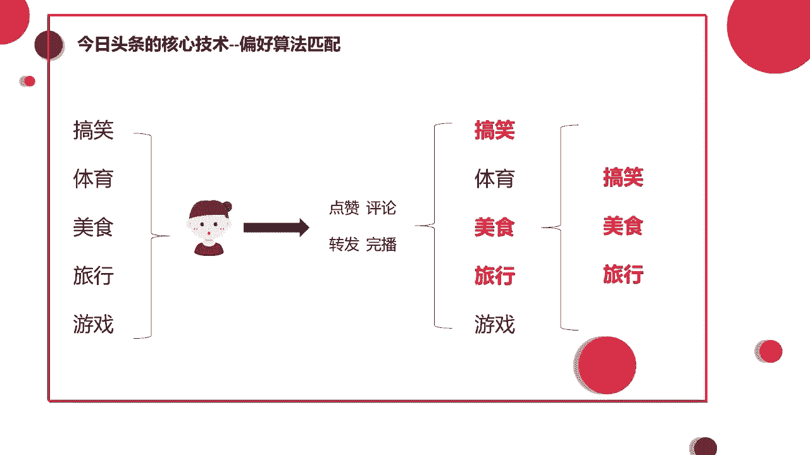
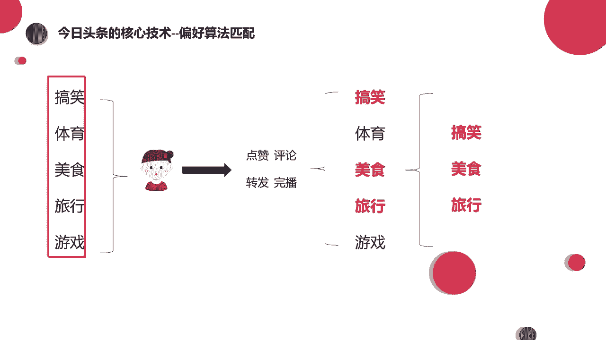
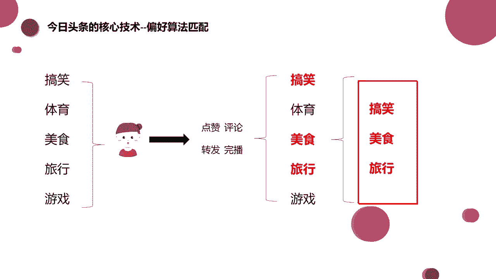
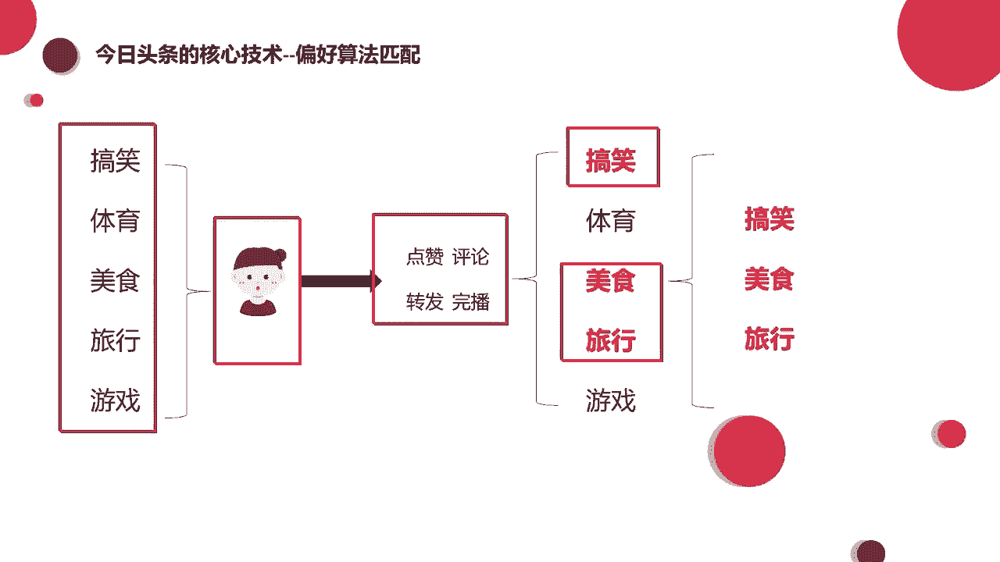

# 《抖音全套运营教程》强推！零基础保姆级自学抖音运营教程（方法+实操），抖音变现必学全套运营逻分享抖音起号运营思路：找账号-定形式-抄选题-测爆款-复制爆款！ - P16：偏好算法匹配 - 梁三伯揍英台 - BV1Y7sHeMEdP

我们今天来讲一下，就是呃抖音它的一个推荐机制，一个算法的机制，也就是同学们经常会问的老师，为什么我的作品发出去之后，他的流量不高，为什么我没有流量，别人都有，是哪里出现了问题啊。

今天呢我们就着重来讲一下这部分的内容好吧，那么我们现在呢在这个PPT上能够看到的，叫做今日头条的核心技术偏好。

算法匹配能看到吧，这一这里有个示意图。

那么这是什么意思呢，大家再想一下啊，咳你刚刚去注册抖音的时候啊，在刚开始是一个新号，什么都没有的情况下，也就是说你的行为轨迹都没有被标注的情况下，是不是平台会根据我们的注册信息啊，给我们发不同的内容。

让我们去看是吧。

那这些内容呢可能包括这些有搞笑的。

有体育赛事，可能有美食教程，可能还有一些户外旅行，以及还有一些游戏的录制视频，对不对，那这些都可能会存在，出现在我们刷到的视频列表里面，但是这些内容呢有一部分是我们喜欢的，有一部分呢是我们不感兴趣的。

对不对，那打个比方啊，我们刚注册的时候，这几类他都给你推荐过来了，那么我们呢就会从用户的角度，做出几种不同的行为，比如说啊我就是喜欢特别沙雕的视频，喜欢特别搞笑的视频。

那么呢我就会给搞笑的视频进行一个点赞评论，甚至是把它分享给我的朋友去看，对不对，那么除了搞笑的之外，我可能对于美食制作，对于户外旅行啊，比较美好的事情也很感兴趣啊，那我也可能给他点赞评论转发，对不对啊。

这些都是有可能的，那么但是说啊因为我是个什么呀，我是个女生，对不对，那我可能对于这个体育赛事，对于这个游戏录播，我就不是特别的感兴趣，对吧，你可能推给我一个体育赛事，什么足球比赛，篮球比赛。

你推给我一个王者荣耀的录屏，我可能不感兴趣，就直接划过去了，对不对，甚至呢给他啊长按点了一个不感兴趣，这都是有可能的好，那么我们在这些内容看过之后啊。

那么我们可能做了下面的这几种行为，点赞评论转发，然后看看完了，甚至看完了之后呢，啊乐呵呵的又多看了几遍，看了好几遍。

对不对，那么最终在这些内容里面呢，哎我们选择好了自己喜欢的这些内容对吧。

像体育游戏呢就被就被我们不感兴趣，就给他划过去了，我就快速划走了对吧，那我们刚才做的这所有的行为，无论是点赞评论，你是转发还是说快速划走，以及说长按点了一个不感兴趣。

这所有的行为呢咱们都会被抖音的后台抓取到，大家知道吧，那么抓取完了之后呢，他就知道了哦，原来卷心菜老师你喜欢的是这样的内容对吧，那么他以后呢就会多给我推这些内容。

哎这就是他以后会给我推荐的一个类型。

这个呢就是关于抖音的一个偏好，算法的匹配推荐。

大家能懂吧，那从最开始他不了解你给你啊。

就是推送了这么多内容，那么在经过你看过之后啊，对于喜欢的内容进行了点赞评论。

对于不喜欢的快速划走了，那么最终呢哎我们留下了搞笑的美食旅行的啊。

把体育游戏的给它划走诶。

最后呢这个抖音说我知道了，你喜欢这个，我以后就多给你推荐这个呗。

对不对，你喜欢啥，我给你啥，你不喜欢我，就让他永远不要出现在你的视线里了。

是不是啊，那这个就是他的一个偏好算法，所以说会有一个现象出现啊，就是我们会出现刷抖音停不下来的现象，是不是啊，我们经常说我想要刷5分钟再睡觉，我就看5分钟，看着看着可能就睡着了。

但是哈往往出现的情况就是，我刷着刷着一个小时过去了，两个小时过去了，对不对，所以抖音的平均停留时间啊，之前出现过这么一个数据，平均每个人在抖音有90分钟的停留时间啊，91分钟吧。

具体的数据是也就相当于一个半小时左右，对不对啊，5分钟变成一个半小时，因为抖音这样的一个偏好机制，所以说他推荐的流量是更精准的，你喜欢搞笑他就给你推搞笑，你喜欢美食他就给你推美食啊。

永远都陷在自己喜欢的那个领域里，出不来是不是好，那么这个大家都明白了之后，那么就有问题了，有同学问哈，有人说这种算法它是永恒不变的吗，我选择了这几类，它就永远都会给我推这几类吗，啊当然不是哈。

比如说打个比方，有一个小姐姐，可能她啊刚刚失恋，失恋了之后就心情很郁闷，就去刷抖音，那抖音上可能就会出现那种很伤感的文案啊，什么失去的人你就不要再抓住了，什么手里的沙越握啊，越握就是什么啊，消失的越快。

是不是类似于这样的话，那他看了之后就特别有感触，仿佛每一条都在说他，然后他就看一条点赞一条，看一条收藏一条，对不对，所以呢在这个施令的时间段里呢，他可能会收到特别多的啊疼痛文学。

什么伤感文学这样的一些文案啊，那再再过了一个星期啊，再过一个星期有点短，可能再过了一个月，那小姐姐呢又遇到了一个比较帅气的小哥哥，那么这个小哥哥呢就给她的生活带来了光亮啊，她的青春又回来了，她又美好了。

那么跟这个小哥哥可能又谈恋爱之后呢，他会关注一些情侣的视频，他可能还会关注一些什么宠物的，对不对啊，因为心情愉快了嘛，看什么都想点个赞啊，是不是那些伤感的话呢，就远离他了，伤感的视频他就刷不到了。

所以在这个过程中啊，其实你喜欢的视频或者你点赞视频，还有抖音给你推的视频，它是根据你的心情哎，根据你这段时间的喜好去进行一个更改的，当然说如果你非常的就是说，我不带任何感情色彩，我就是要养号。

我就是单纯运营这个号，我不带感情色彩的时候去刷抖音，可能就会出现你刷这几类永远都是这几类，因为我看见搞笑的，我就点赞，看见美食的我就点赞，我看见游戏的时候，我永远都不给他点赞，无论我喜不喜欢玩游戏。

我都不给他点，那当然这几类呢你就永远都只能看到这几类了。

它就不会有其他的类型再出现了。

好吧，就简单的跟你们说一下啊，那么我们刚才说抖音它日活4亿，每个人平均的停留时间大概是91分钟，那么这么多流量给到我们，因为这么多流量一定会有很大批的流量，看到我们的作品，对不对。

其实我们知道有很多平台都有所谓的那种大V，还有网红，头部流量非常的大，像微博，他比较早的时候，因为微博很早很早他就出现了，那个时候还没有快手，也没有抖音，所以说啊最早的一批大网红，他都是集中在微博里的。

当时大网红的流量是非常大的，因为流量是平台可以控制的，媒体可以控制流量对吧，买流量啦是不是像热搜啦什么的对吧啊，但是抖音它是不太一样的，不太一样的，大家其实可以想一下，我们经常遇到的那种情况啊。

或者说经常看别人的抖音号啊，比如说这个人他发了十条作品还可以，十条作品也不算少了啊，但是呢他的粉丝不多，这十条作品里面数据好的作品也不太多，但是其中可能有一条视频就爆了。

可能其中有一条它就有个啊几10万的播放，几万的点赞，比其他视频的数据要好很多，对不对，这种情况其实就代表说，无论你这个账号多少的粉丝，我们就是拿作品来说话的，是不是，其实抖音算是比较公平的一个平台啦。

比起其他的那些所谓的有流量控制的平台。

