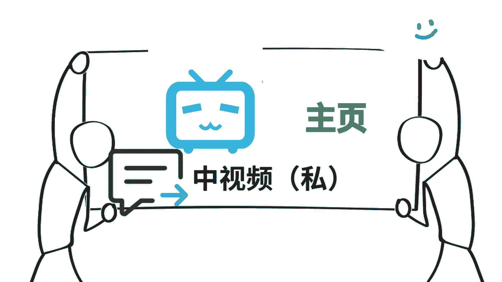

# 《抖音全套运营教程》强推！零基础保姆级自学抖音运营教程（方法+实操），抖音变现必学全套运营逻分享抖音起号运营思路：找账号-定形式-抄选题-测爆款-复制爆款！ - P1：抖音中视频 - 仙女味儿的小可爱 - BV13VW3eTE6d

这是现在唯一能够快速加入中视频计划的方法，能够让你快速达到1。7万的播放，快速开通中视频计划，为什么我说唯一呢，就是现在你可能看到市面上有很多人告诉你，各种各样的方法去通过中视频计划。

但是啊这里边呢大部分都是坑，你真的去用了，你会发现按照他说的做呢，要不然呢就是通过不了，要不然就是通过之后呢，平台找你秋后算账，所以很多人他不知道，又想着快速达到1。7万的播放，快速加入。

所以呢就会去踩坑，今天啊我给大家带来了唯一的这个方法，为什么说它唯一呢，就是因为啊它是通过官方的渠道去实现的，那么下面啊废话不多说，咱们直接上干货，建议点赞收藏一下。

首先呢我们打开我们的西瓜客户端，然后呢在右下角我的这里边呢找到创作训练营，我们点进去，那么进去之后啊，你会看到有一个去学习的入口，就在最下边，当然啊我这边已经学习过了，显示的呢是已结束。

那么作为一个新号新手，你还没有通过中视频计划，你这个地方呢一定是去学习，然后呢点击去学习，在这个页面呢可以学习官方的这些课程，学完了之后呢，提交作业一般啊，只要你踏实去做这个作业都能够合格。

那么这个时候呢你就拿到了1万的流量包，注意啊，这1万的流量包可以直接用于作品的投放，那么接下来第二个呢就是头条，注意咱们换了客户端了，这会儿呢要进入头条里边，然后呢也是点右下角，我的里边呢有个创作中心。

点到这个创作中心里边之后呢，你会看到有一个新作者成长攻略这样的海报，我们点一下这个海报，那么进去之后啊，你会看到有各种新手涨粉的任务，那么这些任务加起来啊，就有6000左右的流量包，那么这个流量包啊。

也可以直接用于我们作品的投放，这样的话这两个端口，你完成这两个任务加起来就有1。6万的播放，最后还剩下1000的播放器，随便发几张作品就能达到了，你们还会觉得加入中视频计划，审核那1。

7万的播放有多难吗，知道了这些，你是不是觉得它非常简单呢，好了其实关于操作中视频啊，现在真的不是说随随便便去操作，就能够达到一个不错效益的时候了，现在必须啊专业的事情用专业的方法来做。

你必须要有一个系统的思维，系统的方法去操作中视频，才能够在这个赛道闯出自己的一片天，如果你对中视频计划比较感兴趣的话，可以啊，中视频我为大家准备好了，关于操作中视频各种各样的问题。

比如说中视频计划它到底是怎么样一个逻辑，那么新号和老号去操作中视频的时候，应该注意什么，它有哪些坑，他应该怎么做选题等等啊，这些呢都有涉及，如果大家还有关于中视频其他的问题啊，也可以评论区留言。

咱们一起探讨，很多人说做中视频不挣钱，我建议啊大家看看，这个号坚持发了900多条视频，涨了40多万粉丝，他的每条视频的中视频收益呢，至少是在50以上，大家可以算一算他挣了多少。

他做的呢就是这种小动画的视频，今天呢我给大家详细来拆解做中视频计划，怎么样通过做这种小动画的视频来参与活动，拿到钱，这个玩法呢它非常适合新手，为什么呢，因为它的制作门槛是非常低的，你不需要去找素材啊。

也不用写文案，更不用你真人出镜，而且啊他的原创度还非常的高，按照我接下来分享的方法呢去制作的话，基本上啊，两三条视频就能直接达到1万7的播放了，那么加入中视频计划之后呢，你每发的一条视频只要有播放量。

它就有效益，而且呢这种视频只要你加入了中视频伙伴计划，那么你后边发的视频呢，基本上每条都能有50以上的效益，而且呢因为中视频计划它这个机制啊，你发的作品呢越多，你会发现呢它的效益会不断的叠加。

所以呢你看这个号他发了994条作品了，涨了不少粉的同时啊，也搞到了不少，那么下面废话不多说，直接上干货，实打实的教给大家到底怎么样，像他一样去制作这种小动画的视频，你看一遍啊，不见得能看懂。

所以啊建议点赞收藏，别用的时候啊，找不到了，那么首先啊我们打开剪映的app，注意啊，我们所有的操作都是在剪映里边就可以完成，全程呢我们只需要用到剪映的贴纸和关键帧，这两个功能，打开剪映之后呢。

我们首先呢在素材库里边，选择一个纯白色的背景，然后呢进入到编辑的页面，点击贴纸这个工具，然后呢点添加贴纸，那么添加的时候呢，它会顶部呢出现一个搜索框，比如说我们在搜索框里面输入蓝天哎。

选择一个自己比较喜欢的蓝天的背景贴纸，加进去之后呢，我们给它缩放缩到最大，然后呢把整个画面给它填充上，然后我们继续重复上一步的添加贴纸的操作，我们接着呢去搜索其他的素材，比如说森林。

选择我们喜欢的一个森林的贴纸，然后呢给它缩放放到合适的位置，那这个贴纸啊它是可以无限添加的，比如说我们还可以添加树木，太阳彩虹等等这样的一些贴纸诶，我们就得到了这样的一个背景素材。

那么接下来呢还是添加贴纸，这一步呢我们就不是添加静态的贴纸了，而是添加动态的贴纸，在栏目里面呢输入小兔子诶，这些小兔子啊基本上都是会动的，有在走路的啊，有在跳的，我们根据呢找到的这种动画的文案故事。

去选择合适的小兔子的素材，然后呢把它拖到合适的位置，这种贴纸啊它是自带动画效果的，比如说我添加的这个小兔子的贴纸，它就是扛着萝卜在走路的这样一个动态的效果，那么我们呢还想让它在画面里边进行移动。

怎么办呢，这时候就需要添加关键帧了，我们在开始呢添加一个关键帧，把小兔子啊从右边给它移动到左边，那么在左边这个位置呢再添加一个关键帧，那么播放的时候呢，小兔子就会实现从右到左走路，这样的一个动作了。

那么用同样的方法呢，我们还可以添加其他的动物形象，比如说狮子老虎大灰狼狗狐狸等等，这些动物形象都可以在贴纸里边搜出来，而且呢大部分都是动态的，我们只需要给它添加关键帧，它就能够移动起来。

这个啊需要根据我们找到的文案的故事素材，给他选择使用，最后啊我们再给视频添加一些特效，还有呢匹配一个跟画面高度相关的BGM，也就是背景音乐，这样的话呢一个小动画的视频啊就完成了，两只老虎爱跳舞，哎。

小兔子乖乖拔萝卜，我和小鸭子学着走路，童年是最美的礼物，怎么样，是不是比较简单呢，那么可能啊，还有很多人呢不是很清楚，中视频到底是怎么参与中视频计划拿到收益的，所以呢我这边有针对中视频它的项目原理啊。

以及起号的时候应该注意什么，怎么样才能把中视频玩好，这几个方面呢，做了一个视频的攻略。

一共有三节，你可以压告我的公，中视频就能拿到了，好了，关于中视频的这个小动画的玩法，就给大家分享到这了，我们下期再见吧，点赞你要投币好不好，点赞呢。

