# 《抖音全套运营教程》强推！零基础保姆级自学抖音运营教程（方法+实操），抖音变现必学全套运营逻分享抖音起号运营思路：找账号-定形式-抄选题-测爆款-复制爆款！ - P21：17、日常生活类视频拍摄方法-8 - 漫步花再乡 - BV1fupueMETo

那么接着我们往后看日常生活类型的看看，那还是拿海蛟举例子吧，咱看看海蛟他是怎么拍的，还得带孩子，自己一个人能拍出来，不需要别人帮他，不，大家都问我一个人带娃怎么拍抖音的，大家好奇问上楼梯是怎么拍摄的。

先把手机角度摆好，按录制功能，然后找上来，把不需要的部分剪辑就可以了，落叶随风，将要去何，只留给天空美丽一场，曾飞舞的身影，像天使的翅膀，划过我幸福的过往，爱曾经来到过的地方，依稀留着拍摄不易。

如果大家喜欢我，关注我吧，给个爱心支持一下，感谢大家观看抖音来，我们看海椒，不需要别人帮他吧，你自己去买一个手机支架就可以了。

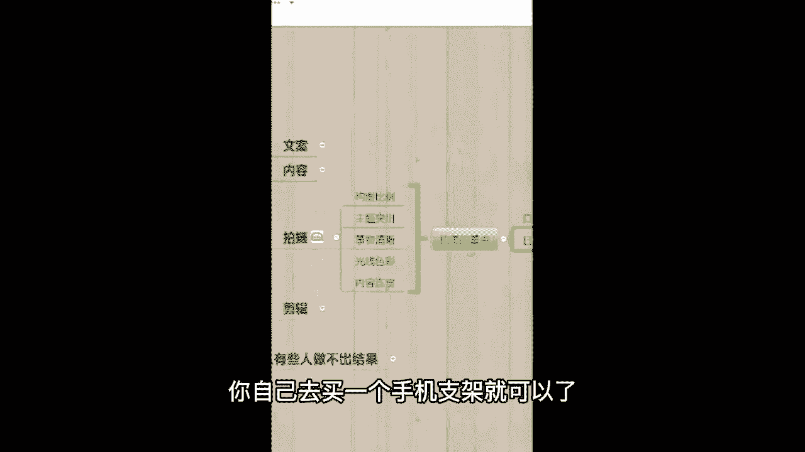

这个手机支架我推荐你买，不要买那种放那儿也不能动的，买一个可以调节高度，可以调节角度的，这样你买一个这个你后期不管怎么掰角度，怎么调角度都没有关系啊，来这就是这两种拍摄方法呃，跟你们讲了这么久了。

还没有了解一下咱们班同学的情况，就是嗯你听完这么久的课，你觉得拍视频老师我也可以，我也能行没有，我想的那么复杂的，你在公屏上给老师，我扣个一，我看一下，然后你如果觉得自己没有太多自信，觉得拍视频嫌难。

嫌麻烦的，给我扣个二，我看一下啊，你们的具体情况是怎么样的，我也得初步的了解一下咱们班同学嘛，哎嘿很多同学都觉得不错，是吧啊，那没白讲，你说这个时代你自己不相信你自己，他就没有别人能相信咱了。

那包括有的同学上班的工作比较忙，会嫌难，会嫌难，嫌麻烦，老师我一会儿给这个上班族的同学，我讲这个变现环节，再给你们推荐一些更简单的啊，那么接下来嗯既然你们都很有自信，那么我们就去看一下他们的一个收入吧。

好不好，从哪儿看呢，从抖音官方平台抖查查来看，我还是一样的，会直接打在公屏上面斗查查，这个是需要会员才能看的，你看老师，我这边开了会员呃，我不是卖软件的啊，你需要就自己去开就行了。

这个官方平台自己花钱开，我给你们看一下啊，海椒122。2万的一个粉丝总数，来我们一起看一下他的一个收入吧，首先我们来看的是这个电商分析。

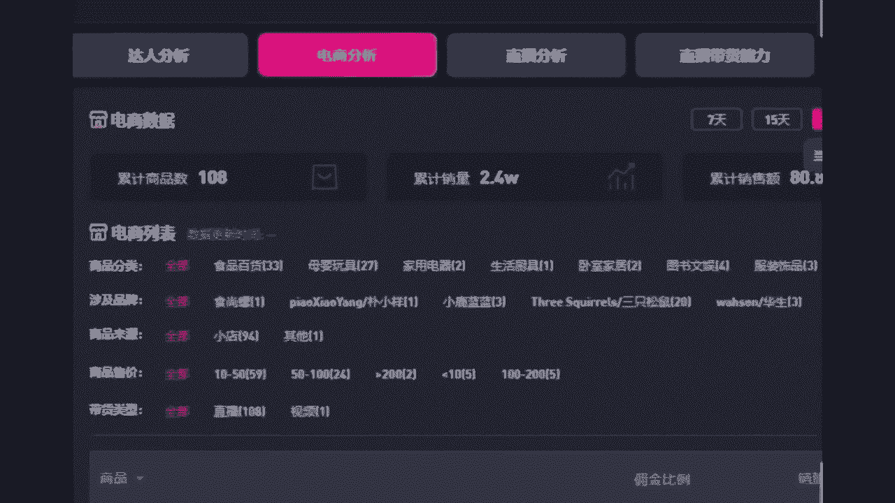

这个电商分析也就是海椒的小黄车，他卖的都是一些美食什么的，因为你想他是一个美食生活类型的，卖的肯定是美食，你比如说你自己是做服装的，那么你总不可能给人家卖锅碗瓢盆吧对吧，你是做什么的，你就去卖什么领域。

你别乱卖啊，这个货源我一会儿这节课就会教你怎么去对接。

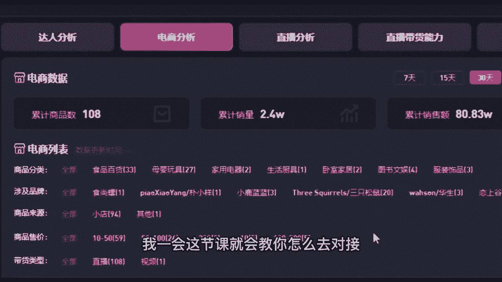

那我们看一下它的一个收入累，这一个月累计销售额是80。83万，那么不是纯收入啊，纯收入占到25%，乘以一个0。25，他这一个月的收入是多少。

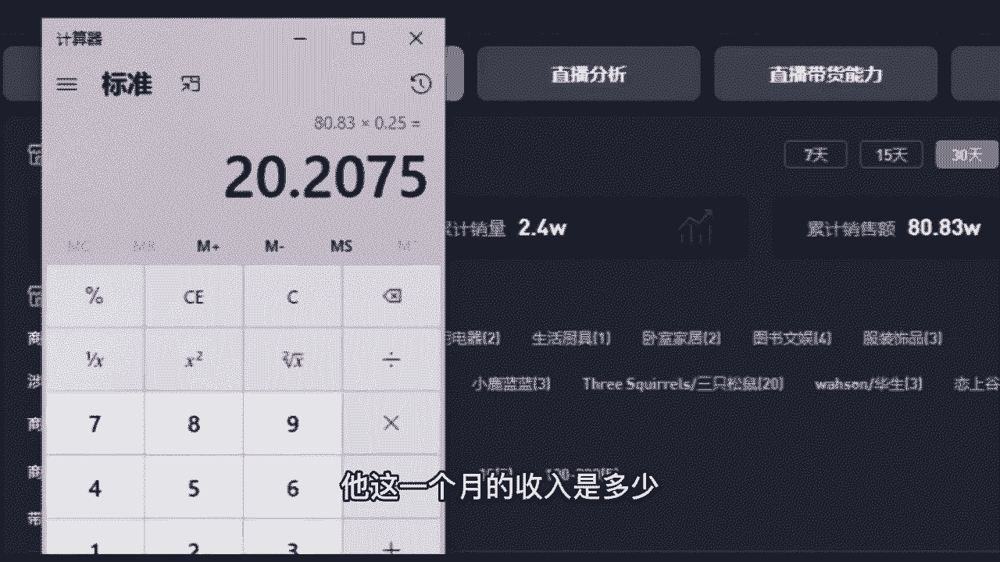

20万，20多万，直接算20吧，20万来，接着我们再看他的一个直播。

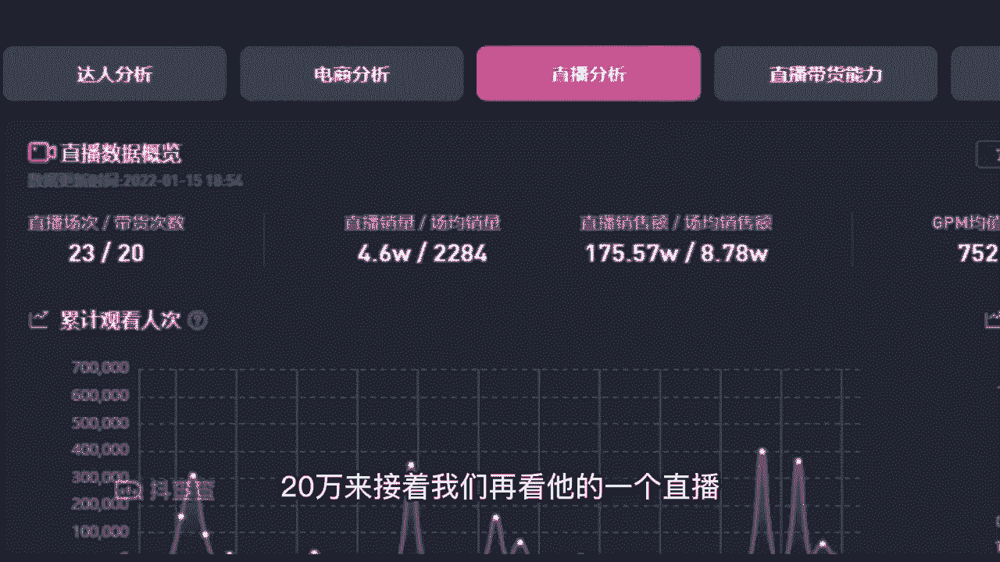

你看海椒这个普通话还是做直播的哈，来看啊，175。57万啊，直播收入高一些，占到30%，因为他会有这个佣金在里面呃，52万加上刚才的那个20万，海椒的收益是72万，是不是有。

有没有就是超过你们的一个就是认知和想象啊。

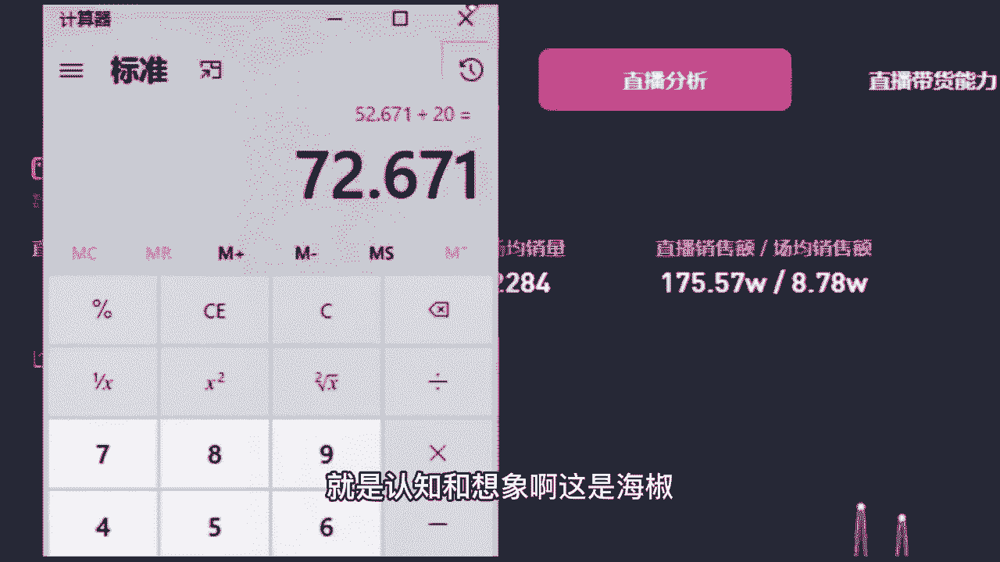

这是海椒，那接着我们来看另外一个口播类的同学，给你瞅一眼。

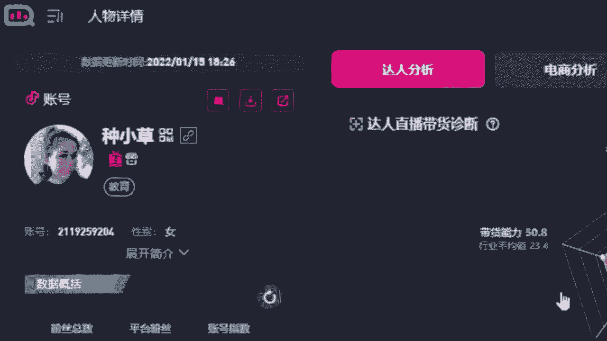

种小草，一条视频就20多秒的那个情感语录，种小草的粉丝216。1万，来看他的一个电商分析，种小草卖什么呀。

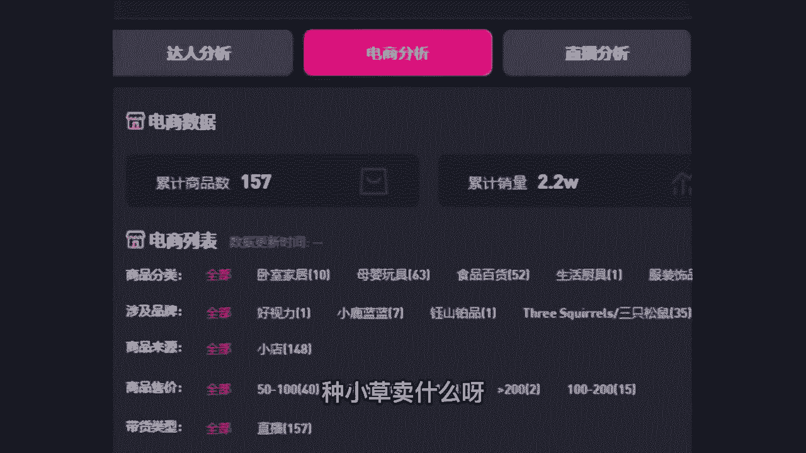

卖平常自己穿的，自己用的，这因为她自己本身是个宝妈嘛，粉丝喜欢的话，就卖一些日用品什么的，他吸引的群体一会带你们看看，来累计销售额115。2，3万×1个0。25，他的收益是多少，28万。

哎这8000咱们就不要了，28万啊。

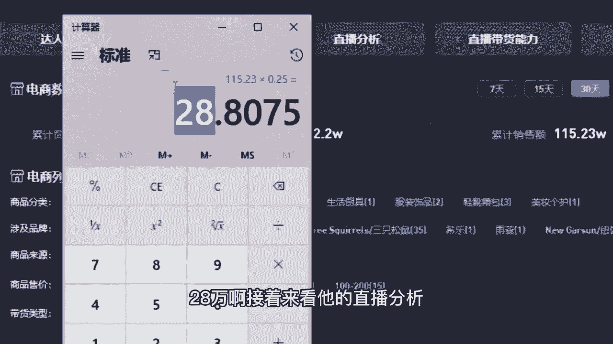

接着来看他的直播分析，他近一个月的直播销售额是319万。

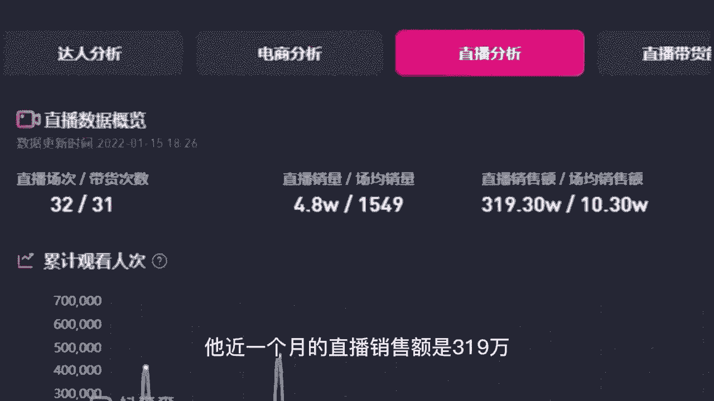

有同学说老师为什么种小草的这个收入高啊，因为他粉丝多啊，319。3万×1个0。3，收益是95万，加加上刚才的28万，他一个月的收入是123万嗯，这个还没有加上，就是粉丝给他刷礼物呀，包括粉丝给他打赏呀。

他接广告。

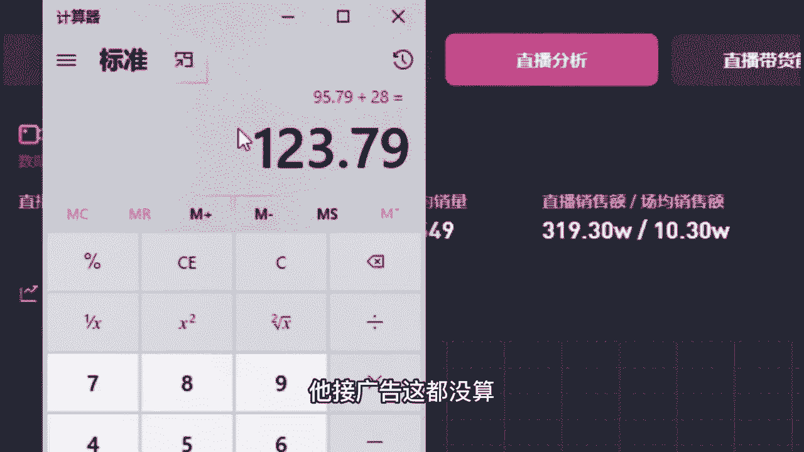

这都没算，我只是算我能够看到的这些告诉大家啊，那你看完之后觉得自己有动力了，可以给老师，我扣个666，我看一下，说句实在话啊，如果你觉得一两百万离你太遥远的话，我们可以做什么呢。

你可以给自己目标定小一点嘛，你比如说老师，我想一个月赚1万块钱，1万块钱需要几万粉丝啊，你给自己定个呃，3万多，4万多个粉丝好，你说老师我想一个月赚2万块钱，2万块钱你就给自己定个56万的粉丝目标啊。

老师我想一个月赚34万34万，你就定个10万粉丝的目标对吧，你不用上来就定100万不现实，你上来就定个3万5万，10万当成目标，这就非常好了啊，1。1点来嘛，这都是来我们看一下种小草。

你看种小草的一个粉丝画像，你看咱们分析的对不对，粉丝的性别分布80。35%，他吸引的是谁，她吸引的是女性群体，她的目标不是男性用户，接着来看粉丝年龄段，30岁到40岁，这个区间就和他年龄差不多的。

他也40岁嘛，30~40这个年龄区间又占到80%，所以他吸引的是谁啊，大部分都是这种已经结了婚的已婚女性，而且很大程度都是宝妈，我告诉你们，现在抖音上面哪个群体消费能力最强呢，就是宝妈群体。

因为宝妈她除了给自己买东西，又要给孩子买，又要给老公买，又要给家里买日用品，所以宝妈的消费购物能力是最强的，那包括斗查查这边还能看什么粉丝星座，男女比例呀，或者是粉丝的地域分布好，那我接着再问。

能够接受开直播的同学给我公屏上扣个一，不管是直播带货还是直播和别人聊天，你能够接受开直播的直接扣一。

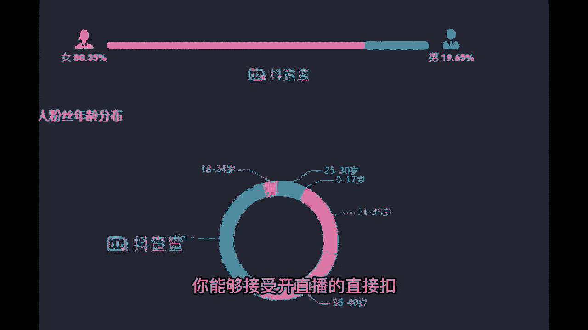

我看一下咳，我这边给你看一下，我之前有一节直播带货的录播课，你看咱们班很多同学也接受开直播，你看海椒那个普通话他都能开直播，你为什么不能呢，对吧，来我告诉你们一个关于开直播的小秘密啊。

咳我先把我的录播打开。

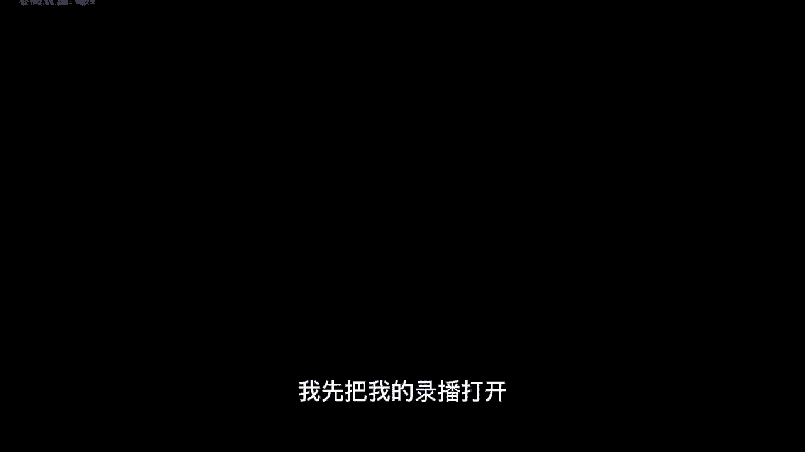

嗯就是直播吧，就是每一场直播他都是有剧本的。

像咱们班同学，你没有剧本，你肯定觉得难，我换句话给你讲啊，比如说你嗯你过两天要开直播，然后直播的每句话包括开场怎么打招呼，中间说了点什么，结尾怎么呃跟人家打招呼，怎么跟人家互动啊什么的，这些都有剧本。

你把这个剧本练熟了，然后一句一句话，你就边看着那个剧本边播，把剧本立在手机后面，你有了剧本，你觉得自己能够播下来，你觉得哎我也可以的，给我扣个666，我看一下，就你但凡现在看到的那些正儿八经的主播。

全都是有剧本的，你说你要是咱们没有剧本，你直接上来让咱播，咱播啥呀，也没有话术，也不知道该说什么，那绝对是有剧本的，这个剧本就是你先确定你吸引的是谁，然后几点钟播播几个小时，然后怎么样洽谈合作商，选品。

选择好商品，你得准备好台词，介绍你的商品嘛，如果你不是带货，你只是单纯的说直播聊天，刷礼物的那种变现的话，那你就得看一下怎么和别人呃，开玩笑啊，讲一些段子啊，和别人互动呀，怎么样留住他们呀。

都是有剧本的，你后期没有剧本的话，没有关系，老师我本身就是做抖音运营的，我可以提供剧本给你啊，关键在于只要你想做老师，这里就有解决的方法，你看还是那句话，你看海椒都能把直播播起来，一个月赚那么多钱。

你也可以啊，这是我们拍摄，咱就先讲到这儿，你就先记住那个小秘密就行了，我们接着往后讲。