# 《抖音全套运营教程》强推！零基础保姆级自学抖音运营教程（方法+实操），抖音变现必学全套运营逻分享抖音起号运营思路：找账号-定形式-抄选题-测爆款-复制爆款！ - P2：素材网站 - 梁三伯揍英台 - BV1Y7sHeMEdP

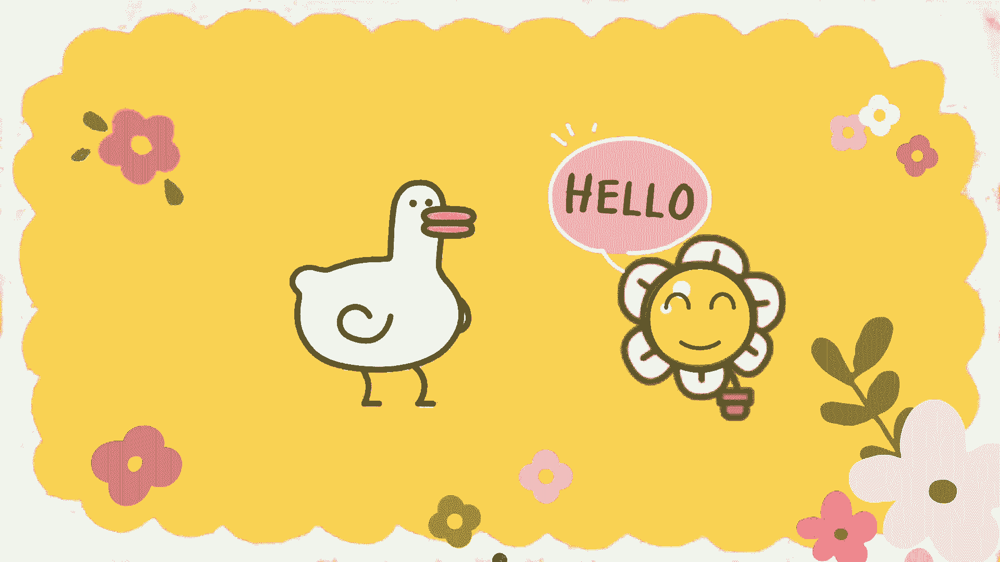

如果你吃得了苦，也熬得了夜。

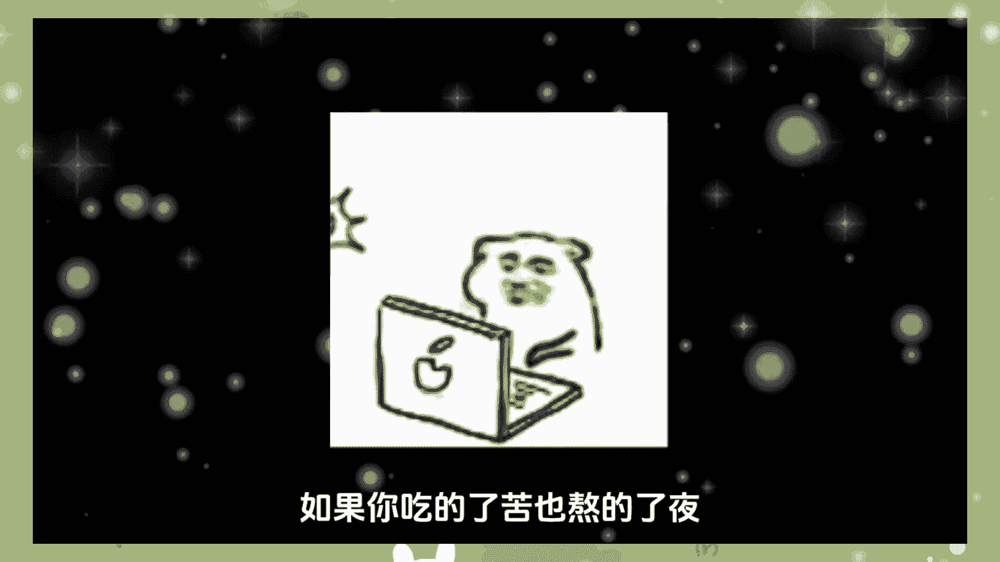

那么你一定要跟我一块做复制粘贴，这两年呢我一共坚持做了18个月。

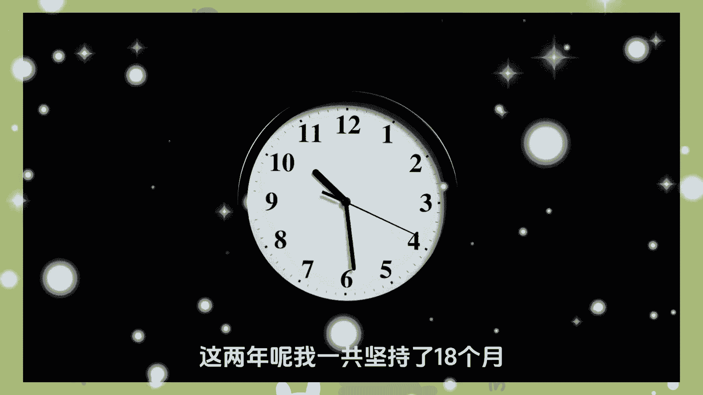

总共到手了这么多的收益，那付出的代价呢，就是我已经将近有两个多月没有出过门了。

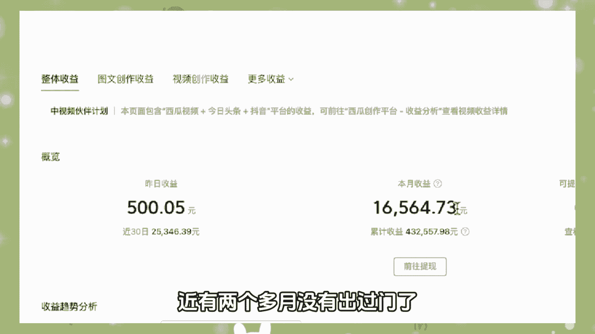

那我每天早上起床的第一件事情，就是打开国外的视频平台，去找到那些点赞，还有播放量都比较高的视频，先将他的文案给它提取下来，进行翻译，然后再将他的视频给它下载下来，再用我们手机里剪辑软件里的一键生成功能。

生成好了之后发布到国内的自媒体平台上，就像B站。

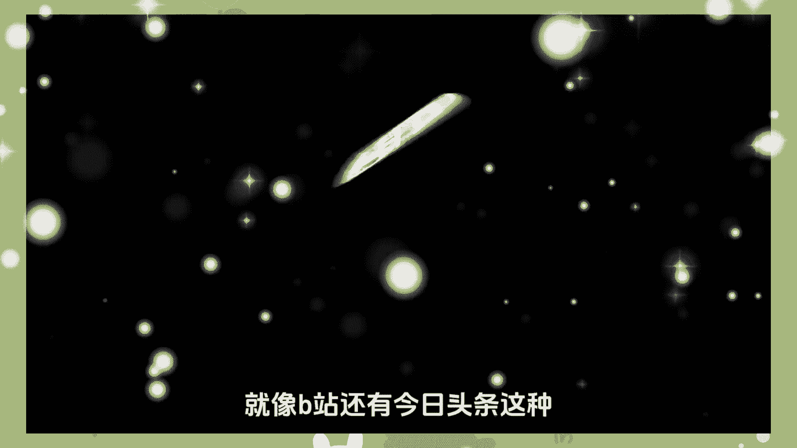

还有今日头条，这种只要视频有了播放平台，就能给你产生收益了，1万的播放量收益大概是在40块钱左右，但其实只要你有一定的播放量，是可以达到一个非常不错的收入的。

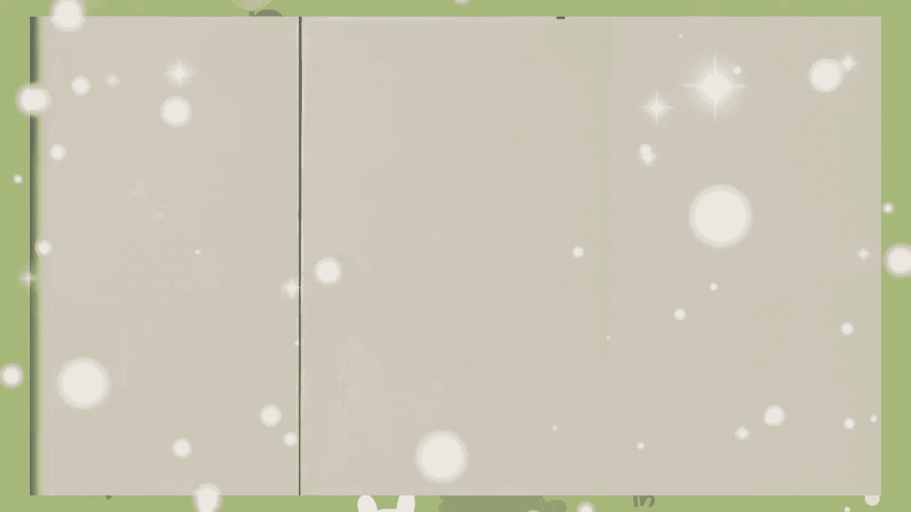

那我这个方法它是真的不难，难的是我们都需要有一颗可以坚持下来的心。

如果你感兴趣的话，可以在评论区里扣学习。

或者单独给我发消息，我可以分享给你一份免费的实操教程，那接下来我就给大家分享一下。

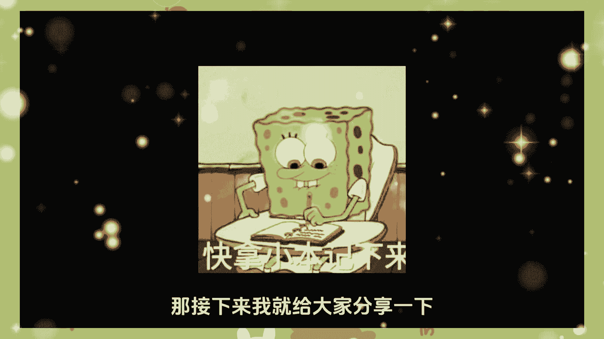

我是如何做到日更视频的，第一个文案类网站，文案狗，文案狗其实是一个导航网站，你可以在里面找到关于图片和文案的素材，网站等等，第二个topic，在这里面呢你可以看到很多有创意的文案。

同时呢还会有一些视频跟图片的拍摄创意。

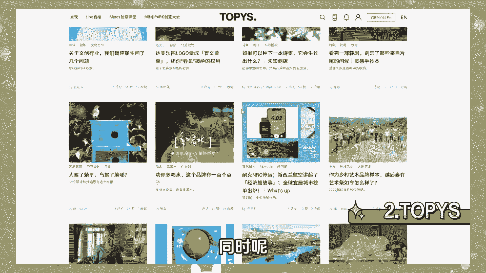

尤其是你想要写出有创意的题目和文案的时候。

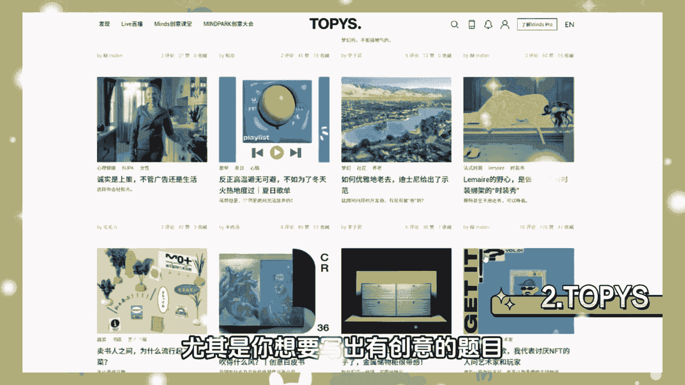

那这个网站呢就可以给你带来灵感，第三个梅花网，这里面呢汇聚了各种精彩的爱利网站，基本上在互联网上面都传播的比较好，那你看过的精彩案例上面几乎都是有的，对于每一个精彩案例呢都会有自己的一个分析。

在这里面啊，你会学到不少关于营销传播的知识，并且呢可以运用在你的作品上，如果说你的作品足够好，你的能力足够强，也是可以在上面推广自己的哦，第四个英文网，这是一个分析各类优秀案例的网站。

不过我觉得最有用的呢就是右边这个灵感日历，可以提前记录下每个日期会有什么热点事件，这样呢你就可以提前做一个准备，提前把控热点，这个呢是创作文案最重要的一点，第二个运营类网站，第一个新榜，新榜。

最有价值的呢，就是可以帮你找到一些热门的内容，知道当下哪些内容在平台的热点最高，这样呢你就可以有针对性地进行创作，达到一个蹭热点的效果，获得一个非常好的流量数据，第二个运营派。

这是一个注重学习教学运营内容，运营用户等等的一个运营网站，重点呢是教你如何去运营作品，你要知道一个好的作品呢，还得是要有好的运营，才是能发挥最大价值的，第三个素材类网站，第一个芯片厂。

如果说你想要做短视频，那就要好好看一看，这个网站里面有很多剪辑不错的视频，可以带给你一些不错的灵感，另外呢它还有很多模板都是可以用的，比如说音乐图片视频的素材也是可以下载的，第二个开眼。

这个呢是一个app里面呢有很多剪辑精细的视频，拍摄有创意的视频，如果说你想要做视频创作，就可以在里面学习到很多的拍摄手法，也是你想要的灵感的来源，第四个制作图片排版类的网站。

第一个CANVA提供各种各样的模板，可以设计封面，可以拼图，提供多种字体模板，图片模板呢，基本上也是可以满足自媒体，制作图片的一个需求，并且呢操作也是很简单的，是非常好用的一个网站。

当然了它也是有app可以进行操作的，第二个黄油相机，它里面最实用的功能呢就是字体风格比较多，可以在制作封面的时候啊，设计出很多好看的字体，也可以拿来做帖子，第三个PIXART。

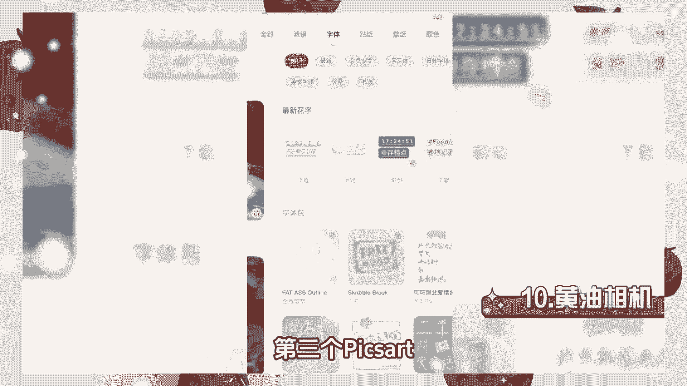

这个呢是一个能够处理图片，参数比较多的一个网站，我最喜欢用的功能啊，就是在一张图片上添加另一张图片的简易功能，操作呢也是非常方便的。

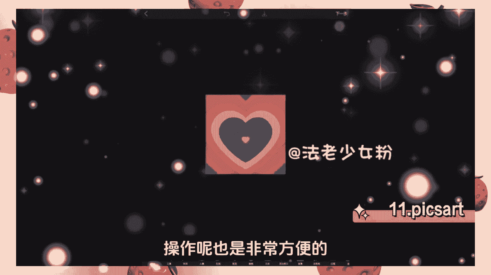

第四个美图秀秀修一些人像啊，还得是靠美图秀秀各种美图的参数设置，能够让你看到一个更好的自己，第五个VISCO，这是一个滤镜做的比较好的一款相机，可以给照片添加各种滤镜，你想要的风格啊，上面几乎都有。

第五个图库类网站，第一个pixels有各种各样的高清图片，提供免费的下载，图片的风格有风景，人物，创意类等等，几乎是你想要的风格啊，上面都能找到，第二个堆糖，他的图片呢偏向于小清新。

也会有一些搞笑有创意的表情包，图片的清晰度呢也是非常可以的。

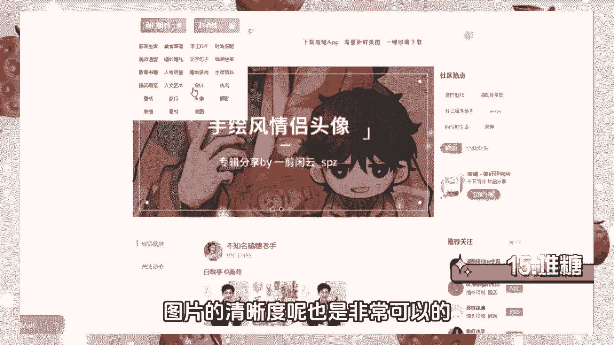

第三个stock snap，这是一个高清的图片网站，分类呢一目了然，可以根据心情，地点或者是场景来选择你想要的图片，查找图片也是非常方便的，第四个UNSPLASH，这是一个高清的图片网站。

可以在上面找到很多有意境的图片，第五个for this feed，这个是一个专注于美食的图片网站，这个网站呢可以看到各种各样拍摄，精美的美食图片，其实呢对于一个自媒体创作者来说。

有些图片的拍摄创意是可以模仿借鉴的。

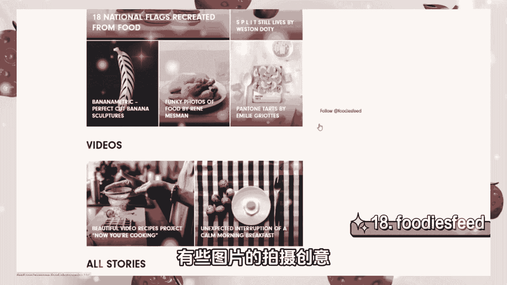

在这个网站呢，对于不少的美食博主，也是能够提供不少的拍摄灵感好了，那么以上呢就是我给大家分享的。

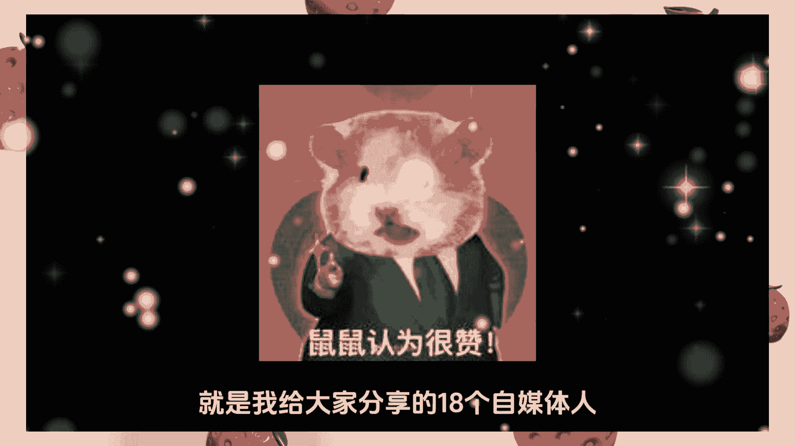

18个自媒体人都会用到的素材工具网站，如果对你来说有所帮助的话。

可以点赞收藏转发本条视频，在评论区呢扣一个学习，我也会分享一节自媒体的实操直播教程给你。

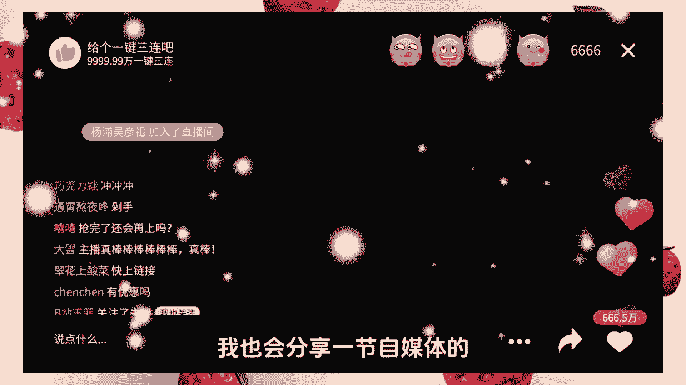

那么本期视频呢就到这里啦，我们下期再见。

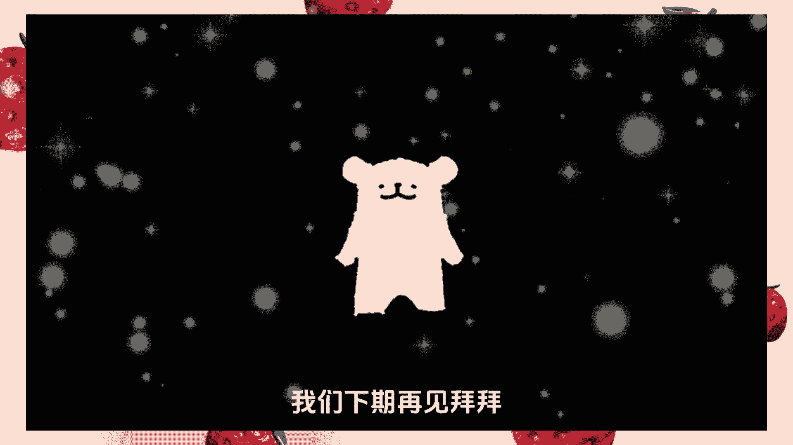

拜拜。

