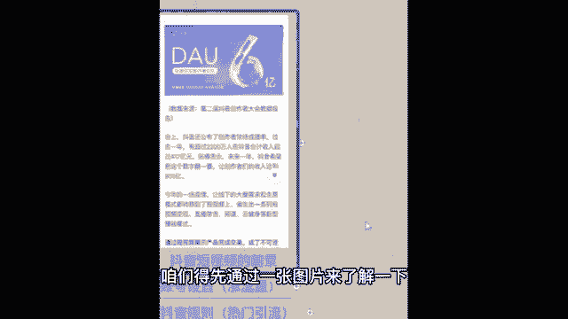
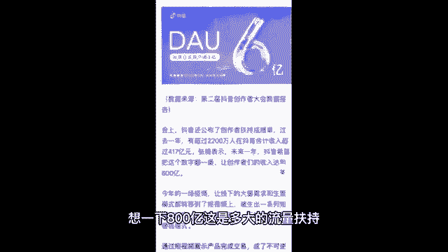

# 《抖音全套运营教程》强推！零基础保姆级自学抖音运营教程（方法+实操），抖音变现必学全套运营逻分享抖音起号运营思路：找账号-定形式-抄选题-测爆款-复制爆款！ - P5：1、抖音短视频的前景 - 漫步花再乡 - BV1fupueMETo

了解抖音短视频的前景，咱们得先通过一张图片来了解一下。

这张图片是抖音创作者大会的一个数据报告，这个报告上显示，有超过2200万人，在抖音的合计收入超过了多少呀，417亿元，并且啊抖音希望把这个数字翻一翻，让我们这些创作者的收入达到800亿，想一下800亿。

这是多大的流量扶持，那么同时我给你们说第一个知识点啊，就是抖音上面有两类人，第一类人叫做玩家，玩家是干嘛的，就是单纯的玩抖音，没想过从抖音上赚到钱，另外一类人，咱们班同学，你们都可以称作创作者。

因为你们想自己制作抖音哎，来获取一份收益，搞清楚啊，这两类人一会还会提到，那么为什么我们选择抖音短视频呢，这么多短视频平台，快手火山短视频，咱们为什么非得做抖音呢，像开实体店铺的同学有没有。

咱们班有没有做实体店生意的，可以公屏上扣个一，我看一下实体店同学一开始自己选店面，选位置的时候，你肯定会找一个流量好对吧，适合你开店流量又大的地方，像做抖音也一样啊对吧。

你做短视频一定要选一个流量大的平台，那个平台他自己都没啥流量，他怎么分给咱，他分没法分给咱，咱就赚不着钱，所以抖音每天，今天一天的活跃用户就达到了8亿以上，一个月的活跃用户，更是达到了40亿人次以上啊。

你想一下这是多大的流量，那么流量大，竞争压力会不会很大，不会创作者啊，只有约5000万，什么叫创作者，非得是那种网红达人，很牛逼的才能叫创作者吗，不是啊，像你邻居家的老太太拿自己的手机拍了一下。

自己做的饭传到抖音上，这个老太太算不算创作者也算，所以你90%的竞争压力，都来自于邻里相亲，那接着嗯做抖音短视频需不需要买电脑，需不需要买摄像机啊，不需要啊，只需要一部智能手机和一个手机号。

就可以注册抖音账号，抖音倡导全民能够通过短视频的形式分享，记录自己的生活，很简单啊，啊都达标了，那第三个有什么样的风口值得我们去做呢，首先抖音计划抖一句话说的是，抖音将帮助1000名优质的艺术创作者。

涨粉超过100万，有的同学说，老师我不会创作呀，你不会创作，不用担心，你要什么都会了，就不来听老师的课了，就是因为咱们什么都不会，所以才需要老师来帮你，我之前带过很多学员，有年纪比我比较大的啊。

就那个六七十岁的都有，有社会经验也很丰富的，我当时很好奇，我说您怎么想着找我学习抖音运营呢，他跟我说了这样一段话，他说虚心请教厉害的人不丢人，就算你的年纪比我小几岁，但只要你在我不懂的这个方面。

你比我有本事，我又刚好想学，那么你就是我的老师，虚心请教，你能让我少走很多弯路，所以不以年龄定高低，不以穷富断今后，所以我要求啊，今天跟着我学习，包括听老师，我课的学员，我希望你是这种谦虚的哎好学的哎。

那老师特别愿意把我的知识分享给你，但是如果说你不是谦虚好学，你觉得自己什么都会了，那你可以直接退出直播间了，因为你也不是我要找的学员啊，来啊这边给大家送上一朵小鲜花，愿意好好学的同学接着往后看。

市场大净控足行业还很容易产出内容，现在是一个什么时代，大数据时代，大数据时代人人无隐私，你喜欢看帅哥，你刷到的全都是有腹肌的帅哥，你喜欢看美女，你刷到的全都是长腿美女，就是你喜欢看什么抖音。

他就给我们推荐什么，以至于我们自己刷手机看到的内容会非常片面，有的同学说老师我是一个宝妈，我不知道拍什么，我能不能拍我们家宝宝，我能不能拍我做的饭来，我告诉你可以，有的同学说老师我是开实体店的。

我主要想引流，我能拍我的产品吗，我告诉你可以，那有的同学说老师我就是一个普通的上班族，我就想分享一下我的生活，但是我觉得很无聊，我可不可以拍来可以，为什么一个月40亿的群体。

只要你拍的不是那种触犯法律道德红线，是那种低俗的东西，总有一部分人会喜欢上你，一定会有人喜欢你的，那为什么老师说一定会有人喜欢你，你却只有嗯几十个粉丝呢，是因为喜欢你的这一部分人。

他还没有刷到过你的作品，你让他怎么喜欢上你，所以啊对于我们小白来说，大家都想涨粉，心情很迫切，老师理解，但是实在话不要把涨粉放成第一个目标，我们的第一个目标是什么，先把流量涨起来，把播放量涨起来。

你的粉丝自然就来了，这一点能明白的同学，公屏上给老师。