# 《电商公开课-付费流量篇》「千川付费流量起号全流程拆解」#飞瓜智投#电商公开课#飞瓜数据#直播电商#抖音电商#视频号电商 - P1 - 飞瓜智投 - BV1gi421C77H

大家好，欢迎来到我们的飞光电商公开课，接下来给大家分享的是付费流量运营篇，前面其实我们已经把货品运营场景构建，团队协作，自然流量短视频已经全部分享完了，并且已经上架在各个社交平台上了，无论是视频号。

无论是抖音还是B站上，全部已经上架了，这一篇给大家分享的是付费流量，片费流量会讲什么，不会讲什么呢，这里给大家澄清一个点哈，就像前面一样，我告诉过大家，我这里边讲的内容，非公电商公开课讲的全部内容。

基本上都是从道德层面来给大家分享，比如说就付费流量片，我不会讲有哪些投放的技巧，哪些可以快速起量，但是我会告诉你，在不同的阶段，不同体量的时候，我应该是由老板自己亲身去投，还是说是我要自己请一个投手。

那自己请一个投手的话，有哪些弊端，有哪些好处，或者是到达什么规模的时候，我要请一个带头团队来多账号矩阵式的投放，我会讲这些点，包括我们不同的付费工具，在什么情况下要投哪些人群。

而不是投放技巧是投哪些人群，比如大促的时候我要砸什么人群，那评销的时候我要砸什么人群给到大家，是一些偏营销思维上的东西，以及公司营销方向性的东西，OK言归正传，还是付费流量天。

那这儿再给大家突出一个点哈，现在在录制付费流量篇的内容，其实我已经在准备下一篇内容了，当我在做下一篇流量分析的时候，发现一个点，就是我流量分析里面我找不出一些比较新颖，您的点来，那我只能去讲讲直播间。

费德line或者付费流量的啊，构成转化率啊，流量漏斗五维思虑这些东西，我觉得这些内容已经在市面上已经存在了，那这些内容我在路程一版，其实大家看了也好，浪费了大家时间。

那绝大多数情况下对大家没有些破认知的点，大家也不愿意看，所以呢，我决定把付费流量片换成一个其他的板块，经营分析，那经营分析，它本质上和流量分析也有点相似的地方，那流量分析就是直播间的流量，那经营分析。

我是把基于整个抖音电商的所有渠道，比作了流量，那我直播间成交应该占比多少，那我的商品卡，我的短视频以及我的达人分销，那不同的类目分别占比是多少，以及怎么去解决这个问题。

会给到大家一些方向上的建议及优化方案吧，OK这是我们整个内容去做了一些修改性的东西，言归正传，回到我们今天正片的内容，最后叠一个Buff，OK我这是我一些容易成了抖音平台的，腾讯平台的。

还有就是我们公司的一个岗位职责性质的，那这样，为什么没有放一些我自己做过的成功案例呢，因为需要品牌，有时候需要脱敏，如果在这些内容上进行呈现的话，这麻烦事会比较多，所以的话姑且就放几个平台的一些呃。

平纳性的倍数就好了，OK讲到我们付费篇之前，给大家回顾一下，我们在讲自然流量的时候，短视频流量的时候，他的经营重点是什么，我需要解决什么能力，自然流量片我需要解决的是货品和主播的能力，我有非常大的货盘。

或者说我的货盘的供应链深度极其深，再或者说我的主播的逼单能力，我主播的销售能力极强，那我就可以玩自然流量，短视频流量主要是对我内容生产和承接能力，有比较高的要求，为什么这样说呢。

我短视频前端呈现的曝光量，是由我内容质量决定的，有短视频曝光到我直播间的信息的传递，应该怎么去搭，当用户进了直播间之后，我应该去销售什么样的产品，什么样的话术去承接，OK这是我短视频流量需要注意的。

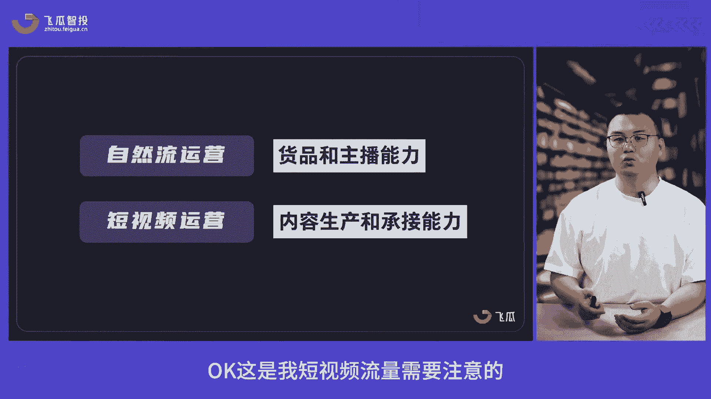

那再说到付费流量，我做付费流量需要去有哪些能力模型，付费流量可以帮助我们建立，账号的精准推流模型，并且可以带来精准流量，需要我们做的就是找到精准的流量人群，以及对付费流量的承接，这付费流量承接。

其实和我们前面讲到的短视频流量承接，是不一样的，短视频流量承接，更多的关注点是在信息的传递上，我在短视频内容里面需要呈现什么信息，那到了第二层，也是到了直播间的时候，我又应该传递什么样的信息。

把整个信息链条建立完善之后，引导到用户成交，那付费流量呢，付费流量是我对付费流量承接脚本是什么，费流量呈现脚本是因为我大量付费的直播间，一定注定他的货品宽度是极其窄的。

那我用什么样的话术能大量的去承接精准流量，并且来回的去讲，这是对于付费流量，直播间的承接能力的一种考验，以及对于主播，对于团队来说一个比较考验的地方，OK讲付费流量不能讲O5V。

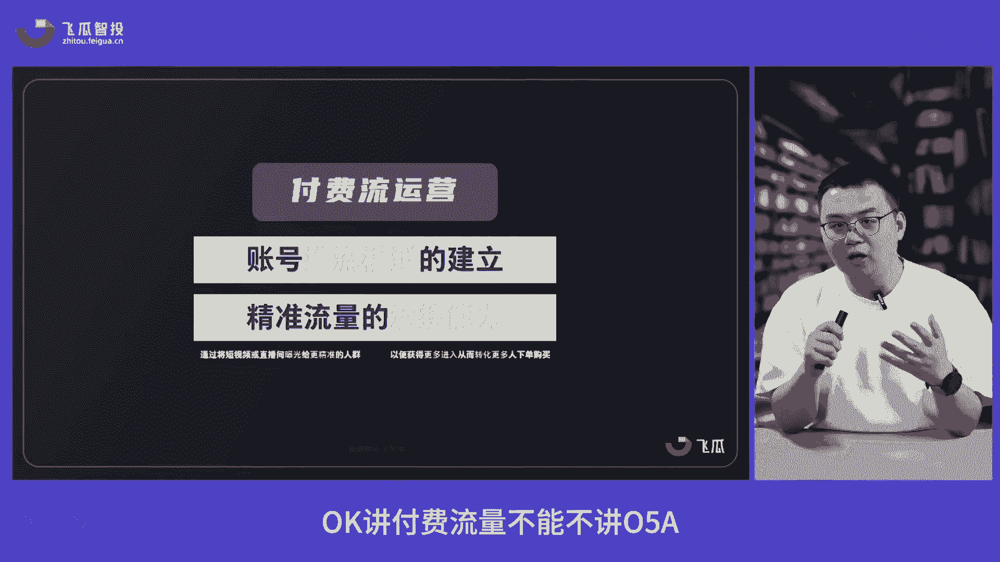

付费流量在O5V的整个途径中，它分别起到什么样的作用呢，我们先给对O5A没有认知的用户来科普一下，什么叫O5VO5V是A1A2A3A5。

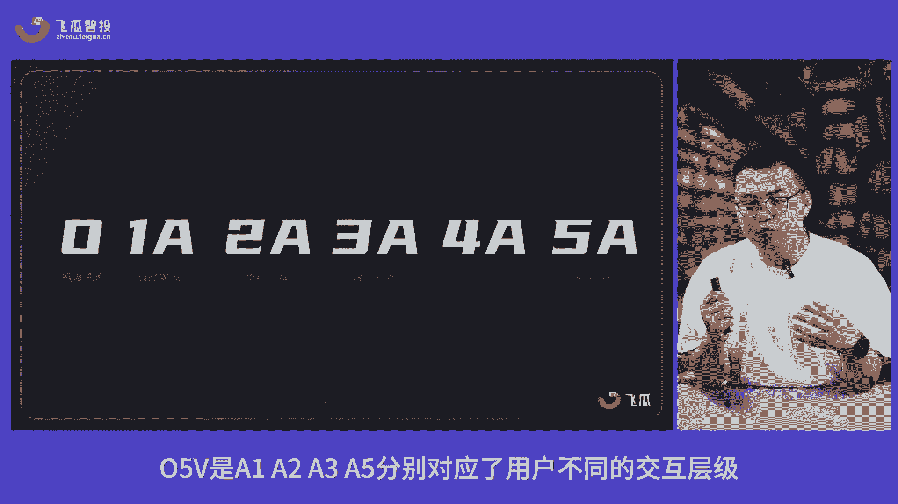

分别对应了用户不同的交互层级，A1就是被动曝光，给大家举几个例子啊。

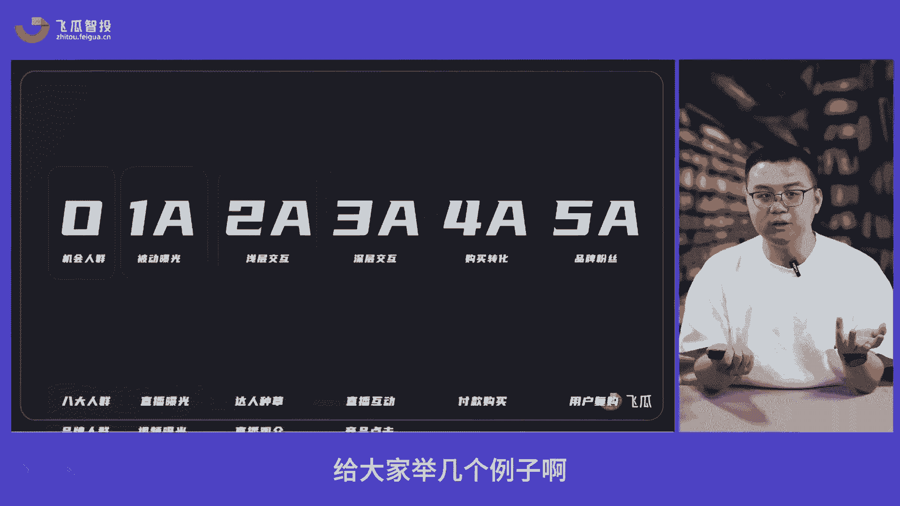

A1那就直播间的被动曝光，视频的曝光，那欧人群就是所有的公益人群，A2呢浅层交互，就比如说是达人种草视频，或者是直播观众或者是账号的粉丝，我们就把它定义为A2人群，那A3的深层交互呢就指直播互动商品。

点击商品下单全部都是A3人群，那A4人群以凡是有购买行为的，我们都把它称为A4人群，那A5人群就是有复购行为的，比如说是品牌的粉丝，那品牌粉丝怎么去界定呢，当然平台有很多的指标来界定。

额A1到A5人群啊，我们这只是给大家举几个例子，让大家更便于理解，A1到A5分别是什么样的人群，而付费流量在A1到A5，人群之间的转化的时候起到决定性作用，就比如说是我们投公益人群的时候。

这也是绝大多数投手会做这个动作，他只会去拉公益人群，尤尤其用镜像广告竞价广告去拉公益人群时候，把公益人群最理想的状态直接拉到A4人群，但是在拉这个人群的时候，一定会产生大量的A1到A3人群对吧。

那产生的A到A3人群，就很多投手他们就不管了，如果是没有全局性思考的人的话，他们也不会管这个A1到A3人群了，但是呢那对于投放方法论而言，我们需要把这A1到A3人群利用起来，比如说到了第二阶段的时候。

我就可以用付费流量去投放A2和A3人群，把A2和A3人群，直接导入到我的A4人群里面，这个动作在什么类目，什么场地上比较用的多呢，比如说是我的美妆护肤类目，在大促节点的时候用的特别多。

或者是说我的用户基数已经很大的情况下，我要上新了，任何类目品牌上新的时候，就这个方法论都是适用的，我可以把我的A2A3人群直接拉到A4，或者是说是我把A4人全拉到A5。

都是可以通过这种方法通过竞价广告去实现的。

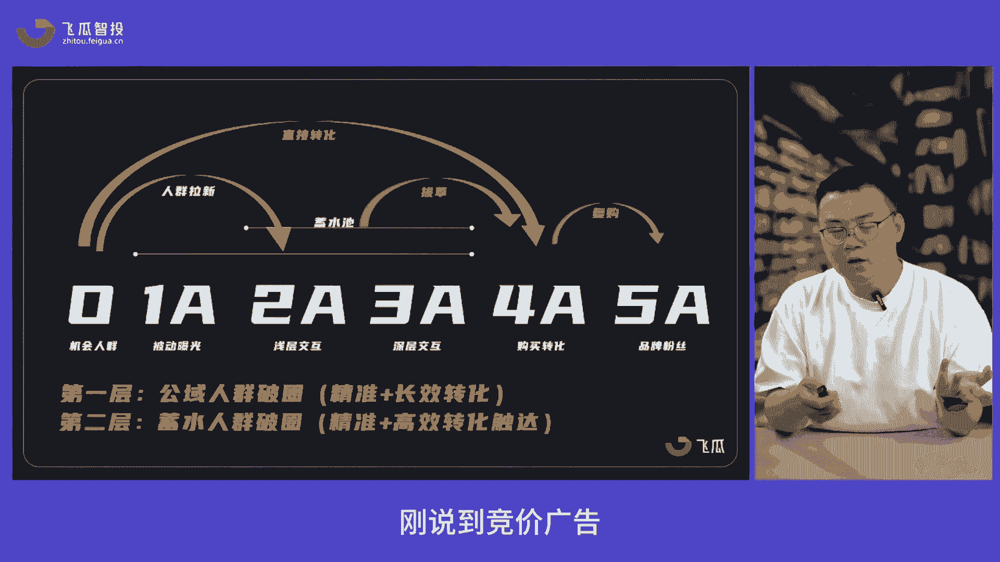

刚说到竞价广告，那付费流量有不仅包括镜像广告，它还有品牌广告，那品牌广告和镜像广告。

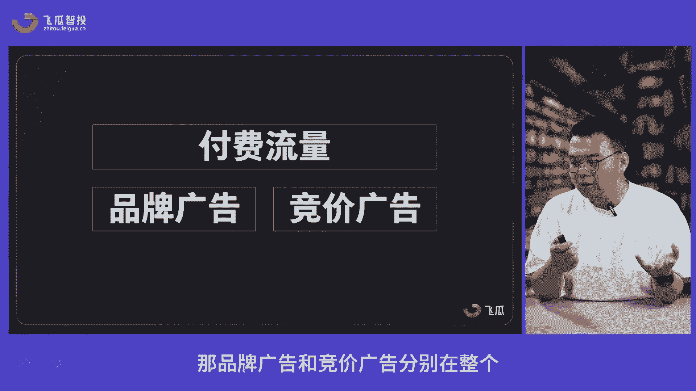

分别在整整个欧维人群流转的时候，起到什么样的作用呢，可以看到啊，品牌广告，基本上我要达成的目的，就是把欧人群拉到A1到A3M求就好了，他做深层的转化，它很难，我只是要给用户去种草。

去把O人群里边的用户拉到我的A2或者A3，当我在大促的时候，更方便于我把我的A2和A3人群，拉到我的A4人群，这是品牌广告，那些全链路都可以覆盖，尤其是很多人用的，这个从欧洲人群直接拉到A4人群。

这个方法，它对于中小品牌而言，它是一个非常行之有效的一种方法，但是呢对于已经有一些体量，有一些成交额的商家而言，其实它最高效的方法其实是A2A3到A4，这儿给大家举个例子哈。

刚好这个事儿我自己有亲身体验，应该是20年的时候，我在投达人直播间嘛，当时是给商业小纸团来来投，我们是两个团队在做这个付费流量，我就很明显的记得，我们全部都是在用A2A3，往A4人群里面去拉。

我们投产就非常高，我记得当时他是要卡二还是靠三来着，只要在二或者三以上就可以继续放量，就是线头就好了，但是另外一个团队，我发现他们就是一直在拉欧人群，去优化自己的标签，去优化什么什么乱七八糟的东西。

要知道对于这种达人而言，他有海量的用户群体，我用付费流量把这些人群，只要拉到我直播间就好了，而对于他们而言，他们需要把那些和这个商业小纸条相关，人群拉进来，其实要知道它的用户注程度是很低的。

所以就导致了我们投产是远高于他的，因为当时是开始先给我们几万块钱吧，5万块钱还是10万块钱，先自个烧，刷完这5万块钱，10万块钱之后，如果谁的投产高，他来给那个团队续费，当时我们就是基本上。

前半场只给他们5万的预算吧，后边因为他们也烧不出去了，后边的消耗，那场应该是30万还是50万的消耗，基本都是由我们这边烧出去的对，因为当时只做投放。

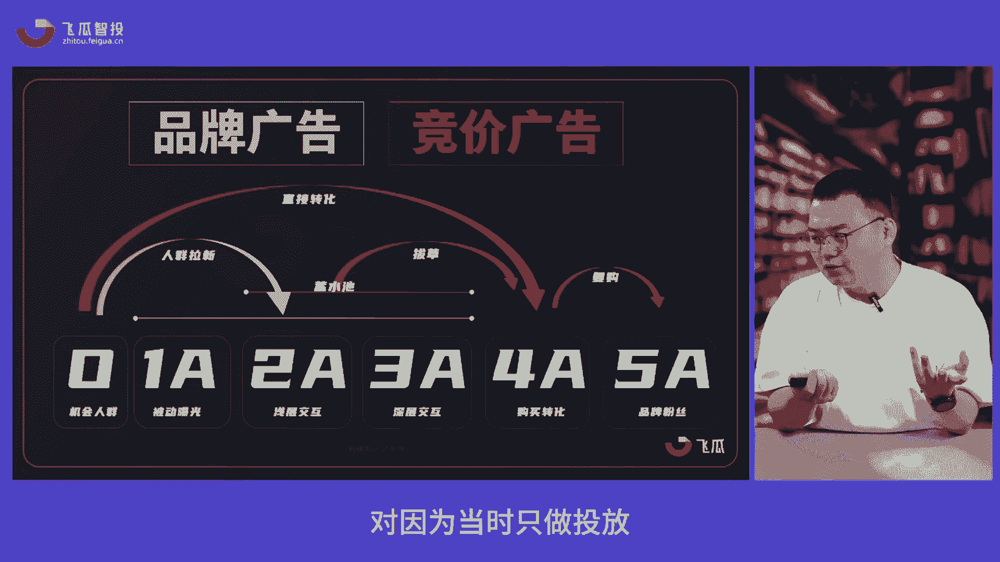

只做付费流量，其实这也是当时营销流量的一种体现，那竞价广告的A1A2A3A4，分别怎么定义呢，我这儿给大家做一个罗列哈，A1就是广告曝光人群减去A2A3A4A5，那分别A4A5是什么，比如说A4A4。

就是店铺的全量购买行为，减去有复购的用户优惠，就我A4人群，A30存商品点击加上下单未付款用户，再减去A4，减去A5，就是我的A3人群，当然可以这个公式可以截图一下啊，商品点击人群，下单未付款人群。

全部可以在签售后台找到对应的交互层次，包括我在后边也会给大家讲到这一点，除了竞价广告和品牌广告作为付费流量以外，其实还有一个板块叫做内广，大家知道这个板块的人应该不多，内广是每个平台都会有啊。

就比如说是这儿给大家透露一个小道消息哈，最近不是那个视频号挺火的嘛，视频号整个团队在24年有100个亿，可以作为内广消耗，也就是这100个亿，他可以想砸哪个品牌，砸哪个品牌，一定有前提。

他可以说服平台说，这个东西可以给公司带来什么价值，100个亿可以作为内广广告消耗去投给品牌方，比如说服饰类目，他们就在选什么香云纱啊，选什么丝绸啊，这种产品的品牌在砸，他就要不计成本的。

要保证他们的成交额在多少多少以上，对就是他们可以随时操作的，这是内部，当然这是给大家做一个破圈的点，分享给大家啊，OK这种情况基本上只有平台小孩主动找到我们，或者是我们都不知道。

我们为什么有这么高的流量。

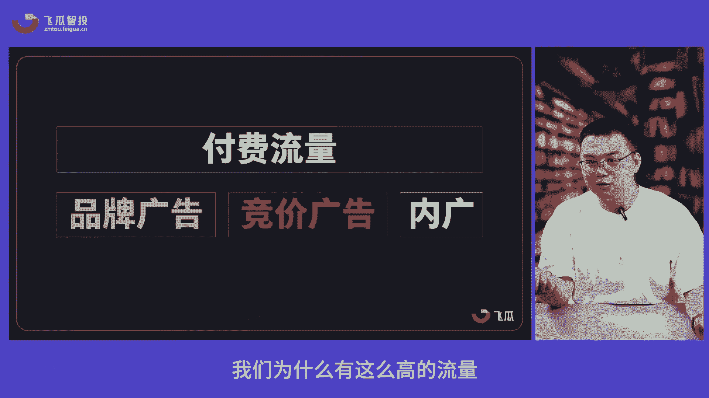

它不会在前端显示啊，OK这涉及到另外一个点，那付费流量的使用场景是这两个，大家应该都知道，第一个建立精准的人群模型，前面已经讲到了，第二个放大利润和成效额，这是付费流量的两个使用场景。

但是很多人不知道另外一个场景，这个场景就是快速放大基础数据，这三个使用的场景其实针对于不同的账号阶段，那对于第二个建立精准的人群模型，它是已经有一些量，比如说我的在线已经稳在50。

或者稳在100的情况下，我需要把用户的标签拉的更精准一些，可以通过付费流量去拉流量进来，这是对于一些发展阶段的，那对于第三个场景，比如说放大利润成交额，这是对于已经有一定规模。

我的投产已经很稳定的情况下，我要把我利润放大，我只要大量上付费就好了，这是两个使用场景，放大利润成交额，这个是对于已经已成熟的账号而言，它是使用场景，那对于一些起号阶段的使用场景的。

那就付费流到另外一个场景，就是快速放大基础数据，你想想如果是我新起号或者是刚开始的时候，那我的在线只有十个人或者最多20个人，那我一个小时的场关有500人，最多1000人，1000人已经算是比较好了。

我怎么去判断我流量漏斗哪里出现了问题，我的转化率哪里低了，商点低了，还是曝光进入低了，场景有问题，还是我的话术有问题，怎么去快速定位，我需要去放大我的基础数据，那怎么放大技术数据。

有付费就可以把我的单小时闯关砸到，不用一两万，砸到5000，一小时，5000的场关，我就能很明显的发现，我的流量漏斗哪里出现了问题，那根据流量漏斗出现的问题，去定位直播间的动作，去找到问题就好了。

很多人遗漏的一个点，付费流量可以解决这样的场景，同时给大家两个避坑点，第一个付费流量是加分项，它是建立在直播间人货场没问题的基础上，来放大的一个东西，如果要是你的人或者都不行。

就像靠付费流量拉着可以去跑，当然你未必跑不出去啊，既跑出去一看投产零点几啊，那这个东西付费就没有意义了，一定是人货场没有问题的情况下，这是第一个点，第二点付费买的是曝光，这有特殊强调一下。

就是为什么说付费版曝光，这儿没有给大家具体去写，为什么哈，凡是跑过千川的人都知道，天窗的出价是OCPMCPM是什么，按千次曝光收费，那OCPM是什么，是智能优化后的签字曝光收费。

你出90是你愿意花90块钱买1000个曝光，你出80是愿意花80块钱买1000个包裹，是这个意思的，是他的签展成本是多少，所以我基本上和别人沟通，付费的时候，你签展成本是多少，你的商点是多少。

RY是多少，偏转成本是一个非常核心的指标，所以再给大家强调一下，付费买的是曝光啊，当然现在一些成交RY出来了，但是成交RY这种的工具，大家也知道他拉的是什么人群啊，他帮你来拉你的A2A3。

甚至拉你的A4人群来去做转化，那投产能不高吗，所以如果你为了保投产的情况下，打瓜式操作，可以用这样的头发，但是这样的头发越投越投不出去，因为你A3A4人群就那么多点，A2人群也就那么多点。

当这些人该该消费的消费完了，那剩下的人就不消费了吗，到最后是跑不出去的，负责那个成交ROI，所以最稳定的方式去跑，付费仍然是用之前的莱卡去拉我，把不同标签的人群到直播间来转化，这是送大家一句话。

凡是做过付费的，应该也知道，付费流量从来都不会雪中送炭。

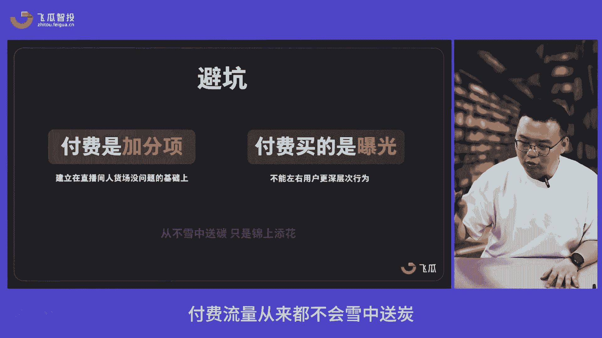

他只会锦上添花，第一板块的内容，那第二板块我们来讲讲付费应该谁来投，老板兼职投，还是招聘投手来投，或者是带头团队来投。

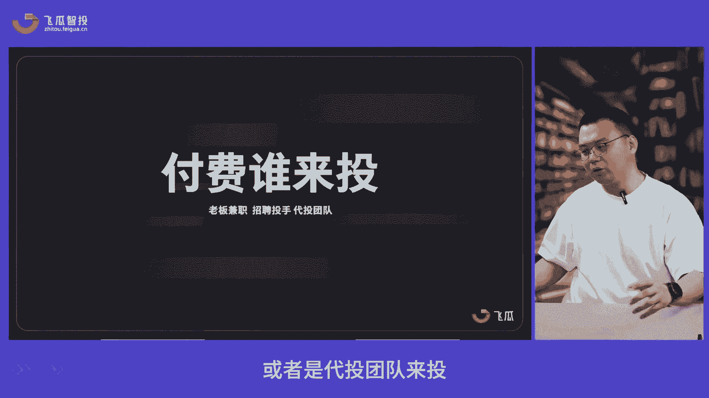

我们来看一下不同的团队，他的优势和弊端是什么，如果是老板兼职的情况下，那老板我自己个儿对这个账号的全权负责，所以他是个有强有力的推手，能把这个事情很快的推进，并且有因果敢测试，我想投什么，投什么。

我啊不用为最后的坏结果而向谁去解释，全盘性的思维，但所以导致就流量会更精准一些，这是老板接下来投，那对于招聘投手，他是专人专责的，与直播间抢绑定，这是他的优势，但它的不足是什么，很难去辨别一些好的投手。

那怎么去获得这些好的投手呢，可以从带头团队里面来带头团队，他们的优势是经验丰富，素材能力比较强，但是它的缺点对啊，直播间或者对这个货品的人群一知半解，这前面应该给大家分享过优酷淘系时代啊。

当时的直通车手啊，壮胆的投手啊，最开始的时候牛逼的这些人基本都是在服务商，都在代理商，都在带头团队里边，但是到了最后投团跑的最高的一定是在品牌方，因为他对这个货品背后的人群，有极其深刻的了解。

他是成天和产品团队滚在一起的，对产品及其了解，对用户及其了解之后，他的投产才会高，你投个60分，投个80分，再投团队，短时间内可以完善的，但是投到90分，投到95分，带土团队一定做不到，一定是自己的。

自己养的，投手才能做到的，这也是给大家分享，对老板而言一些点，如果是想招聘投手的话，可以从先找代投团队去找到一些合适的人员，让他们去投，如果投入比较好的情况下，那是不是可以从他们那边沟通一下。

你来我的品牌公司，来我这个团队里面去投比较好，这个方式对于老板而言，我降低了我辨别这个人有没有能力的一个前提，那对于一些在代扣团队的投手而言，也会获得比较好的发展，因为带头它一定是短时间的一个事情。

就像现在一样，它投放越来越被放轻的情况下，那你这个能力是无用武之地的，但是你一旦转到一个品牌团队，或者转到一个全链路团队的情况下，你是有能力去辐射到其他岗位，其他职责的。

那是不是也是你转到其他方向的一个跳板呢，所以对于带头团队的投手而言，也是一个比较有好处的，那第四个点，带头团队的与直播间隔离，导致了他对人群一知半解，导致了他的投产，长期来看一定不如自己养的投手高。

所以啊不同的投手有不同的优势和弊端，那怎么去做，分别怎么去做筛选，什么阶段应该用什么呢，给大家做了一个划分，这是个是非常主观的划分哈，如果是账号0~1的，比如说你的月销10万以内的，十到100万的。

月销百万以上的，我们这样来划分哈，OK如果是10万以内，就是小店随心推，老板自己坚持去投就好了，小店随心推为主，因为没有必要上千钻天穿了呃，大概率会亏本的，你这个阶段的目的是把基础数据放大。

去定位直播间的问题在哪里，OK第二阶段，10万到100万就可以，小店随心推和千川直投，直播间都可以同时去上了，这样的话可以用招聘的自己投手来做，并且这儿也可以自己养一个投手出来，比如一个月两个月时间。

基本就能养出一个投手来，那到了第三个阶段就是月销百万以上，他可能就需要一个完整的带头团队，或者是说是自己养一个投手团队了，因为它的投放量会比较大，他不是一个人，两个人能解决，他可能需要3~4个人来。

3~4个账户，是甚至十个账户以上来同时投，这个我见过最多的一个投放一个直播间的，应该是2000还是3000，个千套账户在投一个直播间，这就是你体量大了之后就会有这样的问题。

那带头团战就小源随心推品牌广告，这签到直投直播间搜索广就要全量去上了，因为对于你的体量而言，已经有复购了，那我要吃掉我的用户复购，那就可以通过搜索流量来吃，那我要拉我的欧人群到我的A2A3。

就可以用品牌广告，那小店随心推是用来补量的，巨量铅酸，是用来把A2A3人群拉到我的A4人群的，当然如果是一些非正式的营销节点，也可以用定价广告来代替我的品牌广告，进行投放，讲完了付费谁来投。

那付费什么投。

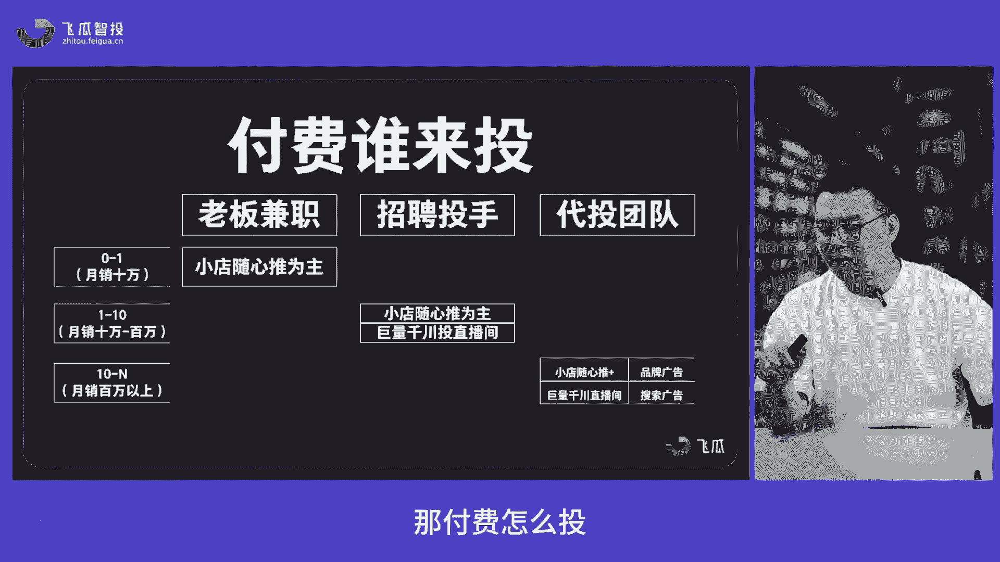

前面有讲过，我不会讲太多投放技巧性的东西。

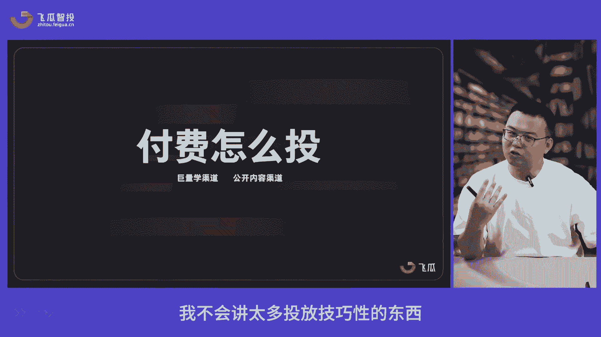

但是我会告诉大家哪里去学到这些内容，直接在飞到网里面去搜，千川投放，官方出的巨量千川投放数，这里应该是有16万的浏览次数，这是第一篇，第二篇有6万或者9万的浏览次数，这都是官方出品的投放技巧性的东西啊。

基本上从0~10吧，从0~10给你讲清楚，巨量千川投放是个怎么回事的东西，如果是想找到这两篇文档，扫上面二维码就好了，当然这是这是一些技巧性的东西，告诉你怎么投，但是这里边有一篇内容我要强特别强调一下。

这是飞刀网站投放页面，大家可以通过地址去找到这个页面，分段看投放的消耗，凡是一个有投放经验的投手而言，都知道这个功能有多重要，我是在21年的时候到呃，就就来到制投团队，我当时就从业务岗啊。

转到制投团队的时候，就告诉他们这个东西迭代这个东西，优化这个东西对我来说很重要，因为之前我是需要每分钟或者每隔5分钟，来记录一下账户的余额是多少，帮助我来分辨我这每分钟的消耗额度是多少。

但是自从有了治头的这个功能之后，我不需要自己去记录了，比如说我上个厕所，比如上20分钟。

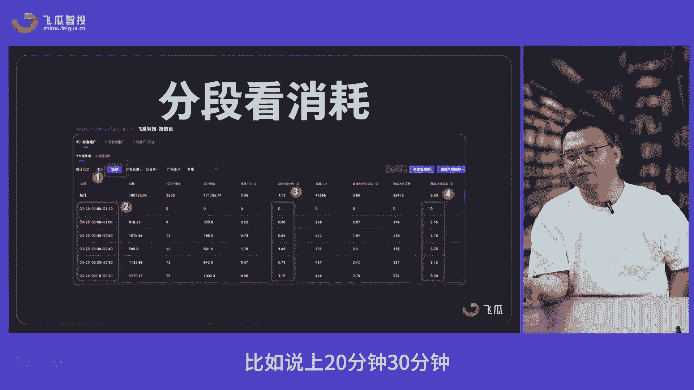

30分钟，那我账户的每分钟消耗了多少，我很难去盯，但是有了这个就好了，他每隔10分钟打一个点，来帮助我判断我整个账户投这个直播间的，所有的消耗额度是多少，这10分钟的投产是多少。

这10分钟的商品点击成本是多少，可以分段来看，但凡是做个投手的去看下这个功能，相信一定能打动到你啊，这个东西非常打动我，OK这是前面没有讲到过的投放的一些小技巧，那除了飞刀王以外，还有巨浪学。

巨浪学有一套极其完善的体系，他虽然说它包装成了认证体系，但是我告诉你，这套就是巨量认证呢，这个里边的全部内容，它真的是有干货在的，因为给大家有看过，我是巨量学高级数字营销师，一步一步考上去的。

初级中级考了之后，他考的时候需要看他的课程，我作为一个做过电商培训的人而言，从里边看到的内容我觉得比线下2万块钱，10万块钱的课都要有干货，但他是只需要300块钱，300块钱报名初级认证营销师就可以了。

就非常完善，非常沉底，一些逻辑性极其强硬，刀客我可以这么来说，极其牛逼的逃课，它不止有巨量千川，有店铺运营，有短视频运营，有直播运营，各种各样，最起码我看的两篇，第一个是天窗的初级认证，天窗的中级认证。

这两篇内容专业度是极高的，网址提供在这了，想学自己去学就好了啊，自己一个人在巨浪平台里面自己付费去看啊，300块钱一套完善的课程，初级的300块钱，中级的应该是500块钱，高级的认证是需要自己写论文的。

写个3000还是5000字的论文，写完论文之后，然后去北京有定时定点的答辩，下面基本都是行业小二啊，总监或者总经理级别以上的字节的人也好，各个企业的CEO也好，或者是我记得当时我答辩的时候。

还有一个清北的哦，清华还是北大的一个博士生导师，还是教授吧，他是很难考一套认证，OK我考下来了啊，这就是吹个牛，这OK这是告诉大家怎么去投放这个板块，去哪里去，学到了第三个板块啊。

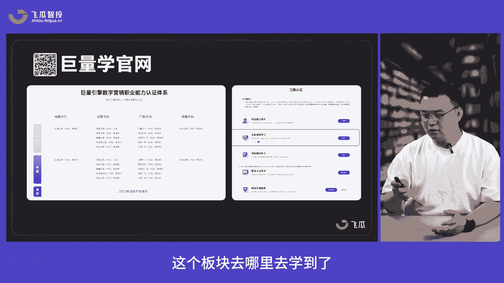

付费流量的人群包玩法，这个内容我原创的，它是方法论，它是技术性的东西，但是我在市面上没有看到有人讲这个玩法，所以往往这个玩法分享给大家，同样这个玩法是可复刻的啊，是可复制到其他渠道的。

他不是说是只针对于这样WIFI，这个东西是抛砖引玉，付费流量的人群包玩法。

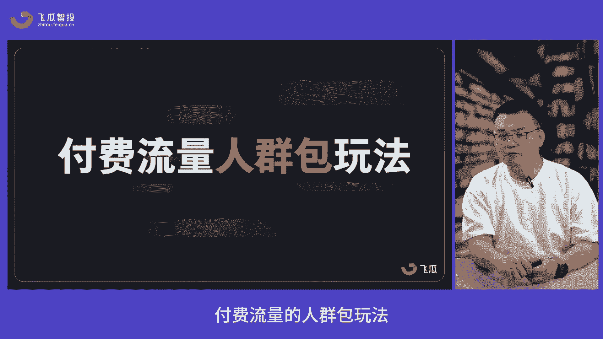

先说付费的定向类型，包括了这几种，对于承受直播间或者已经有精准转化人群而言，是比较好的，那基础定向，基础定向又分为了行为兴趣，相似达人和人群包三种定向对吧，分别用于不同的渠道行为兴趣。

它的精准度是略低于相似达人人群包，对于起号阶段而言，上传其他渠道的精准人群包，可以实现账号的精准转化，对于起号期阶段，那对于成熟期呢，通过人群包嵌套，破直播间人群做精准放量和转化人群的复购。

这就是我们今天要讲的人群包，人群包的优势是什么，人群更精准可复用，投产可控。

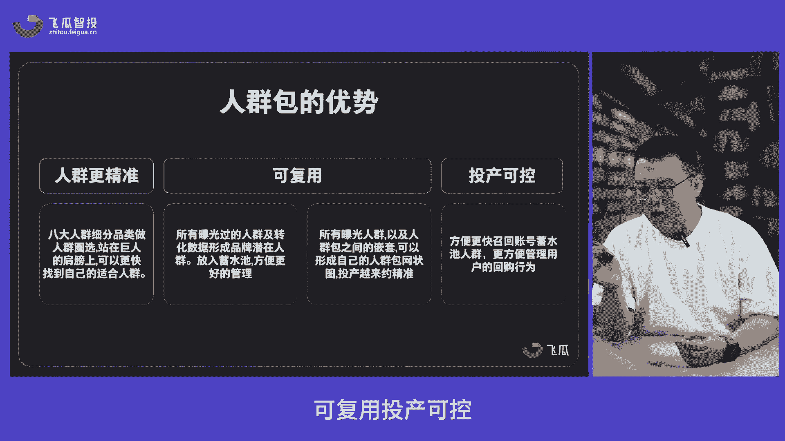

为什么这么说呢，给大家看一下，这个是后台已经提供的人群包哈，左侧是公益人群包，八大人群品类人群，还有基础人群包，他已经又做了很详细的分类，左边是公益人群包，右边是私有人群包，凡是我直播间。

凡是我账号里面覆盖过的人群，还可以选择我的交互深度商品，点击啦或者付费购买的选择，这些人群还可以进行重新打包，这是我的人群包的来源，那通过这些人群包的来源。

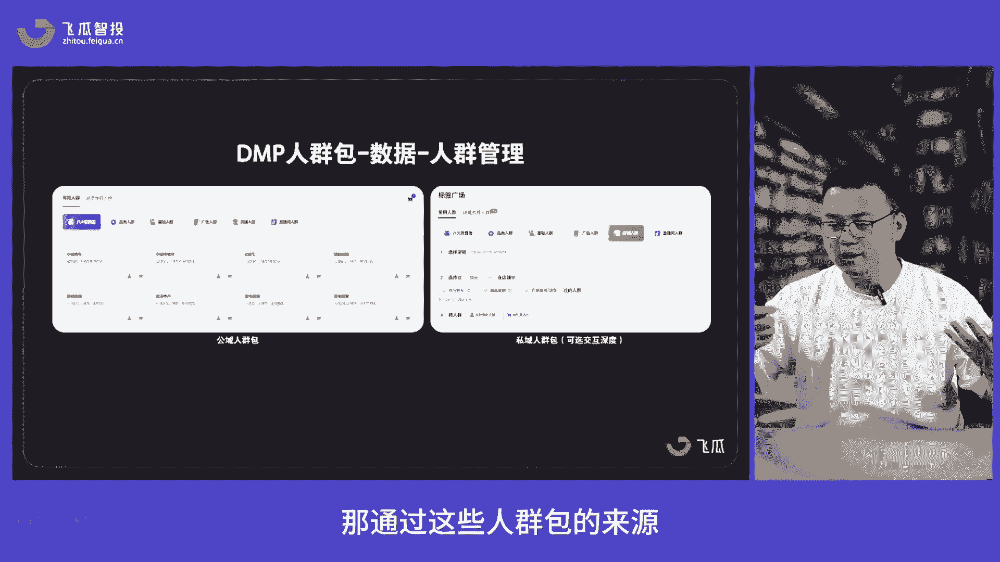

再结合后台提供的雕，并拓排这四个组合方式来实现我这条计划。

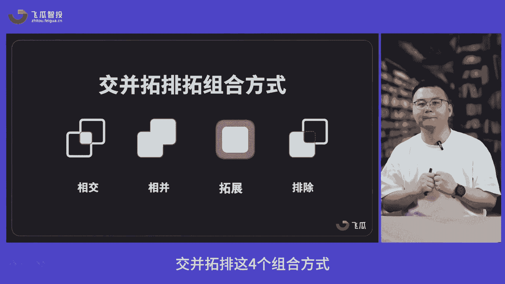

这是大家可以看到T我画面比如大树吗，T不是train吗，就基本上T的前开头是T的计划，都是我的计划哈，看到第九代啊，名字起的有点牛逼啊，无敌人群包消耗个十百千万，10万单条计划消耗15万，投产2。02。

但有一个前提，他是美妆护肤类目的，别看投产低，单条计划消耗15万，美妆护肤类目的二，我觉得很少有人能跑到这么高吧，那我这条计划是怎么跑出来的，这四个方法它是一套连贯的方法论，小包多册，多包组合。

子孙嵌套，精准拓展，我们一步来给大家拆开来看，先看第一步，小包多侧，给大家举个例子啊，我们就拿华生物而言，华西生物的主要的额购买群体，是25岁到40岁以下的女性群体吧，那我选了人群包，美妆护肤人群包。

并上美妆工具人群包，背上女装人群包，减去排除掉40岁以上的人群，形成我的初代人群包，初代人群包是三点1000万的人群包，那我可以去跑一下这个人群包啊，已经有这个人群包了之后跑一下，他投弹多少不重要。

但是就第二部了啊，我的初代人群包三点1000万人群包刚刚是病，现在是交交上年龄18岁到30岁，交上女性，交上消费能力比较强的形成，我的第二代人群包分别是一点4000万。

二点8000万和二点3000万人群，那我这是不是有了第二代人群嘛，而且人群包可以去跑一下，跑出来的投产哎，一定会有高中低吗，那我再选择这里边投产最高的2。1代再交，继续往下交，交上达人哎。

美妆类型的加上行为，加上兴趣，这儿的各个给大家举例的就是达人行不行，这是可以自定义的，但是告诉大家的动作是去交上更垂泪的，更精准的人群，去达到我的第三代人群包，那这儿到这儿为止。

我是不是已经有了三代人承包，相当于有七个人群包，那初代人群包不需要去跑，跑出来，是后面第二代，第三代人群包一定会有一些投放数据出来，这样但是这有一个强调的点，就是单个人群包1000万左右作为一个参考。

低于1000万很难跑出去，投产也会比较低，0。5%到1。5的呃，人群转化数据作为参考，也就是5万次的曝光数据作为参考，比如说我3。3代，我只跑了2000次曝光，他的头上有三，这个有参考意义吗。

没有参考意义，所以单个人群包，0。5%到1。5%之间的曝光，曝光数作为参考，也就是单挑人，全包至少要跑到5万以上的曝光数据，才作为参考，OK50000次的曝光之后，我拉出来投产数据，1。51。21。8。

1。3，1。11。4，到了第三步了，子孙嵌套了啊，子孙嵌套是最关键也是最难理解的，在这六个人群包里边，我随机取三个人群包，他头上一定有高中低嘛，我取头上最高的2。3担去投产，最低的3。

3弹来进行我的第三部子孙嵌套，2。3代的投产是1。8，3。3代的投产是1。3，一个最高一个最低投场最高的人群，包包交上头场最低的人群包筛选出来，3。3代中投产相对较高的转化人群，记住这儿我要的是3。

3的人群，因为香蕉人数比较小，所以啊我这个教出来的人群他很难跑出去，所以我现在下一步要做的动作是，保证精准度的情况下，我要放大我的人群包的数量，我再拿3。3大减去刚刚那个教出来的人群包。

于是获得的是去除了3。3代，人群包中的高转化人群的低转化人群包，这个白框里边的这个人群包，是转化相对低的人群包，那要一个低的有什么用呢，大家应该知道我一共选了三个人群包，那我下一步就是要把投产中等的。

和同投产比较高的这两个人群魔并起来，我要获得一个投产高，转化高且规模大的人群，一点4000万，并上二点3000万，我至少是一个3000万的人群包对吧，投产高且量极大，那我再用大且转化高的人群包。

减去投产低的人群包，那我获得的是不是投产高，且规模比较大的一个人群包，就是子孙嵌套我的4。1代的人群包，4。1代人群包一点5000万，以此类推，那我获得就是转化高且规模比较大的人群包了，那以此类推。

我是不是又能得出我的第五代人群包，5。1代，因为我的4。1代可以去跑啦，跑出来投产多少，投产相对是比较高的，那我用4。1去代替掉我的2。1代，投产还是高中低，以这样的公式来嵌套出我的第五代人群包。

这有一个点要和大家说，单个人群包一旦跑到8%到10%左右，什么意思，800%到十，单个人存包，假如说1000万就拿10%而言吧，相当于就是100万的曝光，单条计划跑到100万的曝光的情况下。

它的投产会急速下降，因为它的流量成本会明显升高，那我就需要有下一步了，精准拓展，当我获得一个跑量极其大，投产极其高的一个人群包，但是他已经跑到10%了，再往上跑，他的投产就会降低。

流量成本就会增加情况下，那我就可以拿这个人群包来进行拓展。

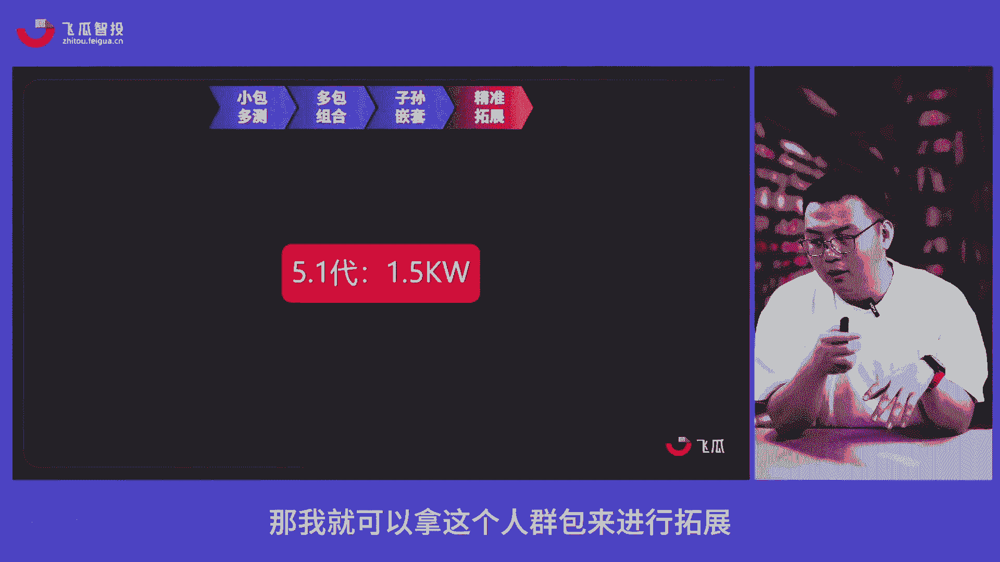

把它拓展到更大这个人群包再回归到前面，再来一波小波多策多胞组合子孙嵌套，那这样的人群包越来越精准，越来越精准了，大家理解这个方法论吧，这就是我们最后给大家讲的这个人群包，精准嵌套的方法论。

这儿只是给大家举个例子，但是这个例子背后就是这四个词儿，小包多测，多包子组合最重要的子孙嵌套，再加上跑到一定量级之后，流量成本升高之后的精准拓展，OK这就是我们付费流量篇的全部内容。

下一篇来给大家讲直播复盘。