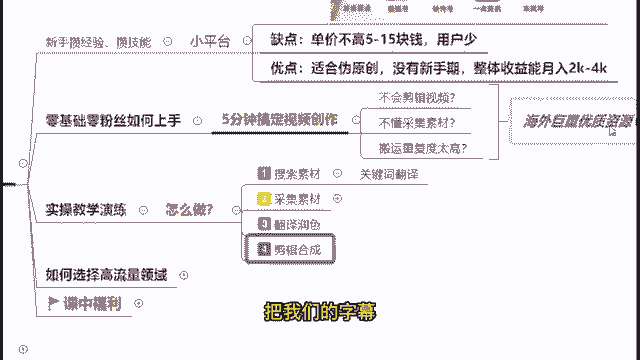
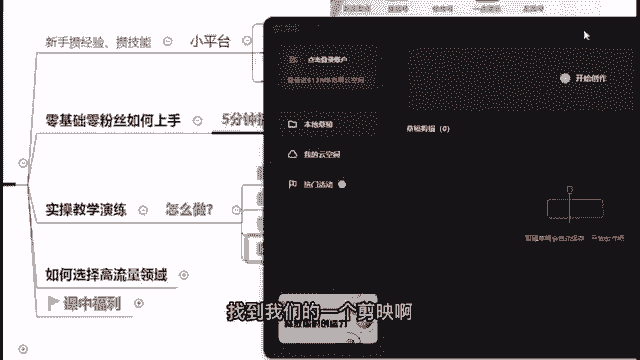
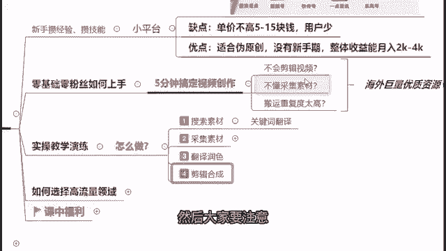
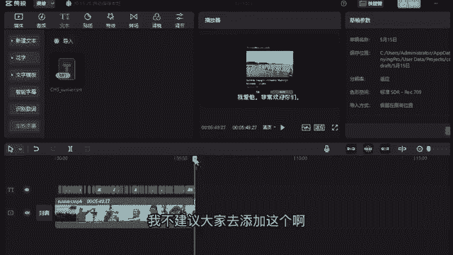
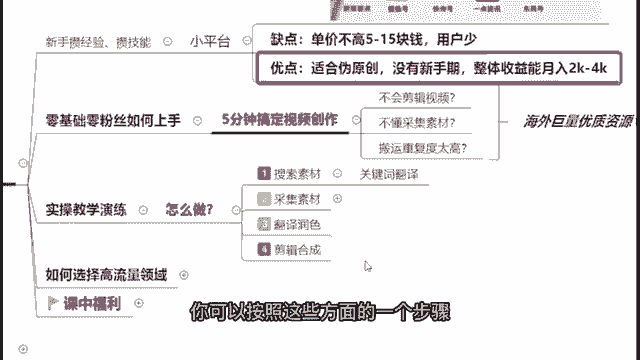

# 《自媒体全套运营教程》强推！零基础保姆级自学自媒体运营教程（方法+实操），自媒体变现必学全套运营逻分享抖音起号运营思路：找账号-定形式-抄选题--复制爆款！ - P10：7实操教学—剪辑合成 - 薇儿啊XN2011 - BV1CK4be1Ebm

好我们来看一下现在这个视频处理好了吗，啊来处理好了好，那么在这边的话我继续进行跟大家去进行讲解，然后接下来大家有问题可以先啊问，然后我在后面有时间的话，我再来跟大家去进行一个一一的解答。

来现在我们的视频已经处理好了，我们来看一下这个翻译的效果到底怎么样，来我们先来看一下，我拉长一点点来给大家看一下，不然你们看不全这个，好首先在这里啊，这个是一个语气助词，我先把它删掉，好那么在这边的话。

首先我们先来播放，看一下它的一个大概的翻译效果怎么样，All right，You guys ready to get to today's immunity challenge，Yeah，Yeah。

First things first katie，I must take it back，All right spin mot lasted，Once again。

Immunity is back up for grabs for，Today's challenge are gonna be standing，On a very small platform。

Over the water，Leaning back，Holding onto a rope，Every five minutes，You'll move your hands。

further down the rope making好，大家可以发现，其实这个视频的一个翻译，基本上都是比较准确的，而且就是说你只看中文的话，配上这个画面，你是基本能够看得懂，没有任何问题的好。

那么在这边如果说啊你要看的话，你首先其实你可以把一部分你看不懂的英文，直接给它删掉，你保留一定部分的，能够让你看得懂的中文就OK了啊，能懂我什么意思吗，就是比如说今天的挑战第一件事啊。

凯蒂我必须收回这个，那么这样的话，中国人是一定能看得懂他在说什么的，对不对啊，包括比如说啊参赛者站在水面上啊，向后倾斜去抓住一根绳子，你配上这个视频画面，你是完全能够读懂他是在讲什么的。

我们的翻译不需要非常的精确，只要让我们中国人配着这个画面，能够大概看懂他在讲什么就OK了，一些不必要的词是直接删掉没有问题的，我们中国人的一个阅读能力是非常强的，中文也是很强大的，那么在这边啊。

我们可以做一个导出，导出什么呢，这里有一个中英的字幕，我们其实不需要英文，我们只需要导出这个中文字幕就OK了，我们只需要这一个中文字幕啊，我们不需要英文，因为英文的话，首先第一部分。

你没有办法去确保它百分百的准确对吧，但是我们对于中文是看得懂的，我们只需要下载中文字幕就已经足够，已经OK了，好那么下载之后呢，我们保存在我们的一个电脑或者手机上面去好，那么在这边的话下载好之后。

我们要干什么呢，我们要去对视频做一个剪辑合成，把我们的字幕跟我们的这个啊。

视频给它结合起来，找到我们的一个剪映啊。

你下载一个剪映的专业版，然后大家要注意。

你下载的时候要下载这个剪映的一个，3。0的一个版本啊，如果说你是以前旧的版本的话，它是不支持这个字幕的导入导出的，你要去注意，你要下载最新的这个剪映3。0的版本，它才是支持字幕的一个导入导出的。

不然的话你可以看一下你的这个剪映的版本，然后相应的去更新一下下，然后找到我们之前下载好的，这个录屏的这个素材，然后把它添加到轨道里面去，然后添加到轨道里面去之后呢，我们找到我们刚刚导出的字幕。

在文本这里最下方有一个本地字幕导入，你刚刚啊下载下来的一个中文字幕，把它一样的添加到轨道导入进去，然后我们点击播放来看一下是否啊正常，平板可以用啊，All right。

You guys ready to get to today's immunity challenge，好，我们可以发现这个字幕这个大小啊，有点小问题来，我们把它拉大一点点，拉到我们一个合适观看的程度。

包括在这里你可以选择这个相应的一个字体，以及相应的一个字幕的颜色，包括下面有非常多的一个预设的一个花体字，都可以进行一个选择，那么在这边的话呢，我习惯是用这一个啊，我习惯是用这样的一个。

那么在这边的话呢我就点击，然后我们继续点击播放，看一下，First things first katie，I must take it back，All right，But molastic。

Once again，immunity is back up for grabs好，如果说你看到有一些这种啊词句，可能让你看起来啊，这个我们可能要调整一下的话，我们就点开右边这里看得到吗。

你可以根据它的断句进行一个简单的调整，比如说你可以根据这个词，那这个语句的一个意思，对它做一个简单的调整啊，比如说站在水面上，给它在这里做一个断句好，那么在这边我们的这个啊字幕。

看起来效果就显得啊舒服多了，对不对好了，那么在这边我们做好这个字幕之后，其实我们现在已经跟刚刚看的B站，这个视频是差不多的了，但是我们现在还少了一样东西，就是首先第一个，既然这个视频是我们搬运回来的。

那么其实我们还要做一件事情，就是我们需要防止别人也搬运，我们自己的一个视频，那么既然我们要防止别人搬运，我们自己视频的话，我们就要添加水印对吧，好，添加水印的话，我不建议大家去添加这个啊。

静态的水印，我建议大家去做什么，做一个动态的水印，而且动态的水印其实是非常简单的，来举个例子来给大家看一下，怎么去添加一个动态的水印好，首先添加一个默认文本，或是添加一个花字都可以啊。

比如说在这里我随机选择一个花字，然后给它添加到轨道上面去，好那么在这边我打上我自己的一个名字啊，我的名字叫安雅啊，我打上我的一个名字好，那么在这边的话啊，我们可以来啊调整一下。

比如说这个我的名称可以叫做啊，一个简单取个名字吧，叫做安雅看综艺吧，好我们可以取这样一个名称，然后把它挪到左上方或是右上方，哎这个把它删掉吧，好那么在这边的话，我们可以调整一下它的一个大小。

调整到一个合适的一个状态，好我们把它拉长，拉到跟整个视频等长，那么拉到跟整个视频等长之后呢，你可以在这里一样的去调整你的一个啊，字体的一个颜色，包括它的一个样式啊，都可以根据你自己的一个需要去做一定的。

一个调整，好，那么在这边啊我简单的调整一下，然后我给他调整一下它的一个不透明度，因为如果让他做一个动态水印，它在屏幕中间滚滚来滚去的话，啊啊不调整不调整的话，它这个太显眼了哈。

好那么调整好这个不透明度之后好，我们接下来可以做什么呢，我们要做动态水印的话，来看到这里有一个位置，对不对，好，我们看到这里这个位置，然后点一下这里这里是一个添加关键帧，然后我们在这里点一下。

大家可以看到这里这个视频的位置，是不是添加了一个关键帧，好我们挪动一下这个横条，然后我们把我们的这个水印，从左上方挪动到右下方，从左上方挪动到右下方，然后我们再来把我们的一个视频位置，再继续拉动。

把我们的是啊，水印从右下方拉到我们那个左上方，好，我们现在可以来看一下，这个水印的一个效果如何，All right。

You guys ready to get to today's immunity challenge，Yes，好，大家可以发现，其实这个水印它就是在什么在不停的这样滚动，对不对，它在啊。

根据我们预设的一个位置啊，它在进行一个啊动态的一个滚动，那么大家在做视频的时候，就可以为你自己的视频，添加上这样的一个动态水印，这样的话别人如果说他想要搬运你的视频的话，他也是非常困难的。

他总不能时时刻刻跟着你的水印，在屏幕中央一直打码，对不对，这个不现实好，那么这个的话大家搬运好素材之后，做好我们的一个字幕之后，我们就可以添加一个属于我们自己的动态水印，来防止别人做一个搬运好。

那么在这里的话呢，因为我看到有同学在问哈，那我首先啊这个软件是叫剪映啊，你在手机上也可以做，在电脑上也可以做啊，都可以啊，这个叫做剪映好，那么在这边的话我们剪辑合成就已经OK了啊。

可以跟大家再总结一下哈，就是我们要去做的话，新手刚刚啊去做视频和内容的话，你先可以在小平台上面去做搬运啊，去把你自己适合的领域啊去做一个啊调整，然后又或者说你去练习你自己的这个，视频剪辑的一个能力。

然后啊，你可以按照这些方面的一个步骤。

来进行一个操作啊。