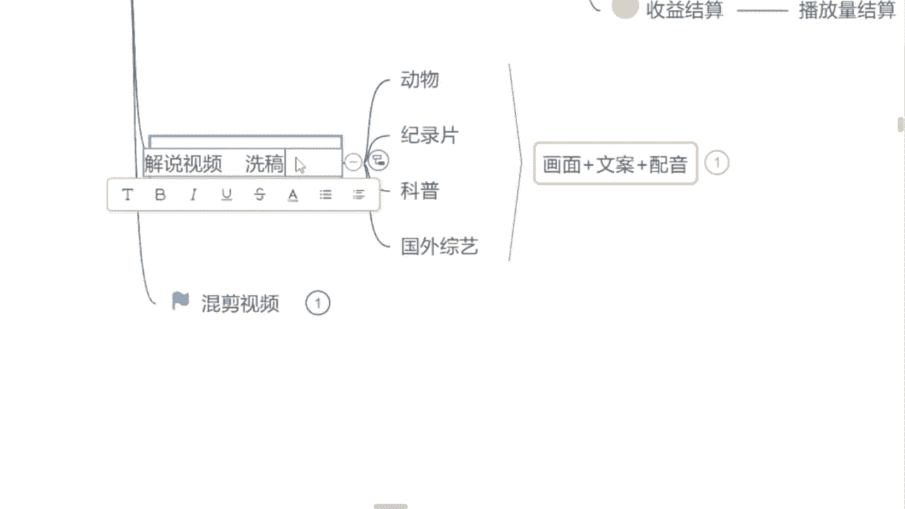

# 《自媒体全套运营教程》强推！零基础保姆级自学自媒体运营教程（方法+实操），自媒体变现必学全套运营逻分享抖音起号运营思路：找账号-定形式-抄选题--复制爆款！ - P10：9.版权急平台审核机制 - 看車就爆了 - BV1uaW6emEA6

如果说没有这个版权，你做不了影视啊，因为影视基本上都是要版权的，但如果说很多同学说曾老师，那我不做影视嘛是吧，那不做影视的话呢，我就建议你们去做一些，跟教育类相关的视频解说，像什么呢，动物解说。

纪录片解说，或者说这个科普类型的解说，现阶段呢这些领域是国家都支持的啊，国家都支持的，为什么呢，因为呃我们刚才也讲到了，因为前几年也是这个国家双减嘛，是不是也是减少了我们学生在这个过程当中的。

一些补课负担，或者说兴趣班的一些负担，但现在孩子回家了之后，除开这个作业写完了之后，基本上都在这个短视频平台上面刷视频了，看一些什么呢，看一些就是动物的纪录片的，或者科普类型的一些视频。

增加我们一下这个人的一些常识，就现在国家都比较支持我们可以去做这个类型，因为我们什么呢，我们小时候也是一样的嘛是吧，家长在家里面的时候，永远不希望我们去看一些没有营养的动画片，动漫。

但动物世界你肯定看过，是不是是的，来举个手打个式子吧，是不是动物世界有看过吗，就我们可以去做这个类型的啊，国家支持的这几个领域，我们平台给你的扶持流量是其他领域的两倍啊，如果平常我们普通的情况之下。

每一个视频的这个流量推送是在2000到5000，他是双倍的，你就可以拿4000起步的一个流量了，是不是还是比较可观，但是我们在讲这个解说之前呢，首先要强调一点，做解说你不能去做洗稿，有没有听过洗稿的。

有的来一样的，举个手吧，有没有做过洗稿的，或者说听过洗稿的，洗稿是什么意思呢，就是我们很多同学呢想做解说，但是呢害怕呃害怕这个写文案，或者说不想写文案是吧，觉得他像写作文一样非常的难。

但这个时候呢很多这个自媒体老师就会告诉你，没关系，同学们不会写是吧，我们就去做洗稿嘛，把别人这个视频解说视频当中文案提取出来，我们用过这个用这个洗稿工具，把这个字字的一些顺序打乱是吧。

添加一些这个什么近义词反义词给他调换一下，这样子就叫叫洗稿，这样子的方法是不能去做的，首先给你们强调啊，他跟搬运是一样的道理，如果说你去做95%的人，你连通过审核都不行，不会有人给你通过的。

因为除了人工。

除了这个机器审核之外，还有人工审核的，包括现在我也自己在审核作品给你们来看一下，就很多同学都明白一点，就你的视频发出去，它永远在一个小时之内，你的播放量就已经到达上限了，有没有这样的情况。

有的来打个友字，有没有这样情况的，就比如说我举个例子，今天我发了一个视频是吧，一个小时的时候我的播放量是500，一个小时之后他还是500，不会有任何的增加，这个就是内容重复的。

我们永远给到你的永远都是低流量推荐嗯，内容不重复的，我们才会给你开始推荐更高的一个流量池，就是我不知道你们有没有看过这样的视频，就有的视频我们在刷的时候，月初的时候我们能看见它。

你月底的时候你还能看见他，这样子的视频才叫做优质的视频，你们要做的就是优质的这个平台，缺乏的就是优质的，并不需要你去做一些内容重复的这个内容，是不是这个洗稿，我首先强调一点啊。

这个审核机制呢当然你们可以保存好，但是想强调一点啊，这是官方的东西，你们不能往外传好不好，这个你们自己留着做视频的时候，自己就看一看是吧，激励一下自己。

