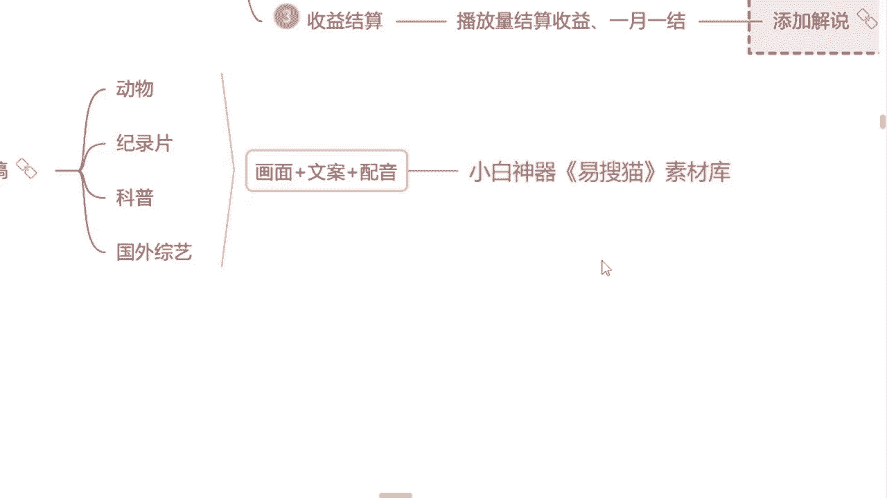
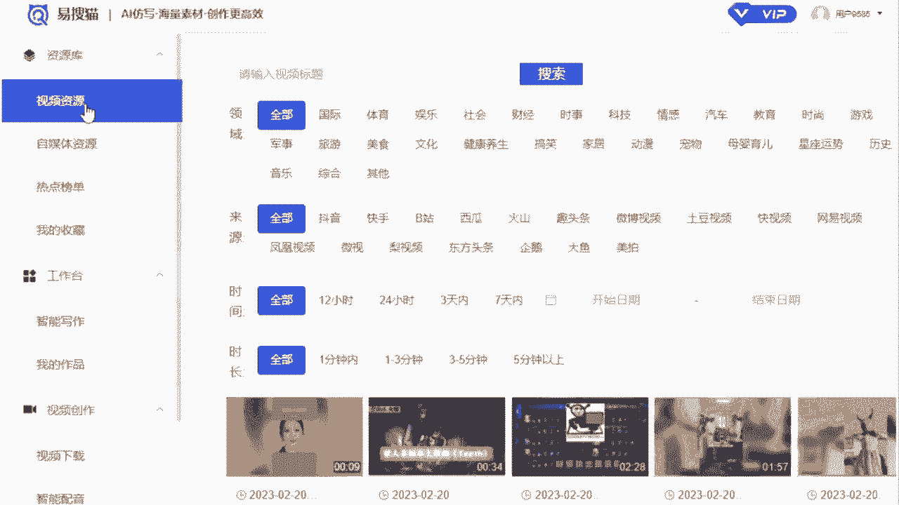
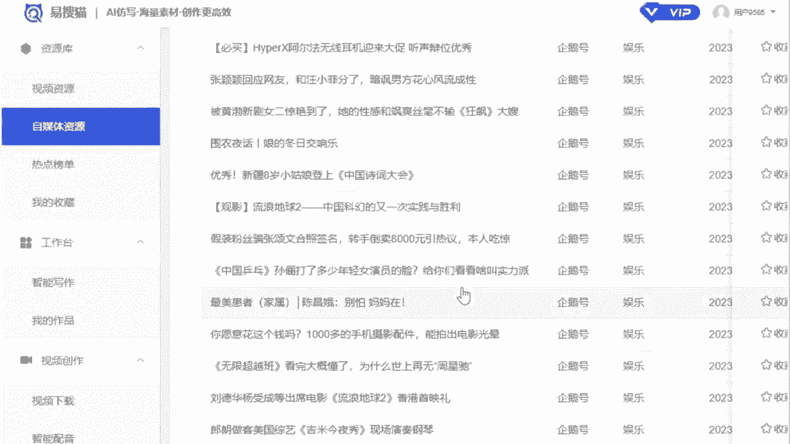
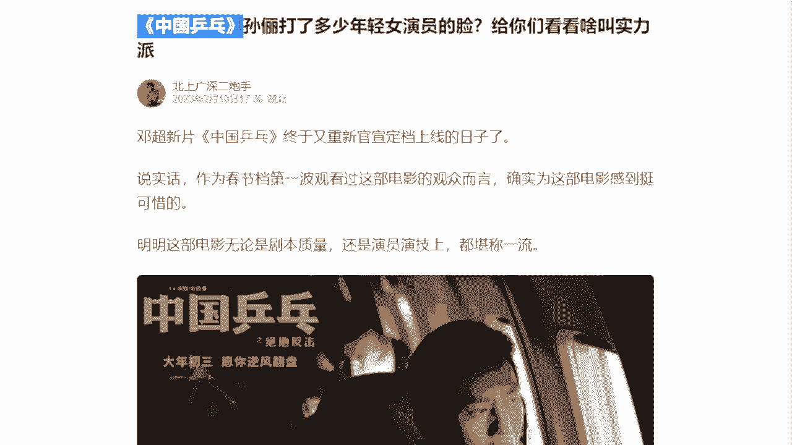
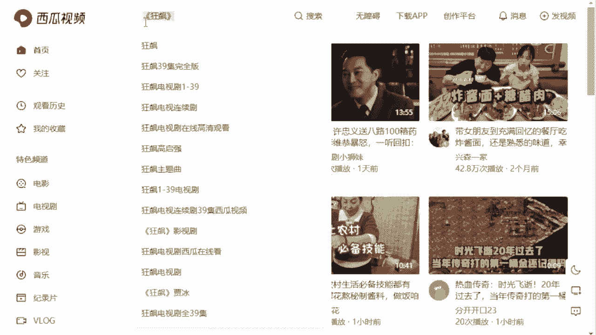
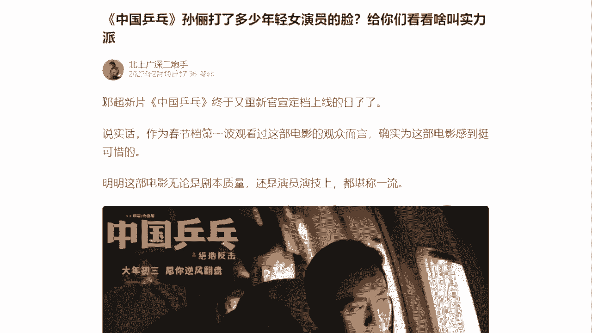

# 《自媒体全套运营教程》强推！零基础保姆级自学自媒体运营教程（方法+实操），自媒体变现必学全套运营逻分享抖音起号运营思路：找账号-定形式-抄选题--复制爆款！ - P12：11.小白神奇素材库 - 看車就爆了 - BV1uaW6emEA6

但是我们找素材呢，我们要用一个这个小白神器啊。

叫什么呢，一搜猫的素材库，打开微信小程序里面就有一个一搜猫，然后我们来看一下该怎么去使用嘛，第一个视频资源就是所有这个平台上面的视频。

你都是能找到的，那第二个自媒体资源就是我们要用到的文章嗯，文案库包括第一个所有的领域，上边就你喜欢什么领域，你就选择什么，如果说你自己不知道你选择哪一个领域的，当然我们就往左下边看有一个什么呢。

热点榜单，看见没，所有平台上面的一些热点信息，全部给你标注出来了，我们跟着热点去做这个视频，你爆款视频的几率高达85%啊，这个爆爆款的视频呢可能会更多一点，所以说这个呢也不用你去每一个平台搜啊。

你就去这上面看就可以了，比较方便，那今天呢我们随便选择一个领域来看一下，下边有个来源，就所有平台上面的文章都在上边，你随便选，看见了吗，所有的文章这就是我们能够用到的素材了啊，包括呢我们随便来看一个吧。

我们随便选一个，我们看一看哪个比较吸引我来着。

你就选这个吧好吧，我们就根据这个文章，我们来找一找我们自己做视频的素材，首先第一个我们要找视频的画面该怎么去找呢，根据这个主题文字来，这个文章讲的是什么章呃，讲的是这个中国乒乓的一个这个电影吗。

我们直接把这一个标题复制下来。

然后打开手机，到你这个西瓜视频上面去搜索一下，这个中国乒乓关键词搜索啊。

搜索完之后来看，这就是你能找到的素材了，现在我讲到这个视频素材能不能找到了，能的来公屏上打个能字吧，视频素材能不能找到了，包括我强调一点哈，所有的视频素材一定要按照我最开始讲的。

每一个片段不要超过十秒钟，好不好，这个要记住哈，别到时候你给我说曾老师我的视频发出去，为什么重复度过高了呢，我给你讲好了啊，不要超过十秒钟，大概六个片段就可以了，视频素材能找到了吧，那第二个文案呢。

我们就从这个文章当中直接去提取就可以了，那这个文案有了过后，配音同学们会不会配会的，来公屏上打个会字吧，不会能打不会会配音吗，会配音的，咱们就自己去配好不好，不会配音的呢，额咱们就找素材怎么找呢。

我们去利用工具嘛，我们直接把这一个文案，我们直接给它复制下来。

复制下来了，过后来返回一搜猫的首页，左下角有一个智能配音，来把文字直接粘贴上去，右边呢有非常多的声音风格，你喜欢哪个声音选哪个好吧，成熟大叔的呀，高冷御姐的萝莉的，还是这个学霸男生的。

喜欢哪个选哪个好不好，选完了过后呢，右下角这个语速给他放快一点音量，咱们给他调大一点，然后左下角有个什么呢，试听配音，来，咱们来听一下，邓超芯片，中国乒乓终于又重新官宣定档上线的日子了，说实话。

作为春节档第一波观看过这部电影的观众而言，确实为这部电影感到挺可惜的，明明这部电影无论是剧本质量还是演员，演技上都堪称这样，一来是不是觉得方便了，觉得方便的来公屏上打个方便吧，是不是现在我们声音也有了。

不用你自己去配了，是不是这个过程当中，除了这一个一搜猫之外呢，配音软件呃，微信小程序上也有啊，像这个配音神器你们也可以使用的，来给你们打出来吧，配音神器，当然配音神器呢他就需要花钱了啊。

配音神器呢一个月是29块钱，这个我不卖软件啊，这个你不交给我，你是交给那一个小程序的好吧，当然这个一个月29块钱，问你问一下同学们愿意花吗，愿意的来公屏，公屏上打，愿意吧，29块钱愿意花吧。

咱们得记住一句话啊，小投资大回报，它能给你带来的收益远不止29块钱，就我们所讲到的1万播放量都不止29了，是不是对了，我们要向前看嘛，不能不能只在只在意这个当下的利益，是不是包括刚才有一个同学说。

这个怎么能连接上对应的情节呢，当然我们做解说，他有两个这个不同的这个模式，一种模式呢只是你介绍这一个电视剧，他的一些情节，这个也叫做解说，一种解说呢它是相对应的去对应这个情节去说。

比如说我今天去讲一下哪一个电视剧，这个片段当中发生了一些什么样的事情，这是两种不同的类型啊，当然第一种我们刚才说到的，你只是介介绍这个电影或者电视剧，你就用这种方式最好的。

那第二种呢就是你在找素材的过程当中，可能你费的时间要多一点，你找视频的时候，你就根据这一个文案，你要去找对应的这一个视频啊，这样讲能不能明白，刚才我看是哪个同学提出来的啊，那个小云同学。

我这样讲能明白吗，能的来公屏上打个能字吧，我这样讲能明白吧是吧，一样的啊，我们都能对应上这个素材的好吧，除此之外呢，就很多同学说曾老师除了这种方式，没有其他方法可以做解说了吗，当然有啊。

问一下同学们有没有想做纯原创的文案的，有的来公屏上打，有字就纯原创的，我想自己写，我真的之前遇到过啊，有个同学告诉我，曾老师，我就想自己写纯原创的文案打，有的同学我欣赏你，唉，为什么。

因为纯原创的文案它的优势是什么呢，我们做一个纯原创的解说视频，所有的平台都可以去发这一个视频，但是我们找的素材就不能啊，因为如果说发多了，它会降低我们这个素材的原创度，我们自己做的这个原创的文案。

就不会有这样的一个这个劣势了。

缺点了，是不是它自自己这个播放量呢。