# 《自媒体全套运营教程》强推！零基础保姆级自学自媒体运营教程（方法+实操），自媒体变现必学全套运营逻分享抖音起号运营思路：找账号-定形式-抄选题--复制爆款！ - P12：9高阶原创 - 薇儿啊XN2011 - BV1CK4be1Ebm

好那么接下来我来跟大家讲一下，你要做收益进阶的话，一定是要做原创的，而且要做什么呢，你要在大平台上面去做。

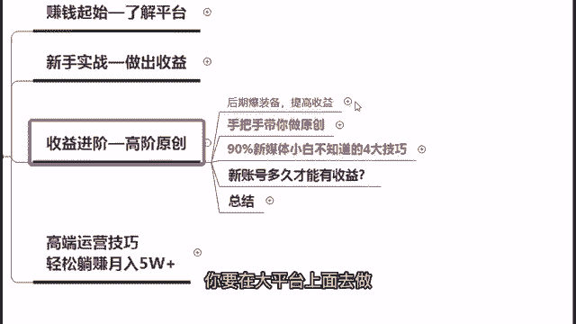

那么大平台的话，其实我们讲就四大平台。

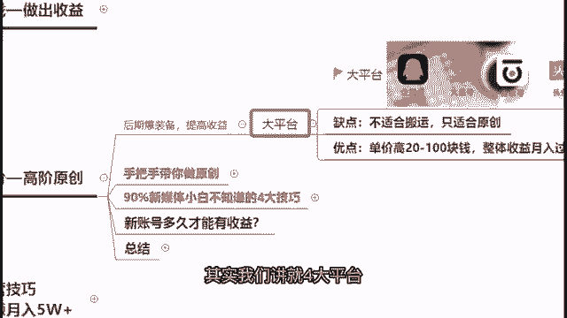

就是我们的一个企鹅号，大鱼号，百家号和头条号，这四大平台到底都有哪些呢。

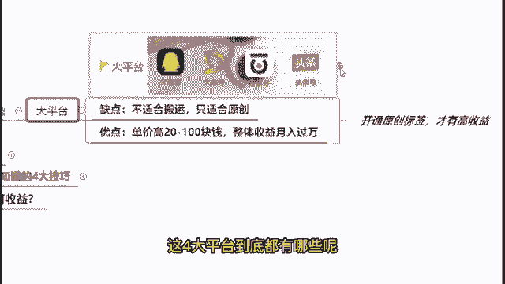

来我来跟大家一一的去讲解一下，好。

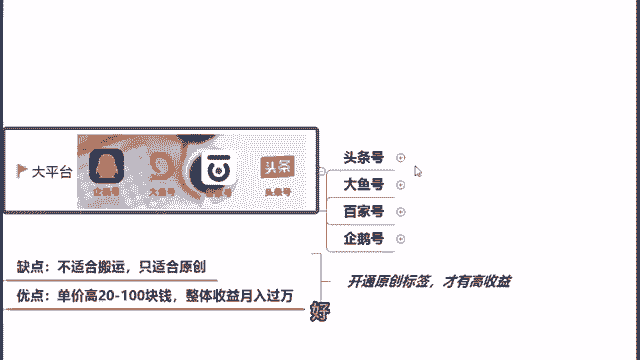

首先头条号里面它是属于字节跳动的，旗下包括了今日头条跟西瓜视频呃，实际上现在如果说做中视频计划也添加上的话，他还能够把抖音也包括进去。

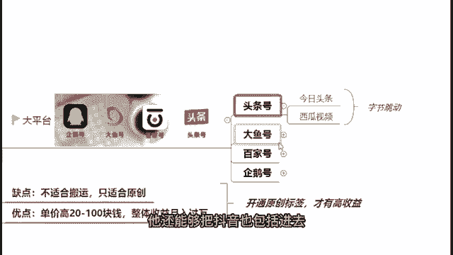

好那么再来大于号的话，它是属于阿里的啊，旗下有包括了UC浏览器以及优酷视频两个，那么再来还有就是我们那个百家号。

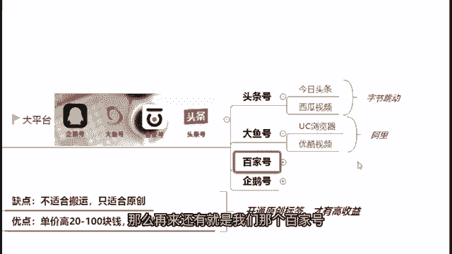

百家号是谁呢呢，是百度的，包括了有百度新闻跟百度浏览器。

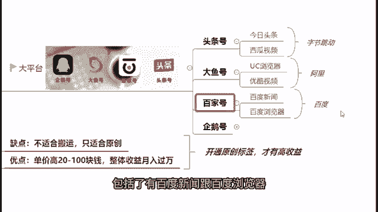

企鹅号是腾讯的，包括了有腾讯新闻跟腾讯视频等等这些方面，好那么在这边的话啊。

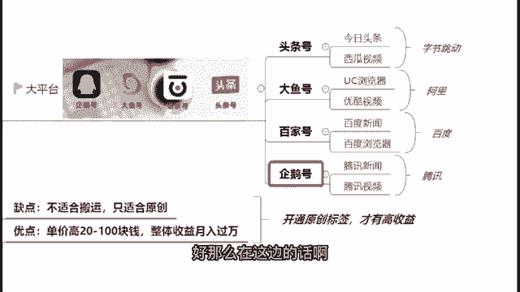

我来跟大家讲一下啊，如果说刚刚讲没通过，没加上的同学们不要着急，我们的云云老师正在逐一的添加，大家都会在课后啊，我们会把所有同学都加上的啊，所以说大家不要着急啊。

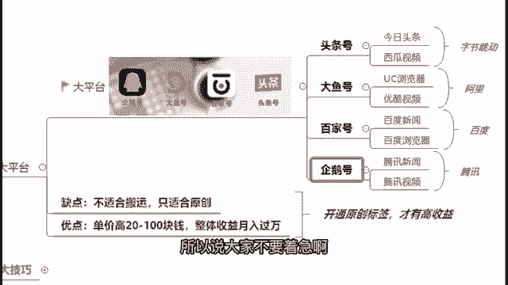

先听咱们接下来的一个课程分享，不然时间就拖得太长了。

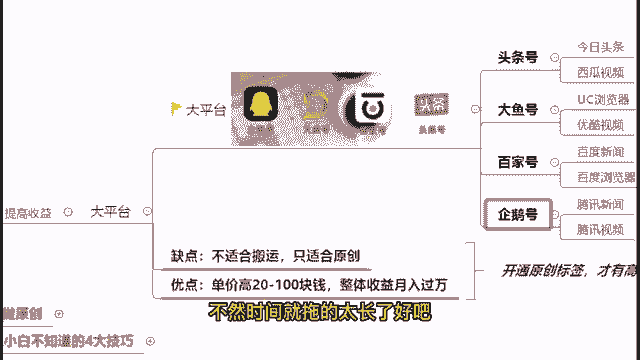

好吧好，那么在这边的话啊，我们来讲讲大平台是这四大平台，然后这四大平台的话都是不适合做搬运的，只适合做原创，但是它有个优点，就是你在上面做原创的话，单价都是普遍比较高的，都能够有在20~100块钱不等。

整体收益，你做好了的话啊。

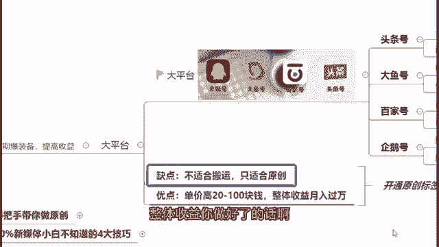

月入过万都是比较简单的事情，但是前提是你要开通了你的原创标签，才能够有高收益好。

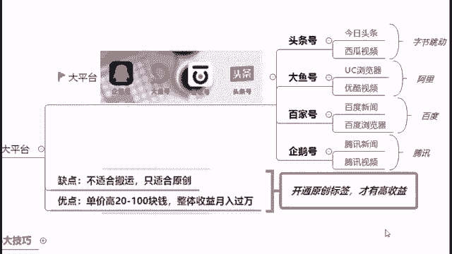

那么在这里哎我也给大家看一下，我们前期新手刚开始做的话。

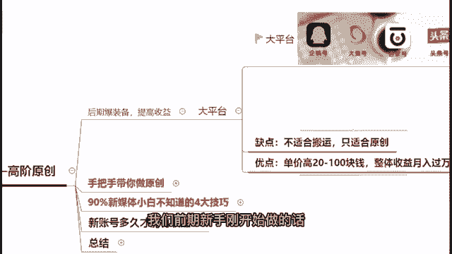

怎么样做原创，又方便又简单又快捷呢，首先我建议大家去做一个图文的原创啊，做一个原创的图文，为什么我建议大家去做图文，而不是首先建议大家做视频呢，首先两个要点，第一个你需要做剪辑，第二个耗时非常长啊。

那么如果说做图文的话，你的耗时是比较短，而且你的收益是可以做到比较高的。

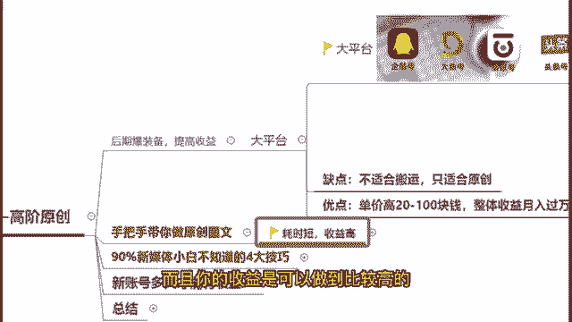

那么在这里同样我找到我的这个号。

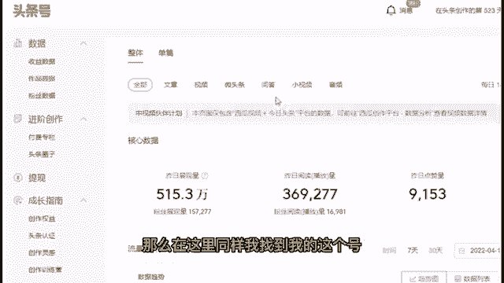

来给大家看一下，然后我看看这个收益数据拿出来给大家看一下，这个是我前段时间的一些收益，那么在这边我给大家看一下，这一天3000多的一个总收益的情况下，文章收益实际上是占了2600多的。

那么再往下面这一天一天下来4000多的收益，我的一个文章收益就占了4000多，我的视频收益其实只占了300多而已，那么在这里的话，所以我就给大家看一下，就是啊其实你做文章只要做得好的话。

你是可以用比做视频更短的时间，但是又能够有更高的一个产出的啊，我不是说空口来跟你们讲，而是我确确实实有这样的一个数据支撑，来跟大家去举例，我做文章，确确实实能够做到，比视频高出上千倍的一个收益好。

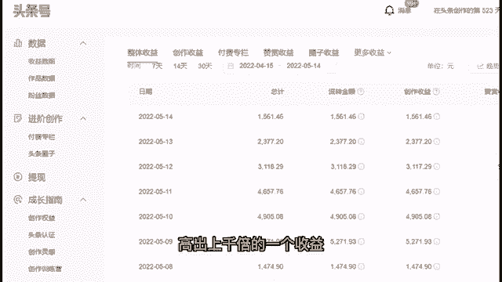

那么在这边来跟大家讲一下，我们做图文原创的话，到底该怎么样去做呢。

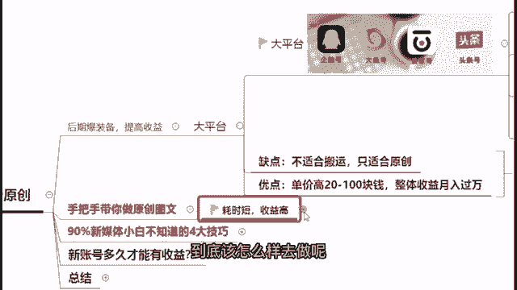

好那么在这边首先第一步我们可以去寻找素材。

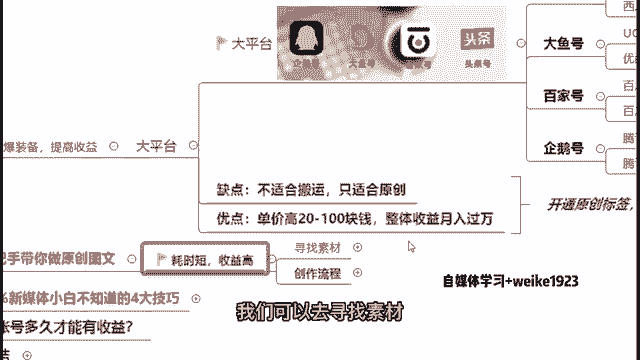

好那么在这边啊找素材我们可以去哪里找呢，你比如说像音频平台或是视频平台去做，都是可以的，然后你在上面去做的话，该怎么样去做呢，你可以下载这个音频或是下载这个视频，然后给他做一个语音转文字。

提取相应的文案出来，然后再做一个加工啊，然后变成你自己的一个啊图文内容，然后当然还有一个更简单的方法。

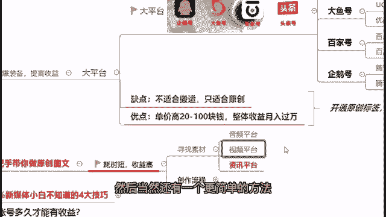

如果说你不知道该怎样去做这个，语音转文字的话，你可以去从资讯平台上面去找文章好。

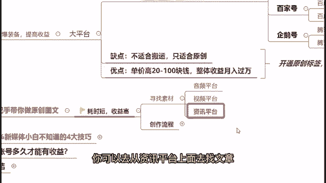

那么怎么样去做呢。

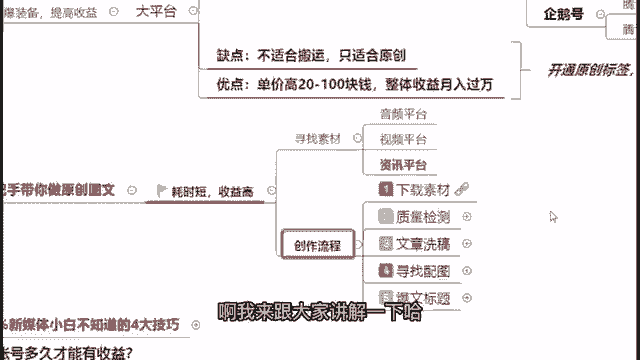