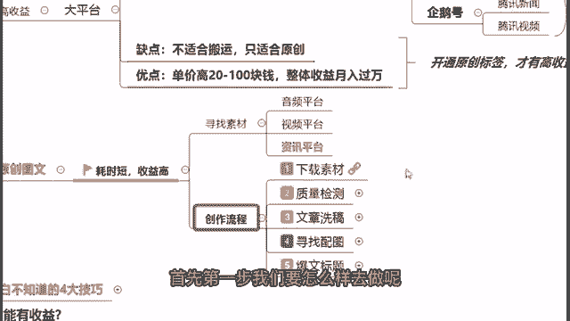

# 《自媒体全套运营教程》强推！零基础保姆级自学自媒体运营教程（方法+实操），自媒体变现必学全套运营逻分享抖音起号运营思路：找账号-定形式-抄选题--复制爆款！ - P13：10图文原创流程 - 薇儿啊XN2011 - BV1CK4be1Ebm

好那么在这边首先第一步我们要怎么样去做呢。

来首先先找素材，然后我们把素材下载下来。

对啊为什么我要跟你们说做这个图文呢，这不就是视频，其实你要去做的话啊，你怎么样去判断他原创，以及你要去做这个剪辑呢，都是很费时间的，但是图文来你跟着我一步步来做，一步步来看，首先第一个。

我找的这个是一个甄嬛传的一篇文章啊，就是说一个同学他对于甄嬛传的一些解读，解说的一个图文，为什么我找这个呢，其实就是想告诉大家，就是首先你做图文的话，你不要找那种就是需要啊一些权威机构才能够。

适合发的一些内容啊，你可以找这些娱乐类的，生活类的，大家都都能够做解读，发的这些文章，你比如说像甄嬛传，大家都可以看甄嬛传，都可以有自己的一些见解的，那么你就可以去发，因为对吧，所有人都看甄嬛传。

那么所有人都可以有自己的一个解读，而不用说你如果说做财经啊，科技这种啊的话，你没有一个，比如说你没有一个相应的资质，你没有这个机构认证，你是很难去发这个啊文章的，因为这样是嗯平台，它会给你有一个判定啊。

动漫是可以的，因为动漫的话每个人都可以看，也每个人都可以有自己的一个解读，而我找的这个就是今日头条的哈，今日头条的好，那么在这边啊，我来看一看这篇甄嬛传讲的是什么啊，就是讲了这个啊雍正啊，跟这个龙凤胎。

以及甄嬛背叛他的这样的一件事情，首先第一步我们要做什么呢，我们先把这篇文章给它复制下来好，我找了一个文件啊，我给他先复制下来哈，来这里大家看一下，我找了一个文本文档，然后我把这个文本文档给他复制了下来。

来大家看一下，是一模一样的哈，雍正到死都没明白龙凤胎的名字连起来念，就是甄嬛背叛他的证据，然后啊这个后宫甄嬛传啊，我是完整的在它复制了下来，那么复制下来之后，我们要先做什么呢，我们要先做一个质量的检测。

你比如说啊下载下来之后，我们可以先用E转或者小火花。

检测它的一个原创度，如果原创度是低的话，你是不能发的，但是检测出来原创度高的话，那么OK没问题，你可以发好，那么首先在这边好。

我们来找到我们的一个小火花，来点开我们的一个实用工具，在这里有一个文章的查重来点击进去，使用把我们刚刚的这篇文章给它复制进去，我们先来做一个文章的查重，来复制进去，啊为什么要查重呢。

其实如果说上大学有在写学术论文的人，应该都知道哈，我们以前写学术论文，都是要在知网上面进行查重的，对不对，好，那么以前我们做知网查重的时候啊，我们的一个查重率只要不超过30%。

都可以判断你的这篇学术论文是原创的，是属于你自己创作出来的一个学术论文啊，所以说这个的话也是一个类似的一个例子，我们可以把所有的一个文章放在上面去，进行一个全网的一个对比查重，如果说查出来啊。

你的这个原创度啊是比较高的话，那么你就可以对吧，没有任何问题，那么证明平台以及我们的这个小火花或是易传，都认可你这个文章，他是原你自己原创的，但是如果说你的这个原创度是比较低的话啊，那么没办法。

你就不要去发诶，怎么一直在闪，我看一下是我这个网有问题吗，我看一下他刚刚一直在闪对吗，看一下是不是我这个网络呃不太好啊，他还在检测当中，来我们来给点时间，我们给他重新检测一下吧，刚刚闪了一下。

感觉像对他，应该是我的这个网稍微有点卡啊，大家稍等一下下，怎么还要验证，好我们现在重新开始验证啊，这个文章的一个原创度来进行一个检测啊，就是跟大家说，如果说我们在上大学写学术论文都是这样。

通过知网查重的一个方式的时候，那么我们现在在平台上面发这些图文，也是一样的，我们可以通过易传或者是小火花，这样的一个平台在全网去检测你的一个原创度，重复度高不高，它实际上就是检测你对这个啊。

重复度是不是高嘛，对吧好，所以说啊在这边的话，我们首先第一步，先检测一下你的原创度到底怎么样，好那么这一篇我们纯粹复制过来的文章，显示多少只有40%的一个原创，为什么，因为我们是纯纯的一个复制粘贴。

那么当然它也显示了原创度很低啊，不建议我们发布好，那么我们现在该怎么做呢，首先啊我们把这里清空，然后我们该怎么样去做我们的这个原创图文呢。

我们可以来做一个文章的洗稿。

这个洗稿是什么意思呢，洗稿其实就是我们近义词的一个替换。

举个例子跟大家说一下，洗澡前你可以说什么，这只小猫真可爱，我好喜欢，洗稿后可以变成什么呢，这只小猫真好看，我太爱了对吧，这个就是洗稿，这个啊换在我们上大学写论文的时候，叫做降虫，对我已经看到有人说了。

那么洗稿，当然我们现在不需要我们人工，一句一句地去洗稿。

我们可以运用一个自媒体，顶尖的智能洗稿工具去洗稿。

什么工具呢，来给大家看一下，这个叫做智媒AI伪原创的一个工具，然后找到这个单片模式，把我们刚刚复制下来的全选，然后粘贴，好全选粘贴进去之后，我们点中间的一键转换。

来我们来看一下这个转换之后它变成什么样子。

来我们看一下前面第一句话，后宫甄嬛传应该算是一部女人大戏啊，洗稿之后变成什么呢，甄嬛传应该算是一部女性大剧，好露面，我们来看一下雍正到死都没明白啊，龙凤胎的名字连起来念，它变成了什么。

雍正到死不明白龙凤铜陵对吧，而我们其实可以看到整体的这个啊，你可以发现他的这个中心意思，是没有发生任何的一个变化的，但是它的用词用句是已经发生了改变了，那那么所以说在这里，我们可以通过这样的一个方式。

方法来解决我们的一个智能洗稿好，所以说把我们刚刚写好稿的一个内容，我们把它复制下来，复制下来之后，同样的哦，我们给它做，这里我找了一个文本文档，做了一个粘贴，来把刚刚的一个写好稿的内容做一个粘贴。

然后同样的找到我们刚刚的小火花，重新输入进去，好找到我们刚刚的小火花，把我们写好稿之后的一个内容给它输入进去，啊这个时间我们就不复制了哈，好那么在这边的话，我们重新的对文章进行查重看一下，好。

现在就已经可以发现重新写好稿之后，我们的原创度已经啊是一个飙升的状态，从原来的三四十%的一个原创度，然后现在就已经可以做到一个，七八十%的一个原创度了，好我们现在再来等待他一下下哈啊。

我看到有很多同学问这个软件是什么啊，那么在最后呢，我会把我所有在用的一个软件告诉给到大家，好吧啊，这个我会在所有最后的时候，我再把我所有在用的一些软件告诉给到大家，那包括现在在用的这些软件啊。

全部都会告知给到大家，我们现在先来看看这样的一个效果，好，现在我们已经可以看到了哦，我们这个文章经过洗稿之后，它的原创分值已经变成了84%，而且它上面有一个发布建议，恭喜文章原创度较高，可以直接发布。

对不对好，那么这个的话就是你如果说你要开始做原创，要可以做这个原创的话，你可以先从图文开始去操作啊，那么就不用说，因为我刚刚也看到有很多同学在公屏上说啊，做这个影视啊，不做这个视频啊。

这个经常被判定不是原创，那么你做图文就完全没有这种问题，因为我们是已经经过了这个文章查重的，已经是被认可，这个原创度较高，可以直接发布的，那么就没有任何的一个问题。

你只要发出去就一定可以认可是原创好，那么在这边好，第三步，写好稿之后，我们可以开始来寻找配图啊，寻找配图我就不跟大家去讲了哈，你直接百度搜索就OK了，对不对啊，百度搜索这个找配图，大家谁还不会甄嬛传嘛。

你随便找几个甄嬛传的这个剧照啊，剧情啊，图片啊就已经可以做这个配图了啊，没有任何问题，然后再来啊，我们可以做这个报文的一个标题，当然也知道标题其实是很重要的，那么我们标题可以你怎么样去操作呢，啊。

首先其实第一个，我建议大家可以做一个三段式的标题好。

那么在这边来跟大家讲一下，我们要做标题可以怎么样去做呢。

这里有一个标题助手来给到大家，有一个标题的一个格式好，那么在这边呢大家看一下啊，首先在这里呢我们有这个对比式的一个做法啊，有这个数字效应式的做法，悬念式的一个标题格式啊，强调式的标题格式。

你比如说这种世界上最伟大的十个公式，没有之一，又或者是这种悬念式的一个格式啊，凭什么看上30岁新欢等等，这些方面你可以发现啊，我们这里是提供了非常多不同类型的这个报文，标题的格式。

你只需要根据你的一个文章内容，找到你想要的一个报文标题格式，然后给它套用进去就已经OK了啊，这样的话大家就不用担心说啊，我们现在啊做标题到底应该怎么样去写啊，其实你现在直接我们都有这个啊。

套用的一个模板，你把你的文章内容直接套进去就可以了，然后我看到有同学问什么是三段式的标题哈。

来看一下，雍正直到死都不明白，龙凤同名是甄嬛背叛自己的证据，这个就是三段式，第一句啊，第一段，第二段，第三段，这个就是一个三段式的一个标题，基本上现在做自媒体的话，三段式标题是最容易出报文标题的啊。

都是比较我们自媒体人常用的一个标题格式。

三段式标题是算一个比较标准的一个格式吧，当然哦，我们这里标题助手里面也有很多，不一样的一个格式哈，你可以都看一下啊，你需要不同的一个方式，方法的话都有不同的格式可以去做。

反正你可以直接在这里套用你想要的一个标题。

