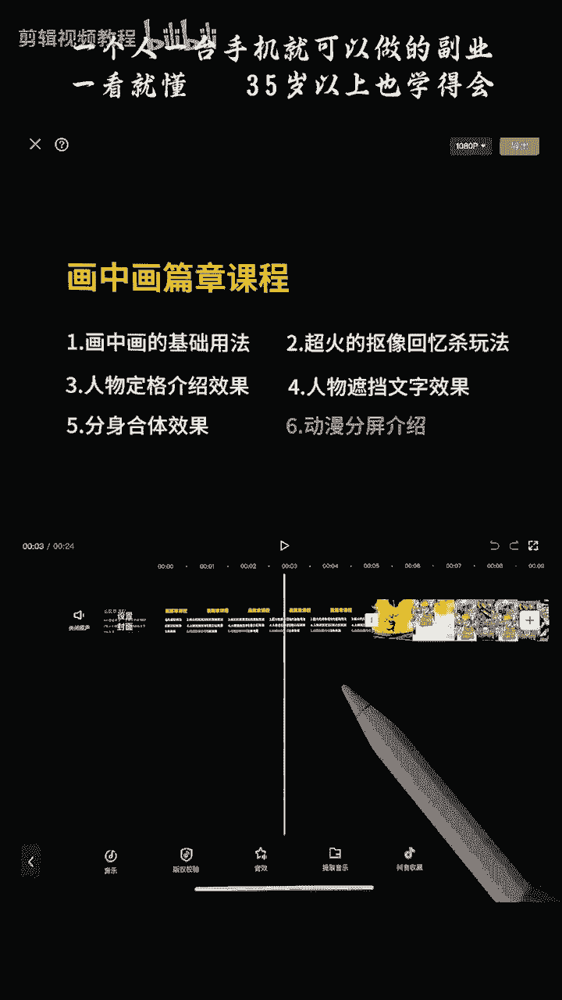
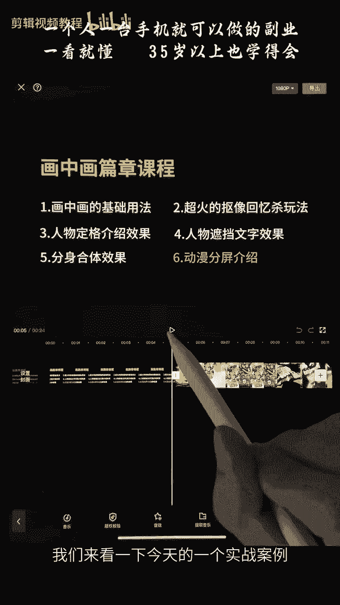
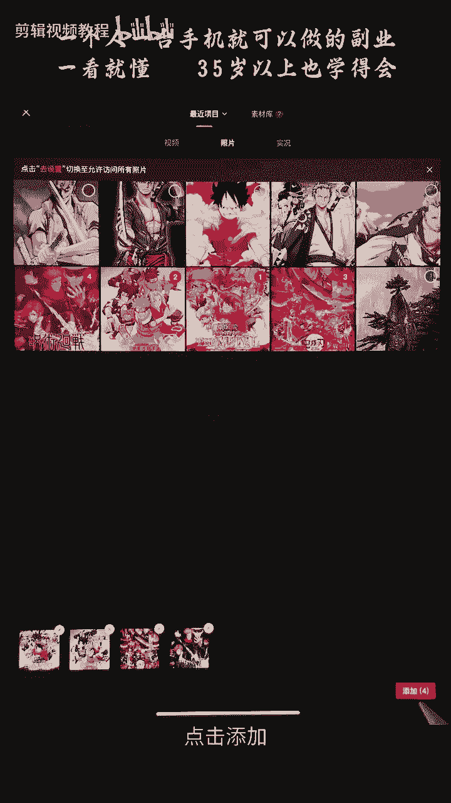
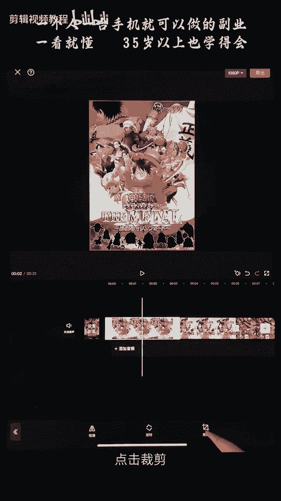
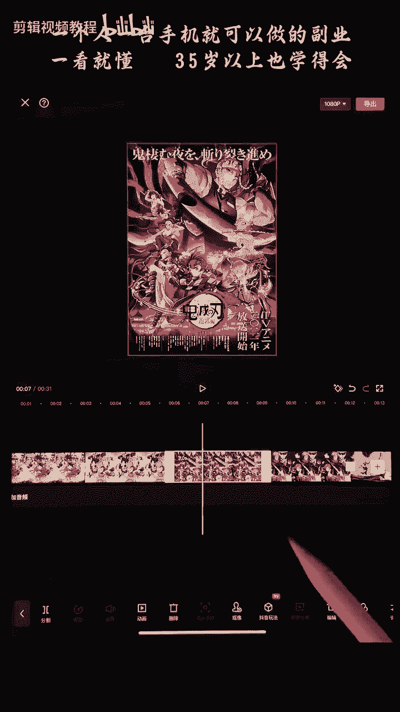
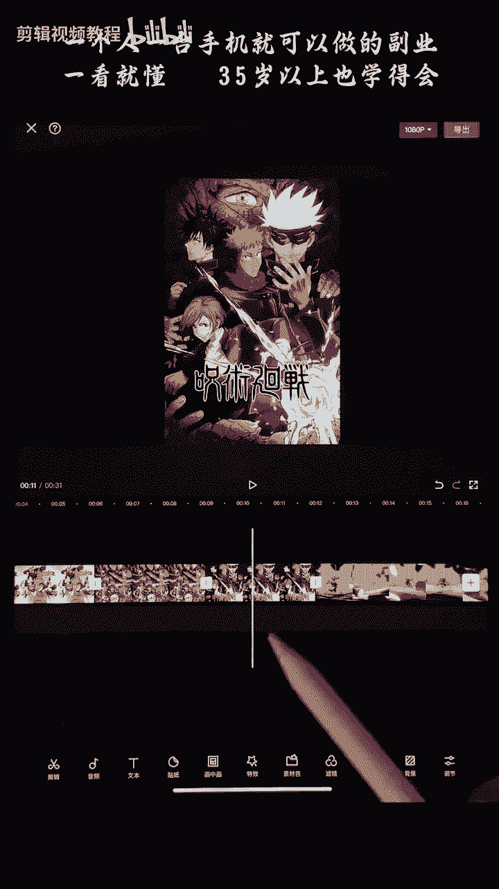
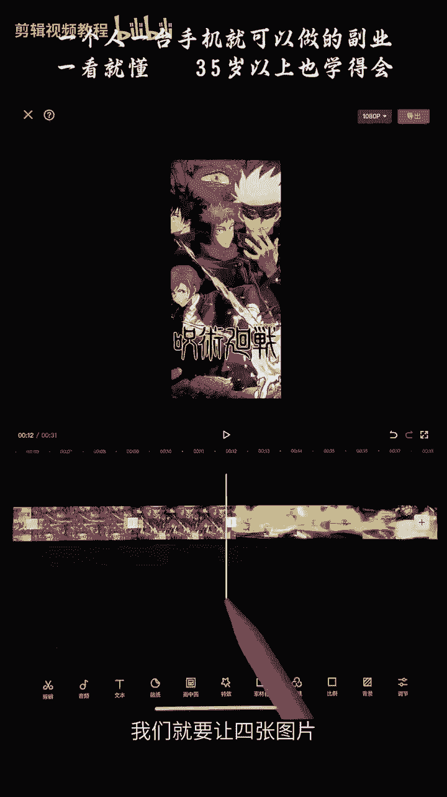
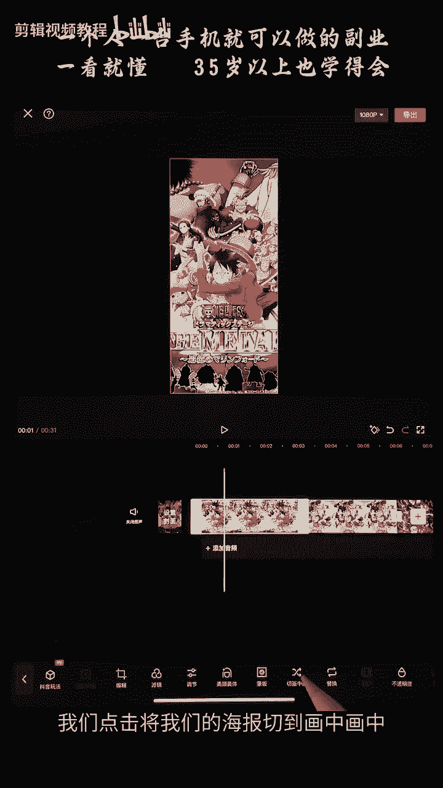
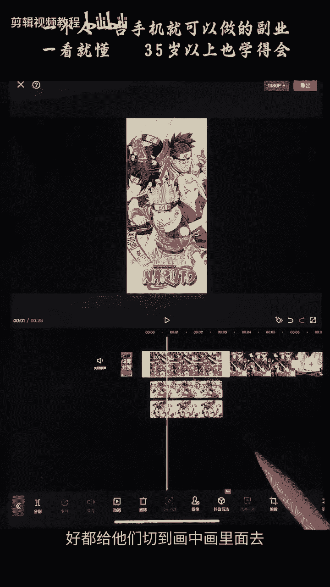
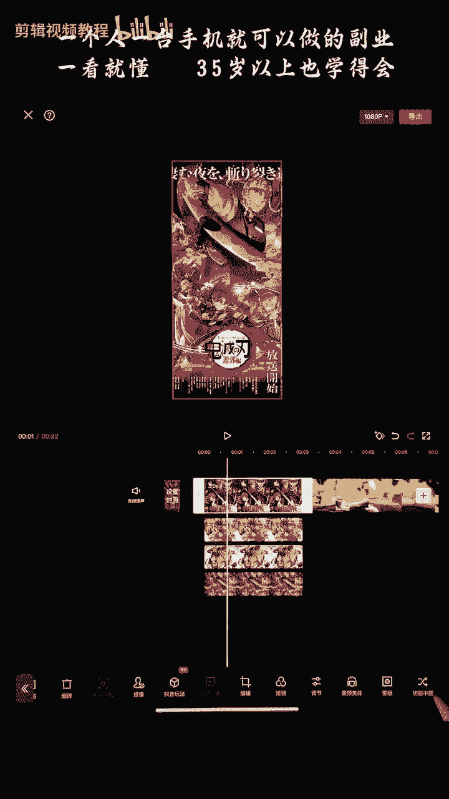

# 《自媒体全套运营教程》强推！零基础保姆级自学自媒体运营教程（方法+实操），自媒体变现必学全套运营逻分享抖音起号运营思路：找账号-定形式-抄选题--复制爆款！ - P17：【手机版】动漫分屏效果介绍 - 看車就爆了 - BV1uaW6emEA6

大家好，我们今天来学一个画中画篇章中的一个动漫，分屏效果，我们来看一下今天的一个实战案例。

just so you want的夜色，那个带领的女人，Love love love love，可可爱情等着用你的三条桥，桥面人家打着好，这个案例是如何制作的呢，我们现在正式开始点击开始创作。

将我们为大家准备好的这个视频素材呢，导入到我们的里面来，将视频素材导入进来，点击添加，it's all only one的意思，接下来呢我们将图片啊，这里的话给大家准备了四张图片，将它们导进来。

点击图片将我们海贼王火影忍者，鬼灭之刃，还有这一个咒术回战的四个海报，给他导入进来，点击添加。

那么这四张海报就被我们导入进来了，接下来呢我们首先第一步，对这四张海报进行裁剪，首先选择它，点击下面这里有个编辑，选中，点击编辑，点击裁剪。

选择5。8，勾选好每一张海报呢，我们都给他改成5。8的这个比例。

古典八。

这个比例呢你们选中5。8之后呢，是可以去调整它的位置的，调整它的位置的，好给他勾选一下，这样的话，四张图片我们就已经把他的比例做好了，接下来呢，我们就要让四张图片出现在我们这上面。

那么我们就用到了我们的画中画，我们点击将我们的海报切到画中画中。

好都给他们切到画中画里面去。

好，这样的话呢，我们的这个图片就会出现在我们的视频上方了，视频上方了，接下来呢我们就给他们排一下它们的顺序，我们点击我们这里的层级，点击层级好，我们将海贼王呢拖到最前面来，这里是海贼王。

可以在这个小窗口里面看到，将海贼王拖到最前面好，第二个是火影忍者，给他排在第二，第三个是我们的鬼灭之刃，排在第三啊，这个层级呢，我们在前面的篇章中已经有学习到了，好给他勾选一下。

那么我们就得到了这样的一个效果啊，我们先把四张海报呢给他排列一下，海贼好，接下来是我们的鬼灭之刃，好最后呢是我们的这个咒术回战啊，在后面的好，这样的话呢我们就已经初步排版好了，初步排版好了，接下来呢。

我们就对他们添加一个入场的一个效果，我们选中这个海贼王的点击啊，我们下方的这里有个动画，选择一个入场动画，选择一个入场动画，我们这里呢可以选择一个向下滑动，向下滑动的一个转场，找一个向下滑动，这个好。

我们将速度呢稍微给他拉慢一点点啊，拉到差不多一秒钟左右，好勾选一下，接下来呢我们对这一个火影忍者的一个，也去添加一个入场动画，好也是添加一个向下滑动，时长呢一定要去拉啊，让他们的一个时长是一样的。

接下来每一个图片呢都是这样去操作，都是这样去操作它，向下滑动，好，这样的话我们就有四张图片，从上面滑下来的一个效果，笑死了好，接下来呢我们就让它逐个出现，我们先把这一个时间轴给它放大一点，放大好。

然后呢我们在这里第十的时候啊，将我们的火影忍者拖到第十，这个地方第十啊，那么接下来每隔十个F看到没有，这里有二十十二十对吧，前面也有讲到的，再出现我们这个鬼灭之刃好，那么到一秒的时候呢。

再出现我们的这个咒术回战，咒术回战好，那么我们就得到了这样的一个效果，this is all only one的LIS好，这个效果呢我们就初步完成了，接下来呢我们就要让他们出去对吧，从这边滑到这边出去。

怎么操作呢，我们这下面呢有一个叫做啊动画，给他们可以添加一个出场动画，出场动画，那么我们只需要将这后面的三个先给他移出去，就可以了啊，因为我们后面的话第一段是海贼对吧啊，第一段是海贼王的。

所以我们不用移出去好，我们等会会在这边呢加一个啊，对应动漫的一个图片，对应动漫的图片好，所以我们接下来呢，就对这个火影忍者添加一个出场动画，我们添加一个向左滑动，我们看一下在下面出场动画这个地方。

找到我们的向左滑动啊，向左滑动啊，在这啊，我们这里呢动画呢前面这个一秒青色的，这个呢就是我们入场动画的一个时长，后面这个红色的写着无0。5秒的，就是我们的一个出场动画的一个时长啊，这个地方我们要清楚啊。

不要搞错了，好勾选一下好，接下来呢我们为这一个也给它添加一个动画，出场动画啊，也去给它添加一个向左滑动的一个效果啊，时长呢我们先让他们的时间先是0。5秒啊，时长时间0。5秒，点击动画，点击出场。

向左滑动啊，都让他们0。5秒，所以我们来看一下效果是怎么样的，好我们来看一下，好那么就是他们播放完之后呢，他们会一起出去对吧啊，那么我们如何让这一个呢更早出去呢，这个呢慢一点，然后这个最慢呢对吧啊。

就会有出现那种折叠的一个效果，我们如何制作，我们先选中这一个点击它的动画，我们让它的动画呢更提前一点啊，比如说我们可以啊，0。9啊，还有0。9或者0。8啊，0。8吧，0。8啊。

那么这一个是第二个出去的对吧啊，我们现在就得到了他一个先出去的一个效果，先出去对吧，先出去啊，那么接下来呢这第二个呢，我们可以选择0。6啊，0。6啊，我们每隔0。2秒呢就一个对吧，0。2秒一个好选择。

海贼王点击动画啊，现在的话0。6-0。2就等于0。4对吧，我们来看一下效果，that's all you wanna li嘶啊，他们就会有一个依次折叠进去的一个效果，对吧啊。

这样的话看起来效果会更好一点，更好一点好，接下来呢啊它折叠进去之后呢，我们的海贼王呢去给它拉长一点啊，拉长啊，因为我们后面的海贼王还是要继续对吧，好，等到我们这后面呢出现了第二部动画片的时候。

我们再去啊换另外一张图片，我们给它拖动好到这里对吧，后面是火影忍者的火影忍者好，那么我们就要将这一个呢啊，将这个图片呢去往后拖动啊，拖动啊，拖到这个地方好放手好，那么接下来后面的画面呢就是我们的啊。

我们的火影忍者，那么我们如何制作呢，我们可以点击这个火影忍者给他复制多一份啊，我们点击复制，点击复制，将它呢给它移动到我们这后面来，移动到后面这个地方，移动到后面啊，那么我们就得到了这样的一个效果啊。

嗯对吧，它从上面滑下来的一个效果啊，但是呢啊我们这里呢要给他调整一下它的位置，对吧，调整它的位置给他放到最左边这个地方来，好，最左边的地方来啊，因为我们是复制的，所以我们这一个呢，火影忍者的这个海报。

是有一个从上往下滑动的一个效果的啊，然后他还有一个往左滑动的，一个出场出去的一个效果对吧，我们刚刚前面这里有添加过了啊，所以的话这里我们不需要出场，我们怎么操作，我们将点击动画啊，点击出场动画啊。

你们可以在这前面呢给他选择一个无啊，在出场动画里面选择无，如果是入场动画，不要就在入场动画里面选择无啊，我们这里选择出场动画啊，可以给他选择无啊，对吧好，那么这后面就没有了，没有出场动画了，勾选一下好。

那么我们要在这里海贼结束之后呢，啊这在这里啊，海贼王出演结束之后出现火影忍者对吧啊，我们看到它滑下来是需要时间的，需要时间的对吧啊，那么我们在它滑到底部的这个时间呢，我们的海贼王是不能消失的，对吧啊。

那么我们往前滑啊，滑动给它拉长一点对吧啊，在我们火影忍者这个海报下来的时候呢，海贼王的画面不要消失，不要消失好，那么就有这样的一个效果，好那么去延长这一个火影忍者的这个视频啊，滑动到我们的鬼灭之刃出现。

对吧啊，在这个地方啊啊好，那么接下来呢，我们就是把鬼灭之刃的这个也给他复制一下，复制好拖动拖动啊，拖动，拖到我们这个地方去对齐啊，让他这个鬼灭之刃出现呢，我们就有这个动画滑下来对吧，滑下来好。

我们先将它也是移到最前面的地方，来移到最前面，然后呢点击动画，将他的出场动画呢给它改成没有啊，没有勾选好，那么接下来呢我们只要把这个火影忍者呢，也要去延长它一点，延长到我们的这个鬼灭之刃的海报。

滑下来的时候再消失，好到这里再消失啊，长一点也可以的哈，长一点再消失也可以啊，因为他是盖住的啊，他是盖住的，如果你们的层级错误呢，你们可以点击它，点击层级对吧啊，让这一个呢是盖在海贼王啊。

盖在我们的火影忍者上面的，对吧好，接下来呢我们继续去把这个变长一点，好，到这里出现了我们的咒术回战对吧啊，到这里结束，后面是咒术回战的啊，同样的道理，我们点击，然后选择复制的复制它啊，然后将它拖到这里。

好，拖到后面这个地方好拖到后面这个地方啊，然后将它放到前面来啊，放到这最前面这个地方啊，放手啊，出场动画呢啊也去给它关掉关掉，好这个呢延长一点延长一点好，OK然后给它对齐我们的结尾，那么这样的话呢。

我们的一个动漫分屏的一个视频就做好了，我们来看一下，That's all only one love myself，Never a night in the need and love love。

单单单看那个叶落通，单单单单PS，我能扛着巴贝克和可可爱情的朋友，一路撒卡丘丘，别人家卡车好，这一个的话呢就是我们动漫分屏的一个效果，我们还可以怎么操作呢，啊比如说我们这里对吧。

海贼王这个画面呢我们要让它居中，这边不要太靠近这个边对吧，我们可以将这个视频呢给它切开啊，切开，因为我们前面是有个底部视频的对吧，底部视频我们这里呢可以给它切开，切完之后呢。

我们可以将这个视频往右边挪一点啊，总体往右边挪一点对吧啊，因为这边呢其实这边呢是没有的，这边是空的，这里的话被我们的这个海贼王的图片，给挡住了对吧，所以我们的视频呢可以往右移动一点，移动一点。

让我们的人物主角居中啊，居中这边啊，居中这边会更好看一点，啊对吧啊，刚刚如果不往这边拖动的话呢，我们的人就是这样的，对吧啊，太靠这边了啊，我们把它放过来一点啊，那么视觉效果呢会更好，视觉效果更好好。

那么本节课呢，我们就学了这个动漫分屏的效果啊，大家主要掌握的就是我们的画中画，还有我们的出场动画，入场动画，以及我们对每一张图片进行的一个啊，我们编辑对吧啊，然后点击裁剪编辑里面的裁剪啊。

去把这个图片的比例呢给它设置好啊，一般的情况下呢我们一个画面啊，横屏的画面呢四张图片就是5。8啊，5。8这个比例好，这个需要大家重点去掌握。

