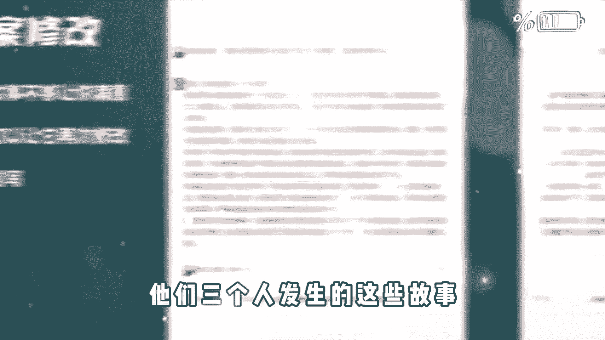

# 《自媒体全套运营教程》强推！零基础保姆级自学自媒体运营教程（方法+实操），自媒体变现必学全套运营逻分享抖音起号运营思路：找账号-定形式-抄选题--复制爆款！ - P2：AI自动创作 - 看車就爆了 - BV1uaW6emEA6

不要讲那么多，先亲下再说，我的天呐，千万别划走，因为接下来我要分享的内容。

可能颠覆你对中视频的认知，我们已经跑通了一个方法，就是中视频可以用AI工具全自动的创作，那么跑通的第一时间呢，我就赶紧过来给大家分享一下，这就相当于中视频可以帮助你全自动的搞钱了，你先别着急质疑。

看完我这个视频啊，你一定会被震撼到。

那么有的朋友可能会疑问了，凭借AI全自动创作的中视频，它能够通过中视频计划吗，它能够有很好的播放量吗，它能够通过平台的审核吗，答案是可以在分享具体操作方法之前呢，我问大家一个问题。

就是平台他喜欢什么样的中视频作品，毫无疑问，首先你视频的文案要足够的优秀，其次你的画面要高度的吻合，高度的相关，而且呢要有一定的精彩程度，这样的视频才能够获得平台的青睐，好，那么知道这些之后呢。

我们要用到三个工具，第一个就是文案创作的神器，最近火遍全球的chat g，可能有的朋友还不太了解，我简单介绍一下这款人工智能的创作工具，简单来说呢，它不是专门用于文案创作的。

但是他的文案创作能力确实是现在最强的，chat gbt的推出呢，甚至引起了很多人的恐慌，因为很多专家学者对他深度考察之后呢，发现chat gbt它不仅仅是一个人工智能的工具，他甚至拥有了人的思维。

人的情感不可能，绝对不可能，因为他回答你的问题也好，写出来的东西也好，你明显能够感觉到，这不像是一个机器人写出来的东西，它里边是有丰富的情感的，能够感受到他写东西的一种情绪，这就非常的可怕了。

但是我们做中视频计划，恰恰需要这样的一款神级的工具，那么有了高度原创，而且非常优质的文案之后呢，我们需要把这个文案进行配音，这一步就比较简单了，我们用到AI配音的工具，比如我们可以用配音神器。

这样的话我们就根据文案把配音搞定了，接下来最后一步是，我们要根据配音和文案来匹配高度相关的画面，而且呢这个画面质量不能太低，不能用剪映里边儿的一键成片儿那个东西啊，很多人教给你们，但是呢它不好用。

跟你匹配一大堆静态的图片轮番播放，这样的一种形式肯定是不行的，这里边呢我给大家推荐一个工具啊，哼哼就是三三搜帧，它会根据你每一句的文案去跟你匹配，高度吻合的动态视频，画面，非常给力，那么结合这三个工具。

我们就能够实现中视频AI的全自动创作，接下来我给大家演示具体怎么操作，建议呢，点赞收藏一下，干货非常多，首先就是ChatGPT，那么有的朋友可能会说啊，ChatGPT我不会用，也没有账号。

这个没有关系啊，我在视频的结尾会给大家一并分享，你先知道怎么用就可以了，比如说呢我们拿历史故事为例，我在ChatGPT上给大家提一个问题，就说我需要一份1000字左右的中国历史故事，你帮我写一下。

大家可以看一下，右边我截的这张图，就是他给我的答案，差不多1000字左右，写的是曹操和华佗的故事，Nice，当然我只是掩饰啊，大家可以发挥自己的脑洞，你想让他写一个什么的故事，他就会帮你自动写出来。

比如说你可以让他写一个民间故事，你还可以加上定语，比如说你给我写一个湖南地区的民间故事，或者你给我写一个偏门冷门的民间故事，它都能够帮你写出来，因为我是掩饰，所以我说的比较笼统，你提问的问题越精细。

他给你的答案也越精细化，而且呢你提完了要求他给你的答案，如果你不满意的话，你还可以追加条件，比如说在刚才他回答的这个，曹操和华佗的故事里边儿，我想让他再加入一个人物，然后呢我就跟他说了。

我说你说的故事啊挺好的，但是呢我还想要更多的人物，加入到这个故事里边，而且故事的字数不要变诶，他就把荀彧这个人物加进去了，故事一下看起来就没有那么的大众化了，可能还真的有很多人不知道。

他们三个人发生的这些故事，那么有了高度原创的文案之后呢。

接下来我们就要给这个文案进行配音了，我们打开配音工具，然后呢点击制作配音，把刚才呢我们得到的这个高度原创的文案呢，给它粘贴进去，然后呢点更多主播在里边呢，可以选择很多主播的风格。

我们选择一个自己喜欢的主播风格，然后呢让它进行配音，最后呢我们选择保存作品就可以了，我们得到配音文件之后呢，最后一步呢，就是我们要找到高度匹配的视频画面，我们用到的工具呢就是三三搜帧。

这个工具的能力特别强大，你只要输入你想找的视频画面，它的大概意思，你点搜索，它就会自动帮你找出来很多相关的画面，而且呢都没有版权，都可以拿过来，直接用，基于这样的一个功能呢。

它还有一个特别强大的功能叫AI合成视频，你只需要导入配音文件，它就会自动帮你匹配画面，我们回到三三搜真的首页，然后呢点合成视频，点击之后呢，它会根据你的台词，跟你匹配N多个相符合的画面。

我们选择好匹配的画面之后呢，拉到最底下有个生成视频，就能够生成这种高质量的原创视频了。

我们一起来看一下效果，康熙皇帝的五皇子胤麒非常有实力，为什么没有参与夺嫡，夺嫡成功的概率不大，失足的可能不小，作为皇子，只要不捅出篓子，在身份待遇上一般都不差，怎么样还不错吧好了。

那么关于以上提到的三个工具，以及他们使用的具体方法，我也给大家整理好了，你可以到我的回复中。

视频全自动就可以拿到了。