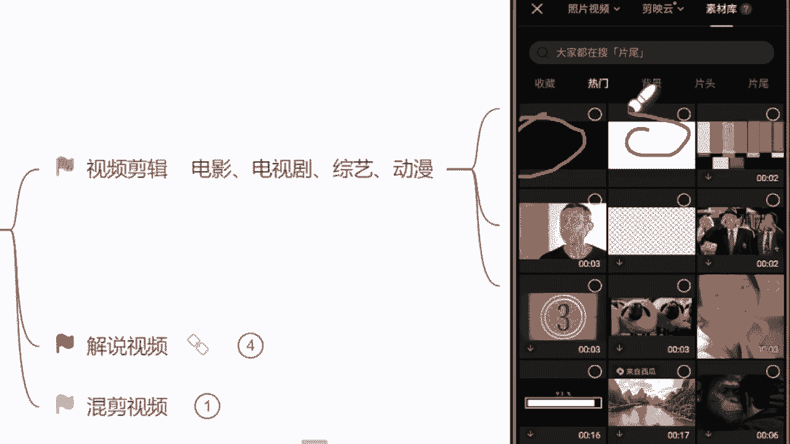

# 《自媒体全套运营教程》强推！零基础保姆级自学自媒体运营教程（方法+实操），自媒体变现必学全套运营逻分享抖音起号运营思路：找账号-定形式-抄选题--复制爆款！ - P7：5.视频剪辑实操（上） - 看車就爆了 - BV1uaW6emEA6

手机你们打手机的这个速度挺快呀是吧，生怕我看见电脑啊，好的，我看见有个电脑，有个平板了，好基本上都手机，我们这个少数服从多数好不好啊，我们就用手机嘛，因为手机更方便一点，是不是你学会了做这个视频以后。

你上下班坐在地铁上面，坐在公交上面，我们都能去做做这个视频的好吧，稍等我把这个手机投屏一下，都在拿着手机堆垒。

人看视频就是听课嘛，也是用手机，那现在同学们都能看见我的这个手机屏幕了，对吧，那首先呢第一点我们要做视频呢，我们一定要下一个软件叫什么呢，剪映这个app啊，记住啊。

他的电脑端和这个手机端图标长的都是一样的，没有什么区别啊，没什么区别，我们找到了过后呢，直接点开它。

点开了过后呢，有一个加号的界面叫开始创作界面，我们直接点击它，那我们今天呢首先选择一个这个领域的主题吧。

我们先确定主题，我们去做一个这个动漫综艺的吧，啊综艺的找一个人物，谁呢综艺你觉得谁最搞笑呢，沈腾吧好吧，我们就选一个吧，沈腾的这个综艺搞笑名场面啊，我们今天就先确定一个这个主题，那主题确定了过后。

你们在找素材这个过程当中，你们所有的视频里面必须要有沈腾这个人啊，没有他这个视频，咱们就用不了这主题相关的平台。

在审核的时候也会考察你的主题，我们点击这个加号的位置。

把我们自己找的素材我们给它添加进去，那这个添加进去过后呢。

首先来看一下我们自己做视频啊，首先呢素材他肯定都是能找到的，但是我们做的这个视频的主题诶，你找不到，我们只能自己做。

怎么做呢，来看着我们这个视频轨道，这里啊有一个加号的位置。

看见没给你圈出来了，我们点击这个加号的位置，然后找到这个手机简易里边自带的素材库啊。

自带的素材库。

我们找到它，然后在热门里面，我们可以看见非常多的一些画面和背景，包括我给你们圈出来的，像这种这种啊这种包括像往下走的这种。

像这种，看见没，这种呢我们都可以拿来当做这个背景去使用，但是零基础的同学，我们刚开始上手做视频的时候呢。

我就建议你们去选择一些更简单的，像这个黑白色的背景啊，这个我们去做呢，他做出来这个背景主题画面呢就不会特别脏，不会特别乱。

看起来工整一点，我们就选择一个黑色的背景添加进去，那这个背景添加进去了过后。

A背景有了主题文字，我们得打上去吧，问一下同学们，我们刚才说到的今天的这个主题人物，他是谁呀，来你把这个名字打在公屏上面吧，知道这个人物吗，首先主题要确定哈，这是我说到的第一点是谁，我们刚才说的沈腾。

哎对了，非常的不错，这个秦氏集团策划中同学非常不错，哎我我对你有印象了哈，现在好，首先呢我们要添加这个文字，我们要点击左下角的什么呢，这里有个文字的选项，我们直接选择它。

然后呢最左边第一个有一个新建文本。

选择它，然后文本框就出来了，那现在呢我们自己先去打字，打什么呢，先去打这个主题人物沈腾，沈腾我们今天做的是哪一个类型的，是综艺类型的，如果说他也这个，因为沈腾嘛他有自己的影视作品。

如果你选择是影视这一个领域，你就把影视两个字打上去啊，它有不同的沈腾的综艺什么呢，爆笑名场面，今天的主题文字我们打好了，但是来看一下是吧，非常白白色的东西谁都不喜欢，我们就喜欢鲜艳的，是不是。

但是现在呢我们也不用去选择什么样式啊，什么花字不用啊，你选出来你自己调整出来，这个东西花里胡哨的，就特别的难看，我们直接去选择文字模板。

咱们直接往上套，文字模板呢它有收费的，有免费的，咱们自己去选就可以了，好吧，我们就选择一个模板来看一下，同学们觉得这个模板可不可以呀，可以的来打，可以吧，就我觉得还不错，那这个模板我们选好了过后呢。

直接点击右上角这个对勾，OK它会自动去下载这个模板，用模板下好了过后呢，来放大一点，看见没，右下角有一个四边形，是吧，正方形我们给它往右边拉，放大了过，后来紧接着选择右下角的文本朗读，为什么选择它呀。

为什么选择他，知道吗，同学们为什么要选择一个文本朗读，因为我们谁都不喜欢看哑巴电视，是不是我们喜欢有声音的东西吗，问一下同学们自己会不会配音，会的来公屏上打惠子，不会的，你打不会会配音吗。

如果说自己会配音的同学，咱们就自己去配啊，因为我们自己的这个声音配出来的，在这个审核的过程当中，平台会去收集数据，别人搬都搬不走，不会不会的，我们就去选择文本朗读，看见没。

是不是每一个这个选选项它都是有作用的。

我们就选择文本朗读，里边有非常多的声音啊，有方言的，包括有这个男生喜欢的萝莉音的什么，这个女生喜欢的男士播音腔，是不是都有应有尽有，你自己喜欢哪个，选择哪个，但我更建议你们选哪个呢，选择方言音。

方言音在现在平台，它的一个使用率是比较少的啊，是比较少的，他是比较有创新点，在这里的，就很多人在听的过程当中，他会不自觉的听下去啊，首先呢我们来听一下嘛，这个声音好不好，爆笑名场面，沈腾中医报销名场面。

沈腾综艺爆笑名场面，沈腾综艺爆笑名场面，沈腾综艺爆笑名场面，是不是声音非常的多啊，你们自己选择自己喜欢听的声音就可以了，就我最近呢可能更喜欢这个广西的方言，有没有广西的同学呀，有的来公屏上打个有字吧。

有没有广西的，就下课之后可以教我两句方言吗，是不是曾老师讲课呢，讲几个小时是吧，最后教我两句好不好，有广西同学吗，广州的呀哈哈，粤语可能有点难啊，广西的声音呢，我现在觉得还是稍微有点有意思是吧。

即使我听不懂，但是我感兴趣。

我们就选择它，选择完了过后来看一下它，就会自动去下载这个音频，这个音频下完了过后呢，来从头听一下沈腾综艺爆笑名场面，OK现在音乐这个声音是有了，那现在呢我们手动去选择这个黑色的背景点，它一下啊。

点完了过后呢，我们手动的给它缩短一点，让它能够音画同步好，来看一下，看见没，现在呢这个音画它已经同步了啊，那现在我们这个主题背景做完了过后，来紧接着我们视频的本身来了。

现在就去看看什么呢，看里面有没有沈腾，看有了，那这个视频我们就可以用，如果说没有，咱们就用不了，好吧，自己去找这个，我强调一遍哈，那现在我们这个视频有了过后呢，来边讲边给你们讲细节，首先第一点。

我们做视频要去调整这个视频的什么比例，为什么要去调整比例呢，因为现在我们所有的平台它有一个硬性的标准，你做的视频必须是16比九的一个横屏，这个标准记住了啊，对了哎，这个king同学非常的不错啊。

16比九除了一个平台，哪一个呢，抖音平台啊，你把它们俩区分开来，抖音呢它是十呃九比16的一个竖屏。

