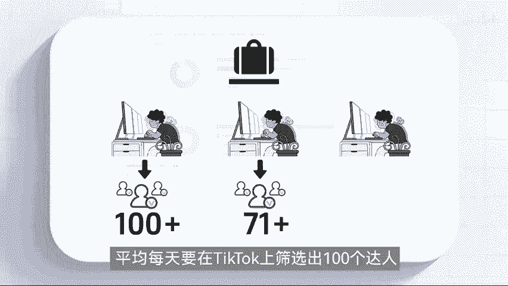
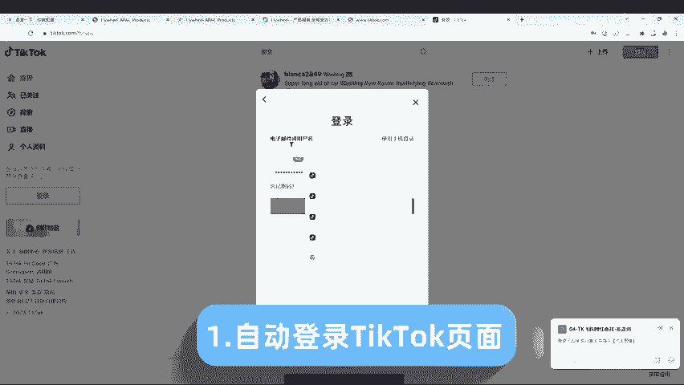
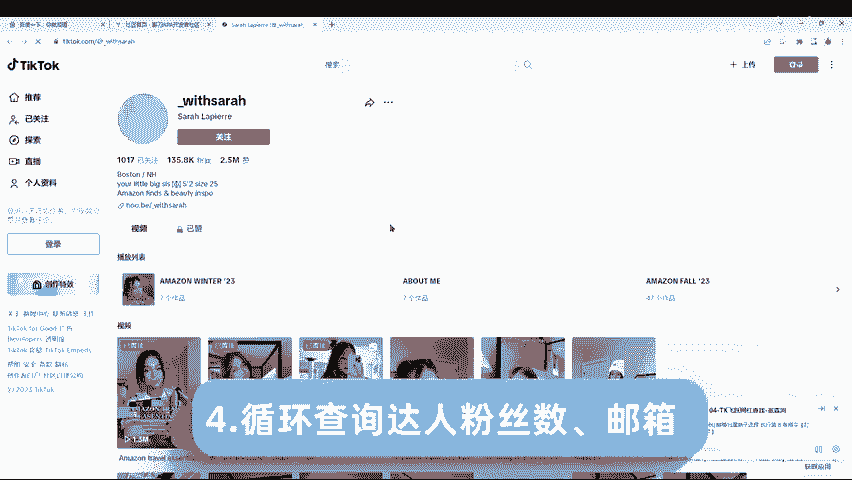
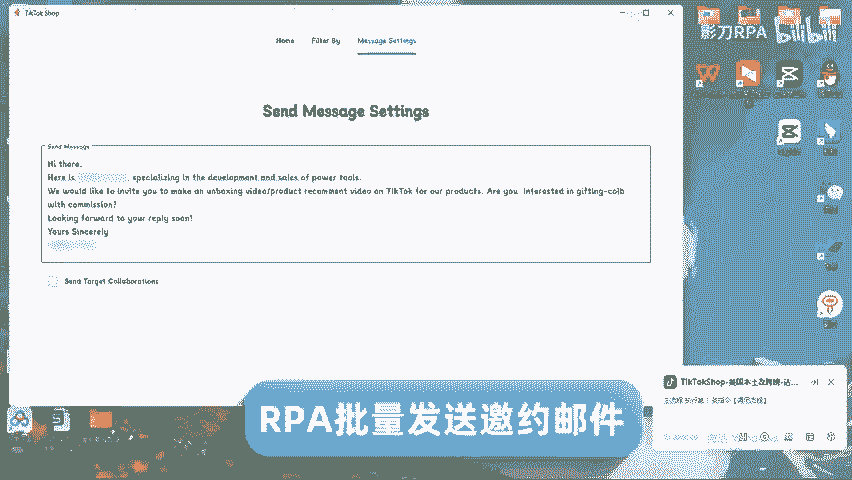
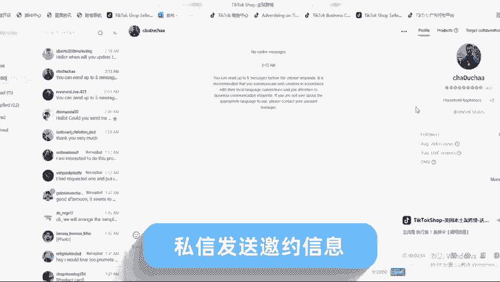
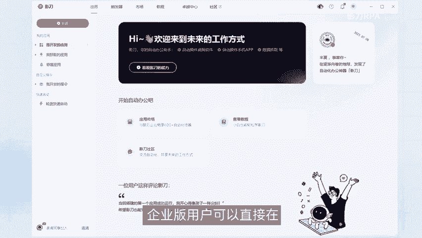
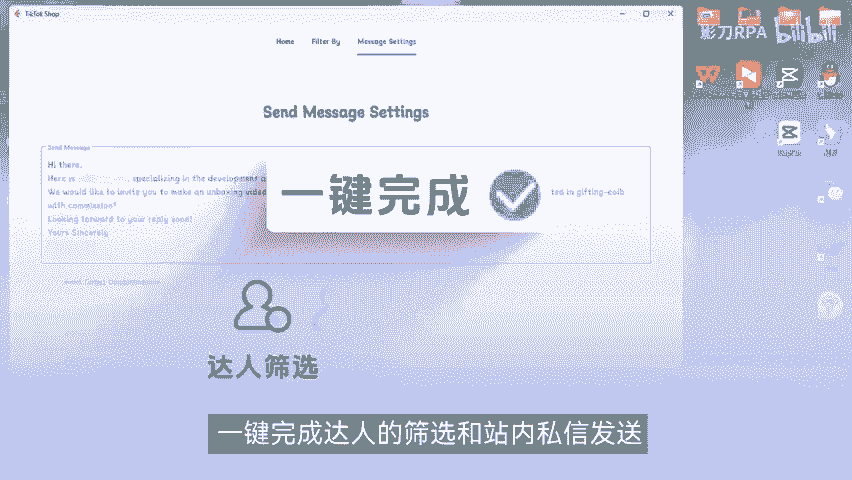

# 「影刀RPA」运营自动化案例：如何用影刀一天建联10000个TikTok红人？ - P1 - 影刀RPA - BV1JZsDeYEwq

🎼90%的跨境品牌会选择红人带货。但为什么他们还在头疼红人筛选、批量建联、投放数据分析等红人营销工具普遍存在达人账号信息不全，数据筛选维度不足，平台支持有限等问题，无法满足品牌方的精细化需求。

某箱包类品牌方三个海外营销专员，平均每天要在destop上筛选出100个达人人力难以复合。RP的引入，改变了游戏规则。就像这样，创建一个机器人自动登录tickkt页面。

🎼搜索关键词。🎼查询不同热门视频，记录视频链接，观看数到本意表格。🎼在一一循环查询达人粉丝数得箱。

🎼搜索一个关键词。🎼能工查取需要一个小时。机器人。🎼分钟效率提升了60倍，筛线后的达人使用IPA量发送邀约邮件。

🎼机器人还可以自动打开top小店后台，循环输入达人ID。🎼私讯发送邀约信息。

🎼寻找100个适配达人，并完成建联，人工至少需要1到2天，用一刀半小时即可搞定机器人24小时复知疲倦的工作，一天至少完成几千到上万次建联。企业版用户可以直接在市场下载tickbook达人应用。

🎼键完成达人的筛选和站领执行发送，一旦和达人达成带货协议，领导还能帮助商家自动新建样品订单。

🎼控样品、物流监控投放数据，更新达人库数据，完成商品空达人筛选简联样品、物流数据的带货闭环。当然，这一套RP达人营销方案也适用于in cream。

🎼facebook、youtube等各类海外平台引到RP让同人营销更快速更高效。

