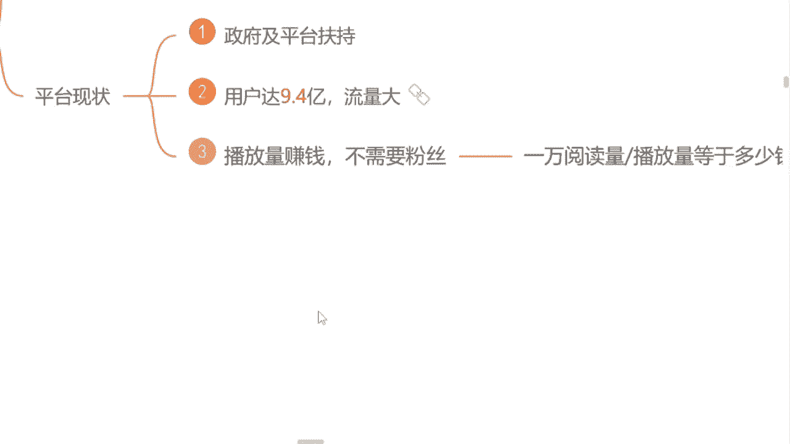

# 【100集精华版】2024年目前B站最完整的自媒体运营教程，起号步骤，怎么快速涨粉，自媒体账号如何变现，大佬亲自教学！做自媒体真不难！ - P4：3.如何靠播放量赚钱 - 辣椒可乐茶 - BV17r421x7uh

首先我选择这个行业呢有一个最基础的原因，对于我们零基础，对于小白来小白的人来说是最友好的，我当时选择自媒体，也是因为他为什么呢，不需要我们有任何的一个粉丝基础，我说我长得也不是多么的漂亮是吧。

我也不是网红，我又不是明星啊是吧，那现阶段呢我去做这个自媒体，我能做起来吗，是不是我们有粉丝呀，很多人都会有这样的疑惑，是不是有这样的担心，但是呢现在我告诉你们，我们自媒体平台。

我们自媒体行业不需要我们有任何的粉丝基础，我们去发视频，靠这个播放量依然可以去结算收益，因为很多同学在这个过程当中，了解的最多的一个自媒体平台是不是抖音啊，是的，来国民党打，是我看一下。

这是我们平常用这个刷视频用的最多的平台，不是抖音，就是快手，是不是就这两个平台嘛，我们了解了，那这两个平台呢它不靠这个播放量结算的，它是靠什么呀，有没有同学知道的，这两个平台靠什么去变现的。

靠什么去赚钱的，有同学知道吗，因为现阶段我们这个抖音也好，这个快手也好，几乎啊它已经变成了这个商业化的模式，我们全部是靠这个带货去变现的，是不是你们有没有在抖音上面去买过东西呀，九块九的是九块九的。

不管他有没有用，我们都去买一点，是不是都看见了，他带货能赚钱，对不对，但是我们自媒体平台呢跟抖音，它是有一个这个不同的区别的啊，我们在这个平台上面去发视频，我们靠这个播放量结算收益。

我们需要了解的是什么呢，1万的播放量我们到底能够拿到多少钱，为什么是以万为单位呢，很多同学会有这样的疑问，曾老师为什么是1万呢，没有以千为单位嘛，当然有啊，以千为单位的单价它是有的。

但是呢只有我们达到1万播放量的时候，产生的这个收益，我们才是能够提现的，我这样讲能不能明白，能的，来公屏上打个能字吧是吧，包括我们现在去看一下这个单价到底是多少吗，是不是包括我用自己的账号给你看好吧。

首先呢，现在我们在这里看见了一个千次的阅读单价，这个数字能不能看懂啊，能不能看清楚，能看见的来，你把那个数字打在公屏上面吧，把这个单价到多少呀，1000的播放量是四块二毛钱，就1000的播放量嘛。

我能赚到四块钱，但这四块钱咱们提现不了，只有达到1万播放量的时候才能提现，1万的播放量是多少呢，乘以1万嘛，就是42块钱啊，是不是，这42块钱，就是未来我们能够揣在自己兜里面，提现到银行卡里面的钱。

这个数字你们要记清楚哦，等一下曾曾老师会问的啊，不要左耳朵进，右耳朵就出了是吧，我们想要去赚钱，首先得把这个单价要记清楚好不好，包括呢现在我们知道这个单价了是吧啊，我们讲到这里。

这个国家也支持了一个行业，包括现在这个行业呢它也没有饱和是吧，我们纯靠这个播放量都可以去变现的，不需要我们有任何的一个粉丝基础的，这样子的一个行业，它值得咱们去做吗，你觉得值得啊，来公屏上打个值吧。

知道吗是吧，有句话说的非常好啊，顺风奔跑猪都能起飞是吧，就看我们自己能不能去做一只风口上的猪了，是不是嗯，想不想想的，来公屏上打个响子，我看一下想不想做一只顺风奔跑的猪啊，想是吗，好多好多，我看见了。

好的好的，说明非常的不错啊，同学们理解了这样一个道理，那我们现在这个行业很多同学说怎么说，我觉得可以做呀是吧，他赚钱，但是我真的我发过视频的是吧，我发过视频的，但这个视频发出去。

他为什么永远都是零播放量呢，为什么呀是吧，为什么这个播放量有时候多呃，这个有100甚至多的时候有1000的播放量，但他提不了现呀，就只有几块钱，是不是就这个平台很多同学都会问，是不是现在现在这个平台。

他已经不不需要去这个拉新了呢，我们新用户注册，对于我们来说没有任何的扶持的呢，他给我限流处理了，其实不是这样子的。

