# 【100集精华版】花了2W买来的！目前B站最完整的自媒体运营教程，大佬亲自教学！！ - P12：11小白不知道的四大技巧 - 海洋王国凉皮 - BV1DM4m1R7kA

好那么在这边的话啊，因为其实我看到啊。

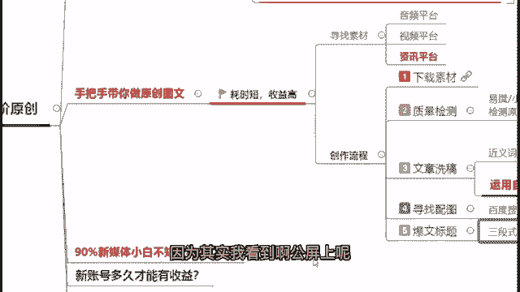

公屏上呢大家也都在进行一个热烈的一个讨论，对吧好。

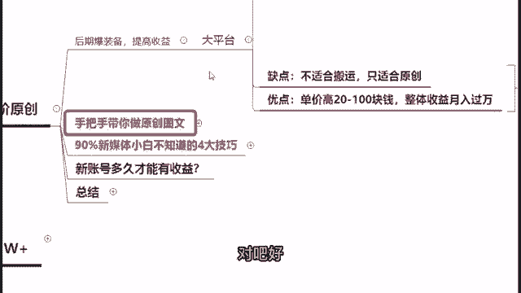

那么在这边的话，其实我看到最多人的一个疑问，其实就是，现在大家可能啊都有开始在发一些视频，发一些内容，但是获取不了一个比较好的一个收益，没有一个很好的一个成果和效果好，那么在这边我来给大家讲一下。

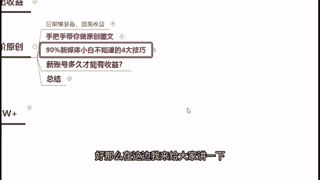

就是在我教导学员的过程中，我会发现他们基本上90%，刚开始做新媒体的小白，它都有忽略的四大技巧，如果说你在做新媒体的时候，你是把这四点技巧你牢牢记住，并且应用得好的话，我认为啊你做这个几万的播。

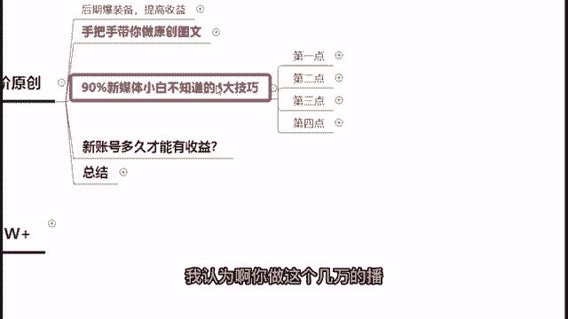

几万的阅读量，几万的展现量是非常轻松简单的事情好，所以说如果说你想要你的收益变高啊，或者说你还没有开始做自媒体的话啊，大家可以认真听，认真看看看你自己到底有没有注意到这些技巧，你有没有应用得当。

如果说应用得当的话，我相信你的这个视频的播放量，你的文章阅读量一定不会低，你的粉丝量也一定不会低好。

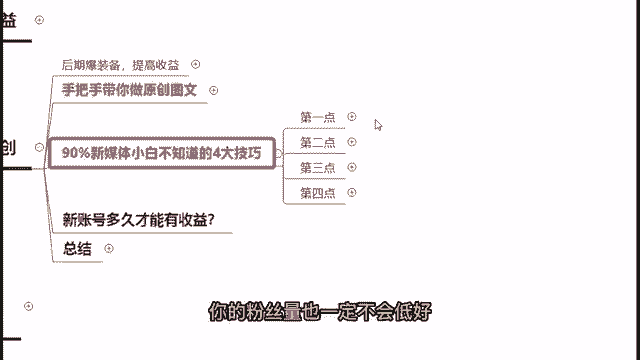

那么首先第一点我要跟大家分享什么呢，就是你在做所有的内容之前，你要做市场喜欢的哦，什么意思呢，就是你要做的时候。

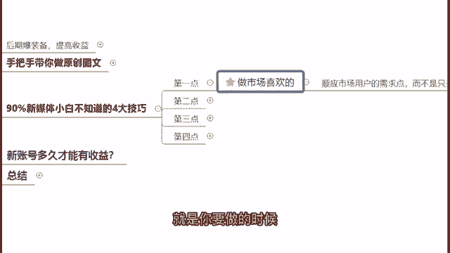

你要去顺应市场用户的一个需求点，而不是只关注你自己喜欢什么内容啊。

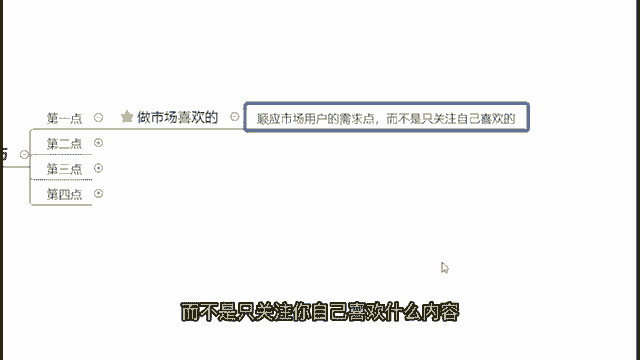

我举个例子，我前几天在教导学员的时候，有一个学生他刚开始做自媒体，他问我说，老师我看到抖音上那个不白痴，他在做这个美食领域，我很喜欢，但是呢我想做这个他做美食领域，我想做这个鸡尾酒领域，我说你在想啥呢。

你刚开始做自媒体，你就要做鸡尾酒领域的话，是一个非常不明智的选择，知道吗，知道为什么吗，是因为啊鸡尾酒这种酒的类型的话，是任何平台都不会给你推荐流量的，你要做这种啊国家不提倡的东西。

你要把账号做起来是非常困难的，那么他这种就是典型只关注他自己喜欢的东西，没有去管啊，平台现在需要什么样的一个内容，用户又需要什么样的内容，他就是一个典型的诶，我很喜欢鸡尾酒啊。

那我也刷到很多做鸡尾酒很好的一些账号，那我就想要做这个，但是我告诉你不行，你不能只关注自己喜欢什么，你要关注市场，喜欢什么平台，喜欢什么用户喜欢看什么，大家做自己内容的时候，千万不要自嗨。

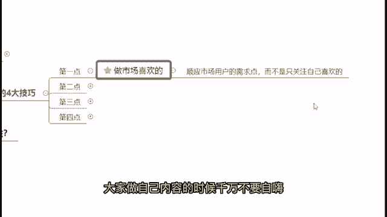

你得找对这个市场的一个需求点，用户的需求点。

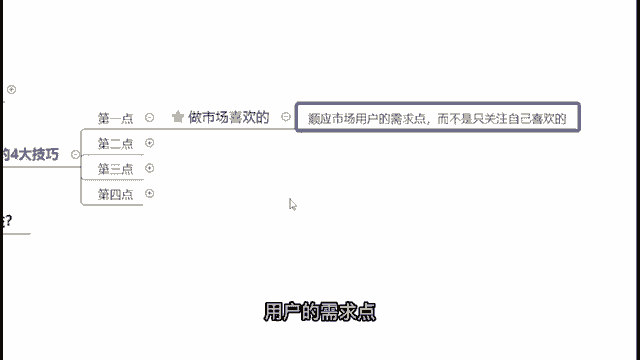

你才能够有办法把你的这个内容给它做上去好。

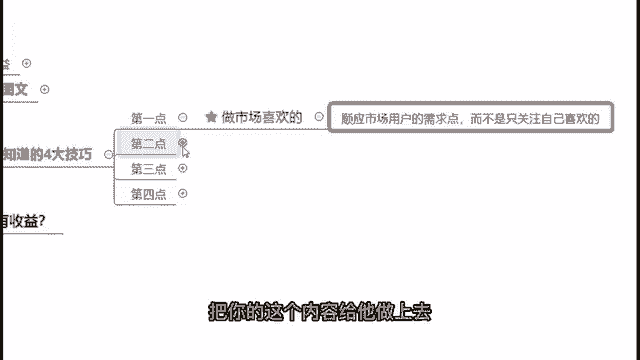

那么第二点我要跟大家讲讲的，这个主要是要跟一些嗯怎么说呢。

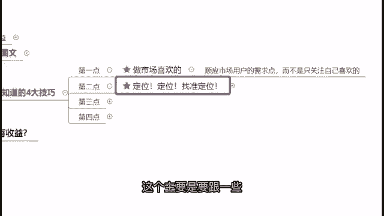

就是还没有做账号的同学们说的，首先第一点就是你在做你自己的账号之前，先要找准你自己的一个定位，就是要确定好你的一个目标客户群体，什么意思呢，比如说大家都在做影视，包括比如说做影视的盘点。

影视的一个解说都好，那么首先第一步，你要确定好你的目标客户群体是什么，比如说啊我做的内容，我主要是想吸引这个年轻的小姐姐来看的，那么你就不要去找那种打斗类的，或者说是这种热血类的，因为年轻的小姐姐。

她基本上不会特别去喜欢这种啊打斗啊，热血啊，或者说是偏黑暗啊这种类型的一个影视，年轻的小姐姐普遍都喜欢啊，帅哥美女啊，美美的好啊，这个美好的爱情等等这些方面的一个内容，所以说你在做所有你的这个内容之前。

你要确立好你的目标客户群体，你的目标客户群体是小哥哥的，你就发小哥哥相关的内容是小姐姐的，你就发小姐姐相关的内容，你如果很混乱的话，平台会不知道把你的视频内容推荐给剁谁。

你是把你的视频内容推荐给20岁的小姐姐，还是推荐给40岁的大叔，平台会不知道，所以说你在做所有内容之前，你先确定好你自己的一个目标客户群体，确定好之后，专门的垂直去做。

然后才能够做的把你自己的一个视频内容做好，让平台知道该把你的账号推荐给谁，让他们去关注你的账号，而且我要跟大家说一点。

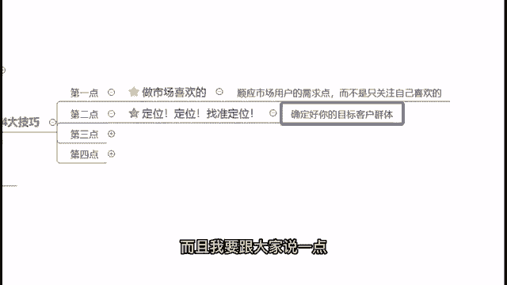

就是你在上面的收益，粉丝的阅读收益能够比普通人看你的视频，收益能够高出四五倍，简单点说，如果说你是有5万的粉丝阅读量，你的收益会比普通用户的一个5万阅读量，高出5~6倍的一个收益啊。

就这么啊我跟大家说这一点，其实粉丝的一个阅读播放量才是收益的最大头。

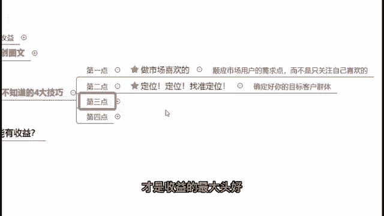

好那么第三点我要跟大家讲的是什么呢，就是你的这个封面和标题也是非常极其重要的，就是简单点说，你的这个封面跟标题如果无法匹配的话，你是很难去上热门的啊，平台很难给你推，如果说你的这个封面啊。

比如说你今天写了一篇啊，去西安旅游的一个文章，但是你的配图全部都是那些啊，跟西安没有什么关系的，没有办法一眼看到西安这两个字的话，那么平台是很难给你去推流，然后也很难推你去上热门的。

所以说第一个你的封面和标题要足够吸引人，第二个你的封面和标题在吸引人的同时，它必须是匹配的，千万不能是割裂的，你要让平台价检测到你的封面的时候，马上就知道我该把你的内容推给谁啊。

40岁大叔还是20岁小姐姐啊，看到你这个标题，我就知道我是该推给用苹果用户的手机，苹果手机的用户还是推给这个啊，一两千块钱的，一个便宜一点的手机的一个用户啊，如果说你有在做头条的话。

你应该在看得到的那个创作者数据里面，有这个分类的好，那么第四点我要跟大家讲什么呢。

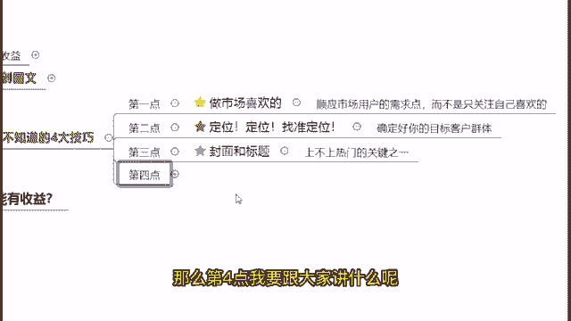

就是你得追热点啊，不管你是做图文也好，做视频也好，你都得去追热点啊，什么意思呢，就是因为热点它是会有用户自动涌入，进来看的啊，包括你比如说最近很火的刘畊宏，那么甚至你可以发现现在刘畊宏火了之后。

就连你拿本草纲目这首歌当背景音乐都会多，很多人去看，所以说啊大家要记住追热点。

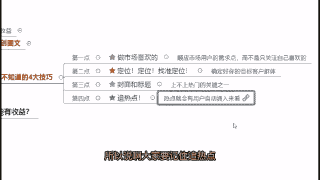

如果说大家不知道怎么样去追热点的话，我来给大家看一下啊。

这个神器哈啊是一个叫做今日热榜好，那么在这边你可以看到所有微博的，知乎的，微信的，百度的，现在所有平台当前的一个热点到底是什么，你可以直接看24小时的一个热点，然后你可以选择三天内的一个热点，对吧啊。

这个就是考验你追热点的能力了，大家自己动动脑子想一想啊，大家知道微博上以前那个有一个追热点，非常出名的一家公司吗，杜蕾斯，你可以发现杜蕾斯这家公司，它是在追热点的道路上，它是非常迅速。

反应非常灵敏的一个热点，刚刚出来，只要过了一个小时，基本上你就可以发现，杜蕾斯已经把相应的广告已经打好了，每个都打得非常的精准，追热点甚至能成为他自己的一个特色，这个就是大家需要去掌握的一个能力。

如果说你能够实时的把这个热点蹭起来的话，你也会获得一个非常好的效果，具体效果还是一样的，你参见参考杜蕾斯，他自己打的这个广告，追的这个热点效果怎么样好，这个是一个叫做今日热榜啊，大家可以自己去搜啊。

不是自己领域的热点，很容易领域偏向，这个就考验大家对于追热点的这个能力了，那你说杜蕾斯，他为什么就能够在所有的热点里面，找到适合他自己的打广告方法呢，对不对，这个是要需要大家自己去琢磨的啊。

当然第一个你还是要做回你自己领域的，第二个你要再怎么样追领追热点的同时啊。

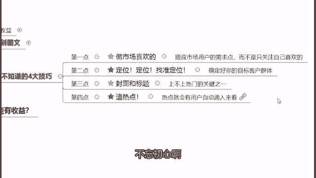

不忘初心啊，这个就需要大家自己的能力啊。