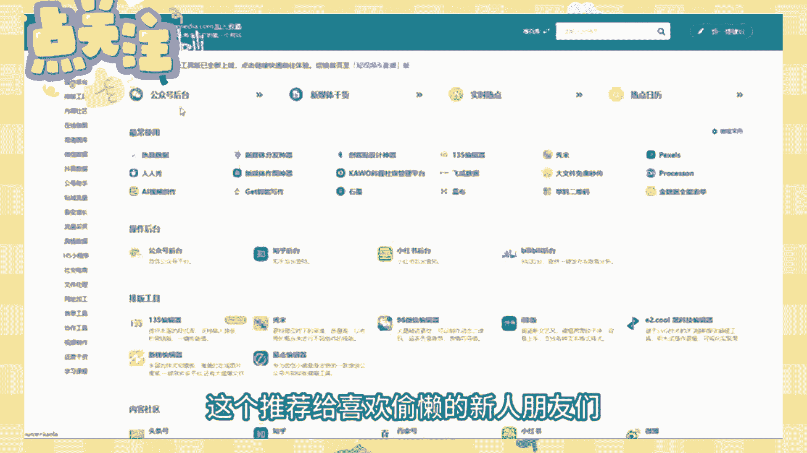

# 【100集精华版】花了2W买来的！目前B站最完整的自媒体运营教程，大佬亲自教学！！ - P1：自媒体工具 - 海洋王国凉皮 - BV1DM4m1R7kA

哈喽大家好，今天呢我来给大家分享一些关于自媒体的副业。

赚钱方法，很多人都会在网上找副业，但是又担心怕被骗踩坑，那在网络新时代呢，不妨来试一下自媒体，那我在这里整理了五个，我做自媒体以来一直都在用的工具。

网站都是我亲身测试过的，非常的好用，那首先呢可以给大家看一下，我的一个自媒体的收益情况，那大家可以看到，这个月呢是已经有4万多的收益了，希望看完这个视频呢，对你做自媒体有一定的帮助。

那我现在呢就给大家介绍一下，99%以上的自媒体博主都在使用的，短视频工具，即使你是上班族，也能做到轻松的日更，所有推荐的资源和网站呢都是好用到爆的那种，那大家一定要记得点赞和收藏，不要弄丢了哦。

那如果说你已经做自媒体一个月了，还没有任何效果，在评论区里扣学习，我可以把我整理好的自媒体实操直播教程，分享给你，那第一个呢是我们的文案工具，零基础小白用轻的，只要你复制报文链接就可以一键提取文案。

就像是三秒拥有了满分作文的模板，你只需要多篇进行整合，二创对标，用户痛点程度高，容易爆，重点是这么好用的功能，现在是完全免费的，写脚本，没有灵感就用AI智能文案，基色写作机器人，阿里妈妈秘塔写作猫。

你可以喜欢哪个就用哪个，那这里呢我的首推是基色写作机器人，主页简单易操作，输入关键词就能自动生成文章，还可以一篇文案类变成千篇，妥妥的提升工作效率，一个关键词就可以找到名言名句和经典句子。

押韵精灵输入你喜欢的词呢，就能够给我们生成押韵词语，甚至是唐诗宋词，非常的牛，那第二个呢就是我们的拍摄工具，新手博主呢不用相机，一部手机就可以了，白天拍摄自然光最绝了，如果说白天的时间不允许。

那就在正前方拿一个补光灯增加画质，清晰度，最多呢再拿一个暖色背景灯，可以增加氛围感，美颜软件呢可以用我们的美图秀秀和青年，就可以了，那第三个呢是封面制作，美图秀秀加黄油相机，美图秀秀可以随意拼图。

黄油相机贴纸好难到手软，最赞的还是可以保存模板，一键做出统一风格的图片，能够省下大把的时间，第四个数据分析网站，千瓜数据最全面的小红书分析网站，秦虹有详细的锤炼数据榜单，热门内容可以分类解锁。

柴妈妈搜索热词和热门话题，提供商业服务数据，三个网站的大部分功能呢都是非常相似的，更推荐新手朋友们呢用猩红，因为可以在免费的前提下搜索到更多的数据，第五个资源积累，石墨文档可以实现手机和PC端同步编辑。

文档自动保存，不怕丢，幕布极简大单工具一键生成思维导图，非常好用，最后呢这个推荐给喜欢偷懒的新人朋友们。

考拉新媒体工具网，这里面有很多常用的新媒体工具，可以节省很多搜索和下载时间，哪个好用就用哪个好了。

以上呢就是我给大家介绍的五个网站，但如果你想做自媒体，但是呢又不知道如何入手的话，可以在我的评论区留言一个学习，那我可以把我整理好的自媒体教程分享给你，关注我，了解更多自媒体干货。

那本期视频呢就先讲到这里啦。

我们下期再见吧。