# 【100集精华版】花了2W买来的！目前B站最完整的自媒体运营教程，大佬亲自教学！！ - P5：4怎样选择平台 - 海洋王国凉皮 - BV1DM4m1R7kA

那么再来啊，现在我们也知道自媒体的平台是特别多的。

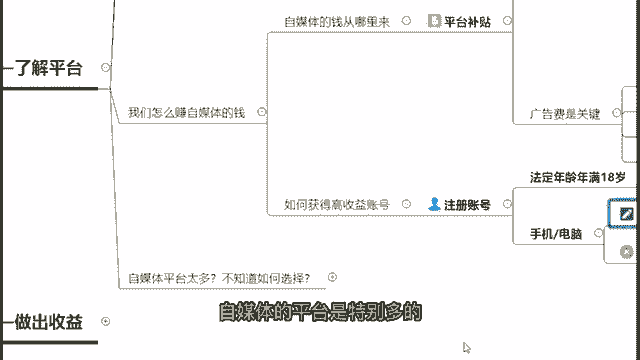

那么我们该怎样去选择去做呢。

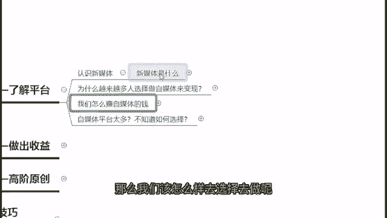

首先第一个啊，我来跟你们说一个结论，就是我建议大家，但凡是新手上路的，你先做小平台，再做大平台啊，当然你要说一开始做大平台也不是不行，只是起步嘛，你可能艰难了一点点。

所以说我建议大家先做小平台再做大平台，为什么呢，前期的话我建议大家先选择小平台练习技巧，收获思路，就好像比如说今天你刚刚下载了一个王者荣耀，准备去打，但是实际上你刚开始的时候。

你是不知道你打上单合适还是打中单合适，还是打法师合适的，对不对，所以说你可以先选择一个小平台去练习，等你后期知道哦，原来我打上单比较牛逼的时候，那么我就可以在后期我选择分发一个大平台。

我知道自己擅长什么了，我可以在后期去选择大平台去做一个一文多发。

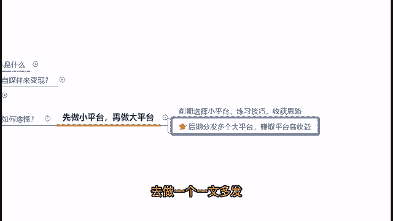

提高收益好，那么在前面的时候啊，我们新手的时候小平台有哪些呢。

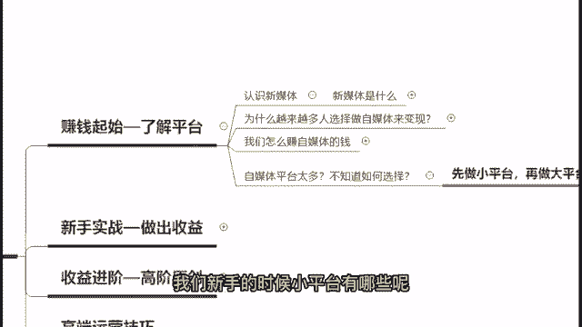

啊我刚刚也跟大家说了，新手攒经验攒技能。

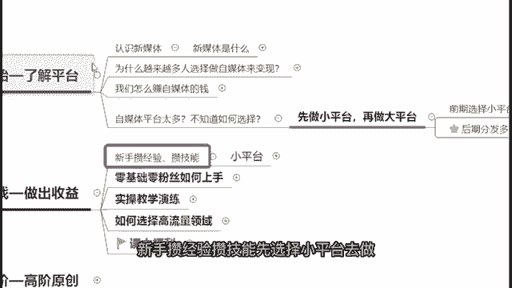

先选择小平台去做，小平台有哪些，我列举了一些给大家看一下啊。

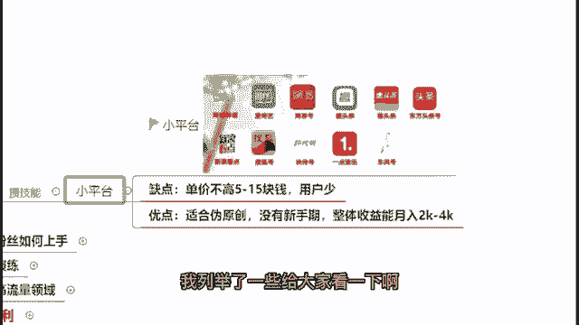

包括你比如说像趣头条，汇头条，快船号，搜狐号等等，这些都属于我们的一个小平台，那么小平台很明显它的缺点是什么，单价不高，基本上是5~15块钱的，而且它在它上面的一个日活跃用户，是相对比较少的。

那么小平台的优点是什么呢，你可以在上面做伪原创，做搬运啊都可以，这样的话呢你是没有任何新手期的，你完全可以很自由地去探索，你到底适合做哪些方面，做哪一个领域啊，但是基于说你做搬运。

做伪原创没有任何问题的话，你在上面没有任何新手期，你只要坚持去发视频，发内容的话。

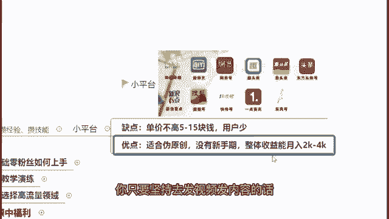

基本上月入2000到4000啊，我认为是一个比较简单的事情，它不难都比较容易能够做到。

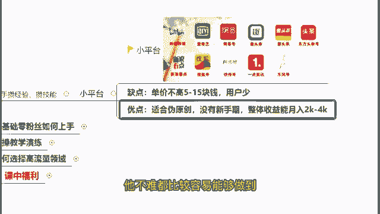

那么零基础零粉丝的朋友们，我们应该怎么样去上手去操作呢。

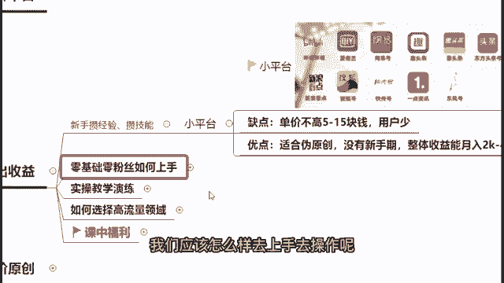

其实啊啊我认为啊是很简单的，在这边我先教大家去做一个伪原创，去做一个搬运，直接教你5分钟搞定视频创作。

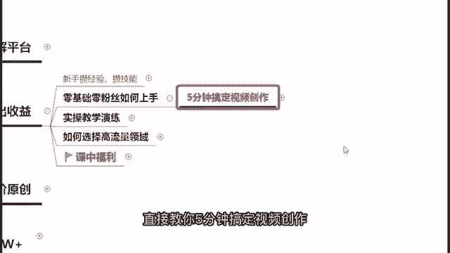

因为如果说你现在啊不会做一个视频的采集。

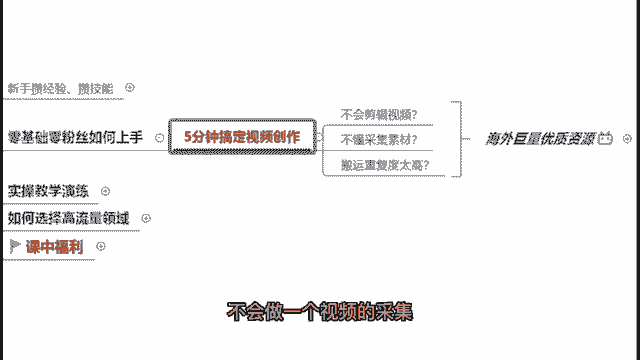

也不知道该怎么样去做一个素材的采集的话。

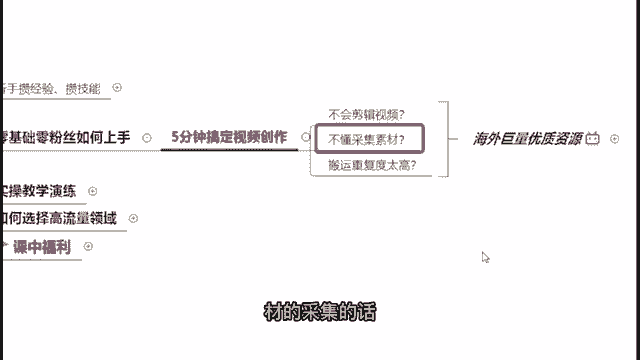

又或者说你觉得在国内搬运的重复度太高的话。

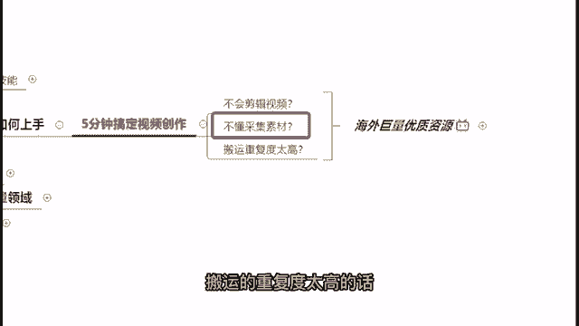

那么其实我认为大家不妨去看一下，海外的巨量的一个优质资源来去看一看，把目光放长远一点，那么在这里我找了一个B站的一个视频，给大家先看一下。

Poem to some seriously dangerous animals，There is definitely a big cat around here ha ha。

I get off to a great start the laurious food，but my abs来大家可以看到这个是在B站上面啊，我们那个荒岛求生的一个视频。

那么很明显它是属于一个海外的一个综艺，搬运到了我们的一个国内，对不对，很明显，因为你可以很清楚地看到这个视频，它是没有经过什么很多的一个剪辑的，然后它就是我们的一个原视频画面，原视频原声。

我他唯一的不同搬运到我们的一个国内之后，他唯一做的改变就是添加上了什么，我们那个中文字幕对吧，唯一的不同就是加了一个字幕而已，但是大家可以看到，我们在B站上面有多少播放量，你看得到吗，232。

9万的播放量好，我们来算一下232。9万是多少钱，这一条视频，232。9乘B站的单价大约是15块钱，那么我们可以计算得出啊，这一条视频搬运到了我们国内的哔哩，哔哩网站上面之后，它所能够获取到的收益。

大约是3490块钱的一个收益，那么其实你可以发现，仅仅啊他不需要做一个视频的一个啊剪辑，也没有说一个很复杂的一个采集素材，然后呢他也是从海外的一个原声原画啊，搬运而来的。

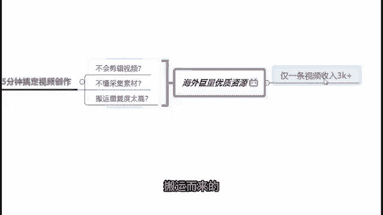