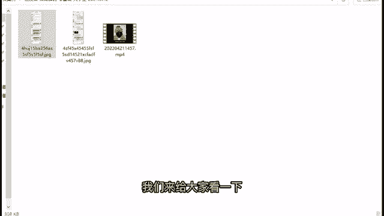
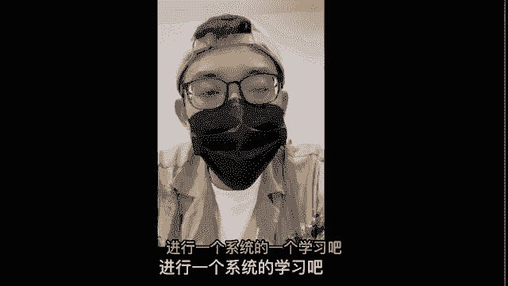
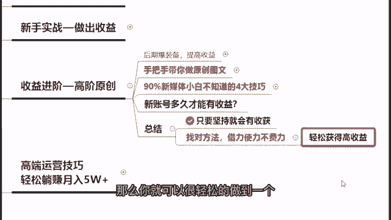

# 【100集精华版】花了4W买来的！2024年目前B站最完整的自媒体运营教程，抄袭也能玩好自媒体，大佬亲自教学！！ - P15：14案例分析2 - 幽香飞龙QAQ - BV1pC411b7hy

好，那么在这边的话呢，啊，如果说大家觉得只有一个学员是这样子的话啊，我们也可以给大家看一下，其他的一个学员的一个情况啊，比如说在这边我再来随便的去找一个啊视频啊，找一个我们的一个案例给大家看一下。

这是一个大学生的一个案例来给大家看一下吧，啊这个大学生的案例，他跟我说啊，他之前也有做一些视频，然后在这边的话啊，他跟我说，他之前做视频效果不太好，没有多少播放量，然后同样的我也来问一下他啊。

这个具体的情况该怎么样啊，我知道了你的一个具体情况之后，我才能够对你的这个啊做出一定的这个，针对性的一些建议，对吧好，那么一样的通话之后，我了解了他之前的话呢他是想做篮球，也想做游戏也想做。

但是现在的话呢他比较想做啊，两方面，我就建议他先从一个方面开始做起，那么他就说啊，那么做运动吧啊，我让他把之前的视频发给我看一下，我看看怎么改进，他说也说没问题，那么其实平时的话呢他也会说啊。

他也想做这个体育的一个图文，那么我也告诉他没有问题，因为他已经有了一定的基础了，我就建议他可以先在头条号上面是试着做一下，体育的一个图文，然后包括他平时也会问我啊，该用一些怎样的工具，我也都会发给他。

包括他会问我一些啊，这个剪辑方面的一些该怎么样去做，我也会给他做一个一一的视频指导好，那么在这边的话啊，他也有一个他自己的一个反馈视频，我们来给大家看一下。

它的一个反馈到底是怎么样的，哈喽哈喽，大家好，我叫李涛啊，我先做个自我介绍吧，我是一个大三的学生，就是平常在学校也没什么事做，就偶尔打打篮球的，然后在宿舍打打游戏，然后刷一下视频。

然后后面就萌生了这种想法，不如自己去做一个自媒体的视频，然后一开始我是自己学的，然后后面学习的过程中，也遇到很多的一些困难吧，后面发现自己的收益也是非常低的，然后后面有一个偶然的机会。

然后听到安迪老师上了一堂课，然后我就抱着一种尝试一下的心态吧，就报了名，跟着安雅老师他去学习，在后面的学习过程之中吧，就学到很多一些，自己以前根本就不懂的一些东西，也有一些困难的地方吧。

但是安雅老师他也逐一的就很耐心，很细心的帮我都去解决了，然后现在做了两个月左右的时间了，每天都有三四百的一个收入，然后现在一个月下来都有一两万的零花钱，然后现在就挺好的，每天有稳定的收入。

我也有人买自己想要的一些东西啊，球鞋啊那些，然后我现在是做一个体育解说的一个，视频的一个盘点吧，所以我也希望大家如果想要学习的同学，可以跟着安娜老师啊进行一个系统的学习吧。

反正大家努力学习，越做越好吧，呃现在给大家看一下我的这个账号的收益吧，就平均都是几百块几百块的，然后后面有一天视频爆了，有800多块的一个日收入吧，然后再给你们看一下我现在微信的余额吧。

因为之前我也提现过，用来买东西或者交学费的，现在还剩下3万6000多，所以我也希望各位同学如果想学的，就努力的去学习吧，越做越好啊，感谢好了，那么在这边的话呢，我也想跟大家说一下一些呃。

一些简单的一些问题，因为我看到确实有比较多同学在问的，首先第一点，刚刚那位宝妈，他做的是一个解说，他不是做的一个纯搬运，他是做了一个剪辑，并且有一个解说啊，所以说啊这边的话是可以坐在头条号上面的。

他不是做的一个纯搬运，他做的是把国外的一些综艺，然后根据他自己的一个理解做了一个剪辑，然后加上他自己的解说，所以说才能够发布在头条号上面啊，所以说大家就不要说纠结，说诶那个是在头条号上面。

怎么也可以搬运海外的一些视频，不是人家做的，不是搬运，人家做的是解说，人家有自己的一个剪辑，有自己写的一个文案啊，那个才能够发在头条号上面，那个就是原创，搬运是肯定不能够发在头条号上面的，对吧好。

我也不会说出现这种错误好，那么首先再来啊，我也回答一下大家的问题，就是我不是单单只有在做文章，我是文章和视频都有在做，这边的话我也可以给大家看一下，我有两个号，那么首先其实不同的号。

我的收益都是不一样的啊，包括啊这个文章呢是我也有在做视频，我也有在做，我不是说不会做，只是我自己来说，我更擅长做一个文章的一个创收，但是如果说现在啊，很多人他不是很喜欢做这个方面的一个，图文的话。

那么你想做视频，想学视频，那么OK完全没有任何问题啊，我不是说只会做文章这一项啊，我是也可以做视频好，包括你可以看到我也有在发视频，我也有在发文章啊，都是有的啊，好吧啊。

现在的话啊是有100多万的一个粉丝了啊，所以说大家就不要说诶，当然如果说你想跟着我来学习做文章的话，那么当然OK啊，我欢迎，因为这个我比较擅长，但是视频的话我也是有在做的啊，我不是没有在做视频的好。

所以说这个就是我自己好，那么在这边的话，唉哟我看到有同学说粉丝有点吓人，拜托我都做了5年多了，做100万粉丝怎么了，挺正常的呀，我觉得啊5年多时间我还做不出100万粉丝啊，那我凭什么在这里讲课呀。

对不对，好那么啊所以我也跟大家说一下这个总结哈，就是其实呢首先第一点，你只要是做自媒体的话，你要坚持，只有坚持的话，你才能够有收获，你如果说在你的一个账号上面哦，你隔两三天，隔十天八天你才能够啊。

你才去发视频，发内容的话，那么当然你的这个账号是不会啊，这个权重是不会高的，流量也不会高，收益也当然不会高，第二个就是我建议大家啊找对方法，借力使力，不费力啊，这样的话才能够轻松的去获得高收益。

你找对了领域了，找对方法了啊，或者说你找到一个称心的一个软件了，那么你就可以很轻松地做到一个。

