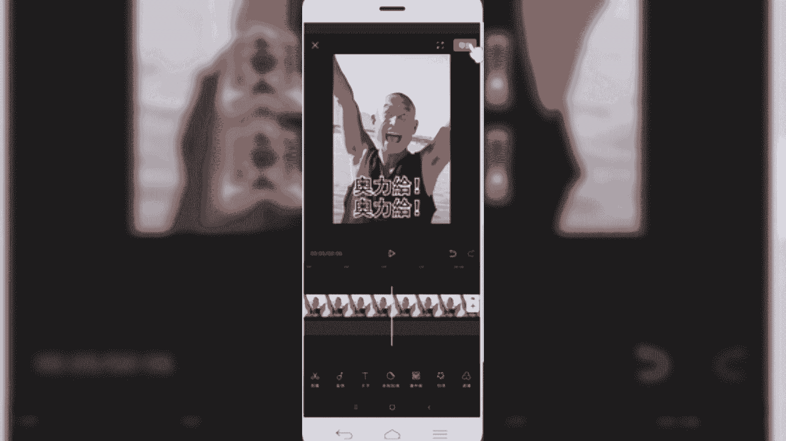

# 【100集精华版】花了4W买来的！2024年目前B站最完整的自媒体运营教程，抄袭也能玩好自媒体，大佬亲自教学！！ - P18：剪映核心剪辑功能讲解--分割功能 - 幽香飞龙QAQ - BV1pC411b7hy

那么今天呢给大家讲解的是剪映，核心的剪辑功能，那么我们在上节课呢跟大家分享的是剪映，APP的一个界面结构，我们了解了剪映主要由四部分组成，剪辑剪同款消息和我的，那么在这四项功能当中的剪辑和剪同款。

是我们学习剪映app剪辑的核心两部分，那接下来的话就是围绕剪辑功能的主要内容，给大家进行展开来讲解，那么首先来看一下本堂课的一个学习目标，掌握剪映app的核心剪辑功能，包括分割音频，文本贴纸。

特效蒙版等等，15个剪辑功能，这是我们各位小伙伴学习剪映APP的，必须要掌握的这15个功能，这对我们后期剪辑各类抖音视频的时候，帮助非常大，我们看到的各类爆款视频，也是由这些功能组合起来制作出来的。

好再来看一下我们的目录，目录的话也是按照功能来进行划分的，主要包括这15项，第一个分割功能，第二音频功能，文本功能，贴纸功能，画中画特效滤镜，调色比例调整和背景设置，视频过渡，转场定格功能。

蒙版倒放变声色度，抠图以及抖音，常用的素材片段，这15个部分好，我们了解了目录之后，那接下来的话就是围绕剪映的核心功能展开来，给大家详细讲解，首先给大家介绍的是第一项功能分割功，能。

分割功能是我们在剪辑视频当中，运用最多的视频处理手段之一，简单来说就是将我们拍摄好的视频素材，在剪辑过程当中，把需要展现出来的，或者是说保留下来的视频素材呢给它截取出来，然后不需要的。

或者说视频镜头不太友好的画面呢，我们需要给它裁切删除掉，或者说分割掉，那这个时候就是用的分割工具进行剪辑，通过分割，直接将我们的视频裁切成两段，然后把多余的部分删除掉即可。

那右侧的话我们看到的这个视频画面，是我们在剪映当中的一个剪辑图片，那么我们可以看到，在上方呢是一个视频的预览窗口，然后中间这部分的是时间轴，所有的视频剪辑软件呢都会有这样一个时间轴。

中间这条白线就是我们的时间线，也是我们视频剪辑过程当中定位的点，就比如说我们想要把视频定位到第两秒钟，或第三秒钟这个位置，那么我们需要把这个视频时间线，放到视频的第二秒或第三秒，然后进行拆解或者说分割。

才能实现在第二秒和第三秒采集视频，那再往下的话是我们的剪辑菜单，我们对视频所进行的一系列的剪辑操作，都是在底部的菜单进行的，包括我们的音频呀，文本呀等等，后期讲到的其他功能，也都是在底部菜单进行选取。

然后呢开始对视频进行一些处理，这是我们第一步的剪辑菜单好，那关于分割功能的基础介绍呢，就给大家讲到这块，那接下来的话是我们进入到软件当中实操，给大家演示如何使用分割功能。

好我们首先呢启动剪映app，启动好之后呢，我们首先进入的界面呢，就是剪辑的界面，那我们在这个地方进行剪辑的话，首先是点击顶部开始创作。

将我们要剪辑的视频素材导入到项目库，我们选择一段视频素材。

好我们把这个视频素材导出来，然后呢，首先可以简单的点击顶部预览窗口的播放按钮，可以预览下个视频，软犯法吗，你告诉我有哪个法律规定，人不能拽干就完了啊。

好那么我们预览这个视频之后呢，我们假设，我们想要把这个视频的前一部分的镜头，想要把它保存下来，或者我们想要把中间这个奥利给这个镜头，给它保留下来，其余的部分呢我想删除掉怎么办呢。

我们首先是需要把这个光标，定位到我们的镜头的这个采分点啊，我们可以看到在这个时间线左右，是这两个镜头的一个衔接点，我们首先把它放大看一下，放大的话，用我们的食指和我们的中指按住这个时间轴，左右来回拖动。

左右同时拖动，把它放大好，那现在是放到最大了，放到最大之后呢，我们把中间的白色时间线定位到这个位置，然后呢选择选中视频，点击一下，可以看到周边加了一个白色的框线，这就代表我们选中了，选中了之后呢。

我们可以看到在底部一级菜单，这进来之后有一个分割功能，我们点击分割啊，然后呢这块就加了一个白色小方框，那就代表我们视频剪辑分割了，就现在的话已经分成两段了，那么我们需要把这一部分保留下来。

那么前面这部分就是多余的，我们需要删除，然后呢同样是点击选中，OK那这块的话，首先是我们前面这部分的视频片段就选中了，然后点击右下角的删除，好那前部分视频呢就删除了，然后我们接着想要把这部分的镜头。

给它保留下来，那么我们就需要找到下一个视频，镜头的一个连接点，好我们找到下一个视频的剪辑节点，我们把同样把时间线定位到这个镜头衔接处，然后呢选中视频，然后点击分割功能好，那么这种情况下。

我们把这一部分也给他拆迁分开了，然后我们选中后面部分多余的删除掉，那么我们中间截取的部分呢，就是我们想要的部分，我们点击预览看看效果，好我们可以看到在视频的第一秒和最后一秒的。

都是啊上下两个衔接镜头的画面，我们如果说不想要的话，可以也给大家往后再裁切一下啊，我们先拿最后这个为例，再分割，然后把右侧多余的这部分给裁剪掉，好同样前部分也是，好我们重新再预览看一下。

好那我们通过这种分割的话，就把中间这部分保留的镜头都给留下来了，那么我们后期在制作的时候，可以通过这种方法分割，把我们想要的镜头给大家拆解出来，裁剪完之后呢，我们可以点击右上角的导出。

然后设置一下我们导出的分辨率和帧率，一般默认情况下选择1080P和三指帧率，然后呢选择导出即可，OK那我们就把这个视频给剪辑完成好，回到我们的课件。

好我们来小结一下，那么刚才呢给大家分享的是，剪映的核心剪辑功能，分割功能，分割呢是视频剪辑当中运用最多，最广的一种视频剪辑手段，通过分割呢，可以将我们想要保留下来的视频片段，很方便的直接裁切分开。

然后导出，把我们需要的视频片段就保留出来了，那留下的镜头呢，就是我们在后期剪辑拼凑片段的时候呢，把我们的镜头拿过来，直接可以作为素材来用，或者说直接就剪辑好我们的视频了，那在剪映app当中呢。

直接选择分割功能，就实现了我们视频的一个裁切，操作呢也非常的方便，我们在操作的时候，注意是分割好我们时间轴定位的线，然后围绕这个线呢直接裁切就可以了，好今天呢关于检验核心功能的分割讲解。

就给大家介绍到这块。

