# 【100集精华版】花了4W买来的！2024年目前B站最完整的自媒体运营教程，抄袭也能玩好自媒体，大佬亲自教学！！ - P2：1认识自媒体 - 幽香飞龙QAQ - BV1pC411b7hy

那么今天的上课方式，我们会采用理论知识加上实操操作，以及案例分分析的方式来跟大家分享。

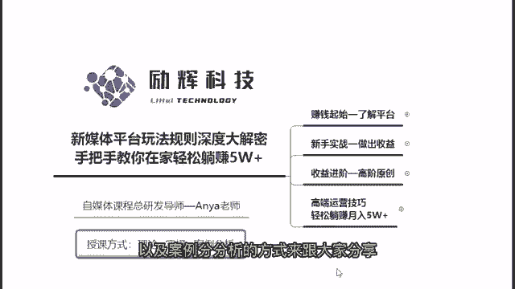

那么今天呢我的一个课件，我分了四个内容板块来跟大家去进行分享。

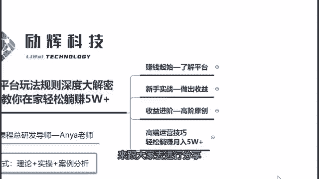

首先我们既然要做自媒体，就先要对自媒体有个认识。

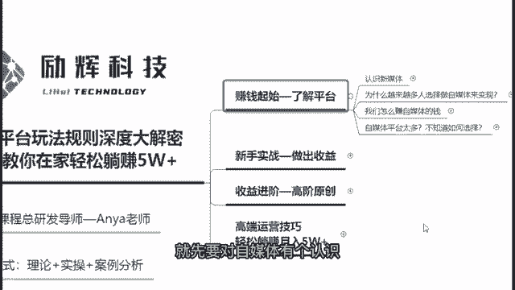

自媒体它到底是什么，我们又为什么要来做自媒体，那么第二部分的话。

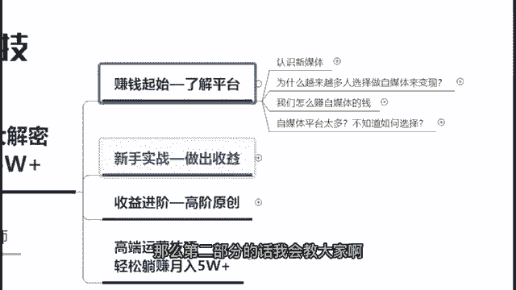

我会教大家啊，从零基础开始怎么样去做一个操作。

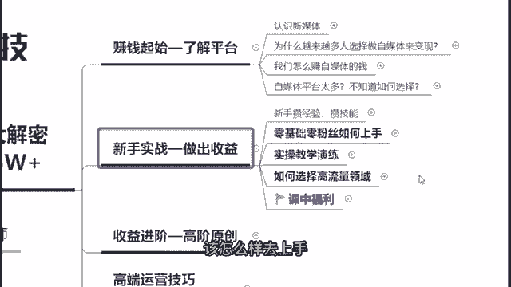

该怎么样去上手，然后再来第三个啊，我会教大家如何去做到一个收益进阶。

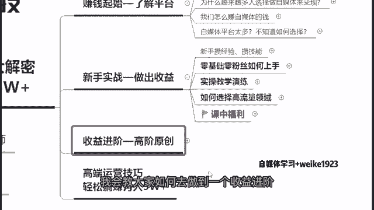

因为要做到收益进阶化，其实我们就要去做到一个高阶的原创，要先做原创，你才能够获得一个更好的收益，包括以及我会跟大家分享，你想要做草自媒体的话。

就需要了解到的一些技巧好，那么这个是今天我们的一个啊课程的一个。

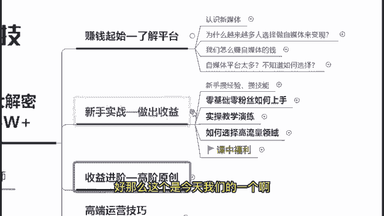

大纲的一个介绍，那么在课堂开始之前，由于我之前其实也是一直有在做学员的教导的，那么在教导学院的过程中，我也会发现很多的自媒体新手小白啊，他都会有的一些疑问，那么呢我把他们做了一些总结。

来我看一下大家是否也有这些方面的一些疑问，好那么在这边呢我总结了一些之前过往啊，我教导学员的过程中，我发现他们普遍会有的一些疑问，那么在这里呢我做了一个总结啊，如果说你是所有问题都想了解的，同学们。

你打个零在公屏上给我看一下，如果说你是有想要去具体了解的啊，那么你打个具体的一个问题在公屏上我看一下，那么我看看今天讲解的一个内容呢，主要是从哪一个方向去出发，或者说有没有同学特别想要关注里面。

某一个具体问题的，你把这个具体问题的序号打出来，如果说全都想了解的，你打个零在公屏上我看一下，看看今天的课堂啊，主要啊倾向于咱们的哪一个啊，环节会讲解的比较多一些，那么我看到零跟三跟六啊都是比较多的。

那么最多人打的呢都是零好，那么看来其实大家主要都是想要啊，了解到所有相关的一些问题的好，那么由于照顾到大部分同学的话，我就先主要的啊从这里面开始讲起，阿玛呢在356里面呢。

我会着重的去跟大家讲一讲相关的一些内容，好吧好，那么在这边的话呢啊我的把这个疑问啊先关掉。

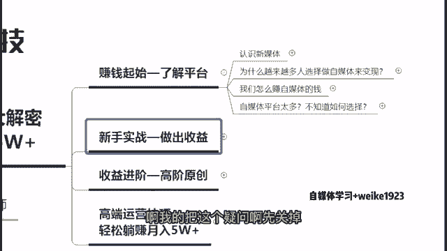

那么今天现在我们即将正式开始，我们今天的一个课程啊，我的一个课程总时长大约会在90分钟左右啊。

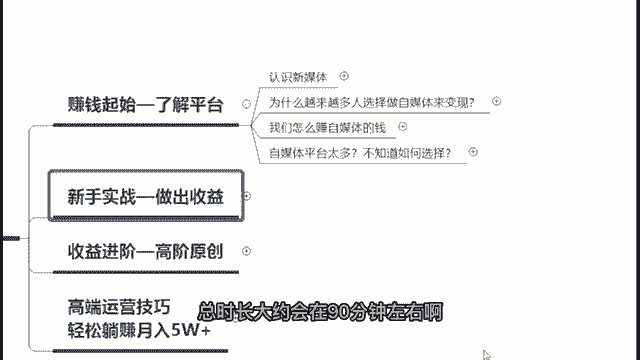

90分钟好，那么现在我们即将开始我们的一个课堂好。

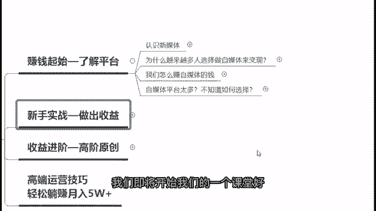

首先第一个既然我们是要来学习新媒体的，首先第一部分我们就要先来去认识他对吧，那么其实新媒体它现在到底是什么呢。

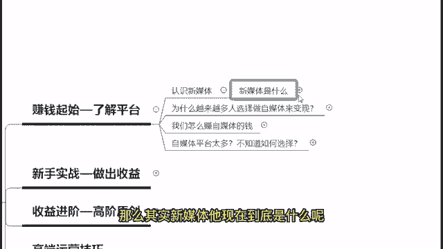

其实新媒体它里面包括了两个部分，一个是群媒体。

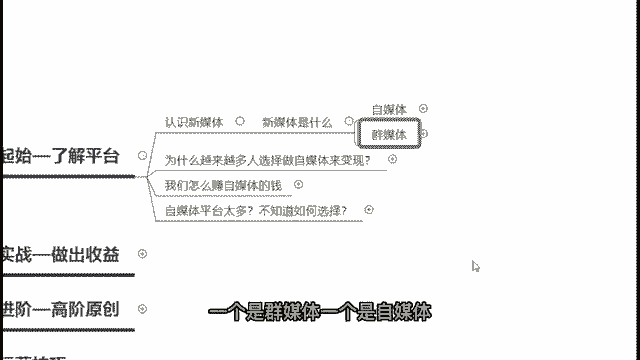

一个是自媒体，自媒体大家应该都有在听，都有在做，但是群媒体可能大家听的了解的比较少一些，全面检查其实是什么呢，是属于一个自媒体达人的一个孵化机构，好，那么在这边的话呢，也就是我们所俗称的一个MCM机构。

包括你比如说像我们看到的李佳琦，罗永浩，薇娅等等，所有的这些人，它都是属于我们的一个MC机构，你比如说像李佳琦，他就是上海美万公司的对吧好。

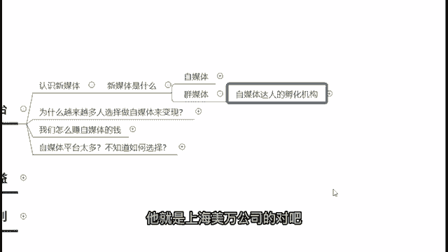

那么其实我们现在在做的事情，以及这些MC机构在做的事情是相似的。

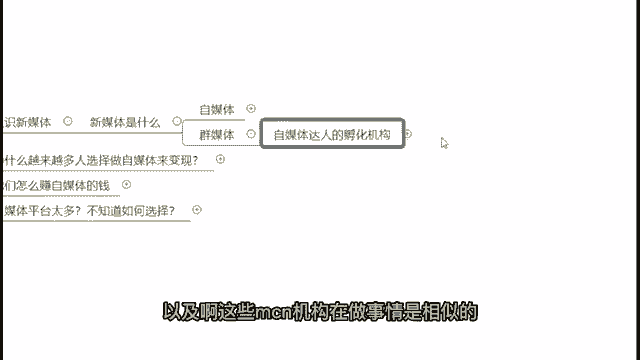

我们是希望可以去发现发展，培养我们的一个新媒体达人，做到一个共同的发展，共同的进步。

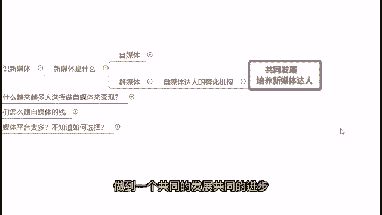

那么再来啊简单的跟大家讲讲自媒体，自媒体其实是什么呢，首先来写一个简单的定义，凡是可以自我发声的都可以称之为自媒体。

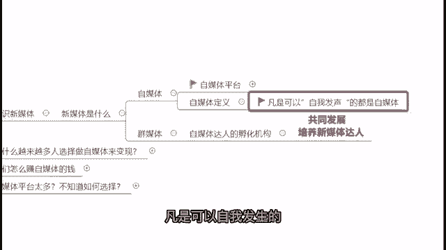

这个发声当然不是说啊唱歌的那个发声，而是说只要你在这个平台上面，可以把你的想法，内容所见所闻，在平台上面传播出去的，都可以称之为自媒体。

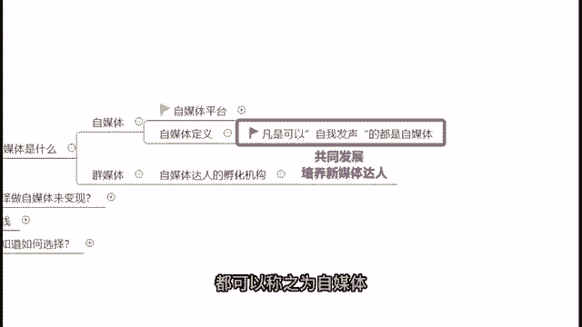

那么自媒体平台常见的有哪些呢，啊有非常多。

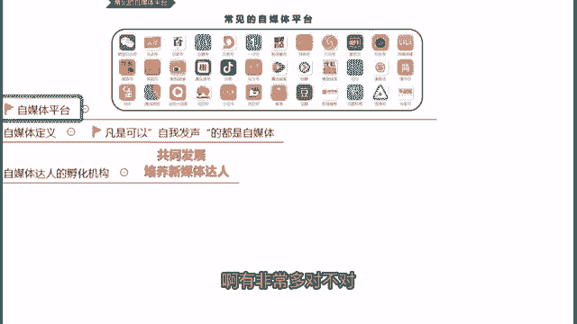

对不对，我在这里呢简单的罗列一些常见的自媒体平台，来给大家看一下啊，包括有道，像这个微信公众号啊，大鱼号，抖音快手小红书等等。

