# 【100集精华版】花了4W买来的！2024年目前B站最完整的自媒体运营教程，抄袭也能玩好自媒体，大佬亲自教学！！ - P3：2为什么选择自媒体变现 - 幽香飞龙QAQ - BV1pC411b7hy

那么其实大家可以想一个问题，就是包括在座的各位也好。

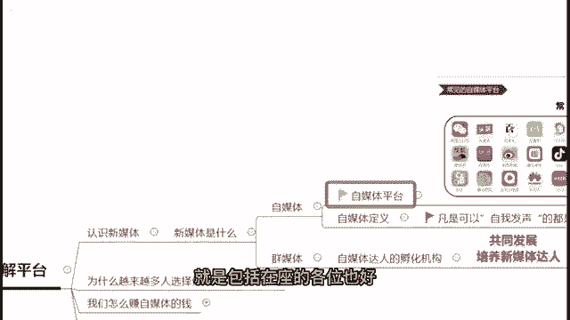

我们的一个明星达人也好，网红也好，为什么现在越来越多的人。

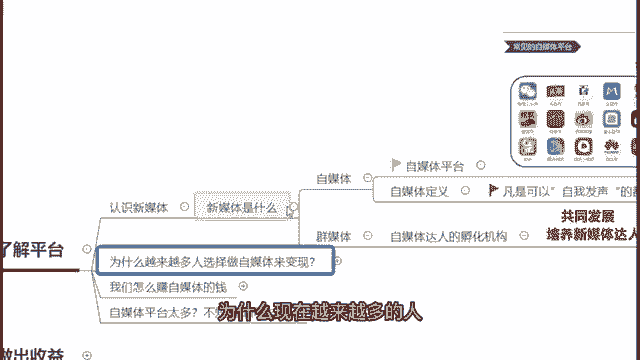

他选择做自媒体来变现，而不是选择做电商。

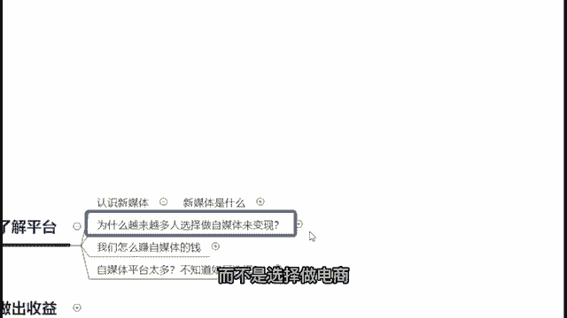

选择做创业，而是选择做自媒体呢，答案很简单。

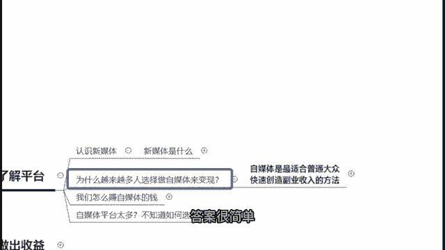

自媒体是现在最适合普通大众，快速创造副业收入的最好的办法啊。

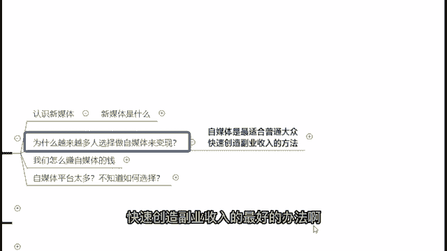

为什么这么说呢，首先第一个自媒体是我们普通人。

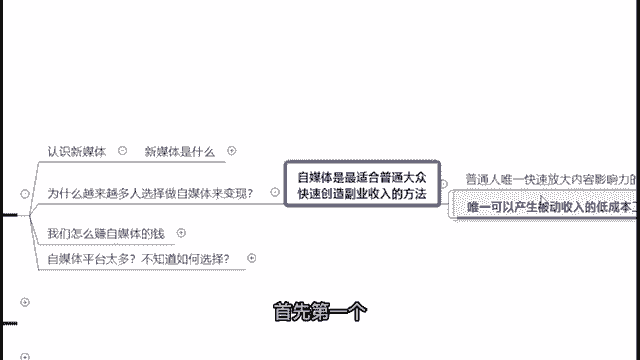

唯一可以快速放大内容影响力的工具。

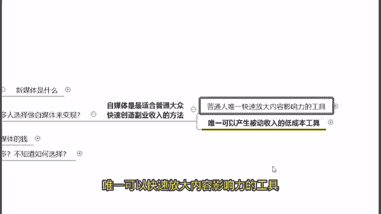

并且你在上面所产生的内容影响力，跟你的收入是可以成杠杆式的放大的。

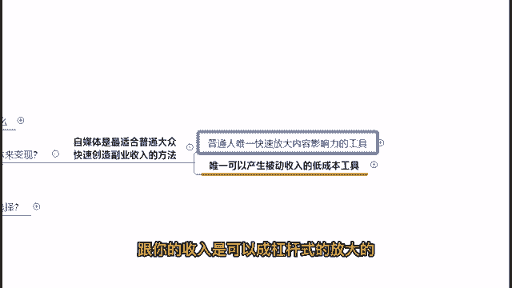

这个呢啊我举个例子。

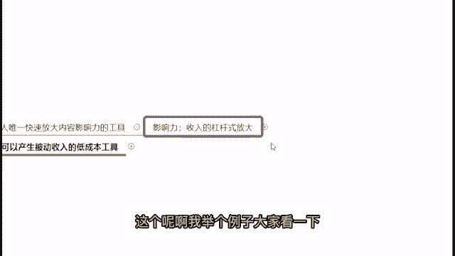

大家看一下，我觉得应该很好理解，就是你比如说抖音50万粉丝的网红。

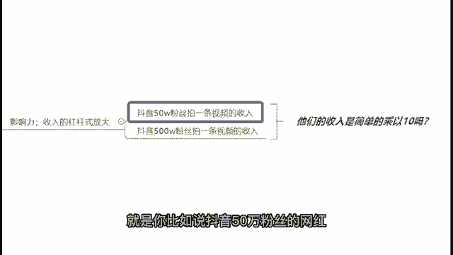

他们拍一条视频能够获得的收入，以及抖音500万粉丝的网红，他们拍一条视频可以获得收入，你觉得他们的粉丝数量差了十倍，但是他们的收入会是简单的，只是乘以十吗，肯定不是，如果说大家有去看星图报价的话。

应该都会知道哈，抖音50万粉丝网红的一个星图报价，大概会是在两三万到10万块钱不等，左右的一个价格，那么抖音500万粉丝的网红，他们的星图报价基本上最低也是在100万左右。

那么高的话呢去到五六百万也是有的啊，所以说大家可以看到你的这个影响力，你这个粉丝数虽然只是差了十倍，但是实际上他们的收入差了不是简单的十倍，而是上百倍甚至500倍，600倍都有啊。

那么抖音星图报价不知道的可以去搜一下哈。

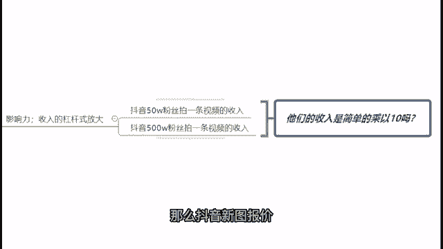

就不要在公屏上面继续问了啊。

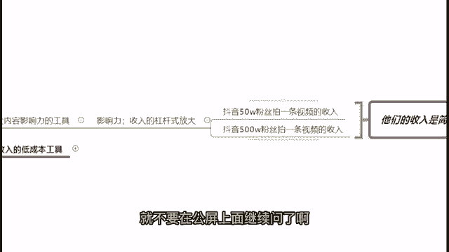

不知道的可以去搜索一下就行了啊，就是一个我们的一个达人们，他去这个赚取广告啊的一个核心的一个渠道。

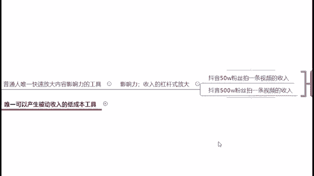

那么再来，为什么我去说。

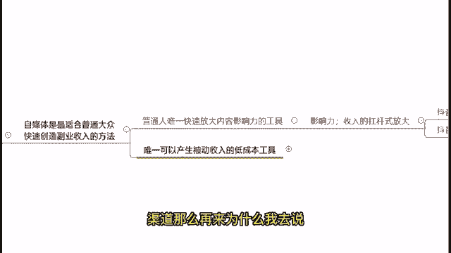

自媒体是现在我们最适合普通大众，快速创造副业收入最好的办法呢，因为其实自媒体是现在我们唯一一。

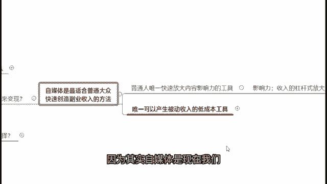

可以产生被动收入的低成本工具。

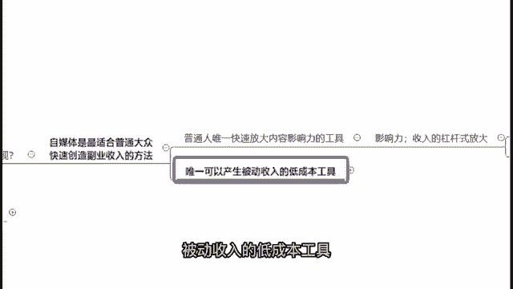

那个这个的话我刚刚看到公屏上也有，就是在上海的朋友们对吧，那么在上海的朋友们应该都很清楚了，现阶段来说，首先我们获取被动收入的方法其实就很少，我们来看一下。

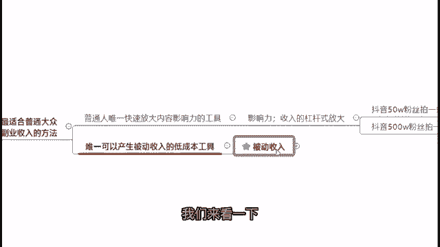

一般来说我们获取被动收入的方法有哪些呢，首先第一个房租，那么其实我相信在座的不是交租的，就是收租的，对不对，但是你说房租，他是普通人能够获取被动收入的低成本方法吗，绝对不是对吧。

首先第一个它不是低成本的，第二个不是每个人都有一套闲置的房子，可以获取这个被动收入的，那么再来一般人可以获取被动收入的方法，还有什么啊，股份分红或者其他的固定投资收益，对吧好。

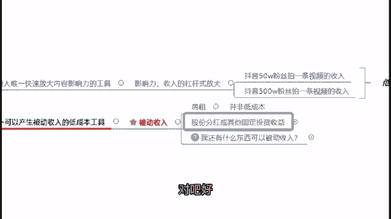

那么在这里的话啊，如果说在座的有炒股的，或者是炒外汇的，或者说是炒基金的，应该都深有体会，就是最近我们的一个基金，包括我们的股市，大盘是上上下下来来回回的对吧，所以说我们的这个固定投资收益这个方式。

它是伴随着非常高的一个风险的，你根本不知道什么时候你扔进股市的10万块钱，现在又变成了多少钱了，对吧好，那么再来，我们还有什么东西可以去获得这份被动收入呢。

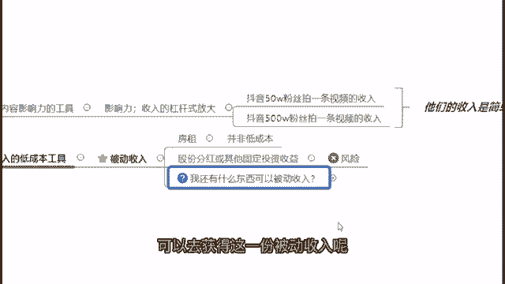

答案很简单，就是可以通过打造我们的一个自媒体账号。

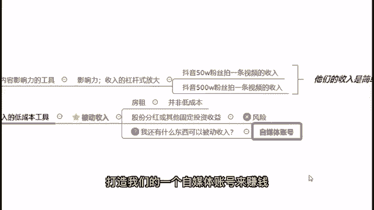