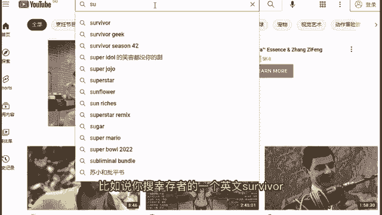

# 【100集精华版】花了4W买来的！2024年目前B站最完整的自媒体运营教程，抄袭也能玩好自媒体，大佬亲自教学！！ - P6：5实操教学—搜集素材 - 幽香飞龙QAQ - BV1pC411b7hy

所以我建议如果说是新手小白的，刚刚上路的，刚刚注册平台的，刚准备要做自媒体的话，你都可以通过这种方式来，先打开你自己的一个啊自媒体之路啊。

先上手做搬运来，怎么样去做呢，首先第一步我们要搜索素材。

怎么样去搜索呢，搜索一些关键字啊。

关键词啊怎么样去做，首先第一步啊，我们来搜索这个啊，比如说你可以搜索一个什么呢，美国最火的一个综艺节目排行榜，为什么要搜索这个是因为啊你搜了你也不要搜，国外特别冷门的，你要做你就做国外也特别火特别热的。

因为这个是经过了国外的市场验证，有非常多人喜欢看等一个内容，所以说啊你要搜就搜啊，这样的一个国外也经过得到了认证，认可的一个内容，那么在这里我点开了这个2018年，美国最火的综艺节目排行榜。

来我们来看一下哪些是适合我们去做呢，首先第一个好声音好，那么这个呢是可以去做搬运的，因为唱歌这件事情，不论国内国外都是可以听得懂，感受得到里面的一个内容的，那么再来啊。

美国达人秀这些也是没有任何问题的啊，你都是可以看得懂别人的一个表演的，但是如果说是像这种维多利亚的秘密，时尚秀的话，我是不建议大家去做搬运的，因为你要做这种搬运的话，你要持续性的去做打码啊。

这样子的话啊就对吧，就非常的麻烦啊，你也知道国内的一个平台，它审核是比较严格的，那么如果说啊你要搬运这类视频的话，你打码得达到类似你好，所以说这种类型的视频，我不建议大家去做搬运好，那么比如说像厨房啊。

烹饪比赛这个啊也是可以去搬运的，因为做菜吗，国内国外你不就算不看字幕，你也能懂个7788，所以说没有任何问题，那那么再来这种相亲节目啊，跳舞的节目都可以啊，那么超模比赛这种不建议搬运啊。

同样的啊里面你需要打码的内容太多了，不建议大家去做，那么包括像这种啊，一周好莱坞的新闻盘点是不建议大家去做的啊，新闻盘点这种事情，需要你对这个翻译非常的准确，不建议大家去做幸存者啊，现代真人秀的鼻祖啊。

这个的话是可以的，然后再来啊，这种脱口秀节目不建议大家去搬运啊，这种的话需要你对这个翻译的准确度非常的高，不建议大家去做好，那么在这边的话啊，我简单的啊去回答一下，大家可能最关心的一个问题就是版权问题。

那么首先第一个啊，国外的人，他基本上是不看我们国内的一些内容的，所以说啊不会，基本上是不会涉及到这种版权问题的啊，第二个他也不会往我们国内的这些，小平台里面去看，第二个他想要啊去追究追溯的话。

也是基本上不会啊找到国内里面去投诉你的啊，第二个他认为啊，其实我们在这里传播的话，也是可以帮助他达到一个更好的一个，传播效果的啊，所以说是没有任何问题的啊，你可以看到。

为什么我也提前找了一个例子来给大家去看，你看一下，这个是一个个人号，B站的个人号啊，如果说啊他也不是说一个官方认可的一个机构，但是你也可以看到，他这个实打实的，就是一个对于海外综艺的一个搬运。

而且他也能够靠这个做到，200多万的一个播放量啊，所以说啊前期新手啊刚开始要做的话，你要做在小平台上面去做，基本上是不存在任何的一个问题的啊，包括如果说你要担心版权问题的话。

只要不是说在国内有明确的公司买了版权，进行一个转播的，都不会涉及任何版权问题，大家听得懂吗，好那么接下来啊到这边来给大家看一下啊，我们要怎么样去做一个素材的一个采集，以及整体素材的一个搬运好。

那么啊我在这里呢啊来给大家先看啊，我们如果说要做这种类型的一个视频，到底应该怎么样去做会比较好，来我们先来看一下，首先找到我们国外最大的视频网站YOUTUBE，我们先来看一下，然后在这里的话。

我们可以搜索，我们刚刚所找到的那些热门的一个综艺，你比如说像这样啊，来在这里啊，比如说在这里我们可以搜这种幸存者好，那么在这边的话，你可以在YOUTUBE上面搜索他的一个关键词。

而且大家要注意不要用中文去搜索，因为中文的话，你就是搜索出来都是中国人自己做的，你要搜你就直接搜英文，比如说你搜幸存者的一个英文survival。

然后在这边的话你可以看得到有非常多的啊，这样的一些啊视频相关的一个视频，而且基本上你可以看到，它的一个播放次数也都是比较多的，那么你也可以看得到，这些就是由我们啊海外的一个啊博主。

他自己对于这些所有的一个视频做了一个剪辑，他们自己在海外的时候，他们也不是说一个做了一个官方的一个啊，转载啊，他们也是海外的一个自己的一个个人博主，去做了一个转载。

那么既然这个在海外他们自己都不告的话对吧，那国内他告告什么呢，对不对好，那么在这边我们找一个比较多播放的吧，我们先来看一下，来首先在这里啊，我们找这个1000多万次播放的，我们先来看一下吧。

Right you guys ready to get to today's immunity challenge，First things，First katie。

I must take it back，All right spun out，Last day，Once again，Immunity is back up，好。

那么在这边我们可以很明显的发现这个视频啊，它是一个我们的一个海外的一个英文原画，以及英文原声，而且它是没有任何的一个字幕的，我告诉你，其实你要找的就是找这种没有任何英文字幕的，因为有字幕的话。

你搬运下来之后，你还得先去掉原来的一个英文字幕的水印，然后再把你自己的一个中文字幕放到上面去，反而更麻烦，你要找你反而就要找这种高清的，没有任何水印的，就单纯是一个视频的，也没有任何英文字幕的。

你就找这种素材，因为这种素材你才能够实现把它搬运下来之后，不用费多大功夫，然后你就可以把你自己的一个中文字幕啊，放上去，然后在这边我也跟大家去说啊，这边的话啊是你可以去找这种视频的话。

我建议大家去去找这种3分钟以上，20分钟以下的视频，如果说啊这个时长太长的话，你这个是很难再去做后续的一个剪辑工作的，好吧，那么在这边的话，为什么我要建议大家去找这种啊，国内国外都看得懂的一些内容啊。

也不要找这种超模的维多利亚的，就是因为啊第一我们要记住，在搬运的过程中，你要找就找那种不需要很多翻译，以你也能够看得懂的视频，第二个不要找这种含有国内平台竞技的画面，包括啊这个穿衣服比较少的。

又或者是血腥的暴力的都不行，你要找就找找那种老少咸宜都能够看的，而且容易看得懂的视频来进行搬运，那么这里的一个素材采集我们该怎么样去做呢，来我们来看一下，其实很简单，如果说你是用手机去看的话。

你直接打开你的手机做一个全屏的播放，然后录屏就可以了，那么如果说你是用电脑的话，那么很简单，我们打开一个相应的录屏软件就可以了，包括你比如说在这边，我可以用一个EV的一个录屏软件。

然后我们就可以对电脑进行一个相应的录屏，就OK好吧好。